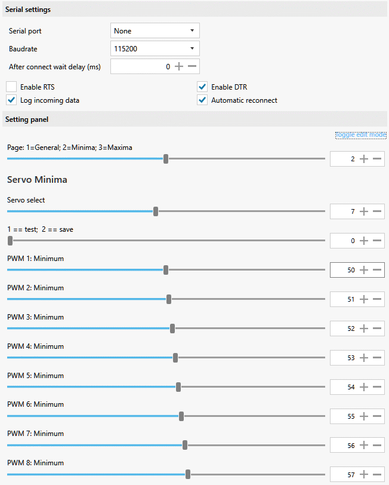

# multi-character control for SimHub Custom serial devices
 As advertised on [RaceDepartment](https://www.racedepartment.com/threads/multi-character-control-for-simhub-custom-serial-devices.208661/)  

At least when using JavaScript, [SimHub Custom Serial devices](https://github.com/SHWotever/SimHub/wiki/Custom-serial-devices) USB messages  
are constrained to 7 bits (ASCII characters) values per byte sent.  
Allocating 1 bit in each character to identifying
whether it is first or second of a character pair leaves 12 bits available.  
This most-significant-bit on first character ploy is used by [MIDI](https://blekenbleu.github.io/MIDI/)...

This evolved to [blek2char](../blek2char/)


  

- [black2char.shsds](https://github.com/blekenbleu/SimHub-Profiles/blob/main/black2char.shsds)  
- [blek2char211005.shsds](https://github.com/blekenbleu/SimHub-Profiles/blob/main/blek2char211005.shsds)  
- [blek2char211006.shsds](https://github.com/blekenbleu/SimHub-Profiles/blob/main/blek2char211006.shsds)  
- [proto2char.shsds](https://github.com/blekenbleu/SimHub-Profiles/blob/main/proto2char.shsds)  
