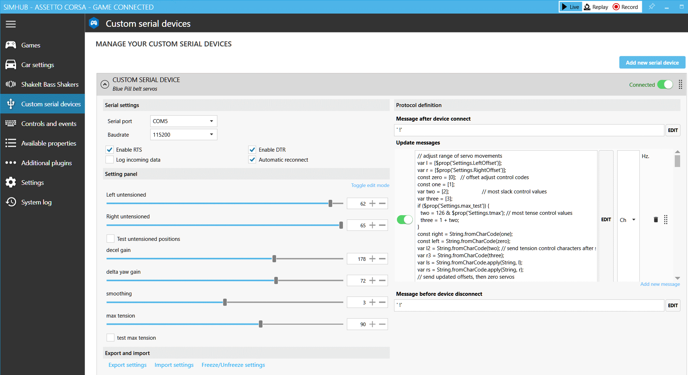

---
title: SimHub Custom serial device for Blue Pill
---
*updated 29 Jan 2021*

#### Background
An [STM32duino sketch](https://github.com/blekenbleu/blekenbleu.github.io/tree/master/Arduino/Blue_ASCII_Servo) was thrown together  
that moves either of a pair of servos,  
depending on least significant bit,  
for byte values (masked by 0x7F) received by serial port,
[as described here](index.md)  

Using Google magic revealed likely help
for using SimHub Custom serial devices:
- [simhub-connector](https://www.thecoderscorner.com/products/arduino-libraries/tc-menu/tcmenu-plugins/simhub-connector/)  
- [SimHub Forum Outputting sim data to Arduino to use with stepper motor gauges](https://www.simhubdash.com/community-2/simhub-support/outputting-sim-data-to-arduino-to-use-with-stepper-motor-gauges/)  
  - This clarifies that it is for "adhoc" protocol with "non simhub" sketches  
- [SHWotever/SimHub Wiki Custom serial devices support](https://github.com/SHWotever/SimHub/wiki#custom-serial-devices-support)  
  Having been here several times before, alwast failed to scroll down to [Formulas Engines](https://github.com/SHWotever/SimHub/wiki#formulas-engines)
  
- [SHWotever/SimHub Custom serial devices](https://github.com/SHWotever/SimHub/wiki/Custom-serial-devices)
  This walks thru enabling the plugin and defining messages:
    

This leaves the trick of sending the message for dynamic harness tensioning.
An interesting property exists:  GameData.GlobalAccelerationG  
Sure would be nice if there was a reference describing it...  

[Elsewhere](https://labo.rcg.jp/wordpress/meter_icon/), I also found:
* DataCorePlugin.GameRawData.Physics.AccelerationX
* DataCorePlugin.GameRawData.Physics.AccelerationY
* DataCorePlugin.GameRawData.Physics.AccelerationZ

This scrap [from reddit](https://www.reddit.com/r/SimHub/comments/g1k1hs/tutorial_for_extracting_deceleration_data_for_use/):  
"I've found the DataCorePlugin.GameRawData.PlayerMotionData.m_angularAccelerationX property (as well as for Y and Z)"  

Clicking around in Property Picker:  
  

In the left margin is "Available properties";
selecting that exposes an Ncalc tester.
Perhaps, if some game were recorded,
then Replay here would show how data worked...?
126+round([GameRawData.Physics.AccG01],0)

Sadly, NCalc looks exactly wrong for what I want
* next to no string operators
* no array indexing
* no byte values
* Integers evidently get written to serial as decimal strings.  
