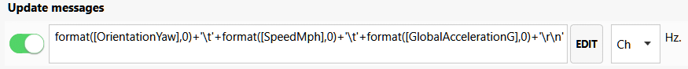

---
title: SimHub Custom serial device for Blue Pill
---
*updated 30 Jan 2021*

#### [Background](https://blekenbleu.github.io/Arduino/SimHubCustomSerial.html)
An [STM32duino sketch](https://github.com/blekenbleu/blekenbleu.github.io/tree/master/Arduino/Blue_ASCII_Servo) was thrown together  
that moves either of a pair of servos,  
depending on least significant bit,  
for byte values (masked with 0x7F) received by serial port,
[as described here](index.md#serial-servos)  

Google magic revealed likely `SimHub Custom serial devices` help:
- [SimHub Forum Outputting sim data to Arduino to use with stepper motor gauges](https://www.simhubdash.com/community-2/simhub-support/outputting-sim-data-to-arduino-to-use-with-stepper-motor-gauges/)  
  - This clarifies that it is for "adhoc" protocol with "non simhub" sketches  
- [SHWotever/SimHub Custom serial devices](https://github.com/SHWotever/SimHub/wiki/Custom-serial-devices)
  This walks thru enabling the plugin and defining messages:
    
- [SHWotever/SimHub Wiki Custom serial devices support](https://github.com/SHWotever/SimHub/wiki#custom-serial-devices-support)  
  Previously had always *failed to* scroll to [Formulas Engines](https://github.com/SHWotever/SimHub/wiki#formulas-engines)
- Here is the [NCalc reference repository to which GitHub points](http://www.codeproject.com/KB/recipes/sota_expression_evaluator.aspx).  

Sadly, NCalc seems exactly wrong for what I want
* next to no string operators
* no array indexing
* no byte values
* Integers evidently get written to serial as decimal strings.  

As much as I dislike Javascript, it allows for byte banging..

This leaves the trick of sending the message for dynamic harness tensioning.
An interesting property exists:  `GameData.GlobalAccelerationG`  
Sure would be nice if there was a reference describing it...  

In [SimHib discord](https://discord.com/channels/299259397060689920/453962780857597966/800365665289502731), Wotever wrote (01/18/2021) about deceleration:  
"it's DataCorePlugin.GameData.GlobalAccelerationG  
  deceleration is just a negative acceleration"  
On 01/25/2021, fhoos wrote: "(Deceleration goes about from 0 to -50)"  

Other properties:  GameData.Sway, GameRawData.Physics.Roll  
  GameData.OrientationRoll GameData.OrientationYaw

Clicking around in `Property Picker`:  
  

In the left margin is "Available properties";
selecting that exposes an Ncalc tester.  
Perhaps, if some game were recorded,  
then Replay here would show how data worked...?  
`round([GameRawData.Physics.AccG01],0)`  

[Rough skeleton for SImHub Custom serial device settings](BlueBeltServos.shsds.txt)
Need to understand the nature of available SimHub properties for acceleration.  
First, record a figure 8 track lap, then play it back and record values.  
Here is a SimHub Custom Serial formula for relevant properties:  
  
Here is yaw and speed deltas vs scaled `GlobalAccelerationG`,  plotted by [Gnuplot delta_v() script](delta.txt):  
  
`delta_v(SpeedMph)` property basically overlays scaled `GlobalAccelerationG`.  

`OrientationYaw` presumably reports degrees heading; abrupt +/-180 transitions are a clue.  
Given figure-8 track telemetry, `delta_v(OrientationYaw)` seems a credible proxy for lateral acceleration.  
My guess is that delta_v "noise" is an artifact of SimHub sampling data at a rate somewhat slower  
than that at which Assetto Corsa updates;  deltas occasionally represent differences between 3 game samples,  
rather than 2. Artifacts could be fairly easily addressed by a non-linear filter which tests:  
```
if (a current delta value is roughly twice the previous)
     then (divide it by 2)...
```
Normalizing speed and yaw deltas by `SystemInfoPlugin.Uptime` deltas is unlikely to work,  
since it increments based on SimHub, not the game.

First pass at harness tension setting:  

Recompiled Blue_ASCII sketch to echo hex, confirming 0 and 1 are received, all over 127 scrogged.  

While it would be nice to have delta_v filter code in a more legible format,
my guess is that SimHub live interpreter does not work for JavascriptExtensions.  

SimHub has Visible Bindings and Enabled Bindings for CUSTOM SERIAL DEVICE Setting panel;
don't know what two different bindings imply.  Sliders work without forcing settings in their Bindings.
