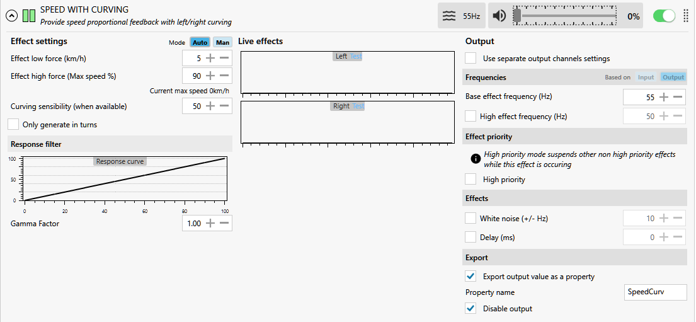

---
Blue Pill PWM fans for SimHub
---
*updated 22 Jun 2021*  
  
**Warning!** 7000 RPM 280CFM fans run full speed without PWM connected  
and must be anchored!  
The Blue Pill module in that image was destroyed by a runaway fan...  

### [Background](https://blekenbleu.github.io/Arduino/SimHubCustomSerial.html)
An [STM32duino sketch](BluePWMfan) was hacked to control 4-wire PC fan speeds.  
Unlike (`50Hz`) hobby servos, 4-wire PC fans want `25kHz` PWM...   

  

## SimHub Custom Serial sends (7-bit) ASCII with (6-bit) fan speed values
One bit is allocated to selecting left vs right fan.  
A SimHub ShakeIt Bass Shakers **SPEED WITH CURVING** effect will generate `SpeedCurv` properites:  
  
A fan speeds profile will be hacked from a SimHub [Custom serial device for harness tensioning](shsds.htm#running):
-  while a single Blue Pill can easily support both hobby servos and PWM fans,  
   appreciable physical separation make separate Blue Pills less hassle.  
-  SimHub Custom serial plugin supports multiple devices at different COM IDs.  
-  A JavaScript message will convert left+right SpeedCurve properties to 7-bit speed values.  
-  An Arduino sketch will scale those to (25kHz) PWM fan control values.  
An STM32 Blue Pill is capable of driving at least 7 PWM devices,    
using available 5V-tolerant pins `PA8-10` and `PB6-9`.  
  - `Timer 4` for `PB6-9` is already configured for hobby servos.  
  - `Timer 1 channels 1-3` control pins `PA8-10`.  

While a [Black pill (STM32F401/F411) module](black) could also be used,  
it would be overkill, and Arduino support is less well documented.  

### sierses used [sgbotic instructions for Black Pill with Arduino](https://www.sgbotic.com/index.php?dispatch=pages.view&page_id=49)  
"The only change I had to make was using SWD for the upload method. STM32duino supports the f411 now."  
"it took a few tries before I got it working. After I flash it the first time,  
 the serial connection initializes through the USB port, then I can flash it again  
 and it will automatically reinitialize and SimHub will reconnect,   
 so the button dance only needs to happen once when it's first connected."
### further [stm32duino PWM hints](https://donneyfan.com/blog/some-information-on-the-bluepill-stm32f103c)  
When `servo.attach()` is called on a certain pin, the hardware timer responsible for creating the PWM signal is set to a certain period/frequency. On the Blue Pill, this period/frequency is synchronized across all pins that the timer is responsible for. So if you have a motor running on the same timer as a servo but another motor running on a different motor, the motor speeds will differ because their PWM frequencies will differ.

Synchronizing all timers:
```
void timerSetup() {
    for (int i = 1; i <= 4; i++) {
        HardwareTimer timer(i);
        timer.pause();
        timer.setPeriod(20000);
        timer.refresh();
        timer.resume();
    }
}
```
