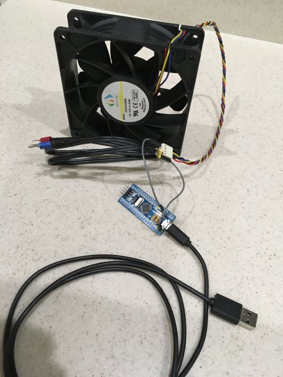

---
Blue Pill PWM fans for SimHub
---
*updated 22 Jun 2021*  
  
#### [Background](https://blekenbleu.github.io/Arduino/SimHubCustomSerial.html)
An [STM32duino sketch](https://github.com/blekenbleu/blekenbleu.github.io/tree/master/Arduino/Blue_PWMfan) was hacked to control 4-wire PC fan speeds.  
Unlike (`50Hz`) hobby servos, 4-wire PC fans want `25kHz` PWM...   

  
## SimHub Custom Serial sends ASCII (7-bit) values to an STM32 Blue Pill.  
A SimHub ShakeIt Bass Shakers **SPEED WITH CURVING** effect will generate `SpeedCurv` properites.  
A fan speeds message will be added to the SimHub [Custom serial device for harness tensioning](Noticeable.shsds.txt):
-  It will convert left+right SpeedCurve properties to 4-bit speed indices.  
-  An Arduino sketch will scale those to (25kHz) PWM fan control values.  
An STM32 Blue Pill is capable of driving at least 7 PWM devices,    
using 5V-tolerant pins `PA8-10` and `PB6-9`.  
  - `Timer 4` for `PB6-9` is already configured for hobby servos.  
  - `Timer 1 channels 1-3` control pins `PA8-10`.  

4-bit control granularity leaves 3 bits for addressing 7 PWM pins,  
with 'special' address 0xF0 reserved for e.g. downloading LUTs and enabling/disabling message echo.  

This [Noticeable.shsds](Noticeable.shsds.txt) GitHub profile already has 3 Javascript messages:
1) Generate LUTs for download to Arduino sketch for equal tension increments
2) Send changes for other 'special' control messages
3) Update 4-bit tension LUT indices based on accelerations
4) **Add**:  Convert SpeedCurve properties to 4-bit speed indices.
