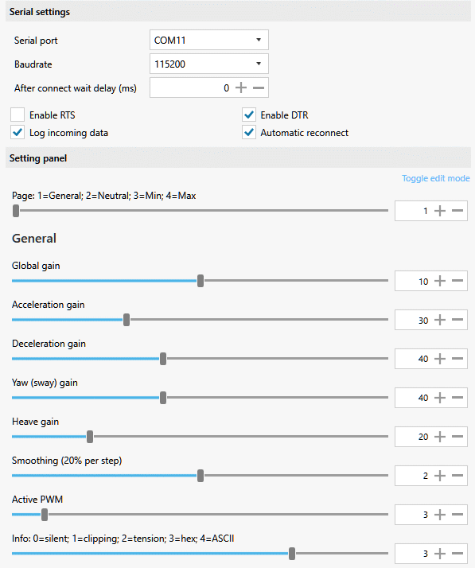
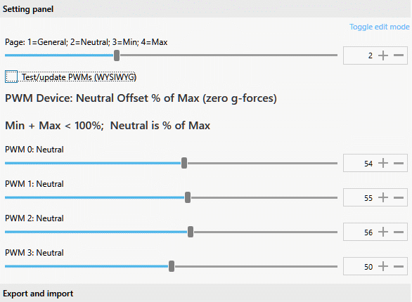

---
---
## multi-character control for SimHub Custom serial devices

.. as advertized on [RaceDepartment](https://www.racedepartment.com/threads/multi-character-control-for-simhub-custom-serial-devices.208661/)

SimHub Custom Serial protocol loosely inspired by MIDI

### 15 Jan 2022 update by @sierses: [real Arduino support](https://www.racedepartment.com/threads/multi-character-control-for-simhub-custom-serial-devices.208661/post-3477031)

Edit near the top of [blek2char.ino](blek2char.ino) to select the appropriate target:
```
/* Uncomment one microprocessor */
//#define BLUEPILL 1
//#define BLACKPILL 1
#define UNO 1 // Arduino Uno, Nano
//#define LEONARDO 1 // Arduino Leonardo, Micro
//#define PROMICRO 1 // Sparkfun ProMicro
//#define MEGA 1 // Arduino Mega 2560 
```
- [blek2char.shsds](https://github.com/blekenbleu/SimHub-Profiles/blob/main/blek2char.shsds)
- [blek2char.siprofile](https://github.com/blekenbleu/SimHub-Profiles/blob/main/blek2char.siprofile)
- [new2char.shsds](https://github.com/blekenbleu/SimHub-Profiles/blob/main/new2char.shsds)

  
  
