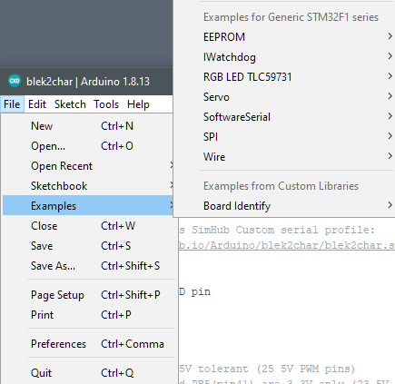
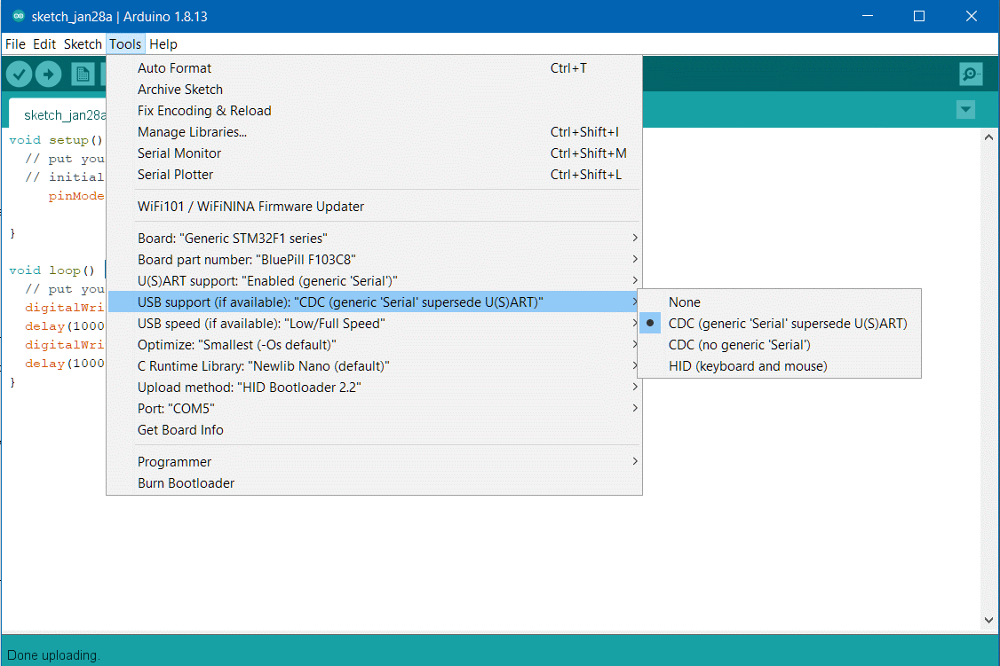

---
Arduino for STM32 Black 'n Blue Pills, ESP32-S[2,3]
---
*updated 6 Mar 2023*  

[related libraries and examples](https://github.com/blekenbleu/Arduino-Blue-Pill)  

#### Background
This is for use with [SimHub's Custom Serial devices plugin](https://github.com/SHWotever/SimHub/wiki/Custom-serial-devices).  
While highly useful, that plugin IMO has 2 key limitations:
- SimHub plugin Javascript is relatively inefficient, hard to debug and maintain.
- Plugin can log but not process received serial port messages from e.g. from Arduino.  
([Fake8](https://github.com/blekenbleu/Fake8/) is proposed to address those limitations.)

Arduino originally employed microcontrollers lacking USB support.  
Their workaround involved boards with USB-to-TTL converter chips,  
usually configured as USB COM devices for serial IO,  
which microcontrollers traditionally support.
  
While not an official Arduino platform,  
[WeMos D1 UNO R1](ESPDuino) is a supported ESP8266 board,  
communicating via CH340 USB-serial chip.
 
While many STM32 chips' ROM bootloaders support (DFU) USB directly,  
Blue Pill's `FC103C8` chip lacks USB bootloader support in ROM.  
While STM32F103C officially has 64K flash,
[many have 128K](https://stm32duinoforum.com/forum/viewtopic_f_28_t_4361.html).  


There are at least 4 ways to flash STM32 chips:  
1) SWD via ST-LINK  
   **Use this to install an HID bootloader on Blue Pills**  
   Unlike Black Pills, new Blue Pills lack a USB bootloader. 
2) (Arduino) USB bootloader[s] <- there have been several:  
   * [STM32duino Bootloader](https://stm32duinoforum.com/forum/wiki_subdomain/index_title_Bootloader.html)
     AKA bootloader 2.0 AKA **HID bootloader**  
     **Arduino uses this to download Blue Pill sketches using [ST Microelectronics-supported libraries](https://github.com/stm32duino)**  
     Installing a USB bootloader in Blue Pill flash takes away storage available for Arduino sketches.
   * the rest are IMO obsolete:
     - [Maple-derivative bootloaders](https://github.com/jonatanolofsson/maple-bootloader)  
     - Maple boards had USB reset hardware to force re-enumeration  
     - [Roger Clark's 8k bootloader](https://github.com/rogerclarkmelbourne/STM32duino-bootloader)  
       Be aware that some of Roger Clark core code is *also* called Stm32duino..
     - Not sure which core (libmaple or stm32duino) [this bootloader supports, but is 4k](https://github.com/davidgfnet/stm32-dfu-bootloader)  
3) STM serial bootloader - **not recommended for frequent reprogramming**   
   Blue Pills have only a serial bootloader in ROM;&nbsp; a USB bootloader gets installed in flash memory.  
   [Load firmware via USART1 by first jumpering](https://stm32duinoforum.com/forum/wiki_subdomain/index_title_Bootloader.html#Boot0_and_Boot1_pin_settings):  
   `Boot0 HIGH`  
   `Boot1 LOW`  
  ... then resetting MCU
4) DFU (device firmware update) using DfuSe utility, e.g. **for [Black Pills](black)**  
    using its [STM32 system memory bootloader in ROM](https://www.st.com/en/development-tools/stsw-stm32080.html),  
    but, *again* USB is [**NOT** supported by Blue Pill's ROM bootloader](https://stm32duinoforum.com/forum/wiki_subdomain/index_title_Bootloader.html).  

STM32duino expects a USB HID bootloader,  
which gets launched by Blue Pill's ROM bootloader,  
then that USB HID bootloader installs sketches above it in flash.  

A clone ST-LINK V2 costs no more than a USB COM dongle,  
connects to dedicated Blue Pill pins and supports debug.  
Clone USB COM dongles *may not* support 3.3V to Blue Pill serial boot pins..  
Blue Pill boot jumpers *need not be changed* when flashing by ST-LINK or HID bootloader.  

#### STM32duino
Many STM32 Arduino projects use [Roger Clark's core](https://github.com/rogerclarkmelbourne/Arduino_STM32) and bootloader AKA Maple,  
but Arduino now has an **ST Microelectronics-supported** [core and board manager](https://github.com/stm32duino/Arduino_Core_STM32/releases)  
for which there is an [HID bootloader](https://github.com/Serasidis/STM32_HID_Bootloader),
as described [on YouTube](https://www.youtube.com/watch?v=Myon8H111PQ).  
That video installs the Blue Pill HID bootloader via USB COM dongle,  
but we will here use an [ST-LINK V2 clone](https://www.ebay.com/itm/183320329257).  
My clone ST-Link happens to have the *correct pinout* printed on its cover;  
**Verify ST-LINK clone pin artwork** by sliding that cover partly open (along the USB plug):
  

[Here is the **Arduino for STM32** forum](https://www.stm32duino.com).  It replaced an earlier one.  
[Here is the READ-ONLY version of that earlier Arduino for STM32 forum](https://stm32duinoforum.com/forum/index_php.html).  
[Here is the Arduino software page](https://www.arduino.cc/en/software).  

### ST-LINK and Blue Pill
[This video](https://www.youtube.com/watch?v=KgR3uM21y7o) programs a Blue Pill using [STM32 ST-LINK utility](https://www.st.com/en/development-tools/stsw-link004.html).  
Wiring Blue Pill to ST-LINK V2 clone:
  
  
Connect 3.3V from ST-LINK to Blue Pill **only when Blue Pill has no other connections**  
Put another way, when using ST-LINK to debug Blue Pill e.g. plugged to USB,  
  **do NOT connect 3.3V to Blue Pill from ST-LINK**.  
Here is my ST-LINK connected to my harness tensioning Blue Pill:
  

### Installing (by Windows ST-LINK) Blue Pill HID bootloader for STM core
 - For Windows, stlink-org tools depend on STM's `ST-LINK driver`,  
   bundled with [STM32 ST-LINK utility](https://www.st.com/en/development-tools/stsw-link004.html),  
   which utility was *also* wanted for updating clone ST-LINK firmware.  
 - *Also* use [STM32 ST-LINK utility](https://www.st.com/en/development-tools/stsw-link004.html) to install HID bootloader.
#### These instructions apply *specifically* for 64-bit Windows, ST-LINK clone,  HID-bootloader, Blue Pill and STM core.  

1) Download and install [STM32 ST-LINK utility](https://www.st.com/en/development-tools/stsw-link004.html)  
   in my case, to `D:\packages\STM32\`
2) Plug bare ST-LINK clone into USB.  
   If it shows up in **`Device Manager`** under **`Other devices`** (*with a yellow warning*),  
   then drivers *were not* installed; see 1)  
   else it should appear under **`Universal Serial Bus Devices`**.
3) Launch **`STM32 ST-LINK Utility.exe`**  
   in my case,  
`D:\packages\STM32\ST-LINK Utility\STM32 ST-LINK Utility.exe`
4) Select `ST-LINK` > `Firmware update`  
   click `Device Connect`
   click `Yes>>>>`
5) Unplug ST-LINK clone from USB and wire it to Blue Pill as shown above.
6) Connect Blue Pill `BOOT-0` and `BOOT-1` pins (or on-board jumpers) to `0`  
   ** *and leave them*! **  
   Disconnect everything except ST-LINK from Blue Pill, and plug ST-LINK to USB.  
7) Download `stm32_binaries.zip` from [the latest HID Bootloader release](https://github.com/Serasidis/STM32_HID_Bootloader/releases)  
   From it, extract:  `hid_generic_pc13.bin`  
   (*Blue Pill on-board LED is connected to pin `PC13`*)  
   in my case, to `D:\packages\STM32\`
8) To flash HID Bootloader to a Blue Pill, in STM32 ST-LINK Utility:  
   `File` > `Open File...` > `hid_generic_pc13.bin`  
   `Target` > `Erase Chip`  
   `Target` > `Program...` > **`Start address`** `0x8000000` **`File path`** `D:\packages\STM32\hid_generic_pc13.bin`  
     
   click **`Start`** (*that should complete quickly*)  
   (*Blue Pill red LED on for power, green LED flickers quickly*)  
   Unplug ST-LINK, unwire ST_LINK from Blue Pill, and connect Blue Pill to USB.  
   (*Blue Pill red LED on for power, green LED flickers quickly*)  

   **Note** A bad Arduino sketch download can leave a Blue Pill unable to be recognized by Windows,  
   and reflashing the HID Bootloader without wiping the bad sketch by `erase chip` may not recover it.  

#### Troubleshooting  
   - Does a downloaded sketch otherwise appear to work (e.g. blinking LED),  
     but not respond to Arduino?  
     If so, then perhaps that sketch is not correctly opening a Serial connection.  
     Otherwise, it may be trying to use inappropriate pins  
     or a wrong board definition  
   - If ANY simple sketch downloads and still is recognized by Arduino,  
     then you very likely use the correct board definition.  
   - Does the blink sketch actually blink the LED as expected?  
     If not, something similar happened to me when compiling and loading a sketch  
     with an incorrect board selected.  
     To check whether the correct board is selected, build and load an example sketch  
     *specific to the selected board*:  
     `File -> Examples -> (examples for selected board type)`:  
       
   - If ANY sketch works for you, then problematic sketches may use pin[s]  
     that Arduino  (or the board) expects to use for communication and control.  
     It is important to locate, if possible, an diagram showing  
     how the board support package assigns pins on **your specific module** for Arduino.  
   - Another possiblity is that your sketch enables pins in some way  
     that causes the STM32 processor to lock up or be too busy to respond to Arduino.  
     Debugging that might require  
	 moving suspect pin initializations from setup() to some separate routine  
	 that gets called only after the sketch receives input from e.g. Serial Monitor.  
   - Another trick for Arduino to work with downloaded sketches:  
     *those sketches SHOULD correctly open communications as Arduino expects,*  
     even if sketch function does not otherwise need it.  
     **Making this initial message unique confirms which sketch is loaded.**  
     For Blue Pill, that amounts to having, in setup(), something like:  
```
  // Initialize serial and wait for port to be opened:
  Serial.begin(115200);
  while (!Serial)
    delay(1);               // wait for native USB serial port to connect
  Serial.write("Blue Pill HEX_echo sketch has connected. ");
```  
   - Genuine original STM Blue Pill modules are basically no longer available,  
     and you probably have some similar *but perhaps incompatible* **clone board**.  
     That clone may need a *different board profile*...  

### Installing STM32duino support
Since SimHub already includes an *older version* of Arduino,  
install the portable (ZIP file) version for STM32;  
no need to install Arduino-specific driver[s]...
1) Download, unzip, and run [Arduino](https://www.arduino.cc/en/software)  
   in my case, to `E:\my\Arduino\`  
   *much of the following is thanks to [sgbotic](https://www.sgbotic.com/index.php?dispatch=pages.view&page_id=48)*
2) Go to **`File` > `Preferences`**, add to **`Additional Board Manager URLs`** text box:
   [https://github.com/stm32duino/BoardManagerFiles/raw/master/package_stmicroelectronics_index.json](https://github.com/stm32duino/BoardManagerFiles/raw/master/package_stmicroelectronics_index.json)  
3) Go to **`Tools` > `Board` > `Boards Manager`**, enter search for **`STM32`**:  
     
   *18 Aug 2022*: Latest version is `2.3.0`; [@bosirovec](https://github.com/bosirovec/Custom-Dashboard-STM32-BluePill-SimHub) reported [a missing `2.3.0` folder, now fixed](https://github.com/stm32duino/Arduino_Core_STM32/issues/1806).  
   click **`STM32 Cores`**, then **`Install`**  (*takes quite awhile*)  
4) Quit and restart Arduino; then  
   from **`Tools` > `Board:` > `STM32 Boards`**, select [`Generic STM32F1 series`].  
   From **`Tools` > `Board Part Number:`**, select [`BluePill F103C8`].  
   > see note above, in last bullet under **Troubleshooting**, about clone boards.  

   From **`Tools` > `Upload method:`**, select [`HID Bootloader 2.1`] or newer.  
     

   **Be sure** to check Tools settings before Sketch upload; Arduino seemingly likes to change them,  
   then Blue Pill will not be a recognized device after uploads.  
   Check in Windows' `Device Manager` under `Ports (COM & LPT)` for `USB Serial Device (COM*n*)`,  
   where in my case `n = 3,5 or 10`.  
   **`Port:`** `COM[5]` is unavailable until a sketch is loaded, e.g.
[`Blue_Servo`](https://github.com/blekenbleu/Arduino-Blue-Pill/tree/main/Blue_Servo):
  

Here is a Blue Pill pinout reference:
  
- 5V tolerant PWM pins are wanted for driving hobby servos, e.g. `PA8-10` and `PB6-9`.  
- 5V tolerant CAN BUS pins `PB8,9` **work for me**.
- In addition to seven 5V tolerant PWM pins, up to 7 more can be available by level-shifting:  
    

#### To drive automobile dash instruments by Blue Pill from SimHub, [go here](https://github.com/bosirovec/Custom-Dashboard-STM32-BluePill-SimHub)

A simple next step adds servos to the blink loop sketch.  
[This servo cycling sketch](https://github.com/blekenbleu/Arduino-Blue-Pill/tree/main/Blue_Servo) is under GitHub revision control,  
with a shortcut to that sketch folder in the Arduino "work" folder.  
Both of these ploys work; the sketch runs..  
**This sketch can be used to verify servo wiring to a Blue Pill** *without* serial control. 

### USB Serial servos e.g. for SimHub harness tensioning
Here is the [Arduino reference for Serial communication](https://www.arduino.cc/reference/en/language/functions/communication/serial/)  
In STM32duino, **`Serial`** device is USB virtual COM port,  
using `PA11+12`, and **`Serial1`** is UART `PA9+10`,  
but **Serial** *may be* UART in [PlatformIO Arduino framework](https://platformio.org/frameworks)  
unless configured as a USB Virtual COM port in Tools.  

Put [`while (!Serial){;}` in `setup(){}`](https://www.arduino.cc/reference/en/language/functions/communication/serial/ifserial/)  
Toggling LED off before and on or blinking after provides connection feedback.  
The first Arduino sketch I found that combined `Serial` and `<Servo.h>` is  
[Matt Williamson's serial_servo_rx.ino](https://github.com/mattwilliamson/Arduino-RC-Receiver/blob/master/serial_servo_rx_ino/serial_servo_rx.ino)  

### USB Serial protocols
In theory, USB communication should be quite robust,  
using shielded balanced pairs for signals and USB device transceivers powered by their host.  
In practice, most USB devices have one side of tranceiver signal pairs tied to their power ground,  
so unbalanced and liable to EMC and [ground bounce](https://en.wikipedia.org/wiki/Ground_bounce) issues.  
USB device communication is in units of 8-bit bytes,  
but [SimHub Custom Serial devices](https://github.com/SHWotever/SimHub/wiki/Custom-serial-devices) are constrained to use only 7 bits of each byte.  
While each single USB bytes may be relatively robust to electrical interference,  
longer messages become increasingly vulnerable to failure.  
Consequently, keeping messages short and providing for recovery (or at least resynchronization) are concerns.  

**First generation** single-character control [avoids serial string blocking and overflows](https://www.forward.com.au/pfod/ArduinoProgramming/Serial_IO/index.html).  
Useful rotation range for my harness' servos is less than 127 degrees;  
direct odd rotation values 3-127 to the right harness strap  
and even rotation values 2-126 to the left,  
reserving values 0-1 to set strap offsets based on **immediately next** values.  

Green LED blink codes feedback when processing servo values,  
with 50% duty cycle for idle operation.  
Perhaps better to use that LED to signal when servo values are max..?  
Blink timing by `delay()` impacts serial bandwidth, so use `millis()`.

For serial servo control, with or *even without* **SimHub Custom serial device**,  
this **[Blue ASCII Servo](https://github.com/blekenbleu/Arduino-Blue-Pill/tree/main/Blue_ASCII_Servo)** sketch accepts e.g. ASCII characters from Arduino `Tools` > `Serial Monitor`.  
to move left or right servo based on least-significant bit.  
**See [STM32duino (above)](#stm32duino) for Blue Pill flash programming information.**  
Characters `> 127` do not arrive intact from SimHub JavaScript,  
but useful strap servo range is `< 127`, with offsets applied to received values.  
Testing suggests that, running on STM32 Blue Pill,  
this sketch handles 60Hz updates of 4 characters, where 2 should suffice.  
By changing from Blue Pill-specific PWM pin and LED assignments,  
this sketch should work for other Arduino-supported modules with PWM-capable pins.

Corresponding [SimHub Custom serial hacking is described here](SimHubCustomSerial).

### Blue Pill firmware generations
- As described above, **first generation** use the least signficant bit of each USB byte  
to e.g. select left or right harness tensioning servo..  
- Since serial communication between SimHub and USB devices is inherently asynchronous,  
  some mechanism is wanted for sorting *multi-byte message* starts and/or ends.  
- A **second generation** allocates 3 msb for PWM pin selection,  
with 0x70 reserved for special commands e.g. 0x7F for servo LUT loading,  
leaving 4 lsb to index into a 16-entry LUT of PWM values.  
This intends to cram so much control as possible into single 7-bit characters.  
- A **third generation** *pairs* 7-bit ASCII characters (14 bits),  
where the most significant bit in each 7-bit character  
identifies it as first (1) or second (0) character of a pair, leaving 6 bits for commands and data.  
The next bit in the first character is most significant of 7 *channel data value* bits,  
while the 5 lsb index a channel, which may e.g. be a PWM pin.  
The largest 5-bit channel index is reserved for special commands.  
Available 6 lsb of second characters are 6 lsb of *channel data values*.
- **Fourth generation** protocol uses 8 bits:  
  A [`Fake8.shsds` SimHub Custom Serial device plugin profile](https://github.com/blekenbleu/SimHub-Profiles/) communicates with another SimHub [**Fake8** plugin](https://github.com/blekenbleu/Fake8)  
  that converts Custom Serial device 7-bit data to [8-bit sequences](https://github.com/blekenbleu/Arduino-Blue-Pill/blob/main/8-bit.md)
  for e.g. [**Arduino PWM sketches**](https://github.com/blekenbleu/Arduino-Blue-Pill/tree/main/PWM_FullConfiguration).  
  SimHub plugins are implicitly synchronized by SimHub's (60Hz) refresh rate,  
  simplifying serial communication between them.

[**PWM fan**](https://github.com/blekenbleu/Arduino-Blue-Pill/tree/main/SimHubPWMfans)  
