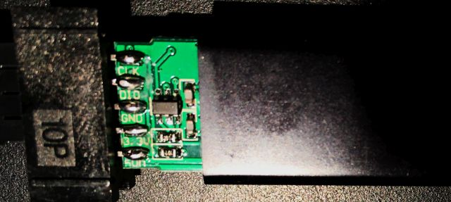
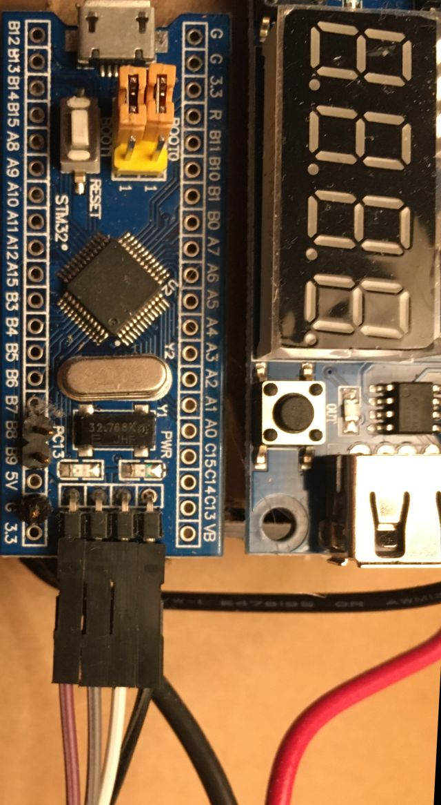
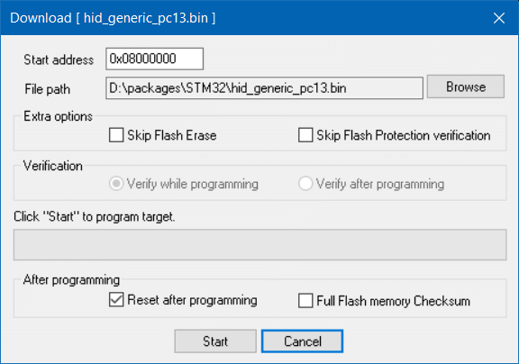
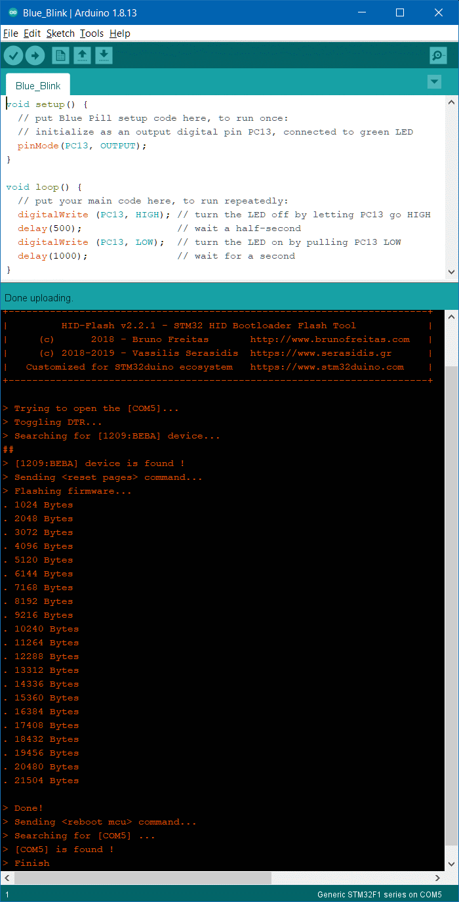
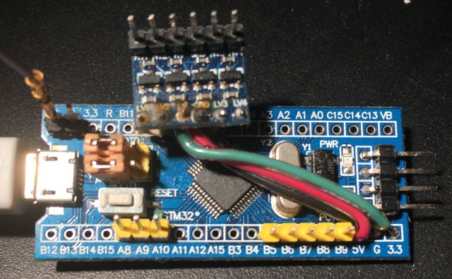

---
Arduino for Blue Pill
---
*updated 20 Jun 2021*

#### Background
Arduino originally employed microcontrollers lacking USB support.  
Their workaround involved boards with USB-to-TTL converter chips,  
usually configured as USB COM devices for serial IO,  
which microcontrollers traditionally support.
  
While not an official Arduino platform,  
[WeMos D1 UNO R1](ESPDuino) is a supported ESP8266 board,  
communicating via CH340 USB-serial chip.
 
While many STM32 chips' ROM bootloaders support (DFU) USB directly,  
Blue Pill's `FC103C8` chip lacks USB bootloader support in ROM.  
While STM32F103C officially has 64K flash,
[many have 128K](https://stm32duinoforum.com/forum/viewtopic_f_28_t_4361.html).  

There are at least 4 ways to flash STM32 chips:  
1) SWD via ST-LINK  
   **This will be used to load an HID bootloader to Blue Pills** 
2) (Arduino) USB bootloader[s] <- there have been several:  
   * [STM32duino Bootloader](https://stm32duinoforum.com/forum/wiki_subdomain/index_title_Bootloader.html) AKA bootloader 2.0 AKA **HID bootloader**  
     **Arduino uses this to download Blue Pill sketches using ST Microelectronics-supported libraries**
   * the rest are IMO obsolete:
     - [Maple-derivative bootloaders](https://github.com/jonatanolofsson/maple-bootloader)  
     - Maple boards had USB reset hardware to force re-enumeration  
     - [Roger Clark's 8k bootloader](https://github.com/rogerclarkmelbourne/STM32duino-bootloader)  
       Be aware that some of Roger Clark core code is also called Stm32duino..
     - Not sure which core (libmaple or stm32duino) [this bootloader supports, but is 4k](https://github.com/davidgfnet/stm32-dfu-bootloader)  
3) STM serial bootloader  
   Blue Pill micro has only a serial bootloader  
   [Load firmware via USART1 by jumpering](https://stm32duinoforum.com/forum/wiki_subdomain/index_title_Bootloader.html#Boot0_and_Boot1_pin_settings):  
   `Boot0 HIGH`  
   `Boot1 LOW`  
  ... then resetting MCU
4) DFU (device firmware update) using DfuSe utility, e.g. for [Black Pills](black)   
    using the [STM32 system memory bootloader in ROM](https://www.st.com/en/development-tools/stsw-stm32080.html),  
    but USB is [**NOT** supported by Blue Pill's ROM bootloader](https://stm32duinoforum.com/forum/wiki_subdomain/index_title_Bootloader.html)  

STM32duino expects a USB HID bootloader,  
which gets launched by Blue Pill's ROM bootloader,  
then that USB HID bootloader installs sketches above it in flash.  

A clone ST-LINK V2 costs no more than a USB COM dongle,  
connects to dedicated Blue Pill pins and supports debug.  
Clone USB COM dongles *may not* support 3.3V to Blue Pill serial boot pins..  
Blue Pill boot jumpers *are unchanged* when flashing by ST-LINK or HID bootloader.  

#### STM32duino
Many STM32 Arduino projects use [Roger Clark's core](https://github.com/rogerclarkmelbourne/Arduino_STM32) and bootloader AKA Maple,  
but Arduino now has an ST Microelectronics-supported [core and board manager](https://github.com/stm32duino/Arduino_Core_STM32/releases)  
for which there is an [HID bootloader](https://github.com/Serasidis/STM32_HID_Bootloader),
as described [on YouTube](https://www.youtube.com/watch?v=Myon8H111PQ).  
That video installs the Blue Pill HID bootloader via USB COM dongle,   
but we will here use an [ST-LINK V2 clone](https://www.ebay.com/itm/183320329257).  
My clone ST-Link happens to have the *correct pinout* printed on its cover;  
**Verify ST-LINK clone pin artwork** by sliding that cover partly open (along the USB plug):
  

[Here is the **Arduino for STM32** forum](https://www.stm32duino.com).  It replaced an earlier one.  
[Here is the READ-ONLY version of that earlier Arduino for STM32 forum](https://stm32duinoforum.com/forum/index_php.html).  
[Here is the Arduino software page](https://www.arduino.cc/en/software).  

### ST-LINK and Blue Pill
[This video](https://www.youtube.com/watch?v=KgR3uM21y7o) programs a Blue Pill using [STM32 ST-LINK utility](https://www.st.com/en/development-tools/stsw-link004.html).  
Wiring Blue Pill to ST-LINK V2 clone:
  
  
Connect 3.3V from ST-LINK to Blue Pill **only when Blue Pill has no other connections**  
Put another way, when using ST-LINK to debug Blue Pill e.g. plugged to USB,  
  **do NOT connect 3.3V to Blue Pill from ST-LINK**.  
Here is my ST-LINK connected to my harness tensioning Blue Pill:
  

### Installing (by Windows ST-LINK) Blue Pill HID bootloader for STM core
 - For Windows, stlink-org tools depend on STM's `ST-LINK driver`,  
   bundled with [STM32 ST-LINK utility](https://www.st.com/en/development-tools/stsw-link004.html),  
   which utility was *also* wanted for updating clone ST-LINK firmware.  
 - *Also* use [STM32 ST-LINK utility](https://www.st.com/en/development-tools/stsw-link004.html) to install HID bootloader.
 - These instructions apply *specifically* for 64-bit Windows, ST-LINK clone,  
   HID-bootloader, Blue Pill and STM core.  

1) Download and install [STM32 ST-LINK utility](https://www.st.com/en/development-tools/stsw-link004.html)  
   in my case, to `D:\packages\STM32\`
2) Plug bare ST-LINK clone into USB.  
   If it shows up in **`Device Manager`** under **`Other devices`** (*with a yellow warning*),  
   then drivers *were not* installed; see 1)  
   else it should appear under **`Universal Serial Bus Devices`**.
3) Launch **`STM32 ST-LINK Utility.exe`**  
   in my case,  
`D:\packages\STM32\ST-LINK Utility\STM32 ST-LINK Utility.exe`
4) Select `ST-LINK` > `Firmware update`  
   click `Device Connect`
   click `Yes>>>>`
5) Unplug ST-LINK clone from USB and wire it to Blue Pill as shown above.
6) Connect Blue Pill `BOOT-0` and `BOOT-1` pins (or on-board jumpers) to `0`  
   ** *and leave them*! **  
   Disconnect everything except ST-LINK from Blue Pill, and plug ST-LINK to USB.  
7) Download `stm32_binaries.zip` from [the latest HID Bootloader release](https://github.com/Serasidis/STM32_HID_Bootloader/releases)  
   From it, extract:  `hid_generic_pc13.bin`  
   (*Blue Pill on-board LED is connected to pin `PC13`*)  
   in my case, to `D:\packages\STM32\`
8) To flash HID Bootloader to a Blue Pill, in STM32 ST-LINK Utility:  
   `File` > `Open File...` > `hid_generic_pc13.bin`  
   `Target` > `Erase Chip`  
   `Target` > `Program...` > **`Start address`** `0x8000000` **`File path`** `D:\packages\STM32\hid_generic_pc13.bin`
     
   click **`Start`** (*that should complete quickly*)  
   (*Blue Pill red LED on for power, green LED flickers quickly*)  
   Unplug ST-LINK, unwire ST_LINK from Blue Pill, and connect Blue Pill to USB.  
   (*Blue Pill red LED on for power, green LED flickers quickly*)  

   **Note** A bad Arduino sketch download can leave a Blue Pill unable to be recognized by Windows,  
   and reflashing the HID Bootloader without wiping the bad sketch by `erase chip` may not recover it.  

### Installing STM32duino support
Since SimHub already includes an *older version* of Arduino,  
install the portable (ZIP file) version for STM32;  
no need to install Arduino-specific driver[s]...
1) Download, unzip, and run [Arduino](https://www.arduino.cc/en/software)  
   in my case, to `E:\my\Arduino\`  
   *much of the following is thanks to [sgbotic](https://www.sgbotic.com/index.php?dispatch=pages.view&page_id=48)*
2) Go to **`File` > `Preferences`**, add to **`Additional Board Manager URLs`** text box:
   [https://github.com/stm32duino/BoardManagerFiles/raw/master/package_stmicroelectronics_index.json](https://github.com/stm32duino/BoardManagerFiles/raw/master/package_stmicroelectronics_index.json)  
3) Go to **`Tools` > `Board` > `Boards Manager`**, enter search for **`STM32`**:  
     
   *18 Aug 2022*: Latest version is `2.3.0`; @bosirovec reported [a missing `2.3.0` folder, now fixed](https://github.com/stm32duino/Arduino_Core_STM32/issues/1806).  
   click **`STM32 Cores`**, then **`Install`**  (*takes quite awhile*)  
4) Quit and restart Arduino; then  
   from **`Tools` > `Board:` > `STM32 Boards`**, select [`Generic STM32F1 series`].  
   From **`Tools` > `Board Part Number:`**, select [`BluePill F103C8`].  
   From **`Tools` > `Upload method:`**, select [`HID Bootloader 2.1`] or newer.  
     

   **Be sure** to check Tools settings before Sketch upload; Arduino seemingly likes to change them,   
   then Blue Pill will not be a recognized device after uploads.  
   Check in Windows' `Device Manager` under `Ports (COM & LPT)` for `USB Serial Device (COM*n*)`,  
   where in my case `n = 3,5 or 10`.    
   **`Port:`** `COM[5]` is unavailable until a sketch is loaded, e.g.
[`Blue_Servo`](https://github.com/blekenbleu/blekenbleu.github.io/blob/master/Arduino/Blue_Servo):
   

Here is a Blue Pill pinout reference:
  
- 5V tolerant PWM pins are wanted for driving hobby servos, e.g. `PA8-10` and `PB6-9`.  
- 5V tolerant CAN BUS pins `PB8,9` **work for me**.
- In addition to seven 5V tolerant PWM pins, up to 7 more can be available by level-shifting:  
    

A simple next step adds servos to the blink loop sketch.  
[This servo cycling sketch](https://github.com/blekenbleu/blekenbleu.github.io/tree/master/Arduino/Blue_Servo) is under GitHub revision control,  
with a shortcut to that sketch folder in the Arduino "work" folder.  
Both of these ploys work; the sketch runs..  
**This sketch can be used to verify servo wiring to a Blue Pill** *without* serial control. 

### Serial servos e.g. for SimHub harness tensioning
Here is the [Arduino reference for Serial communication](https://www.arduino.cc/reference/en/language/functions/communication/serial/)  
In STM32duino, **`Serial`** device is USB virtual COM port,  
using `PA11+12`, and **`Serial1`** is UART `PA9+10`,  
but **Serial** *may be* UART in [PlatformIO Arduino framework](https://platformio.org/frameworks)  
unless configured as a USB Virtual COM port in Tools.  

Put [`while (!Serial){;}` in `setup(){}`](https://www.arduino.cc/reference/en/language/functions/communication/serial/ifserial/)  
Toggling LED off before and on or blinking after provides connection feedback.  
The first Arduino sketch I found that combined `Serial` and `<Servo.h>` is  
[Matt Williamson's serial_servo_rx.ino](https://github.com/mattwilliamson/Arduino-RC-Receiver/blob/master/serial_servo_rx_ino/serial_servo_rx.ino)  

Single-character control [avoids serial string blocking and overflows](https://www.forward.com.au/pfod/ArduinoProgramming/Serial_IO/index.html).  
Useful rotation range for my harness' servos is less than 127 degrees;  
direct odd rotation values 3-127 to the right harness strap  
and even rotation values 2-126 to the left,  
reserving values 0-1 to set strap offsets based on **immediately next** values.  

Green LED blink codes feedback when processing servo values,  
with 50% duty cycle for idle operation.  
Perhaps better to use that LED to signal when servo values are max..?   
Blink timing by `delay()` impacts serial bandwidth, so use `millis()`.

For serial servo control, with or *even without* **SimHub Custom serial device**,  
**[this sketch](https://github.com/blekenbleu/blekenbleu.github.io/tree/master/Arduino/Blue_ASCII_Servo)** accepts e.g. ASCII characters from Arduino `Tools` > `Serial Monitor`.  
to move left or right servo based on least-significant bit.  
**See [above](#stm32duino) for Blue Pill flash programming information.**  
Characters `> 127` do not arrive intact from SimHub JavaScript,  
but useful strap servo range is `< 127`, with offsets applied to received values.  
Testing suggests that, running on STM32 Blue Pill,  
this sketch handles 60Hz updates of 4 characters,  
where 2 should suffice and servos respond less quickly.  
By changing from Blue Pill-specific PWM pin and LED assignments,  
this sketch should work for other Arduino-supported modules with PWM-capable pins.

Corresponding [SimHub Custom serial hacking is described here](SimHubCustomSerial).

### Blue Pill servo firmware generations
As described above, **first generation** use the least signficant of 7 bits  
to select servos for left or right harness tensioning..   
A **second generation** allocates 3 msb for PWM pin selection,  
with 0x70 reserved for special commands e.g. 0x7F for servo LUT loading,  
leaving 4 lsb to index into a 16-entry LUT of PWM values.  
A **third generation** pairs ASCII characters (14 bits),  
of which the most significant bit in each character  
identifies it as first (1) or second (0) of a pair.  
The next bit in the first character is most significant of 7 data bits,  
while the 5 lsb index a channel, which may e.g. be a PWM pin.  
The largest channel value is reserved for special commands.  
The 6 lsb of second characters is 6 lsb of channel data values.

[**PWM fan code is described here**](SimHubfans)  
[**PWM fan sketch is here**](SimHubPWMfans)  
