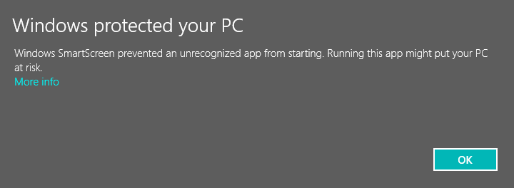
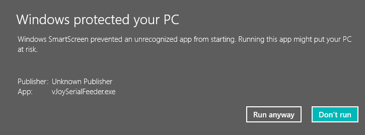

---
---
## VJoySerialFeeder Installation
* Download from [releases](https://github.com/Cleric-K/vJoySerialFeeder/releases)
* Create a folder for downloaded contents
* Unzip/untar release into created folder
   - Arduino code is in [Source code](https://github.com/Cleric-K/vJoySerialFeeder/archive/v1.3.1.zip)
* On Windows
   * Run `vJoySerialFeeder.exe`
   * click "More info" in SmartScreen:
  
   * click "Run anyway":
  
     *This is only required for the first launch after installation.*  
   * Help Manual is [here](https://github.com/Cleric-K/vJoySerialFeeder/blob/master/Docs/README.md)
   * Configurations are saved to `%LOCALAPPDATA%\vJoySerialFeeder\vJoy*\1.3.1.0\user.config`
