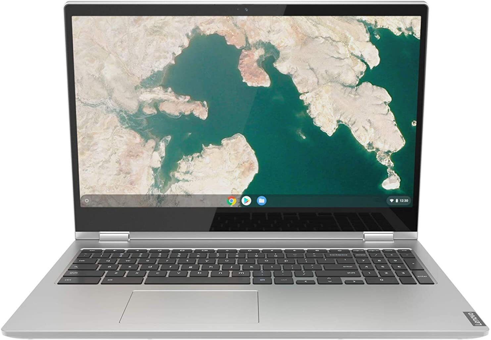
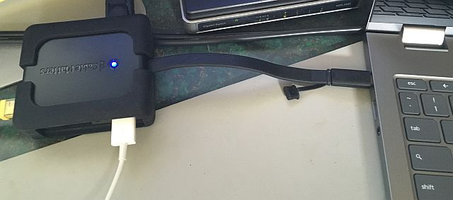
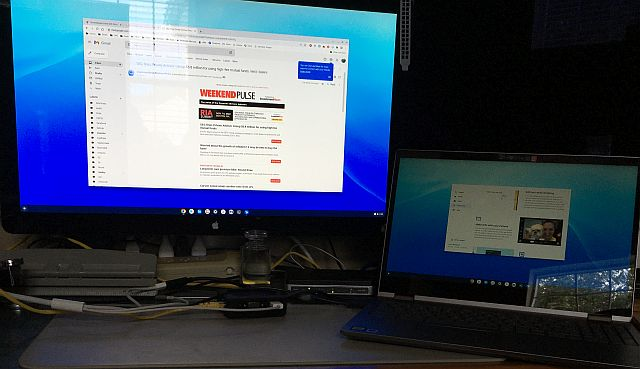

---
---
*[back](../)*
  

## Lenovo Chromebook C340 2-in-1 15.6" FHD IPS Touch i3-8130U 4GB RAM 32GB eMMC
  
item number: &nbsp; [304527111077](https://www.ebay.com/itm/304527111077)  
Condition: New  
Type: Notebook/Laptop  
Model:  Lenovo Chromebook C340  
MPN:  81T9000XUS  
Operating System: Chrome OS  
Processor Speed: 2.20 GHz  
Graphics Processing Type:  Integrated/On-Board Graphics Intel UHD Graphics 600  
Storage:  eMMC 32 GB  
RAM Size:  4 GB  
Processor:  Intel Core i3 8th Gen.  
Screen:  15.6-in (1920 x 1080) IPS, anti-glare, Touchscreen, 250 nits  
Features:  Bluetooth, Built-in Microphone, Built-in Webcam, Convertible 2-in-1 Laptop/Tablet  
Country/Region of Manufacture: China  
Input:  Internal Keyboard, non-backlit  
Battery:  4 cell 56Wh  
Power:  AC Adapter  
Chassis: Mineral Grey  
Ports: &amp; Slots:  2 x USB-C 3.1 Gen 1, 1 x USB-A 3.1 Gen 1, MicroSD card reader, Headphone/mic combo, Kensington lock slot  
Dimensions:  361.5mm x 248.85mm x 18.95mm / 14.23" x 9.8" x 0.74"  
Weight:  Starting at 4.4 pounds  
Warranty:  It is covered by manufacturer's Warranty Repair Service Service until June, 2023.  

  &nbsp; [Lenovo Authorized seller](https://www.ebay.com/usr/themaxmart)  

---

 *received 28 July*  
My solitary C340 arrived today in a sealed Lenovo box.  
Somewhat evocative of my now-ancient MacBook Pro;  
less tapered and a darker gray (no illuminated apple logo)...  
It fired up a few seconds after plugging in its USB-C charger.  
It needed a (~5 minute) update.  
It tried and failed to sync settings without first asking for my passphrase...  
[**Lenovo Chromebook community**](https://forums.lenovo.com/t5/Lenovo-Chromebooks/bd-p/lc01_en)  
[**Lenovo IdeaPad C340-15 hardware manual**](https://download.lenovo.com/consumer/mobiles_pub/flex_15iwl_hmm_201902.pdf)  
 - [**7 Best Chromebooks for Artists in 2022**](https://proactivecreative.com/7-best-chromebooks-for-artists-in-2020)  

## Ordered a USB-C dock with DisplayPort  
[Cable Matters' USB C hub](https://www.amazon.com/gp/product/B076TRGGM6) works perfectly with this Chromebook.  
  
As Amazon reviewers noted, the single USB-2 port can be limiting,  
but in this case is used for the USB connection from my Apple 27" Cinema Display (also via MiniDP adapter),
  
Except that the Cinema display is *significantly* brighter than the C340's,  
they are otherwise nearly so compatible as is the MacBook Pro for which the display was originally purchased.  
Cinema display speakers automagically play from the C340, and it has USB ports on the back,  
to which a keyboard and mouse are plugged, being a fan of neither touchpads nor touch screens.  

[**Connect your Chromebook to a monitor**](https://support.google.com/chromebook/answer/1060909)  
[**Multiple Chromebook monitors by USB-C**](https://www.androidheadlines.com/2020/09/chromebook-multiple-displays-single-usb-c-port.html)  
[**VLC Media Player on Chromebook plays FLAC**](https://chromeready.com/2683/how-to-install-vlc-media-player-on-chromebook)  
[**Chromebook external NTFS hard drives**](https://www.cnet.com/tech/computing/how-to-use-an-external-drive-with-a-chromebook/)  
It mounts the 1TB NTFS USB drive attached to our network router, which is used for FLAC music, images  
and e.g. PDF files that are shared among my several PCs and Macs.  
- [File types and external devices that work on Chromebooks](https://support.google.com/chromebook/answer/183093)  
[Stylus for C340-15 Touch-Screen Chromebook](https://www.amazon.com/dp/B085FDR67C)  
 - Stylus to draw on it needs to be brought separately.  

A satisfactory *for me* Windows PC replacement wants:
- [IrfanView](https://en.wikipedia.org/wiki/IrfanView), a nominally Windows-only image app
  - [How to Run Windows 10 Apps on Chromebook Using Wine 5.0](https://beebom.com/how-use-windows-10-apps-chromebook-using-wine)  
- DeadBeef to play FLAC music
  - [Running Linux on your Chromebook with GalliumOS](https://opensource.com/article/17/4/linux-chromebook-gallium-os)  
- iPhone file sharing
  - [How to use an iPhone with your Chromebook: Tips and Tricks](https://www.xda-developers.com/how-to-use-iphone-chromebook)
- GitHub  
  Git cannot be installed in ChromeOS separately.  In the Linux environment, [Git is already installed](https://www.geeksforgeeks.org/how-to-install-git-on-chrome-os/).  
  - [How to use GitHub in Chrome OS (via Termux)](https://www.youtube.com/watch?v=KXLQcX3HbWw) <- video
- GVim (text editor)
  - [GVim for Chromebook](https://www.bestchromebookapps.com/gvim-for-chromebook) 

### [coding on a Chromebook: VSCode.dev](https://www.aboutchromebooks.com/news/a-new-option-to-code-on-a-chromebook-vscode-dev/)  
[How to install and use VS Code on a Chromebook](https://chromeready.com/5207/install-vscode-on-chromebook/)  

### [The github.dev web-based editor](https://docs.github.com/en/codespaces/the-githubdev-web-based-editor)  
