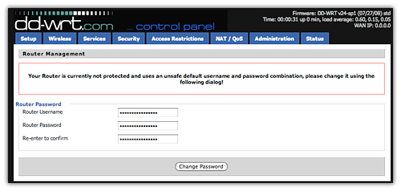
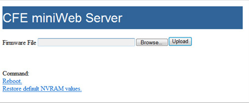
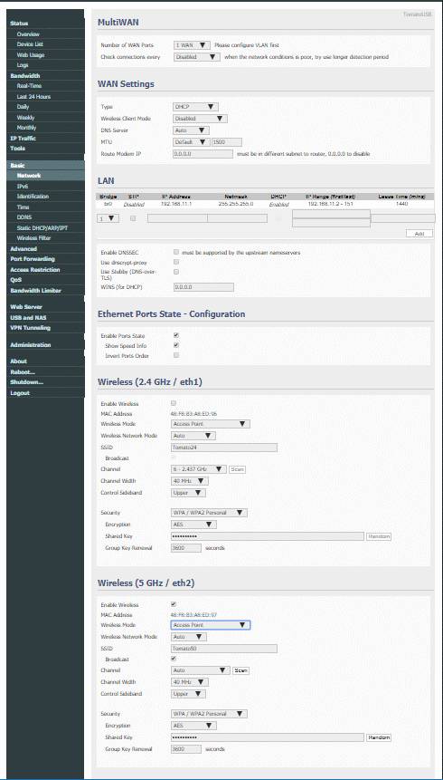

---
FreshTomato, Linksys EA6500v2 and the Internet
---
26 November 2018

### Background

<details>
<summary>click for routers vs gateways</summary>
<br>
Often bundled by cable TV or other <a href="https://en.wikipedia.org/wiki/Internet_service_provider">ISP</a>,
<br>commodity boxes called <em>routers</em> are 
<a href="https://www.techwalla.com/articles/difference-between-gateway-router">
more accurately gateways</a>.
<ul compact>
<li>Routers establish and maintain connections among network nodes.
<br>Routers advertise paths for connecting fragments of Internet address space,
<br>This requires that routers advertise address ranges for nodes attached to them.
<li>Gateways hide details about network nodes attached to their LAN side from those in Internet address space on their <a href="https://www.diffen.com/difference/LAN_vs_WAN">WAN</a> side.
</ul>
So-called home routers (AKA wireless routers) are a particular kind of gateway,
in that home LAN devices could at least in theory attach directly to the Internet, since they implement <a href="https://en.wikipedia.org/wiki/Internet_protocol_suite">Internet protocols</a>
<br>Additionally, wireless routers <a href="https://en.wikipedia.org/wiki/Bridging_(networking)">bridge</a> Wi-Fi nodes to e.g. switched <a href="https://en.wikipedia.org/wiki/Ethernet_over_twisted_pair">CAT5/6 ethernet nodes</a>,
so that an iPad using Wi-Fi can discover and communicate with other LAN nodes without distinguishing between radio and twisted wire connections.
<ul compact>
<li>Few home network devices are robust against Internet malware exploits.
<li>Some important home router features:
<ul compact>
<li>firewall and <a href="https://en.wikipedia.org/wiki/Network_address_translation">NAT</a>
<li>relatively frequent updates to address new exploits
<li><a href="https://www.cisco.com/c/en/us/td/docs/switches/lan/catalyst4500/12-2/25ew/configuration/guide/conf/vlans.html">VLAN</a>,
 <a ref="http://www.tech-faq.com/the-vpn-gateway.html">VPN</a>
 and <a href="https://www.lifewire.com/definition-of-dynamic-dns-816294">DDNS</a><br>
These can help secure privacy (e.g., block ISP monetizing your Internet habits)
and login to your home PC from away.
<li><a href="https://en.wikipedia.org/wiki/Dnsmasq">Dnsmasq</a><br>
This allows assigning your network-attached printer a name, such as `printer`,<br>
 then print to `printer` from other LAN nodes<br> without knowing its current IP address assignment.
</ul></ul>
<br>

</details>

<details>
<summary>click for Tomato vs dd-wrt vs OpenWrt</summary>
<br>
These are <a href="https://bluegadgettooth.com/dd-wrt-vs-tomato-vs-openwrt/">IMO
most</a> significant <a href="https://en.wikipedia.org/wiki/Comparison_of_router_software_projects">embedded Linux distributions for routers</a>,
<br>all derived from Linksys WRT54G firmware.
<ul compact>
<li><a href="https://openwrt.org/">OpenWrt</a> continues to make releases, but
<ul compact>
<li>relatively complex to use
<li>has a writeable filesystem, making it more immediately vulnerable,
<br> all other things being equal (which they rarely are)
</ul>

<li><a href="https://dd-wrt.com/">dd-wrt</a> has not made stable releases for years..
<ul compact>
<li>supports more devices than others
<li>many, if not the most, configurable options
<li>hard to identify a stable current beta release that is robust on a specific router
<li><a href="https://dd-wrt.com/professional/customization/">Commercial versions</a> bundled with (refurbished) routers..
</ul>

<li><a href="https://bitbucket.org/pedro311/freshtomato-arm">FreshTomato</a> is the currently-supported fork of <a href="http://www.polarcloud.com/tomato">Tomato</a>
<ul compact>
<li>IMO, most appropriate for DIY router upgrades.
<li>easiest and seemingly most robust distro
<li>supports relatively few routers (simplifying releases)
<br>Linksys EA6300v1/EA6400, EA6500v2, EA6700, EA6900 are supported.
<li>Probably the <a href="https://www.linksysinfo.org/index.php?threads/fork-freshtomato-arm.74117/">least-well documented</a>
<br>Much has been written about various Tomato forks and release versions,
<br> but little is specific to FreshTomato, much less 2018.4 for ARM
</ul>
</ul>
<br>

</details>

<details>
<summary>click for FreshTomato-ARM <code>AIO</code> vs <code>VPN</code> builds; Entware </summary>
<br>
Shibby Tomato K26ARM builds include EA6500-6900<br>
<em> (K26ARM7 applied only to R8000 and Asus RT-AC3200)</em><br>
<br>
For clear definition of AIO vs VPN; go to
<a href="https://bitbucket.org/kille72/freshtomato-arm/src">source</a>:
<code>shibby-arm</code> branch for <code>release/src-rt-6.x.4708/Makefile </code><br>
Comparing Makefile <code>VPN</code> and <code>AIO</code> target line items sorted,<br>
<br>
VPN has no unique options<br>
AIO has additional options:<br>
<em>Comments from http://tomato.groov.pl/?page_id=78</em><br>
<br>
  <code>BTCLIENT=y</code>  # BlueTooth?<br>
  <code>TR_EXTRAS=y</code> # transmission-remote tool[s]..?<br>
  <code>DNSCRYPT=y</code>  # user selectable/manual DNS<br>
  <code>STUBBY=y</code>       # DNS-over-TLS resolver<br>
  <code>UPS=y</code>  &nbsp      # UPS presumably by USB<br>
  <code>TINC=y</code> &nbsp      # Tunneling VPN daemon<br>
  <code>NFS=y</code>  &nbsp      # NFS fileserver<br>
  <code>NANO=y</code> &nbsp    # text editor<br>
  <code>TOR=y</code>  &nbsp      # Bittorrent?<br>
  <code>NGINX=y</code>         # webserver?<br>
  <code>IPERF=y</code>         # network utilities - available separately for
<a href="https://www.linksysinfo.org/index.php?threads/tomato-arm-utilities-tcpdump-iperf-rsync.70648/">TomatoUSB from Entware</a>
<br>
<br>In theory, mount a flash drive on the USB port and
<a href="https://github.com/Entware/Entware/wiki/Install-on-the-TomatoUSB">install Entware there</a><br>
"the FreshTomato project gives native support to ENTWARE"<br>
<a href="https://www.linksysinfo.org/index.php?threads/fork-freshtomato-arm.74117/#post-296337">How To</a> &nbsp - &nbsp
<a href="https://www.linksysinfo.org/index.php?threads/fork-freshtomato-arm.74117/page-7#post-298255">more forum support</a> -
<a href="https://www.linksysinfo.org/index.php?threads/mips-repo-entware-backports-entware-ng-reloaded.74337/">
.. but that was before entware-ng went away</a><br><br>
<h4>
<a href="https://repology.org/metapackages/?inrepo=entware&newest=1">Repology Metapackages in Entware</a></h4>
<br>

</details>

<details>
<summary>click for Sagemcom F@st 5260 vs Linksys EA6500v2 vs EA6700 </summary>
<br>
<ul compact>
<li>Bundled by Spectrum, who control <a href="https://wikidevi.com/wiki/Sagemcom_F@ST_5250">F@st 5260</a> firmware,
<br> which does <em>not</em> support <a href="https://medium.com/linode-cube/want-faster-easier-to-manage-dns-use-dnsmasq-a02517234d5f">Dnsmasq</a>.  USB is 2.0.
<li>Relatively cheap and fairly fast, the <a href="https://www.linksys.com/us/support-article?articleNum=141157">Linksys EA6500</a> was developed by Cisco.
<br>IMO, cloud management is weird, then useless when diagnosing ISP issues.
<br>Stock <a href="https://en.wikipedia.org/wiki/Network-attached_storage">NAS</a> firmware supports few USB 3.0 hard drives .
<br>Available in two versions, <a href="https://www.amazon.com/dp/B008I21EA2">v2</a> is equivalent to the <a href="https://www.amazon.com/dp/B07DTL1QPK">Linksys EA6700</a>
<br>
<br>I <a href="https://www.amazon.com/gp/product/B008I21EA2">purchased</a> mine in 2014,
would now get a refurbished <a href="https://www.amazon.com/dp/B07DTL1QPK">EA6700</a>.
<br>IMO, an EA6700 has hardware nearly as good as many $150 routers, 
<br> but available for < $40 used or refurbished.  Linksys rates their EA6900
<br>faster <a href="https://www.linksys.com/us/support-article?articleNum=138794">only on 2.4 GHz</a> and has overheating issues
<br> that would be mitigated by vertical mounting. 
<br>Buying used cuts prices and avoids early life failures.
<br>Replacing problematic Linksys firmware with FreshTomato should make an EA6900 equivalent to
NETGEAR's <a href="https://www.google.com/search?q=EA6900+vs+R7000&pcmp=f">more popular and expensive Nighthawk R7000</a> running nearly
<a href="https://www.linksysinfo.org/index.php?threads/fork-freshtomato-arm.74117/page-13#post-300517">identical firmware</a>.
</ul>

</details>

<br>

### Linksys ARM CFE, NVRAM and firmware
<a href="https://en.wikipedia.org/wiki/Common_Firmware_Environment">CFE</a> is basically a standardized BIOS and bootloader.
<br>In their version, Linksys
- disabled firmware update by HTTP during boot,
- reduced available NVRAM for storing variable data to 32KB, and
- enabled dual-booting.  
If current firmware is problematic,
either the user can revert to prior firmware  
or the EA6500 might reboot to it automagically.  

These are unexpected behaviors among routers sharing Broadcom SoC technology..
<a href="https://www.linksysinfo.org/index.php?threads/understanding-nvram.69532/">Understanding
Tomato NVRAM</a>  

Recent Linksys firmware releases reject unsigned binaries, which complicates hacking.  
Only the latest EA6500v2 firmware release <a href="http://downloads.linksys.com/downloads/releasenotes/EA6500_v2_Customer_Release_Notes_1.1.40.176451.txt">(build 176451)</a> has this restriction,  
and reverting to the previous release allows loading e.g. mini-dd-wrt.

## FreshTomato 2018.4 installation on EA6500v2
This works only on Windows.  

Instructions <a href="https://www.linksysinfo.org/index.php?threads/guide-flash-linksys-ea6300v1-ea6400-ea6500v2-ea6700-ea6900v1-0-1-1-with-tomato.73877/">here</a> are nearly accurate, but IMO confusing,  
since they focus on problematic tftp recovery, which should be unnecessary.

### Step 1
- Download FreshTomato firmware from  
  [https://exotic.se/freshtomato-arm/v2018/2018.4/](https://exotic.se/freshtomato-arm/v2018/2018.4/)  
- Download
<a href="https://my.pcloud.com/publink/show?code=kZUbB87Zm3YFpS5jm17pxlLl49R2b5lXvYQV">EA6500v2 CFE Flash</a> kit, which requires <a href="https://www.7-zip.org/">7-Zip</a> to unpack.  

### Step 2
Connect the Linksys router ONLY to its power dongle and your Windows PC.  
**Disconnect its WAN port!**  
Routers are usually found by web browsers at [192.168.1.1](http://192.168.1.1).  
For current Linksys firmware newer than 166281, restore the previous version:  
`login, Troubleshooting>Diagnostics>[Restore previous firmware]`  


That worked for me...   

If the router *still* reports firmware newer than 166281, then get 166281
<a href="http://cache-www.belkin.com/support/dl/FW_EA6500v2_1.1.40.166281_prod.img">here</a>
and
[perform a manual firmware update](https://www.linksys.com/us/support-article?articleNum=138220)
 to `FW_EA6500v2_1.1.40.166281_prod.img`:  


EA6500 eventually reboots itself

<details>
<summary>click to understand steps 3-8</summary>
<br>
<h4>custom CFE</h4>
FreshTomato (and dd-wrt) expect to be able to use 64KB NVRAM,<br>
which is NOT supported by stock Linksys CFE.<br>
The workaround is to install a custom CFE.<br>
Linksys firmware has no provision for replacing CFE,<br>
so we first install a mini-dd-wrt that<ul compact>
<li> works with Linksys' small NVRAM
<li> simplifies backup of original Linksys CFE
<li> supports CFE replacement
<li> but is too old to include important exploit fixes,<br>
  so should NOT be used for Internet access.</ul>
After that custom CFE is customized and installed using mini-dd-wrt,<br>
that CFE's HTTP bootloader will be used to install FreshTomato 2018.4

</details>

<br>

### Step 3
#### On the router,
- goto `Troubleshooting>Diagnostics`  
- `Factory Reset`

### Step 4
#### The <a href="https://my.pcloud.com/publink/show?code=kZUbB87Zm3YFpS5jm17pxlLl49R2b5lXvYQV">EA6500v2 CFE Flash</a> kit contains
- Tools
- `linksys_ea6500_cfe.bin`
- `linksys_ea6500_ddwrt.bin`

#### [Perform a manual firmware update](https://www.linksys.com/us/support-article?articleNum=138220) to `linksys_ea6500_ddwrt.bin`  
- click OK for reboot
- takes awhile; I waited ~20 minutes (lunch break)  
### Step 5
- Power off/on - rebooted to dd-wrt 

- Set userid/password to admin admin admin
- click `Services`
- enable `Secure Shell` `SSHd`
### Step 6
#### New CFE has relatively few customizable parameters, based on:
- MAC Address (found on the bottom of the router)
- WPS Password (found on the bottom of the router)  

#### On the PC,
- `Tools\CFEEdit.exe`
- Open `linksys_ea6500_cfe.bin`  
- find and set
  - `et0macaddr=`(MAC Address) 
  - `secret_code=`(WPS Password without '-')
- in `Advanced`
  - `0:macaddr=`(2 + MAC Address)
  - `1:macaddr=`(4 + MAC Address)
- Save As `new-cfe.bin`
- Exit
### Step 7
#### Copy original CFE to Windows PC and copy custom CFE to router  
- browse to [`http://192.168.1.1/backup/cfe.bin`](http://192.168.1.1/backup/cfe.bin)  
  and save this orignal Linksys CFE somewhere memorable,  
  in case you ever want to restore Linksys firmware..
- launch `Tools\WinSCP-5.9.6-Portable\WinSCP.exe`  
  Host name: 192.168.1.1  
  Port: 22  
  Connection type: SFTP  
  `[Open]`  
  login as: root  
  password: admin  
- make sure the right pane is in the `/tmp/root` directory
- drag `new-cfe.bin` from left pane to right
- Close WinSCP
### Step 8
#### Flash this custom CFE  
- `Tools\putty.exe`  
  Host name: 192.168.1.1  
  Port: 22  
  Connection type: SSH  
  and Open  
  login as: root  
  password: admin  
  3 commands: (`#` is prompt)
```
# mtd unlock /dev/mtd0
# mtd write -f /tmp/root/new-cfe.bin /dev/mtd0
# exit
```

<details>
<summary>click for NVRAM discussion</summary>
<br>
Firmware is easily crashed by bad NVRAM data.<br>
Until now, Linksys CFE reserved only 32KB for NVRAM.<br>
Now, custom CFE and new firmware expect 64KB for NVRAM,<br>
where previously valid data for old could crash new firmware,<br>  
not to mention whatever is in the 32K<br>
that was not previously considered NVRAM.<br>
Consequently, take every opportunity to clear NVRAM<br>
until tweaking FreshTomato settings,<br>
which will be after the *second* time booting into FreshTomato.<br>

</details>

<br>

### Step 9
#### Install FreshTomato by CFE Recovery Web Interface 
Router must be coming from powered off state  
while depressing the red reset button for 10-15 sec.  

- click `Restore default NVRAM values`
- `[Browse]` to `freshtomato-EA6500v2-ARM-2018.4-AIO-64K.trx`
- `[Upload]`
- Flash can take up to five minutes;  
  check `ping 192.168.1.1` for ttl=64 to see if it's done.

### Step 10
#### reset NVRAM
- power off router
- press blue WPS button while powering on the router,
- continue holding WPS until the Linksys logo starts flashing -or- 15-20 seconds
- browse to [192.168.1.1](http://192.168.1.1)
- Administration > Configuration > Restore Default Configuration >  
  `Erase all data in NVRAM memory (thorough)`
### Step 11
#### Tweak and deploy FreshTomato
- First, `reboot router`  

<details>
<summary>click for <code>Wireless Ethernet Bridge</code> configuration</summary>
<br>
Tomato routers offer
<a href="https://learntomato.com/category/wireless-bridge/">various wireless bridge modes</a>, such as:<br>
Wireless Client Bridge, Wireless Ethernet Bridge, and<br>
 WDS (Wireless Distribution System).<br>
<br>
<a href="https://learntomato.com/setup-wireless-repeater-wds-bridge-tomato/">WDS
requires compatible support at both ends</a>;<br>
Sagemcom 5260 manual does not mention WDS..<br>
<br>
<a href="https://learntomato.com/category/wireless-bridge/">Wireless Client Bridge mode</a>
 puts clients on a different subnet.<br>
FreshTomato owner declared <code>wireless client bridge mode</code> broken by <code>multi-wan</code><br>
<br>
<h4>Wireless Ethernet Bridge is <em>different</em></h4>
* wireless ethernet bridge should transparantly bridge ethernet ports to Wi-Fi gateway<br>
<br>
FWIW, Wireless Client Mode is a WAN Setting in FreshTomato:<br>

<br clear=all>
Relevant entry from tools-survey:<br><code>
My5G  B8:EE:0E:BD:F2:BB -70 dBm 50% ch 155 5 GHz 80 MHz WPA2-Personal AES 11ac</code>
<br>

<code>basic-network.asp</code> shows 
<code>Enable Wireless</code> unchecked for 2.4 GHz/ eth1<br>
.. but is otherwise default.<br>
Both eth1 and eth2 were Access Point mode;<br>
5 Ghz/eth2 was 40 MHz Channel Width<br>
<br>
Changed eth2 to:<br>
Wireless Ethernet Bridge (from Access Point)<br>
My5G (from Tomato50)<br>
80 MHz (from 40)<br>
with the Shared Key appropriate for that SSID.<br>
<br>
Perhaps should have also changed EA6500v2 IP address?<br>
New address 192.68.1.68 was assigned by MySpectrumWiFib4-5G DHCP;<br>
can ping it at 192.68.1.68, but cannot login by web or putty SSH.<br>
YouTube video streams fine; Speakeasy shows great speed<br>
as does http://www.dslreports.com/speedtest?<br>

<h4><a href="http://tomato.groov.pl/download/K26ARM/132/">Tomato 132 for EA6500v2</a></h4>
<code>Wireless client mode</code> was broken after release 132, which preceded FreshTomato<br>

<h4>Original Tomato <a href="https://learntomato.com/setup-wireless-ethernet-bridge-on-tomato-router/">Wireless Ethernet Bridge</a> setup</h4>

<h4>
<a href="https://www.linksysinfo.org/index.php?threads/solved-see-post-12-isolated-guest-wifi-on-wireless-ethernet-bridge-how-to.74357/">Wireless
Ethernet Bridge on AdvancedTomato</a></h4>

<h4>i<a href="https://wiki.dd-wrt.com/wiki/index.php/Repeating_Mode_Comparisons">DD-WRT's unhelpful table</a></h4>

</details>
<br>

### Usage Documentation
- [FreshTomato-ARM @ LinksysInfo.org](https://www.linksysinfo.org/index.php?threads/fork-freshtomato-arm.74117/)  
- [Using QOS - Tutorial and discussion](https://www.linksysinfo.org/index.php?threads/using-qos-tutorial-and-discussion.28349/)  
#### (not necessarily Fresh) Tomato User Documentation
- [Tomato Advanced Firmware Setup](https://www.privateinternetaccess.com/helpdesk/guides/routers/tomato/tomato-advanced-firmware-setup) 8 Nov 2018

- [Tomato Wireless Recommended Settings](https://flashrouters.zendesk.com/hc/en-us/articles/225844447-Tomato-Wireless-Recommended-Settings) Sept 2018
- [Tomato Firmware/Installation and Configuration](https://en.wikibooks.org/wiki/Tomato_Firmware/Installation_and_Configuration) 25 Jan 2018  
- [HaganFox.net - Tomato Firmware Setup Guide](http://www.haganfox.net/Main/TomatoSetup) 4 Jan 2018  
- [SaferVPN - Manual OpenVPN setup for Tomato Router](https://support.safervpn.com/hc/en-us/articles/115001394109-Manual-OpenVPN-setup-for-Tomato-Router) 14 Nov 2018  
- [Surfshark - AdvancedTomato 3-5.140 OpenVPN tutorial](https://support.surfshark.com/hc/en-us/articles/360003780834-Tomato-router-tutorial) Jun 2018  
- [IVPN Tomato Setup Guide](https://www.ivpn.net/setup/router-tomato-manual.html)  
- [shibby Tomato IPVanish VPN setup](https://www.ipvanish.com/visualguides/OpenVPN/Tomato/)  
- [shibby Tomato windscribe VPN setup](https://windscribe.com/guides/tomato)  

#### Probably NOT current for FreshTomato:  
[LearnTomato](https://learntomato.com/blog/) 16 Nov 2014  
[TomatoUSB Tutorials](http://tomatousb.org/tutorials) 8 Jun 2011
