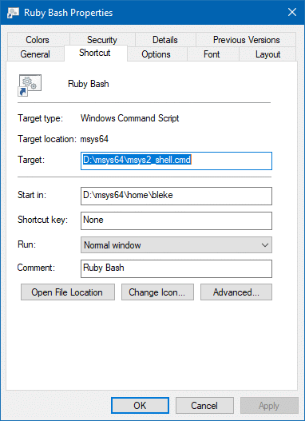

---
Jekyll on Windows 10
---
4 November 2018  

This was written *after* first Windows 10 installation,  
which followed Windows 8.1 installation.  
Having multiple Windows PCs enables discovering multiple ways to fail  
without the overhead of virtual machines.

**The short version**: [installation using Windows Subsystem for Linux](GitHubWSL)  
...which should basically be an [Ubuntu Installation](https://jekyllrb.com/docs/installation/ubuntu/)    
was disappointing.  FWIW, a Fedora distro on WSL would be preferred,  
but is as yet unsupported and problematic even for [better hackers](https://github.com/RoliSoft/WSL-Distribution-Switcher)  

#### Jekyll requires Ruby.    
Downloaded [Ruby WITHOUT Dev toolchain](https://github.com/oneclick/rubyinstaller2),  
.. but that installer anyway ran `ridk.cmd`,  
which prompted for Dev toolchain, to which `Enter` was pressed..  
FWIW, `ridk.cmd` is a Windows script  
that will not run from within a bash shell.  

MINGW64 in Ruby is much larger than in **Git for Windows** or **GitHub Desktop**:  
#### Git for Windows:
```
$ du -s /bin /usr
86818   /bin
74850   /usr
```

#### GitHub Desktop:
```
$ du -s $GPATH/mingw64/bin $GPATH/usr
21429   /c/Users/bleke/AppData/Local/GitHubDesktop/app-1.4.3/resources/app/git/mingw64/bin
21254   /c/Users/bleke/AppData/Local/GitHubDesktop/app-1.4.3/resources/app/git/usr
```

#### Ruby:
```
$ du -s /bin /usr
166562  /bin
257421  /usr
```
**GitHub Desktop** (and SmartGit) include usable `git.exe`  
**Git for Windows** seems redundant...   

#### Ruby Bash
Ruby MINGW64 installation includes `D:\msys64\msys2_shell.cmd`  
for which I made a shortcut named **Ruby Bash**,  
  
which launches a useful MSYS2 terminal.  

**Git Bash** set `$HOME = /c/Users/bleke` and extended Windows' huge $PATH, while  
**Ruby Bash** sets `$HOME = /home/bleke`, AKA `/d/msys64/home/bleke`,  
and prunes Windows' $PATH before adding its bin/ directories.  
Although **Git for Windows**' **Git Bash** seemed nicer than **Ruby Bash**,  
**Ruby Bash** has more and different things on its path than did **Git Bash**  
and better isolates git / ruby / jekyll bash stuff from Windows..  

After using Git Bash for awhile, I eventually reverted to **Ruby Bash**,  
adding more binaries to its path  

`$ gem install bundler`
```
Successfully installed bundler-1.17.1
Parsing documentation for bundler-1.17.1
Installing ri documentation for bundler-1.17.1
Done installing documentation for bundler after 9 seconds
1 gem installed
```
#### Verify Ruby SSL:
`$ ruby -ropen-uri -e 'eval open("https://git.io/vQhWq").read'`
```
(eval):136: warning: constant OpenSSL::SSL::SSLContext::METHODS is deprecated
Here's your Ruby and OpenSSL environment:

Ruby:           2.5.3p105 (2018-10-18 revision 65156) [x64-mingw32]
RubyGems:       2.7.6
Bundler:        1.17.1
Compiled with:  OpenSSL 1.1.1  11 Sep 2018
Loaded version: OpenSSL 1.1.1  11 Sep 2018
SSL_CERT_FILE:  D:/Ruby25-x64/ssl/cert.pem
SSL_CERT_DIR:   D:/Ruby25-x64/ssl/certs

With that out of the way, let's see if you can connect to rubygems.org...

Bundler connection to rubygems.org:       success ?
RubyGems connection to rubygems.org:      success ?
Ruby net/http connection to rubygems.org: success ?

Hooray! This Ruby can connect to rubygems.org. You are all set to use Bundler and RubyGems.
```

`$ gem update --system`  
<details>
<summary>click for details</summary>

```
Updating rubygems-update
Successfully installed rubygems-update-2.7.7
Parsing documentation for rubygems-update-2.7.7
Installing ri documentation for rubygems-update-2.7.7
Installing darkfish documentation for rubygems-update-2.7.7
Bundler 1.16.2 installed
RubyGems 2.7.7 installed
Regenerating binstubs
Parsing documentation for rubygems-2.7.7
Installing ri documentation for rubygems-2.7.7

=== 2.7.7 / 2018-05-08

Minor enhancements:

* [RequestSet] Only suggest a gem version with an installable platform.
  Pull request #2175 by Samuel Giddins.
* Fixed no assignment variables about default gems installation. Pull
  request #2181 by SHIBATA Hiroshi.
* Backport improvements for test-case from Ruby core. Pull request #2189
  by SHIBATA Hiroshi.
* Fix ruby warnings in test suite. Pull request #2205 by Colby Swandale.
* To use Gem::Specification#bindir of bundler instead of hard coded path.
  Pull request #2208 by SHIBATA Hiroshi.
* Update gem push --help description. Pull request #2215 by Luis
  Sagastume.
* Backport ruby core commits. Pull request #2264 by SHIBATA Hiroshi.

Bug fixes:

* Frozen string fix - lib/rubygems/bundler_version_finder.rb. Pull request
  #2115 by MSP-Greg.
* Fixed tempfile leak for RubyGems 2.7.6. Pull request #2194 by SHIBATA
  Hiroshi.
* Add missing requires. Pull request #2196 by David Rodriguez.
* Fix Gem::Version.correct?. Pull request #2203 by Masato Nakamura.
* Fix verify_entry regex for metadata. Pull request #2212 by Luis
  Sagastume.
* Fix path checks for case insensitive filesystem. Pull request #2211 by
  Lars Kanis.

Compatibility changes:

* Deprecate unused code before removing them at #1524. Pull request #2197
  by SHIBATA Hiroshi.
* Deprecate for rubygems 3. Pull request #2214 by SHIBATA Hiroshi.
* Mark deprecation to `ubygems.rb` for RubyGems 4. Pull request #2269 by
  SHIBATA Hiroshi.
* Update bundler-1.16.2. Pull request #2291 by SHIBATA Hiroshi.

=== 2.7.6 / 2018-02-16

Security fixes:

* Prevent path traversal when writing to a symlinked basedir outside of the root.
  Discovered by nmalkin, fixed by Jonathan Claudius and Samuel Giddins.
* Fix possible Unsafe Object Deserialization Vulnerability in gem owner.
  Fixed by Jonathan Claudius.
* Strictly interpret octal fields in tar headers.
  Discoved by plover, fixed by Samuel Giddins.
* Raise a security error when there are duplicate files in a package.
  Discovered by plover, fixed by Samuel Giddins.
* Enforce URL validation on spec homepage attribute.
  Discovered by Yasin Soliman, fixed by Jonathan Claudius.
* Mitigate XSS vulnerability in homepage attribute when displayed via `gem server`.
  Discovered by Yasin Soliman, fixed by Jonathan Claudius.
* Prevent Path Traversal issue during gem installation.
  Discovered by nmalkin.

=== 2.7.5

Bug fixes:

* To use bundler-1.16.1 #2121 by SHIBATA Hiroshi.
* Fixed leaked FDs. Pull request #2127 by Nobuyoshi Nakada.
* Support option for `--destdir` with upgrade installer. #2169 by Thibault Jouan.
* Remove PID from gem index directory. #2155 by SHIBATA Hiroshi.
* Avoid a #mkdir race condition #2148 by Samuel Giddins.
* Gem::Util.traverse_parents should not crash on permissions error #2147 by Robert Ulejczyk.
* Use `File.open` instead of `open`. #2142 by SHIBATA Hiroshi.
* Set whether bundler is used for gemdeps with an environmental variable #2126 by SHIBATA Hiroshi.
* Fix undefined method error when printing alert #1884 by Robert Ross.

=== 2.7.4

Bug fixes:

* Fixed leaked FDs. Pull request #2127 by Nobuyoshi Nakada.
* Avoid to warnings about gemspec loadings in rubygems tests. Pull request
  #2125 by SHIBATA Hiroshi.
* Fix updater with rubygems-2.7.3 Pull request #2124 by SHIBATA Hiroshi.
* Handle environment that does not have `flock` system call. Pull request
  #2107 by SHIBATA Hiroshi.

=== 2.7.3

Minor enhancements:

* Removed needless version lock. Pull request #2074 by SHIBATA Hiroshi.
* Add --[no-]check-development option to cleanup command. Pull request
  #2061 by Lin Jen-Shin (godfat).
* Merge glob pattern using braces. Pull request #2072 by Kazuhiro
  NISHIYAMA.
* Removed warnings of unused variables. Pull request #2084 by SHIBATA
  Hiroshi.
* Call SPDX.org using HTTPS. Pull request #2102 by Olle Jonsson.
* Remove multi load warning from plugins documentation. Pull request #2103
  by Thibault Jouan.

Bug fixes:

* Fix test failure on Alpine Linux. Pull request #2079 by Ellen Marie
  Dash.
* Avoid encoding issues by using binread in setup. Pull request #2089 by
  Mauro Morales.
* Fix rake install_test_deps once the rake clean_env does not exist. Pull
  request #2090 by Lucas Oliveira.
* Prevent to delete to "bundler-" prefix gem like bundler-audit. Pull
  request #2086 by SHIBATA Hiroshi.
* Generate .bat files on Windows platform. Pull request #2094 by SHIBATA
  Hiroshi.
* Workaround common options mutation in Gem::Command test. Pull request
  #2098 by Thibault Jouan.
* Check gems dir existence before removing bundler. Pull request #2104 by
  Thibault Jouan.
* Use setup command --regenerate-binstubs option flag. Pull request #2099
  by Thibault Jouan.

=== 2.7.2

Bug fixes:

* Added template files to vendoerd bundler. Pull request #2065 by SHIBATA
  Hiroshi.
* Added workaround for non-git environment. Pull request #2066 by SHIBATA
  Hiroshi.

=== 2.7.1 (2017-11-03)

Bug fixes:

* Fix `gem update --system` with RubyGems 2.7+. Pull request #2054 by
  Samuel Giddins.

=== 2.7.0 (2017-11-02)

Major enhancements:

* Update vendored bundler-1.16.0. Pull request #2051 by Samuel Giddins.
* Use Bundler for Gem.use_gemdeps. Pull request #1674 by Samuel Giddins.
* Add command `signin` to `gem` CLI. Pull request #1944 by Shiva Bhusal.
* Add Logout feature to CLI. Pull request #1938 by Shiva Bhusal.

Minor enhancements:

* Added message to uninstall command for gem that is not installed. Pull
  request #1979 by anant anil kolvankar.
* Add --trust-policy option to unpack command. Pull request #1718 by
  Nobuyoshi Nakada.
* Show default gems for all platforms. Pull request #1685 by Konstantin
  Shabanov.
* Add Travis and Appveyor build status to README. Pull request #1918 by
  Jun Aruga.
* Remove warning `no email specified` when no email. Pull request #1675 by
  Leigh McCulloch.
* Improve -rubygems performance. Pull request #1801 by Samuel Giddins.
* Improve the performance of Kernel#require. Pull request #1678 by Samuel
  Giddins.
* Improve user-facing messages by consistent casing of Ruby/RubyGems. Pull
  request #1771 by John Labovitz.
* Improve error message when Gem::RuntimeRequirementNotMetError is raised.
  Pull request #1789 by Luis Sagastume.
* Code Improvement: Inheritance corrected. Pull request #1942 by Shiva
  Bhusal.
* [Source] Autoload fileutils. Pull request #1906 by Samuel Giddins.
* Use Hash#fetch instead of if/else in Gem::ConfigFile. Pull request #1824
  by Daniel Berger.
* Require digest when it is used. Pull request #2006 by Samuel Giddins.
* Do not index the doc folder in the `update_manifest` task. Pull request
  #2031 by Colby Swandale.
* Don't use two postfix conditionals on one line. Pull request #2038 by
  Ellen Marie Dash.
* [SafeYAML] Avoid warning when Gem::Deprecate.skip is set. Pull request
  #2034 by Samuel Giddins.
* Update gem yank description. Pull request #2009 by David Radcliffe.
* Fix formatting of installation instructions in README. Pull request
  #2018 by Jordan Danford.
* Do not use #quick_spec internally. Pull request #1733 by Jon Moss.
* Switch from docs to guides reference. Pull request #1886 by Jonathan
  Claudius.
* Happier message when latest version is already installed. Pull request
  #1956 by Jared Beck.
* Update specification reference docs. Pull request #1960 by Grey Baker.
* Allow Gem.finish_resolve to respect already-activated specs. Pull
  request #1910 by Samuel Giddins.
* Update cryptography for Gem::Security. Pull request #1691 by Sylvain
  Daubert.
* Don't output mkmf.log message if compilation didn't fail. Pull request
  #1808 by Jeremy Evans.
* Matches_for_glob - remove root path. Pull request #2010 by ahorek.
* Gem::Resolver#search_for update for reliable searching/sorting. Pull
  request #1993 by MSP-Greg.
* Allow local installs with transitive prerelease requirements. Pull
  request #1990 by Samuel Giddins.
* Small style fixes to Installer Set. Pull request #1985 by Arthur
  Marzinkovskiy.
* Setup cmd: Avoid terminating option string w/ dot. Pull request #1825 by
  Olle Jonsson.
* Warn when no files are set. Pull request #1773 by Aidan Coyle.
* Ensure `to_spec` falls back on prerelease specs. Pull request #1755 by
  Andre Arko.
* [Specification] Eval setting default attributes in #initialize. Pull
  request #1739 by Samuel Giddins.
* Sort ordering of sources is preserved. Pull request #1633 by Nathan
  Ladd.
* Retry with :prerelease when no suggestions are found. Pull request #1696
  by Aditya Prakash.
* [Rakefile] Run `git submodule update --init` in `rake newb`. Pull
  request #1694 by Samuel Giddins.
* [TestCase] Address comments around ui changes. Pull request #1677 by
  Samuel Giddins.
* Eagerly resolve in activate_bin_path. Pull request #1666 by Samuel
  Giddins.
* [Version] Make hash based upon canonical segments. Pull request #1659 by
  Samuel Giddins.
* Add Ruby Together CTA, rearrange README a bit. Pull request #1775 by
  Michael Bernstein.
* Update Contributing.rdoc with new label usage. Pull request #1716 by
  Lynn Cyrin.
* Add --host sample to help. Pull request #1709 by Code Ahss.
* Add a helpful suggestion when `gem install` fails due to required_ruby.
  Pull request #1697 by Samuel Giddins.
* Add cert expiration length flag. Pull request #1725 by Luis Sagastume.
* Add submodule instructions to manual install. Pull request #1727 by
  Joseph Frazier.
* Allow usage of multiple `--version` operators. Pull request #1546 by
  James Wen.
* Warn when requiring deprecated files. Pull request #1939 by Ellen Marie
  Dash.

Compatibility changes:

* Use `-rrubygems` instead of `-rubygems.rb`. Because ubygems.rb is
  unavailable on Ruby 2.5. Pull request #2028 #2027 #2029
  by SHIBATA Hiroshi.
* Deprecate Gem::InstallerTestCase#util_gem_bindir and
  Gem::InstallerTestCase#util_gem_dir. Pull request #1729 by Jon Moss.
* Deprecate passing options to Gem::GemRunner. Pull request #1730 by Jon
  Moss.
* Add deprecation for Gem#datadir. Pull request #1732 by Jon Moss.
* Add deprecation warning for Gem::DependencyInstaller#gems_to_install.
  Pull request #1731 by Jon Moss.
* Update Code of Conduct to Contributor Covenant v1.4.0. Pull request
  #1796 by Matej.

Bug fixes:

* Fix issue for MinGW / MSYS2 builds and testing. Pull request #1876 by
  MSP-Greg.
* Fixed broken links and overzealous URL encoding in gem server. Pull
  request #1809 by Nicole Orchard.
* Fix a typo. Pull request #1722 by Koichi ITO.
* Fix error message Gem::Security::Policy. Pull request #1724 by Nobuyoshi
  Nakada.
* Fixing links markdown formatting in README. Pull request #1791 by Piotr
  Kuczynski.
* Fix failing Bundler 1.8.7 CI builds. Pull request #1820 by Samuel
  Giddins.
* Fixed test broken on ruby-head . Pull request #1842 by SHIBATA Hiroshi.
* Fix typos with misspell. Pull request #1846 by SHIBATA Hiroshi.
* Fix gem open to open highest version number rather than lowest. Pull
  request #1877 by Tim Pope.
* Fix test_self_find_files_with_gemfile to sort expected files. Pull
  request #1878 by Kazuaki Matsuo.
* Fix typos in CONTRIBUTING.rdoc. Pull request #1909 by Mark Sayson.
* Fix some small documentation issues in installer. Pull request #1972 by
  Colby Swandale.
* Fix links in Policies document. Pull request #1964 by Alyssa Ross.
* Fix NoMethodError on bundler/inline environment. Pull request #2042 by
  SHIBATA Hiroshi.
* Correct comments for Gem::InstallerTestCase#setup. Pull request #1741 by
  MSP-Greg.
* Use File.expand_path for certification and key location. Pull request
  #1987 by SHIBATA Hiroshi.
* Rescue EROFS. Pull request #1417 by Nobuyoshi Nakada.
* Fix spelling of 'vulnerability'. Pull request #2022 by Philip Arndt.
* Fix metadata link key names. Pull request #1896 by Aditya Prakash.
* Fix a typo in uninstall_command.rb. Pull request #1934 by Yasuhiro
  Horimoto.
* Gem::Requirement.create treat arguments as variable-length. Pull request
  #1830 by Toru YAGI.
* Display an explanation when rake encounters an ontological problem. Pull
  request #1982 by Wilson Bilkovich.
* [Server] Handle gems with names ending in `-\d`. Pull request #1926 by
  Samuel Giddins.
* [InstallerSet] Avoid reloading _all_ local gems multiple times during
  dependency resolution. Pull request #1925 by Samuel Giddins.
* Modify the return value of Gem::Version.correct?. Pull request #1916 by
  Tsukuru Tanimichi.
* Validate metadata link keys. Pull request #1834 by Aditya Prakash.
* Add changelog to metadata validation. Pull request #1885 by Aditya
  Prakash.
* Replace socket error text message. Pull request #1823 by Daniel Berger.
* Raise error if the email is invalid when building cert. Pull request
  #1779 by Luis Sagastume.
* [StubSpecification] Don't iterate through all loaded specs in #to_spec.
  Pull request #1738 by Samuel Giddins.


------------------------------------------------------------------------------

RubyGems installed the following executables:
        D:/Ruby25-x64/bin/gem
        D:/Ruby25-x64/bin/bundle

Ruby Interactive (ri) documentation was installed. ri is kind of like man
pages for Ruby libraries. You may access it like this:
  ri Classname
  ri Classname.class_method
  ri Classname#instance_method
If you do not wish to install this documentation in the future, use the
--no-document flag, or set it as the default in your ~/.gemrc file. See
'gem help env' for details.

Done installing documentation for rubygems-update after 25 seconds
Parsing documentation for rubygems-update-2.7.7
Done installing documentation for rubygems-update after 0 seconds
Installing RubyGems 2.7.7
RubyGems system software updated
```

</details>

###   
###   
#### Modify bash shell environment for Jekyll and (optionally) GitHub Desktop
<details>
<summary>click for <em>working</em> example files</summary>

`$ cat .bash_profile`
```
# To the extent possible under law, the author(s) have dedicated all
# copyright and related and neighboring rights to this software to the
# public domain worldwide. This software is distributed without any warranty.
# You should have received a copy of the CC0 Public Domain Dedication along
# with this software.
# If not, see <http://creativecommons.org/publicdomain/zero/1.0/>.

# ~/.bash_profile: executed by bash(1) for login shells.

# The copy in your home directory (~/.bash_profile) is yours, please
# feel free to customise it to create a shell
# environment to your liking.  If you feel a change
# would be benificial to all, please feel free to send
# a patch to the msys2 mailing list.

# User dependent .bash_profile file

# source the users bashrc if it exists
if [ -f "${HOME}/.bashrc" ] ; then
  source "${HOME}/.bashrc"
fi

# Set PATH to include Ruby bin/ if it exists
if [ -d "/d/Ruby25-x64/bin" ] ; then
  PATH="/d/Ruby25-x64/bin:${PATH}"
# 10/26/2018 possibly required by pacman
  export DEV=/d
fi

# Set PATH so it includes user's private bin if it exists
if [ -d "${HOME}/bin" ] ; then
  PATH="${HOME}/bin:${PATH}"
fi

if [ -d "/c/WINDOWS/System32/OpenSSH" ] ; then
  PATH="${PATH}:/c/WINDOWS/System32/OpenSSH"
fi

# GitHub Desktop has git.exe in $GPATH/mingw64/bin/
GPATH=${ORIGINAL_TEMP%/Temp}
GPATH="${GPATH}/GitHubDesktop/app-1.4.3/resources/app/git"

# Set MANPATH so it includes users' private man if it exists
# if [ -d "${HOME}/man" ]; then
#   MANPATH="${HOME}/man:${MANPATH}"
# fi

# Set INFOPATH so it includes users' private info if it exists
# if [ -d "${HOME}/info" ]; then
#   INFOPATH="${HOME}/info:${INFOPATH}"
# fi

# 10/26/2018
# GitHub Pages Jekyll helpers
export JEKYLL_GITHUB_TOKEN=123456789your_token_here0987654321abcdef
alias g="cd /d/Git/blekenbleu.github.io"
alias serve="${HOME}/bin/serve"
alias unserve="taskkill //IM ruby.exe //F"
# remove vim debris
alias rmv="rm *~ .[._a-Z]*~"

# Windows command compatibility
alias path="echo $PATH"
```
`$ cat ~/bin/serve`  
```
echo bundle exec jekyll serve --incremental  
bundle exec jekyll serve --incremental  
```

`$ exit`, then re-launch **Ruby Bash**
</details>

###   
###   
### Jekyll
`$ gem install jekyll`
<details>
<summary>click for details</summary>

```
Successfully installed public_suffix-3.0.3
Successfully installed addressable-2.5.2
Successfully installed colorator-1.1.0
Temporarily enhancing PATH for MSYS/MINGW...
Building native extensions. This could take a while...
Successfully installed http_parser.rb-0.6.0
Successfully installed eventmachine-1.2.7-x64-mingw32
Successfully installed em-websocket-0.5.1
Successfully installed concurrent-ruby-1.0.5
Successfully installed i18n-0.9.5
Successfully installed rb-fsevent-0.10.3
Successfully installed ffi-1.9.25-x64-mingw32
Successfully installed rb-inotify-0.9.10
Successfully installed sass-listen-4.0.0

Ruby Sass is deprecated and will be unmaintained as of 26 March 2019.

* If you use Sass as a command-line tool, we recommend using Dart Sass, the new
  primary implementation: https://sass-lang.com/install

* If you use Sass as a plug-in for a Ruby web framework, we recommend using the
  sassc gem: https://github.com/sass/sassc-ruby#readme

* For more details, please refer to the Sass blog:
  http://sass.logdown.com/posts/7081811

Successfully installed sass-3.6.0
Successfully installed jekyll-sass-converter-1.5.2
Successfully installed ruby_dep-1.5.0
Successfully installed listen-3.1.5
Successfully installed jekyll-watch-2.1.2
Successfully installed kramdown-1.17.0
Successfully installed liquid-4.0.1
Successfully installed mercenary-0.3.6
Successfully installed forwardable-extended-2.6.0
Successfully installed pathutil-0.16.1
Successfully installed rouge-3.3.0
Successfully installed safe_yaml-1.0.4
Successfully installed jekyll-3.8.4
Parsing documentation for public_suffix-3.0.3
Installing ri documentation for public_suffix-3.0.3
Parsing documentation for addressable-2.5.2
Installing ri documentation for addressable-2.5.2
Parsing documentation for colorator-1.1.0
Installing ri documentation for colorator-1.1.0
Parsing documentation for http_parser.rb-0.6.0
Installing ri documentation for http_parser.rb-0.6.0
Parsing documentation for eventmachine-1.2.7-x64-mingw32
Installing ri documentation for eventmachine-1.2.7-x64-mingw32
Parsing documentation for em-websocket-0.5.1
Installing ri documentation for em-websocket-0.5.1
Parsing documentation for concurrent-ruby-1.0.5
Installing ri documentation for concurrent-ruby-1.0.5
Parsing documentation for i18n-0.9.5
Installing ri documentation for i18n-0.9.5
Parsing documentation for rb-fsevent-0.10.3
Installing ri documentation for rb-fsevent-0.10.3
Parsing documentation for ffi-1.9.25-x64-mingw32
Installing ri documentation for ffi-1.9.25-x64-mingw32
Parsing documentation for rb-inotify-0.9.10
Installing ri documentation for rb-inotify-0.9.10
Parsing documentation for sass-listen-4.0.0
Installing ri documentation for sass-listen-4.0.0
Parsing documentation for sass-3.6.0
Installing ri documentation for sass-3.6.0
Parsing documentation for jekyll-sass-converter-1.5.2
Installing ri documentation for jekyll-sass-converter-1.5.2
Parsing documentation for ruby_dep-1.5.0
Installing ri documentation for ruby_dep-1.5.0
Parsing documentation for listen-3.1.5
Installing ri documentation for listen-3.1.5
Parsing documentation for jekyll-watch-2.1.2
Installing ri documentation for jekyll-watch-2.1.2
Parsing documentation for kramdown-1.17.0
Installing ri documentation for kramdown-1.17.0
Parsing documentation for liquid-4.0.1
Installing ri documentation for liquid-4.0.1
Parsing documentation for mercenary-0.3.6
Installing ri documentation for mercenary-0.3.6
Parsing documentation for forwardable-extended-2.6.0
Installing ri documentation for forwardable-extended-2.6.0
Parsing documentation for pathutil-0.16.1
Installing ri documentation for pathutil-0.16.1
Parsing documentation for rouge-3.3.0
Installing ri documentation for rouge-3.3.0
Parsing documentation for safe_yaml-1.0.4
Installing ri documentation for safe_yaml-1.0.4
Parsing documentation for jekyll-3.8.4
Installing ri documentation for jekyll-3.8.4
Done installing documentation for public_suffix, addressable, colorator, http_parser.rb, eventmachine, em-websocket, concurrent-ruby, i18n, rb-fsevent, ffi, rb-inotify, sass-listen, sass, jekyll-sass-converter, ruby_dep, listen, jekyll-watch, kramdown, liquid, mercenary, forwardable-extended, pathutil, rouge, safe_yaml, jekyll after 36 seconds
25 gems installed
```

</details>

###   
###   
#### Installing a dummy Jekyll home page
Since github.com already has a GitHub Pages repository for blekenbleu  
Jekyll for Windows 10 was tested on a different drive:  
`$ cd /d/Git/blekenbleu`  
`$ jekyll new blekenbleu.github.io`
<details>
<summary>click for details</summary>

```
Running bundle install in D:/Git/blekenbleu.github.io...
  Bundler: Fetching gem metadata from https://rubygems.org/...........
  Bundler: Fetching gem metadata from https://rubygems.org/.
  Bundler: Resolving dependencies...
  Bundler: Using public_suffix 3.0.3
  Bundler: Using addressable 2.5.2
  Bundler: Using bundler 1.17.1
  Bundler: Using colorator 1.1.0
  Bundler: Using concurrent-ruby 1.0.5
  Bundler: Using eventmachine 1.2.7 (x64-mingw32)
  Bundler: Using http_parser.rb 0.6.0
  Bundler: Using em-websocket 0.5.1
  Bundler: Using ffi 1.9.25 (x64-mingw32)
  Bundler: Using forwardable-extended 2.6.0
  Bundler: Using i18n 0.9.5
  Bundler: Using rb-fsevent 0.10.3
  Bundler: Using rb-inotify 0.9.10
  Bundler: Using sass-listen 4.0.0
  Bundler: Using sass 3.6.0
  Bundler: Using jekyll-sass-converter 1.5.2
  Bundler: Using ruby_dep 1.5.0
  Bundler: Using listen 3.1.5
  Bundler: Using jekyll-watch 2.1.2
  Bundler: Using kramdown 1.17.0
  Bundler: Using liquid 4.0.1
  Bundler: Using mercenary 0.3.6
  Bundler: Using pathutil 0.16.1
  Bundler: Using rouge 3.3.0
  Bundler: Using safe_yaml 1.0.4
  Bundler: Using jekyll 3.8.4
  Bundler: Fetching jekyll-feed 0.11.0
  Bundler: Installing jekyll-feed 0.11.0
  Bundler: Fetching jekyll-seo-tag 2.5.0
  Bundler: Installing jekyll-seo-tag 2.5.0
  Bundler: Fetching minima 2.5.0
  Bundler: Installing minima 2.5.0
  Bundler: Fetching thread_safe 0.3.6
  Bundler: Installing thread_safe 0.3.6
  Bundler: Fetching tzinfo 1.2.5
  Bundler: Installing tzinfo 1.2.5
  Bundler: Fetching tzinfo-data 1.2018.6
  Bundler: Installing tzinfo-data 1.2018.6
  Bundler: Fetching wdm 0.1.1
  Bundler: Installing wdm 0.1.1 with native extensions
  Bundler: Bundle complete! 5 Gemfile dependencies, 33 gems now installed.
  Bundler: Use `bundle info [gemname]` to see where a bundled gem is installed.
New jekyll site installed in D:/Git/blekenbleu.github.io.
```

</details>

###   
###   
##### Lauch local Jekyl test page

`$ cd /d/Git/blekenbleu.github.io`  
`$ serve`
```
bundle exec jekyll serve --incremental
Configuration file: D:/Git/blekenbleu.github.io/_config.yml
            Source: D:/Git/blekenbleu.github.io
       Destination: D:/Git/blekenbleu.github.io/_site
 Incremental build: enabled
      Generating...
       Jekyll Feed: Generating feed for posts
                    done in 0.638 seconds.
 Auto-regeneration: enabled for 'D:/Git/blekenbleu.github.io'
    Server address: http://127.0.0.1:4000/
  Server running... press ctrl-c to stop.
[2018-10-26 09:54:23] ERROR `/favicon.ico' not found.
```

#### Install [GitHub Desktop](https://desktop.github.com/)
After trying [SmartGit](https://www.syntevo.com/), I reverted to GitHub Desktop.  

<details>
<summary>click for <b>GitHub Desktop</b> details</summary>

If **GitHub Desktop**, then add to [Windows User Path](https://www.architectryan.com/2018/03/17/add-to-the-path-on-windows-10/):  
`%LOCALAPPDATA%\GitHubDesktop\app-1.4.3\resources\app\git\mingw64\bin`  

...so that **GitHub Desktop** finds `git.exe`

FWIW, **GitHub Desktop** installs many command-line biinaries in  
`%LOCALAPPDATA%\GitHubDesktop\app-1.4.3\resources\app\git\mingw64\bin\` and  
`%LOCALAPPDATA%\GitHubDesktop\app-1.4.3\resources\app\git\usr\bin\`  
.. but does not by default use them.

Also FWIW, **GitHub Desktop** has a menu item for opening an external editor,  
but seemingly only [Atom](https://atom.io/) actually works on Windows..

</details>

###   
###   
### Clone GitHub Pages repository
  .. if already created, else:
### Configure Jekyll for GitHub Pages
Enable `bundle exec jekyll serve` for documentation repository from github.com  
`$ cd /d/Git/blekenbleu.github.io`  
`$ cat _config.yml`   
```

```
`$ cat Gemfile`
```

```
`$ bundle install`
<details>
<summary>click for details</summary>

```
Fetching gem metadata from http://rubygems.org/...........
Using concurrent-ruby 1.0.5
Using i18n 0.9.5
Fetching minitest 5.11.3
Installing minitest 5.11.3
Using thread_safe 0.3.6
Using tzinfo 1.2.5
Fetching activesupport 4.2.10
Installing activesupport 4.2.10
Fetching public_suffix 2.0.5
Installing public_suffix 2.0.5
Using addressable 2.5.2
Using bundler 1.17.1
Fetching coffee-script-source 1.11.1
Installing coffee-script-source 1.11.1
Fetching execjs 2.7.0
Installing execjs 2.7.0
Fetching coffee-script 2.4.1
Installing coffee-script 2.4.1
Using colorator 1.1.0
Fetching ruby-enum 0.7.2
Installing ruby-enum 0.7.2
Fetching commonmarker 0.17.13
Installing commonmarker 0.17.13 with native extensions
Fetching dnsruby 1.61.2
Installing dnsruby 1.61.2
Using eventmachine 1.2.7 (x64-mingw32)
Using http_parser.rb 0.6.0
Using em-websocket 0.5.1
Using ffi 1.9.25 (x64-mingw32)
Fetching ethon 0.11.0
Installing ethon 0.11.0
Fetching multipart-post 2.0.0
Installing multipart-post 2.0.0
Fetching faraday 0.15.3
Installing faraday 0.15.3
Using forwardable-extended 2.6.0
Fetching gemoji 3.0.0
Installing gemoji 3.0.0
Fetching sawyer 0.8.1
Installing sawyer 0.8.1
Fetching octokit 4.13.0
Installing octokit 4.13.0
Fetching typhoeus 1.3.0
Installing typhoeus 1.3.0
Fetching github-pages-health-check 1.8.1
Installing github-pages-health-check 1.8.1
Using rb-fsevent 0.10.3
Using rb-inotify 0.9.10
Using sass-listen 4.0.0
Using sass 3.6.0
Using jekyll-sass-converter 1.5.2
Using ruby_dep 1.5.0
Using listen 3.1.5
Using jekyll-watch 2.1.2
Using kramdown 1.17.0
Fetching liquid 4.0.0
Installing liquid 4.0.0
Using mercenary 0.3.6
Using pathutil 0.16.1
Fetching rouge 2.2.1
Installing rouge 2.2.1
Using safe_yaml 1.0.4
Fetching jekyll 3.7.4
Installing jekyll 3.7.4
Fetching jekyll-avatar 0.6.0
Installing jekyll-avatar 0.6.0
Fetching jekyll-coffeescript 1.1.1
Installing jekyll-coffeescript 1.1.1
Fetching jekyll-commonmark 1.2.0
Installing jekyll-commonmark 1.2.0
Fetching jekyll-commonmark-ghpages 0.1.5
Installing jekyll-commonmark-ghpages 0.1.5
Fetching jekyll-default-layout 0.1.4
Installing jekyll-default-layout 0.1.4
Fetching jekyll-feed 0.10.0
Installing jekyll-feed 0.10.0
Fetching jekyll-gist 1.5.0
Installing jekyll-gist 1.5.0
Fetching jekyll-github-metadata 2.9.4
Installing jekyll-github-metadata 2.9.4
Fetching mini_portile2 2.3.0
Installing mini_portile2 2.3.0
Fetching nokogiri 1.8.5 (x64-mingw32)
Installing nokogiri 1.8.5 (x64-mingw32)
Fetching html-pipeline 2.8.4
Installing html-pipeline 2.8.4
Fetching jekyll-mentions 1.4.1
Installing jekyll-mentions 1.4.1
Fetching jekyll-optional-front-matter 0.3.0
Installing jekyll-optional-front-matter 0.3.0
Fetching jekyll-paginate 1.1.0
Installing jekyll-paginate 1.1.0
Fetching jekyll-readme-index 0.2.0
Installing jekyll-readme-index 0.2.0
Fetching jekyll-redirect-from 0.14.0
Installing jekyll-redirect-from 0.14.0
Fetching jekyll-relative-links 0.5.3
Installing jekyll-relative-links 0.5.3
Fetching rubyzip 1.2.2
Installing rubyzip 1.2.2
Fetching jekyll-remote-theme 0.3.1
Installing jekyll-remote-theme 0.3.1
Using jekyll-seo-tag 2.5.0
Fetching jekyll-sitemap 1.2.0
Installing jekyll-sitemap 1.2.0
Fetching jekyll-swiss 0.4.0
Installing jekyll-swiss 0.4.0
Fetching jekyll-theme-architect 0.1.1
Installing jekyll-theme-architect 0.1.1
Fetching jekyll-theme-cayman 0.1.1
Installing jekyll-theme-cayman 0.1.1
Fetching jekyll-theme-dinky 0.1.1
Installing jekyll-theme-dinky 0.1.1
Fetching jekyll-theme-hacker 0.1.1
Installing jekyll-theme-hacker 0.1.1
Fetching jekyll-theme-leap-day 0.1.1
Installing jekyll-theme-leap-day 0.1.1
Fetching jekyll-theme-merlot 0.1.1
Installing jekyll-theme-merlot 0.1.1
Fetching jekyll-theme-midnight 0.1.1
Installing jekyll-theme-midnight 0.1.1
Fetching jekyll-theme-minimal 0.1.1
Installing jekyll-theme-minimal 0.1.1
Fetching jekyll-theme-modernist 0.1.1
Installing jekyll-theme-modernist 0.1.1
Fetching jekyll-theme-primer 0.5.3
Installing jekyll-theme-primer 0.5.3
Fetching jekyll-theme-slate 0.1.1
Installing jekyll-theme-slate 0.1.1
Fetching jekyll-theme-tactile 0.1.1
Installing jekyll-theme-tactile 0.1.1
Fetching jekyll-theme-time-machine 0.1.1
Installing jekyll-theme-time-machine 0.1.1
Fetching jekyll-titles-from-headings 0.5.1
Installing jekyll-titles-from-headings 0.5.1
Fetching jemoji 0.10.1
Installing jemoji 0.10.1
Using minima 2.5.0
Fetching unicode-display_width 1.4.0
Installing unicode-display_width 1.4.0
Fetching terminal-table 1.8.0
Installing terminal-table 1.8.0
Fetching github-pages 192
Installing github-pages 192
Using wdm 0.1.1
Bundle complete! 2 Gemfile dependencies, 86 gems now installed.
Use `bundle info [gemname]` to see where a bundled gem is installed.
Post-install message from dnsruby:
Installing dnsruby...
  For issues and source code: https://github.com/alexdalitz/dnsruby
  For general discussion (please tell us how you use dnsruby): https://groups.google.com/forum/#!forum/dnsruby
Post-install message from nokogiri:
Nokogiri is built with the packaged libraries: libxml2-2.9.8, libxslt-1.1.32, zlib-1.2.11, libiconv-1.15.
Post-install message from html-pipeline:
-------------------------------------------------
Thank you for installing html-pipeline!
You must bundle Filter gem dependencies.
See html-pipeline README.md for more details.
https://github.com/jch/html-pipeline#dependencies
-------------------------------------------------
```

</details>

###   
###   
### Launch GitHub Pages locally
Using my alias and/or script:  
`$ serve`
```
bundle exec jekyll serve --incremental
Configuration file: D:/Git/blekenbleu.github.io/_config.yml
            Source: D:/Git/blekenbleu.github.io
       Destination: D:/Git/blekenbleu.github.io/_site
 Incremental build: enabled
      Generating...
                    done in 0.718 seconds.
 Auto-regeneration: enabled for 'D:/Git/blekenbleu.github.io'
    Server address: http://127.0.0.1:4000  
  Server running... press ctrl-c to stop.
```

### Problem workarounds
* jekyll serve `-- incremental` option can be occasionally problematic  
  Workaround: `$ bundle exec jekyll serve` (without `-- incremental`)  
* Ruby `git.exe` installed by `pacman` reported files in cloned repository as `modified`.  
  Workaround:  
  * *Do NOT* install git by `pacman`.
  * Instead, link **SmartGit** or **GitHub Desktop**'s mingw64/bin to `/usr/bin/local`, e.g.:  
  `$ ln -s $GPATH/mingw64/bin /usr/local/`
* jekyll build `Error: invalid byte sequence in UTF-8`  
  Workaround: find offending characters to be editted out:    
  `$ grep -axv '.*' badfile.md | less`
* In Ruby Bash window, Ctrl+C to `bundle exec jekyll serve` does NOT stop port 4000 service  
  It does allows window reuse for other purposes...
  Workaround:
  To kill HTTP service:
  ```
  $ grep unserve ~/.bash_profile
  alias unserve="taskkill //IM ruby.exe //F"
  ```

### *June 21, 2021 (on Aurora)*  
```
$ ruby -ropen-uri -e 'eval open("https://git.io/vQhWq").read'
Here's your Ruby and OpenSSL environment:

Ruby:           2.5.3p105 (2018-10-18 revision 65156) [x64-mingw32]
RubyGems:       2.7.7
Bundler:        2.1.4
Compiled with:  OpenSSL 1.1.1  11 Sep 2018
Loaded version: OpenSSL 1.1.1  11 Sep 2018
SSL_CERT_FILE:  D:/Ruby25-x64/ssl/cert.pem
SSL_CERT_DIR:   D:/Ruby25-x64/ssl/certs

With that out of the way, let's see if you can connect to rubygems.org...

Bundler connection to rubygems.org:       success ?
RubyGems connection to rubygems.org:      success ?
Ruby net/http connection to rubygems.org: success ?

Hooray! This Ruby can connect to rubygems.org. You are all set to use Bundler and RubyGems.
```  
`$ gem update --system`
<details>
<summary>click for details</summary>

```
Updating rubygems-update
Successfully installed rubygems-update-3.2.20
Parsing documentation for rubygems-update-3.2.20
Installing ri documentation for rubygems-update-3.2.20
Installing darkfish documentation for rubygems-update-3.2.20
  Successfully built RubyGem
  Name: bundler
  Version: 2.2.20
  File: bundler-2.2.20.gem
Bundler 2.2.20 installed
RubyGems 3.2.20 installed
Regenerating binstubs
Regenerating plugins
Parsing documentation for rubygems-3.2.20
Installing ri documentation for rubygems-3.2.20

# 3.2.20 / 2021-06-11

## Security fixes:

* Verify plaform before installing to avoid potential remote code
  execution. Pull request #4667 by sonalkr132

## Enhancements:

* Add better specification policy error description. Pull request #4658 by
  ceritium

# 3.2.19 / 2021-05-31

## Enhancements:

* Fix `gem help build` output format. Pull request #4613 by tnir

# 3.2.18 / 2021-05-25

## Enhancements:

* Don't leave temporary directory around when building extensions to
  improve build reproducibility. Pull request #4610 by baloo

# 3.2.17 / 2021-05-05

## Enhancements:

* Only print month & year in deprecation messages. Pull request #3085 by
  Schwad
* Make deprecate method support ruby3's keyword arguments. Pull request
  #4558 by mame
* Update the default bindir on macOS. Pull request #4524 by nobu
* Prefer File.open instead of Kernel#open. Pull request #4529 by mame

## Documentation:

* Fix usage messages to reflect the current POSIX-compatible behaviour.
  Pull request #4551 by graywolf-at-work

# 3.2.16 / 2021-04-08

## Bug fixes:

* Correctly handle symlinks. Pull request #2836 by voxik

# 3.2.15 / 2021-03-19

## Enhancements:

* Prevent downgrades to untested rubygems versions. Pull request #4460 by
  deivid-rodriguez

## Bug fixes:

* Fix missing require breaking `gem cert`. Pull request #4464 by lukehinds

# 3.2.14 / 2021-03-08

## Enhancements:

* Less wrapping of network errors. Pull request #4064 by deivid-rodriguez

## Bug fixes:

* Revert addition of support for `musl` variants to restore graceful
  fallback on Alpine. Pull request #4434 by deivid-rodriguez

# 3.2.13 / 2021-03-03

## Bug fixes:

* Support non-gnu libc linux platforms. Pull request #4082 by lloeki

# 3.2.12 / 2021-03-01

## Bug fixes:

* Restore the ability to manually install extension gems. Pull request
  #4384 by cfis

# 3.2.11 / 2021-02-17

## Enhancements:

* Optionally fallback to IPv4 when IPv6 is unreachable. Pull request #2662
  by sonalkr132

# 3.2.10 / 2021-02-15

## Documentation:

* Add a `gem push` example to `gem help`. Pull request #4373 by
  deivid-rodriguez
* Improve documentation for `required_ruby_version`. Pull request #4343 by
  AlexWayfer

# 3.2.9 / 2021-02-08

## Bug fixes:

* Fix error message when underscore selection can't find bundler. Pull
  request #4363 by deivid-rodriguez
* Fix `Gem::Specification.stubs_for` returning wrong named specs. Pull
  request #4356 by tompng
* Don't error out when activating a binstub unless necessary. Pull request
  #4351 by deivid-rodriguez
* Fix `gem outdated` incorrectly handling platform specific gems. Pull
  request #4248 by deivid-rodriguez

# 3.2.8 / 2021-02-02

## Bug fixes:

* Fix `gem install` crashing on gemspec with nil required_ruby_version.
  Pull request #4334 by pbernays

# 3.2.7 / 2021-01-26

## Bug fixes:

* Generate plugin wrappers with relative requires. Pull request #4317 by
  deivid-rodriguez

# 3.2.6 / 2021-01-18

## Enhancements:

* Fix `Gem::Platform#inspect` showing duplicate information. Pull request
  #4276 by deivid-rodriguez

## Bug fixes:

* Swallow any system call error in `ensure_gem_subdirs` to support jruby
  embedded paths. Pull request #4291 by kares
* Restore accepting custom make command with extra options as the `make`
  env variable. Pull request #4271 by terceiro

# 3.2.5 / 2021-01-11

## Bug fixes:

* Don't load more specs after the whole set of specs has been setup. Pull
  request #4262 by deivid-rodriguez
* Fix broken `bundler` executable after `gem update --system`. Pull
  request #4221 by deivid-rodriguez

# 3.2.4 / 2020-12-31

## Enhancements:

* Use a CHANGELOG in markdown for rubygems. Pull request #4168 by
  deivid-rodriguez
* Never spawn subshells when building extensions. Pull request #4190 by
  deivid-rodriguez

## Bug fixes:

* Fix fallback to the old index and installation from it not working. Pull
  request #4213 by deivid-rodriguez
* Fix installing from source on truffleruby. Pull request #4201 by
  deivid-rodriguez

# 3.2.3 / 2020-12-22

## Enhancements:

* Fix misspellings in default API key name. Pull request #4177 by hsbt

## Bug fixes:

* Respect `required_ruby_version` and `required_rubygems_version`
  constraints when looking for `gem install` candidates. Pull request #4110
  by deivid-rodriguez

# 3.2.2 / 2020-12-17

## Bug fixes:

* Fix issue where CLI commands making more than one request to
  rubygems.org needing an OTP code would crash or ask for the code twice.
  Pull request #4162 by sonalkr132
* Fix building rake extensions that require openssl. Pull request #4165 by
  deivid-rodriguez
* Fix `gem update --system` displaying too many changelog entries. Pull
  request #4145 by deivid-rodriguez

# 3.2.1 / 2020-12-14

## Enhancements:

* Added help message for gem i webrick in gem server command. Pull request
  #4117 by hsbt

## Bug fixes:

* Added the missing loading of fileutils same as load_specs. Pull request
  #4124 by hsbt
* Fix Resolver::APISet to always include prereleases when necessary. Pull
  request #4113 by deivid-rodriguez

# 3.2.0 / 2020-12-07

## Enhancements:

* Do not override Kernel#warn when there is no need. Pull request #4075 by
  eregon
* Update endpoint of gem signin command. Pull request #3840 by sonalkr132
* Omit deprecated commands from command help output. Pull request #4023 by
  landongrindheim
* Suggest alternatives in `gem query` deprecation. Pull request #4021 by
  landongrindheim
* Lazily load `time`, `cgi`, and `zlib`. Pull request #4010 by
  deivid-rodriguez
* Don't hit the network when installing dependencyless local gemspec. Pull
  request #3968 by deivid-rodriguez
* Add `--force` option to `gem sources` command. Pull request #3956 by
  andy-smith-msm
* Lazily load `openssl`. Pull request #3850 by deivid-rodriguez
* Pass more information when comparing platforms. Pull request #3817 by
  eregon

## Bug fixes:

* Use better owner & group for files in rubygems package. Pull request
  #4065 by deivid-rodriguez
* Improve gem build -C flag. Pull request #3983 by bronzdoc
* Handle unexpected behavior with URI#merge and subpaths missing trailing
  slashes. Pull request #3123 by drcapulet
* Add missing `fileutils` require in rubygems installer. Pull request
  #4036 by deivid-rodriguez
* Fix `--platform` option to `gem specification` being ignored. Pull
  request #4043 by deivid-rodriguez
* Expose `--no-minimal-deps` flag to install the latest version of
  dependencies. Pull request #4030 by deivid-rodriguez
* Fix "stack level too deep" error when overriding `Warning.warn`. Pull
  request #3987 by eregon
* Append '.gemspec' extension only when it is not present. Pull request
  #3988 by voxik
* Install to correct plugins dir when using `--build-root`. Pull request
  #3972 by deivid-rodriguez
* Fix `--build-root` flag under Windows. Pull request #3975 by
  deivid-rodriguez
* Fix `typo_squatting?` false positive for `rubygems.org` itself. Pull
  request #3951 by andy-smith-msm
* Make `--default` and `--install-dir` options to `gem install` play nice
  together. Pull request #3906 by deivid-rodriguez

## Deprecations:

* Deprecate server command. Pull request #3868 by bronzdoc

## Performance:

* Don't change ruby process CWD when building extensions. Pull request
  #3498 by deivid-rodriguez

# 3.2.0.rc.2 / 2020-10-08

## Enhancements:

* Make --dry-run flag consistent across rubygems commands. Pull request
  #3867 by bronzdoc
* Disallow downgrades to too old versions. Pull request #3566 by
  deivid-rodriguez
* Added `--platform` option to `build` command. Pull request #3079 by nobu
* Have "gem update --system" pass through the `--silent` flag. Pull
  request #3789 by duckinator
* Add writable check for cache dir. Pull request #3876 by xndcn
* Warn on duplicate dependency in a specification. Pull request #3864 by
  bronzdoc
* Fix indentation in `gem env`. Pull request #3861 by colby-swandale
* Let more exceptions flow. Pull request #3819 by deivid-rodriguez
* Ignore internal frames in RubyGems' Kernel#warn. Pull request #3810 by
  eregon

## Bug fixes:

* Add missing fileutils require. Pull request #3911 by deivid-rodriguez
* Fix false positive warning on Windows when PATH has
  `File::ALT_SEPARATOR`. Pull request #3829 by deivid-rodriguez
* Fix Kernel#warn override to handle backtrace location with nil path.
  Pull request #3852 by jeremyevans
* Don't format executables on `gem update --system`. Pull request #3811 by
  deivid-rodriguez
* `gem install --user` fails with `Gem::FilePermissionError` on the system
  plugins directory. Pull request #3804 by nobu

## Performance:

* Avoid duplicated generation of APISpecification objects. Pull request
  #3940 by mame
* Eval defaults with frozen_string_literal: true. Pull request #3847 by
  casperisfine
* Deduplicate the requirement operators in memory. Pull request #3846 by
  casperisfine
* Optimize Gem.already_loaded?. Pull request #3793 by casperisfine

# 3.2.0.rc.1 / 2020-07-04

## Enhancements:

* Test TruffleRuby in CI. Pull request #2797 by Benoit Daloze.
* Rework plugins system and speed up rubygems. Pull request #3108 by David
  Rodriguez.
* Specify explicit separator not to be affected by $;. Pull request #3424
  by Nobuyoshi Nakada.
* Enable `Layout/ExtraSpacing` cop. Pull request #3449 by David Rodriguez.
* Rollback gem deprecate. Pull request #3530 by Luis Sagastume.
* Normalize heredoc delimiters. Pull request #3533 by David Rodriguez.
* Log messages to stdout in `rake package`. Pull request #3632 by David
  Rodriguez.
* Remove explicit `psych` activation. Pull request #3636 by David
  Rodriguez.
* Delay `fileutils` loading to fix some warnings. Pull request #3637 by
  David Rodriguez.
* Make sure rubygems/package can be directly required reliably. Pull
  request #3670 by Luis Sagastume.
* Make sure `tmp` folder exists before calling `Dir.tmpdir`. Pull request
  #3711 by David Rodriguez.
* Add Gem.disable_system_update_message to disable gem update --system if
  needed. Pull request #3720 by Josef imanek.
* Tweaks to play nice with ruby-core setup. Pull request #3733 by David
  Rodriguez.
* Remove explicit require for auto-loaded constant. Pull request #3751 by
  Karol Bucek.
* Test files should not be included in spec.files. Pull request #3758 by
  Marc-Andre Lafortune.
* Remove TODO comment about warning on setting instead of pushing. Pull
  request #2823 by Luis Sagastume.
* Add deprecate command method. Pull request #2935 by Luis Sagastume.
* Simplify deprecate command method. Pull request #2974 by Luis Sagastume.
* Fix Gem::LOADED_SPECS_MUTEX handling for recursive locking. Pull request
  #2985 by MSP-Greg.
* Add `funding_uri ` metadata field to gemspec. Pull request #3060 by
  Colby Swandale.
* Updates to some old gem-signing docs. Pull request #3063 by Tieg
  Zaharia.
* Update the gem method for Gem::Installer. Pull request #3137 by Daniel
  Berger.
* Simplify initial gem help output. Pull request #3148 by Olivier Lacan.
* Resolve latest version via `gem contents`. Pull request #3149 by Dan
  Rice.
* Install suggestions. Pull request #3151 by Sophia Castellarin.
* Only rescue the errors we actually want to rescue. Pull request #3156 by
  David Rodriguez.

## Bug fixes:

* Accept not only /usr/bin/env but also /bin/env in some tests. Pull
  request #3422 by Yusuke Endoh.
* Skip a test that attempts to remove the current directory on Solaris.
  Pull request #3423 by Yusuke Endoh.
* Fix race condition on bundler's parallel installer. Pull request #3440
  by David Rodriguez.
* Fix platform comparison check in #contains_requirable_file?. Pull
  request #3495 by Benoit Daloze.
* Improve missing spec error. Pull request #3559 by Luis Sagastume.
* Fix hidden bundler template installation from rubygems updater. Pull
  request #3674 by David Rodriguez.
* Fix gem update --user-install. Pull request #2901 by Luis Sagastume.
* Correct conflict list when uninstallation is prevented. Pull request
  #2973 by David Rodriguez.
* Fix error when trying to find bundler with a deleted "working directory.
  Pull request #3090 by Luis Sagastume.
* Fix -I require priority. Pull request #3124 by David Rodriguez.
* Fix `ruby setup.rb` for new plugins layout. Pull request #3144 by David
  Rodriguez.

## Deprecations:

* Set deprecation warning on query command. Pull request #2967 by Luis
  Sagastume.

## Breaking changes:

* Remove ruby 1.8 leftovers. Pull request #3442 by David Rodriguez.
* Minitest cleanup. Pull request #3445 by David Rodriguez.
* Remove `builder` gem requirement for `gem regenerate_index`. Pull
  request #3552 by David Rodriguez.
* Remove modelines for consistency. Pull request #3714 by David Rodriguez.
* Stop using deprecated OpenSSL::Digest constants. Pull request #3763 by
  Bart de Water.
* Remove Gem module deprecated methods. Pull request #3101 by Luis
  Sagastume.
* Remove ubygems.rb. Pull request #3102 by Luis Sagastume.
* Remove Gem::Commands::QueryCommand. Pull request #3104 by Luis
  Sagastume.
* Remove dependency installer deprecated methods. Pull request #3106 by
  Luis Sagastume.
* Remove Gem::UserInteraction#debug method. Pull request #3107 by Luis
  Sagastume.
* Remove options from Gem::GemRunner.new. Pull request #3110 by Luis
  Sagastume.
* Remove deprecated Gem::RemoteFetcher#fetch_size. Pull request #3111 by
  Luis Sagastume.
* Remove source_exception from Gem::Exception. Pull request #3112 by Luis
  Sagastume.
* Requiring rubygems/source_specific_file is deprecated, remove it. Pull
  request #3114 by Luis Sagastume.

# 3.1.4 / 2020-06-03

## Enhancements:

* Deprecate rubyforge_project attribute only during build
  time. Pull request #3609 by Josef imanek.
* Update links. Pull request #3610 by Josef imanek.
* Run CI at 3.1 branch head as well. Pull request #3677 by Josef imanek.
* Remove failing ubuntu-rvm CI flow. Pull request #3611 by
  Josef imanek.

# 3.1.3 / 2020-05-05

## Enhancements:

* Resolver: require NameTuple before use. Pull request #3171 by Olle
  Jonsson.
* Use absolute paths with autoload. Pull request #3100 by David Rodriguez.
* Avoid changing $SOURCE_DATE_EPOCH. Pull request #3088 by Ellen Marie
  Dash.
* Use Bundler 2.1.4. Pull request #3072 by Hiroshi SHIBATA.
* Add tests to check if Gem.ruby_version works with ruby git master.
  Pull request #3049 by Yusuke Endoh.

## Bug fixes:

* Fix platform comparison check in #contains_requirable_file?. Pull
  request #3495 by Benoit Daloze.
* Improve gzip errors logging. Pull request #3485 by David Rodriguez.
* Fix incorrect `gem uninstall --all` message. Pull request #3483 by David
  Rodriguez.
* Fix incorrect bundler version being required. Pull request #3458 by
  David Rodriguez.
* Fix gem install from a gemdeps file with complex dependencies.
  Pull request #3054 by Luis Sagastume.

# 3.1.2 / 2019-12-20

## Enhancements:

* Restore non prompting `gem update --system` behavior. Pull request #3040
  by David Rodriguez.
* Show only release notes for new code installed. Pull request #3041 by
  David Rodriguez.
* Inform about installed `bundle` executable after `gem update --system`.
  Pull request #3042 by David Rodriguez.
* Use Bundler 2.1.2. Pull request #3043 by SHIBATA Hiroshi.

## Bug fixes:

* Require `uri` in source.rb. Pull request #3034 by mihaibuzgau.
* Fix `gem update --system --force`. Pull request #3035 by David
  Rodriguez.
* Move `require uri` to source_list. Pull request #3038 by mihaibuzgau.

# 3.1.1 / 2019-12-16

## Bug fixes:

* Vendor Bundler 2.1.0 again. The version of Bundler with
  RubyGems 3.1.0 was Bundler 2.1.0.pre.3. Pull request #3029 by
  SHIBATA Hiroshi.

# 3.1.0 / 2019-12-16

## Enhancements:

* Vendor bundler 2.1. Pull request #3028 by David Rodriguez.
* Check for rubygems.org typo squatting sources. Pull request #2999 by
  Luis Sagastume.
* Refactor remote fetcher. Pull request #3017 by David Rodriguez.
* Lazily load `open3`. Pull request #3001 by David Rodriguez.
* Remove `delegate` dependency. Pull request #3002 by David Rodriguez.
* Lazily load `uri`. Pull request #3005 by David Rodriguez.
* Lazily load `rubygems/gem_runner` during tests. Pull request #3009 by
  David Rodriguez.
* Use bundler to manage development dependencies. Pull request #3012 by
  David Rodriguez.

## Bug fixes:

* Remove unnecessary executable flags. Pull request #2982 by David
  Rodriguez.
* Remove configuration that contained a typo. Pull request #2989 by David
  Rodriguez.

## Deprecations:

* Deprecate `gem generate_index --modern` and `gem generate_index
  --no-modern`. Pull request #2992 by David Rodriguez.

## Breaking changes:

* Remove 1.8.7 leftovers. Pull request #2972 by David Rodriguez.

# 3.1.0.pre3 / 2019-11-11

## Enhancements:

* Fix gem pristine not accounting for user installed gems. Pull request
  #2914 by Luis Sagastume.
* Refactor keyword argument test for Ruby 2.7. Pull request #2947 by
  SHIBATA Hiroshi.
* Fix errors at frozen Gem::Version. Pull request #2949 by Nobuyoshi
  Nakada.
* Remove taint usage on Ruby 2.7+. Pull request #2951 by Jeremy Evans.
* Check Manifest.txt is up to date. Pull request #2953 by David Rodriguez.
* Clarify symlink conditionals in tests. Pull request #2962 by David
  Rodriguez.
* Update command line parsing to work under ps. Pull request #2966 by
  David Rodriguez.
* Properly test `Gem::Specifications.stub_for`. Pull request #2970 by
  David Rodriguez.
* Fix Gem::LOADED_SPECS_MUTEX handling for recursive locking. Pull request
  #2985 by MSP-Greg.

# 3.1.0.pre2 / 2019-10-15

## Enhancements:

* Optimize Gem::Package::TarReader#each. Pull request #2941 by Jean byroot
  Boussier.
* Time comparison around date boundary. Pull request #2944 by Nobuyoshi
  Nakada.

# 3.1.0.pre1 / 2019-10-08

## Enhancements:

* Try to use bundler-2.1.0.pre.2. Pull request #2923 by SHIBATA Hiroshi.
* [Require] Ensure -I beats a default gem. Pull request #1868 by Samuel
  Giddins.
* [Specification] Prefer user-installed gems to default gems. Pull request
  #2112 by Samuel Giddins.
* Multifactor authentication for yank command. Pull request #2514 by Qiu
  Chaofan.
* Autoswitch to exact bundler version if present. Pull request #2583 by
  David Rodriguez.
* Fix Gem::Requirement equality comparison when ~> operator is used. Pull
  request #2554 by Grey Baker.
* Don't use a proxy if https_proxy env var is empty. Pull request #2567 by
  Luis Sagastume.
* Fix typo in specs warning. Pull request #2585 by Rui.
* Bin/gem: remove initial empty line. Pull request #2602 by Kenyon Ralph.
* Avoid rdoc hook when it's failed to load rdoc library. Pull request
  #2604 by SHIBATA Hiroshi.
* Refactor get_proxy_from_env logic. Pull request #2611 by Luis Sagastume.
* Allow to easily bisect flaky failures. Pull request #2626 by David
  Rodriguez.
* Fix `--ignore-dependencies` flag not installing platform specific gems.
  Pull request #2631 by David Rodriguez.
* Make `gem install --explain` list platforms. Pull request #2634 by David
  Rodriguez.
* Make `gem update --explain` list platforms. Pull request #2635 by David
  Rodriguez.
* Refactoring install and update explanations. Pull request #2643 by David
  Rodriguez.
* Restore transitiveness of version comparison. Pull request #2651 by
  David Rodriguez.
* Undo requirement sorting. Pull request #2652 by David Rodriguez.
* Update dummy version of Bundler for #2581. Pull request #2584 by SHIBATA
  Hiroshi.
* Ignore to handle the different platform. Pull request #2672 by SHIBATA
  Hiroshi.
* Make Gem::Specification.default_stubs to public methods. Pull request
  #2675 by SHIBATA Hiroshi.
* Sort files and test_files in specifications. Pull request #2524 by
  Christopher Baines.
* Fix comment of Gem::Specification#required_ruby_version=. Pull request
  #2732 by Alex Junger.
* Config_file.rb - update path separator in ENV['GEMRC'] logic. Pull
  request #2735 by MSP-Greg.
* Fix `ruby setup.rb` warnings. Pull request #2737 by David Rodriguez.
* Don't use regex delimiters when searching for a dependency. Pull request
  #2738 by Luis Sagastume.
* Refactor query command. Pull request #2739 by Luis Sagastume.
* Don't remove default spec files from mapping after require. Pull request
  #2741 by David Rodriguez.
* Cleanup base test case. Pull request #2742 by David Rodriguez.
* Simplify Specification#gems_dir. Pull request #2745 by David Rodriguez.
* Fix test warning. Pull request #2746 by David Rodriguez.
* Extract an `add_to_load_path` method. Pull request #2749 by David
  Rodriguez.
* Fix setup command if format_executable is true by default. Pull request
  #2766 by Jeremy Evans.
* Update the certificate files to make the test pass on Debian 10. Pull
  request #2777 by Yusuke Endoh.
* Write to the correct config file(.gemrc). Pull request #2779 by Luis
  Sagastume.
* Fix for large values in UID/GID fields in tar archives. Pull request
  #2780 by Alexey Shein.
* Lazy require stringio. Pull request #2781 by Luis Sagastume.
* Make Gem::Specification#ruby_code handle OpenSSL::PKey::RSA objects.
  Pull request #2782 by Luis Sagastume.
* Fix setup command test for bundler with program_suffix. Pull request
  #2783 by Sorah Fukumori.
* Make sure `rake package` works. Pull request #2787 by David Rodriguez.
* Synchronize access to the Gem::Specification::LOAD_CACHE Hash. Pull
  request #2789 by Benoit Daloze.
* Task to install rubygems to local system. Pull request #2795 by David
  Rodriguez.
* Add an attr_reader to Gem::Installer for the package instance variable.
  Pull request #2796 by Daniel Berger.
* Switch CI script to bash. Pull request #2799 by David Rodriguez.
* Move gemcutter utilities code to Gem::Command. Pull request #2803 by
  Luis Sagastume.
* Add raw spec method to gem package. Pull request #2806 by Luis
  Sagastume.
* Improve `rake package` test error message. Pull request #2815 by David
  Rodriguez.
* Resolve `@@project_dir` from test file paths. Pull request #2843 by
  Nobuyoshi Nakada.
* Remove dead code in Gem::Validator. Pull request #2537 by Ellen Marie
  Dash.
* The date might have advanced since TODAY has been set. Pull request
  #2938 by Nobuyoshi Nakada.
* Remove old ci configurations. Pull request #2917 by SHIBATA Hiroshi.
* Add Gem::Dependency identity. Pull request #2936 by Luis Sagastume.
* Filter dependency type and name strictly. Pull request #2930 by SHIBATA
  Hiroshi.
* Always pass an encoding option to Zlib::GzipReader.wrap. Pull request
  #2933 by Nobuyoshi Nakada.
* Introduce default prerelease requirement. Pull request #2925 by David
  Rodriguez.
* Detect libc version, closes #2918. Pull request #2922 by fauno.
* Use IAM role to extract security-credentials for EC2 instance. Pull
  request #2894 by Alexander Pakulov.
* Improve `gem uninstall --all`. Pull request #2893 by David Rodriguez.
* Use `RbConfig::CONFIG['rubylibprefix']`. Pull request #2889 by Nobuyoshi
  Nakada.
* Build the first gemspec we found if no arguments are passed to gem
  build. Pull request #2887 by Luis Sagastume.
* $LOAD_PATH elements should be real paths. Pull request #2885 by
  Nobuyoshi Nakada.
* Use the standard RUBY_ENGINE_VERSION instead of JRUBY_VERSION. Pull
  request #2864 by Benoit Daloze.
* Cleanup after testing `rake package`. Pull request #2862 by David
  Rodriguez.
* Cherry-pick shushing deprecation warnings from ruby-core. Pull request
  #2861 by David Rodriguez.
* Ext/builder.rb cleanup. Pull request #2849 by Luis Sagastume.
* Fix @ran_rake assignment in builder.rb. Pull request #2850 by Luis
  Sagastume.
* Remove test suite warnings. Pull request #2845 by Luis Sagastume.
* Replace domain parameter with a parameter to suppress suggestions. Pull
  request #2846 by Luis Sagastume.
* Move default specifications dir definition out of BasicSpecification.
  Pull request #2841 by Vit Ondruch.
* There is no usage of @orig_env_* variables in test suite. Pull request
  #2838 by SHIBATA Hiroshi.
* Use File#open instead of Kernel#open in stub_specification.rb. Pull
  request #2834 by Luis Sagastume.
* Simplify #to_ruby code. Pull request #2825 by Nobuyoshi Nakada.
* Add a gem attr to the Gem::Package class. Pull request #2828 by Daniel
  Berger.
* Remove useless TODO comment. Pull request #2818 by Luis Sagastume.

## Bug fixes:

* Fix typos in History.txt. Pull request #2565 by Igor Zubkov.
* Remove unused empty sources array. Pull request #2598 by Aaron
  Patterson.
* Fix windows specific executables generated by `gem install`. Pull
  request #2628 by David Rodriguez.
* Gem::Specification#to_ruby needs OpenSSL. Pull request #2937 by
  Nobuyoshi Nakada.
* Set SOURCE_DATE_EPOCH env var if not provided. Pull request #2882 by
  Ellen Marie Dash.
* Installer.rb - fix #windows_stub_script. Pull request #2876 by MSP-Greg.
* Fixed deprecation message. Pull request #2867 by Nobuyoshi Nakada.
* Fix requiring default gems to consider prereleases. Pull request #2728
  by David Rodriguez.
* Forbid `find_spec_for_exe` without an `exec_name`. Pull request #2706 by
  David Rodriguez.
* Do not prompt for passphrase when key can be loaded without it. Pull
  request #2710 by Luis Sagastume.
* Add missing wrapper. Pull request #2690 by David Rodriguez.
* Remove long ago deprecated methods. Pull request #2704 by David
  Rodriguez.
* Renamed duplicate test. Pull request #2678 by Nobuyoshi Nakada.
* File.exists? is deprecated. Pull request #2855 by SHIBATA Hiroshi.
* Fixed to warn with shadowing outer local variable. Pull request #2856 by
  SHIBATA Hiroshi.
* Fix explain with ignore-dependencies. Pull request #2647 by David
  Rodriguez.
* Fix default gem executable installation when folder is not `bin/`. Pull
  request #2649 by David Rodriguez.
* Fix cryptic error on local and ignore-dependencies combination. Pull
  request #2650 by David Rodriguez.

## Deprecations:

* Make deprecate Gem::RubyGemsVersion and Gem::ConfigMap. Pull request
  #2857 by SHIBATA Hiroshi.
* Deprecate Gem::RemoteFetcher#fetch_size. Pull request #2833 by Luis
  Sagastume.
* Explicitly deprecate `rubyforge_project`. Pull request #2798 by David
  Rodriguez.
* Deprecate unused Gem::Installer#unpack method. Pull request #2715 by Vit
  Ondruch.
* Deprecate a few unused methods. Pull request #2674 by David Rodriguez.
* Add deprecation warnings for cli options. Pull request #2607 by Luis
  Sagastume.

## Breaking changes:

* Suppress keywords warning. Pull request #2934 by Nobuyoshi Nakada.
* Suppress Ruby 2.7's real kwargs warning. Pull request #2912 by Koichi
  ITO.
* Fix Kernel#warn override. Pull request #2911 by Jeremy Evans.
* Remove conflict.rb code that was supposed to be removed in Rubygems 3.
  Pull request #2802 by Luis Sagastume.
* Compatibility cleanups. Pull request #2754 by David Rodriguez.
* Remove `others_possible` activation request param. Pull request #2747 by
  David Rodriguez.
* Remove dependency installer deprecated code. Pull request #2740 by Luis
  Sagastume.
* Removed guard condition with USE_BUNDLER_FOR_GEMDEPS. Pull request #2716
  by SHIBATA Hiroshi.
* Skip deprecation warning during specs. Pull request #2718 by David
  Rodriguez.
* Remove QuickLoader reference. Pull request #2719 by David Rodriguez.
* Removed circular require. Pull request #2679 by Nobuyoshi Nakada.
* Removed needless environmental variable for Travis CI. Pull request
  #2685 by SHIBATA Hiroshi.
* Removing yaml require. Pull request #2538 by Luciano Sousa.

# 3.0.8 / 2020-02-19

## Bug fixes:

* Gem::Specification#to_ruby needs OpenSSL. Pull request #2937 by
  Nobuyoshi Nakada.

# 3.0.7 / 2020-02-18

## Bug fixes:

* Fix underscore version selection for bundler #2908 by David Rodriguez.
* Add missing wrapper. Pull request #2690 by David Rodriguez.
* Make Gem::Specification#ruby_code handle OpenSSL::PKey::RSA objects.
  Pull request #2782 by Luis Sagastume.
* Installer.rb - fix #windows_stub_script. Pull request #2876 by MSP-Greg.
* Use IAM role to extract security-credentials for EC2 instance. Pull
  request #2894 by Alexander Pakulov.

# 3.0.6 / 2019-08-17

## Bug fixes:

* Revert #2813. It broke the compatibility with 3.0.x versions.

# 3.0.5 / 2019-08-16

## Enhancements:

* Use env var to configure api key on push. Pull request #2559 by Luis
  Sagastume.
* Unswallow uninstall error. Pull request #2707 by David Rodriguez.
* Expose windows path normalization utility. Pull request #2767 by David
  Rodriguez.
* Clean which command. Pull request #2801 by Luis Sagastume.
* Upgrading S3 source signature to AWS SigV4. Pull request #2807 by
  Alexander Pakulov.
* Remove misleading comment, no reason to move Gem.host to Gem::Util.
  Pull request #2811 by Luis Sagastume.
* Drop support for 'gem env packageversion'. Pull request #2813 by Luis
  Sagastume.
* Take into account just git tracked files in update_manifest rake task.
  Pull request #2816 by Luis Sagastume.
* Remove TODO comment, there's no Gem::Dirs constant. Pull request #2819
  by Luis Sagastume.
* Remove unused 'raise' from test_case. Pull request #2820 by Luis
  Sagastume.
* Move TODO comment to an information comment. Pull request #2821 by Luis
  Sagastume.
* Use File#open instead of Kernel#open in stub_specification.rb. Pull
  request #2834 by Luis Sagastume.
* Make error code a gemcutter_utilities a constant. Pull request #2844 by
  Luis Sagastume.
* Remove FIXME comment related to PathSupport. Pull request #2854 by Luis
  Sagastume.
* Use gsub with Hash. Pull request #2860 by Kazuhiro NISHIYAMA.
* Use the standard RUBY_ENGINE_VERSION instead of JRUBY_VERSION. Pull
  request #2864 by Benoit Daloze.
* Do not mutate uri.query during s3 signature creation. Pull request #2874
  by Alexander Pakulov.
* Fixup #2844. Pull request #2878 by SHIBATA Hiroshi.

## Bug fixes:

* Fix intermittent test error on Appveyor & Travis. Pull request #2568 by
  MSP-Greg.
* Extend timeout on assert_self_install_permissions. Pull request #2605 by
  SHIBATA Hiroshi.
* Better folder assertions. Pull request #2644 by David Rodriguez.
* Fix default gem executable installation when folder is not `bin/`. Pull
  request #2649 by David Rodriguez.
* Fix gem uninstall behavior. Pull request #2663 by Luis Sagastume.
* Fix for large values in UID/GID fields in tar archives. Pull request
  #2780 by Alexey Shein.
* Fixed task order for release. Pull request #2792 by SHIBATA Hiroshi.
* Ignore GEMRC variable for test suite. Pull request #2837 by SHIBATA
  Hiroshi.

# 3.0.4 / 2019-06-14

## Enhancements:

* Add support for TruffleRuby #2612 by Benoit Daloze
* Serve a more descriptive error when --no-ri or --no-rdoc are used #2572
  by Grey Baker
* Improve test compatibility with CMake 2.8. Pull request #2590 by Vit
  Ondruch.
* Restore gem build behavior and introduce the "-C" flag to gem build.
  Pull request #2596 by Luis Sagastume.
* Enabled block call with util_set_arch. Pull request #2603 by SHIBATA
  Hiroshi.
* Avoid rdoc hook when it's failed to load rdoc library. Pull request
  #2604 by SHIBATA Hiroshi.
* Drop tests for legacy RDoc. Pull request #2608 by Nobuyoshi Nakada.
* Update TODO comment. Pull request #2658 by Luis Sagastume.
* Skip malicious extension test with mswin platform. Pull request #2670 by
  SHIBATA Hiroshi.
* Check deprecated methods on release. Pull request #2673 by David
  Rodriguez.
* Add steps to run bundler tests. Pull request #2680 by Aditya Prakash.
* Skip temporary "No such host is known" error. Pull request #2684 by
  Takashi Kokubun.
* Replaced aws-sdk-s3 instead of s3cmd. Pull request #2688 by SHIBATA
  Hiroshi.
* Allow uninstall from symlinked GEM_HOME. Pull request #2720 by David
  Rodriguez.
* Use current checkout in CI to uninstall RVM related gems. Pull request
  #2729 by David Rodriguez.
* Update Contributor Covenant v1.4.1. Pull request #2751 by SHIBATA
  Hiroshi.
* Added supported versions of Ruby. Pull request #2756 by SHIBATA Hiroshi.
* Fix shadowing outer local variable warning. Pull request #2763 by Luis
  Sagastume.
* Update the certificate files to make the test pass on Debian 10. Pull
  request #2777 by Yusuke Endoh.
* Backport ruby core changes. Pull request #2778 by SHIBATA Hiroshi.

## Bug fixes:

* Test_gem.rb - intermittent failure fix. Pull request #2613 by MSP-Greg.
* Fix sporadic CI failures. Pull request #2617 by David Rodriguez.
* Fix flaky bundler version finder tests. Pull request #2624 by David
  Rodriguez.
* Fix gem indexer tests leaking utility gems. Pull request #2625 by David
  Rodriguez.
* Clean up default spec dir too. Pull request #2639 by David Rodriguez.
* Fix 2.6.1 build against vendored bundler. Pull request #2645 by David
  Rodriguez.
* Fix comment typo. Pull request #2664 by Luis Sagastume.
* Fix comment of Gem::Specification#required_ruby_version=. Pull request
  #2732 by Alex Junger.
* Fix TODOs. Pull request #2748 by David Rodriguez.

# 3.0.3 / 2019-03-05

Security fixes:

  * CVE-2019-8320: Delete directory using symlink when decompressing tar
  * CVE-2019-8321: Escape sequence injection vulnerability in `verbose`
  * CVE-2019-8322: Escape sequence injection vulnerability in `gem owner`
  * CVE-2019-8323: Escape sequence injection vulnerability in API response handling
  * CVE-2019-8324: Installing a malicious gem may lead to arbitrary code execution
  * CVE-2019-8325: Escape sequence injection vulnerability in errors

# 3.0.2 / 2019-01-01

## Enhancements:

* Use Bundler-1.17.3. Pull request #2556 by SHIBATA Hiroshi.
* Fix document flag description. Pull request #2555 by Luis Sagastume.

## Bug fixes:

* Fix tests when ruby --program-suffix is used without rubygems
  --format-executable. Pull request #2549 by Jeremy Evans.
* Fix Gem::Requirement equality comparison when ~> operator is used. Pull
  request #2554 by Grey Baker.
* Unset SOURCE_DATE_EPOCH in the test cases. Pull request #2558 by Sorah
  Fukumori.
* Restore SOURCE_DATE_EPOCH. Pull request #2560 by SHIBATA Hiroshi.

# 3.0.1 / 2018-12-23

## Bug fixes:

* Ensure globbed files paths are expanded. Pull request #2536 by Tony Ta.
* Dup the Dir.home string before passing it on. Pull request #2545 by
  Charles Oliver Nutter.
* Added permissions to installed files for non-owners. Pull request #2546
  by SHIBATA Hiroshi.
* Restore release task without hoe. Pull request #2547 by SHIBATA Hiroshi.

# 3.0.0 / 2018-12-19

## Enhancements:

* S3 source. Pull request #1690 by Aditya Prakash.
* Download gems with threads. Pull request #1898 by Andre Arko.
* Update to SPDX license list 3.0. Pull request #2152 by Mike Linksvayer.
* [GSoC] Multi-factor feature for RubyGems. Pull request #2369 by Qiu
  Chaofan.
* Use bundler 1.17.2. Pull request #2521 by SHIBATA Hiroshi.
* Don't treat inaccessible working directories as build failures. Pull
  request #1135 by Pete.
* Remove useless directory parameter from builders .build methods.
  [rebased]. Pull request #1433 by Kurtis Rainbolt-Greene.
* Skipping more than one gem in pristine. Pull request #1592 by Henne
  Vogelsang.
* Add info command to print information about an installed gem. Pull
  request #2023 by Colby Swandale.
* Add --[no-]check-development option to cleanup command. Pull request
  #2061 by Lin Jen-Shin (godfat).
* Show which gem referenced a missing gem. Pull request #2067 by Artem
  Khramov.
* Prevent to delete to "bundler-" prefix gem like bundler-audit. Pull
  request #2086 by SHIBATA Hiroshi.
* Fix rake install_test_deps once the rake clean_env does not exist. Pull
  request #2090 by Lucas Arantes.
* Workaround common options mutation in Gem::Command test. Pull request
  #2098 by Thibault Jouan.
* Extract a SpecificationPolicy validation class. Pull request #2101 by
  Olle Jonsson.
* Handle environment that does not have `flock` system call. Pull request
  #2107 by SHIBATA Hiroshi.
* Handle the explain option in gem update. Pull request #2110 by Colby
  Swandale.
* Add Gem.operating_system_defaults to allow packagers to override
  defaults. Pull request #2116 by Vit Ondruch.
* Update for compatibility with new minitest. Pull request #2118 by
  MSP-Greg.
* Make Windows bin stubs portable. Pull request #2119 by MSP-Greg.
* Avoid to warnings about gemspec loadings in rubygems tests. Pull request
  #2125 by SHIBATA Hiroshi.
* Set whether bundler is used for gemdeps with an environmental variable.
  Pull request #2126 by SHIBATA Hiroshi.
* Titleize "GETTING HELP" in readme. Pull request #2136 by Colby Swandale.
* Improve the error message given when using --version with multiple gems
  in the install command. Pull request #2137 by Colby Swandale.
* Use `File.open` instead of `open`. Pull request #2142 by SHIBATA
  Hiroshi.
* Gem::Util.traverse_parents should not crash on permissions error. Pull
  request #2147 by Robert Ulejczyk.
* [Installer] Avoid a #mkdir race condition. Pull request #2148 by Samuel
  Giddins.
* Allow writing gemspecs from gem unpack to location specified by target
  option. Pull request #2150 by Colby Swandale.
* Raise errors in `gem uninstall` when a file in a gem could not be
  removed . Pull request #2154 by Colby Swandale.
* Remove PID from gem index directory. Pull request #2155 by SHIBATA
  Hiroshi.
* Nil guard on `Gem::Specification`. Pull request #2164 by SHIBATA
  Hiroshi.
* Skip broken test with macOS platform. Pull request #2167 by SHIBATA
  Hiroshi.
* Support option for `--destdir` with upgrade installer. Pull request
  #2169 by SHIBATA Hiroshi.
* To use constant instead of hard-coded version. Pull request #2171 by
  SHIBATA Hiroshi.
* Add Rake task to install dev dependencies. Pull request #2173 by Ellen
  Marie Dash.
* Add new sections to the README and explanation of what RubyGems is.
  Pull request #2174 by Colby Swandale.
* Prefer to use `Numeric#zero?` instead of `== 0`. Pull request #2176 by
  SHIBATA Hiroshi.
* Ignore performance test of version regexp pattern. Pull request #2179 by
  SHIBATA Hiroshi.
* Ignore .DS_Store files in the update_manifest task. Pull request #2199
  by Colby Swandale.
* Allow building gems without having to be in the gem folder . Pull
  request #2204 by Colby Swandale.
* Added coverage ability used by simplecov. Pull request #2207 by SHIBATA
  Hiroshi.
* Improve invalid proxy error message. Pull request #2217 by Luis
  Sagastume.
* Simplify home directory detection and platform condition. Pull request
  #2218 by SHIBATA Hiroshi.
* Permission options. Pull request #2219 by Nobuyoshi Nakada.
* Improve gemspec and package task. Pull request #2220 by SHIBATA Hiroshi.
* Prefer to use util_spec in `Gem::TestCase`. Pull request #2227 by
  SHIBATA Hiroshi.
*  [Requirement] Treat requirements with == versions as equal. Pull
  request #2230 by Samuel Giddins.
* Add a note for the non-semantically versioned case. Pull request #2242
  by David Rodriguez.
* Keep feature names loaded in the block. Pull request #2261 by Nobuyoshi
  Nakada.
* Tweak warning recommendation. Pull request #2266 by David Rodriguez.
* Show git path in gem env. Pull request #2268 by Luis Sagastume.
* Add `--env-shebang` flag to setup command. Pull request #2271 by James
  Myers.
* Support SOURCE_DATE_EPOCH to make gem spec reproducible. Pull request
  #2278 by Levente Polyak.
* Chdir back to original directory when building an extension fails. Pull
  request #2282 by Samuel Giddins.
* [Rakefile] Add a default task that runs the tests. Pull request #2283 by
  Samuel Giddins.
* Support SOURCE_DATE_EPOCH to make gem tar reproducible. Pull request
  #2289 by Levente Polyak.
* Reset hooks in test cases. Pull request #2297 by Samuel Giddins.
* Minor typo: nokogiri. Pull request #2298 by Darshan Baid.
* Ignore vendored molinillo from code coverage. Pull request #2302 by
  SHIBATA Hiroshi.
* Support IO.copy_stream. Pull request #2303 by okkez.
* Prepare beta release. Pull request #2304 by SHIBATA Hiroshi.
* Add error message when trying to open a default gem. Pull request #2307
  by Luis Sagastume.
* Add alias command 'i' for 'install' command. Pull request #2308 by
  ota42y.
* Cleanup rdoc task in Rakefile. Pull request #2318 by SHIBATA Hiroshi.
* Add testcase to test_gem_text.rb. Pull request #2329 by Oliver.
* Gem build strict option. Pull request #2332 by David Rodriguez.
* Make spec reset more informative. Pull request #2333 by Luis Sagastume.
* [Rakefile] Set bundler build metadata when doing a release. Pull request
  #2335 by Samuel Giddins.
* Speed up globbing relative to given directories. Pull request #2336 by
  Samuel Giddins.
* Remove semver gem build warning. Pull request #2351 by David Rodriguez.
* Expand symlinks in gem path. Pull request #2352 by Benoit Daloze.
* Normalize comment indentations. Pull request #2353 by David Rodriguez.
* Add bindir flag to pristine. Pull request #2361 by Luis Sagastume.
* Add --user-install behaviour to cleanup command. Pull request #2362 by
  Luis Sagastume.
* Allow build options to be passed to Rake. Pull request #2382 by Alyssa
  Ross.
* Add --re-sign flag to cert command. Pull request #2391 by Luis
  Sagastume.
* Fix "interpreted as grouped expression" warning. Pull request #2399 by
  Colby Swandale.
* [Gem::Ext::Builder] Comments to aid future refactoring. Pull request
  #2405 by Ellen Marie Dash.
* Move CONTRIBUTING.rdoc and POLICIES.rdoc documents to markdown. Pull
  request #2412 by Colby Swandale.
* Improve certificate expiration defaults. Pull request #2420 by Luis
  Sagastume.
* Freeze all possible constants. Pull request #2422 by Colby Swandale.
* Fix bundler rubygems binstub not properly looking for bundler. Pull
  request #2426 by David Rodriguez.
* Make sure rubygems never leaks to another installation. Pull request
  #2427 by David Rodriguez.
* Update README.md. Pull request #2428 by Marc-Andre Lafortune.
* Restrict special chars from prefixing new gem names. Pull request #2432
  by Luis Sagastume.
* This removes support for dynamic API backend lookup via DNS SRV records.
  Pull request #2433 by Arlandis Word.
* Fix link to CONTRIBUTING.md doc. Pull request #2434 by Arlandis Word.
* Support Keyword args with Psych. Pull request #2439 by SHIBATA Hiroshi.
* Bug/kernel#warn uplevel. Pull request #2442 by Nobuyoshi Nakada.
* Improve certificate error message. Pull request #2454 by Luis Sagastume.
* Update gem open command help text. Pull request #2458 by Aditya Prakash.
* Uninstall with versions. Pull request #2466 by David Rodriguez.
* Add output option to build command. Pull request #2501 by Colby
  Swandale.
* Move rubocop into a separate stage in travis ci. Pull request #2510 by
  Colby Swandale.
* Ignore warnings with test_gem_specification.rb. Pull request #2523 by
  SHIBATA Hiroshi.
* Support the environment without OpenSSL. Pull request #2528 by SHIBATA
  Hiroshi.

## Bug fixes:

* Fix undefined method error when printing alert. Pull request #1884 by
  Robert Ross.
* Frozen string fix - lib/rubygems/bundler_version_finder.rb. Pull request
  #2115 by MSP-Greg.
* Fixed typos. Pull request #2143 by SHIBATA Hiroshi.
* Fix regression of destdir on Windows platform. Pull request #2178 by
  SHIBATA Hiroshi.
* Fixed no assignment variables about default gems installation. Pull
  request #2181 by SHIBATA Hiroshi.
* Fix spelling errors in the README. Pull request #2187 by Colby Swandale.
* Missing comma creates ambiguous meaning. Pull request #2190 by Clifford
  Heath.
* Fix getting started instructions. Pull request #2198 by Luis Sagastume.
* Fix rubygems dev env. Pull request #2201 by Luis Sagastume.
* Fix #1470: generate documentation when --install-dir is present. Pull
  request #2229 by Elias Hernandis.
* Fix activation when multiple platforms installed. Pull request #2339 by
  MSP-Greg.
* Fix required_ruby_version with prereleases and improve error message.
  Pull request #2344 by David Rodriguez.
* Update tests for 'newer' Windows builds. Pull request #2348 by MSP-Greg.
* Fix broken rubocop task by upgrading to 0.58.1. Pull request #2356 by
  David Rodriguez.
* Gem::Version should handle nil like it used to before. Pull request
  #2363 by Luis Sagastume.
* Avoid need of C++ compiler to pass the test suite. Pull request #2367 by
  Vit Ondruch.
* Fix auto resign expired certificate. Pull request #2380 by Luis
  Sagastume.
* Skip permissions-dependent test when root. Pull request #2386 by Alyssa
  Ross.
* Fix test that depended on /usr/bin being in PATH. Pull request #2387 by
  Alyssa Ross.
* Fixed test fail with mswin environment. Pull request #2390 by SHIBATA
  Hiroshi.
* Fix broken builds using the correct rubocop version. Pull request #2396
  by Luis Sagastume.
* Fix extension builder failure when verbose. Pull request #2457 by Sorah
  Fukumori.
* Fix test warnings. Pull request #2472 by MSP-Greg.
* The test suite of bundler is not present ruby description. Pull request
  #2484 by SHIBATA Hiroshi.
* Fix crash on certain gemspecs. Pull request #2506 by David Rodriguez.
* Fixed test fails with the newer version of OpenSSL. Pull request #2507
  by SHIBATA Hiroshi.
* Fix broken symlink that points to ../*. Pull request #2516 by Akira
  Matsuda.
* Fix remote fetcher tests. Pull request #2520 by Luis Sagastume.
* Fix tests when --program-suffix and similar ruby configure options are
  used. Pull request #2529 by Jeremy Evans.

## Breaking changes:

* IO.binread is not provided at Ruby 1.8. Pull request #2093 by SHIBATA
  Hiroshi.
* Ignored to publish rdoc documentation of rubygems for
  docs.seattlerb.org. Pull request #2105 by SHIBATA Hiroshi.
* Support pre-release RubyGems. Pull request #2128 by SHIBATA Hiroshi.
* Relax minitest version for 5. Pull request #2131 by SHIBATA Hiroshi.
* Remove zentest from dev dependency. Pull request #2132 by SHIBATA
  Hiroshi.
* Remove hoe for test suite. Pull request #2160 by SHIBATA Hiroshi.
* Cleanup deprecated tasks. Pull request #2162 by SHIBATA Hiroshi.
* Drop to support Ruby < 2.2. Pull request #2182 by SHIBATA Hiroshi.
* Cleanup deprecated style. Pull request #2193 by SHIBATA Hiroshi.
* Remove CVEs from the rubygems repo. Pull request #2195 by Colby
  Swandale.
* Removed needless condition for old version of ruby. Pull request #2206
  by SHIBATA Hiroshi.
* Removed deprecated methods over the limit day. Pull request #2216 by
  SHIBATA Hiroshi.
* Remove syck support. Pull request #2222 by SHIBATA Hiroshi.
* Removed needless condition for Encoding. Pull request #2223 by SHIBATA
  Hiroshi.
* Removed needless condition for String#force_encoding. Pull request #2225
  by SHIBATA Hiroshi.
* Removed needless OpenSSL patch for Ruby 1.8. Pull request #2243 by
  SHIBATA Hiroshi.
* Removed compatibility code for Ruby 1.9.2. Pull request #2244 by SHIBATA
  Hiroshi.
* Removed needless version condition for the old ruby. Pull request #2252
  by SHIBATA Hiroshi.
* Remove needless define/respond_to condition. Pull request #2255 by
  SHIBATA Hiroshi.
* Use File.realpath directly in Gem::Package. Pull request #2284 by
  SHIBATA Hiroshi.
* Removed needless condition for old versions of Ruby. Pull request #2286
  by SHIBATA Hiroshi.
* Remove the --rdoc and --ri options from install/update. Pull request
  #2354 by Colby Swandale.
* Move authors assigner to required attributes section of
  Gem::Specification. Pull request #2406 by Grey Baker.
* Remove rubyforge_page functionality. Pull request #2436 by Nick
  Schwaderer.
* Drop ruby 1.8 support and use IO.popen. Pull request #2441 by Nobuyoshi
  Nakada.
* Drop ruby 2.2 support. Pull request #2487 by David Rodriguez.
* Remove some old compatibility code. Pull request #2488 by David
  Rodriguez.
* Remove .document from src. Pull request #2489 by Colby Swandale.
* Remove old version support. Pull request #2493 by Nobuyoshi Nakada.
* [BudlerVersionFinder] set .filter! and .compatible? to match only on
  major versions. Pull request #2515 by Colby Swandale.

# 2.7.10 / 2019-06-14

## Enhancements:

* Fix bundler rubygems binstub not properly looking for bundler. Pull request #2426
  by David Rodriguez.
* [BudlerVersionFinder] set .filter! and .compatible? to match only on major versions.
  Pull request #2515 by Colby Swandale.
+ Update for compatibility with new minitest. Pull request #2118 by MSP-Greg.

# 2.7.9 / 2019-03-05

Security fixes:

  * CVE-2019-8320: Delete directory using symlink when decompressing tar
  * CVE-2019-8321: Escape sequence injection vulnerability in `verbose`
  * CVE-2019-8322: Escape sequence injection vulnerability in `gem owner`
  * CVE-2019-8323: Escape sequence injection vulnerability in API response handling
  * CVE-2019-8324: Installing a malicious gem may lead to arbitrary code execution
  * CVE-2019-8325: Escape sequence injection vulnerability in errors

# 2.7.8 / 2018-11-02

## Enhancements:

* [Requirement] Treat requirements with == versions as equal. Pull
  request #2230 by Samuel Giddins.
* Fix exec_name documentation. Pull request #2239 by Luis Sagastume.
* [TarHeader] Extract the empty header into a constant. Pull request #2247
  by Samuel Giddins.
* Simplify the code that lets us call the original, non-monkeypatched
  Kernel#require. Pull request #2267 by Leon Miller-Out.
* Add install alias documentation. Pull request #2320 by ota42y.
* [Rakefile] Set bundler build metadata when doing a release. Pull request
  #2335 by Samuel Giddins.
* Backport commits from ruby core . Pull request #2347 by SHIBATA Hiroshi.
* Sign in to the correct host before push. Pull request #2366 by Luis
  Sagastume.
* Bump bundler-1.16.4. Pull request #2381 by SHIBATA Hiroshi.
* Improve bindir flag description. Pull request #2383 by Luis Sagastume.
* Update bundler-1.16.6. Pull request #2423 by SHIBATA Hiroshi.

## Bug fixes:

* Fix #1470: generate documentation when --install-dir is present. Pull
  request #2229 by Elias Hernandis.
* Fix no proxy checking. Pull request #2249 by Luis Sagastume.
* Validate SPDX license exceptions. Pull request #2257 by Mikit.
* Retry api specification spec with original platform. Pull request #2275
  by Luis Sagastume.
* Fix approximate recommendation with prereleases. Pull request #2345 by
  David Rodriguez.
* Gem::Version should handle nil like it used to before. Pull request
  #2363 by Luis Sagastume.


------------------------------------------------------------------------------

RubyGems installed the following executables:
        D:/Ruby25-x64/bin/gem
        D:/Ruby25-x64/bin/bundle
        D:/Ruby25-x64/bin/bundler

Ruby Interactive (ri) documentation was installed. ri is kind of like man
pages for Ruby libraries. You may access it like this:
  ri Classname
  ri Classname.class_method
  ri Classname#instance_method
If you do not wish to install this documentation in the future, use the
--no-document flag, or set it as the default in your ~/.gemrc file. See
'gem help env' for details.

Done installing documentation for rubygems-update after 142 seconds
Parsing documentation for rubygems-update-3.2.20
Done installing documentation for rubygems-update after 0 seconds
Installing RubyGems 3.2.20
RubyGems system software updated

```

</details>

`$ cd blekenbleu.github.io/`  
`$ bundle update`  

<details>
<summary>click for details</summary>

```
Warning: the running version of Bundler (1.17.1) is older than the version thatcreated the lockfile (1.17.3). We suggest you upgrade to the latest version of Bundler by running `gem install bundler`.
Fetching gem metadata from http://rubygems.org/............
Fetching gem metadata from http://rubygems.org/..
Resolving dependencies.......
Fetching concurrent-ruby 1.1.9 (was 1.1.6)
Installing concurrent-ruby 1.1.9 (was 1.1.6)
Using i18n 0.9.5
Fetching minitest 5.14.4 (was 5.14.1)
Installing minitest 5.14.4 (was 5.14.1)
Using thread_safe 0.3.6
Fetching tzinfo 1.2.9 (was 1.2.7)
Installing tzinfo 1.2.9 (was 1.2.7)
Fetching zeitwerk 2.4.2 (was 2.4.0)
Installing zeitwerk 2.4.2 (was 2.4.0)
Fetching activesupport 6.0.4 (was 6.0.3.2)
Installing activesupport 6.0.4 (was 6.0.3.2)
Fetching public_suffix 4.0.6 (was 3.1.1)
Installing public_suffix 4.0.6 (was 3.1.1)
Using addressable 2.7.0
Using bundler 1.17.1
Using coffee-script-source 1.11.1
Fetching execjs 2.8.1 (was 2.7.0)
Installing execjs 2.8.1 (was 2.7.0)
Using coffee-script 2.4.1
Using colorator 1.1.0
Fetching ruby-enum 0.9.0 (was 0.8.0)
Installing ruby-enum 0.9.0 (was 0.8.0)
Using commonmarker 0.17.13
Using unf_ext 0.0.7.7 (x64-mingw32)
Using unf 0.1.4
Fetching simpleidn 0.2.1 (was 0.1.1)
Installing simpleidn 0.2.1 (was 0.1.1)
Fetching dnsruby 1.61.6 (was 1.61.4)
Installing dnsruby 1.61.6 (was 1.61.4)
Using eventmachine 1.2.7 (x64-mingw32)
Using http_parser.rb 0.6.0
Fetching em-websocket 0.5.2 (was 0.5.1)
Installing em-websocket 0.5.2 (was 0.5.1)
Fetching ffi 1.15.3 (x64-mingw32) (was 1.13.1)
Installing ffi 1.15.3 (x64-mingw32) (was 1.13.1)
Fetching ethon 0.14.0 (was 0.12.0)
Installing ethon 0.14.0 (was 0.12.0)
Fetching faraday-em_http 1.0.0
Installing faraday-em_http 1.0.0
Fetching faraday-em_synchrony 1.0.0
Installing faraday-em_synchrony 1.0.0
Fetching faraday-excon 1.1.0
Installing faraday-excon 1.1.0
Fetching faraday-net_http 1.0.1
Installing faraday-net_http 1.0.1
Fetching faraday-net_http_persistent 1.1.0
Installing faraday-net_http_persistent 1.1.0
Using multipart-post 2.1.1
Fetching ruby2_keywords 0.0.4
Installing ruby2_keywords 0.0.4
Fetching faraday 1.4.2 (was 1.0.1)
Installing faraday 1.4.2 (was 1.0.1)
Using forwardable-extended 2.6.0
Using gemoji 3.0.1
Using sawyer 0.8.2
Fetching octokit 4.21.0 (was 4.18.0)
Installing octokit 4.21.0 (was 4.18.0)
Using typhoeus 1.4.0
Fetching github-pages-health-check 1.17.2 (was 1.16.1)
Installing github-pages-health-check 1.17.2 (was 1.16.1)
Fetching rb-fsevent 0.11.0 (was 0.10.4)
Installing rb-fsevent 0.11.0 (was 0.10.4)
Using rb-inotify 0.10.1
Using sass-listen 4.0.0
Using sass 3.7.4
Using jekyll-sass-converter 1.5.2
Fetching listen 3.5.1 (was 3.2.1)
Installing listen 3.5.1 (was 3.2.1)
Using jekyll-watch 2.2.1
Fetching rexml 3.2.5
Installing rexml 3.2.5
Fetching kramdown 2.3.1 (was 2.3.0)
Installing kramdown 2.3.1 (was 2.3.0)
Using liquid 4.0.3
Using mercenary 0.3.6
Using pathutil 0.16.2
Fetching rouge 3.26.0 (was 3.19.0)
Installing rouge 3.26.0 (was 3.19.0)
Using safe_yaml 1.0.5
Using jekyll 3.9.0
Using jekyll-avatar 0.7.0
Using jekyll-coffeescript 1.1.1
Using jekyll-commonmark 1.3.1
Using jekyll-commonmark-ghpages 0.1.6
Using jekyll-default-layout 0.1.4
Fetching jekyll-feed 0.15.1 (was 0.13.0)
Installing jekyll-feed 0.15.1 (was 0.13.0)
Using jekyll-gist 1.5.0
Using jekyll-github-metadata 2.13.0
Fetching racc 1.5.2
Installing racc 1.5.2 with native extensions
Fetching nokogiri 1.11.7 (x64-mingw32) (was 1.11.4)
Installing nokogiri 1.11.7 (x64-mingw32) (was 1.11.4)
Fetching html-pipeline 2.14.0 (was 2.13.0)
Installing html-pipeline 2.14.0 (was 2.13.0)
Fetching jekyll-mentions 1.6.0 (was 1.5.1)
Installing jekyll-mentions 1.6.0 (was 1.5.1)
Using jekyll-optional-front-matter 0.3.2
Using jekyll-paginate 1.1.0
Using jekyll-readme-index 0.3.0
Fetching jekyll-redirect-from 0.16.0 (was 0.15.0)
Installing jekyll-redirect-from 0.16.0 (was 0.15.0)
Using jekyll-relative-links 0.6.1
Using rubyzip 2.3.0
Fetching jekyll-remote-theme 0.4.3 (was 0.4.1)
Installing jekyll-remote-theme 0.4.3 (was 0.4.1)
Fetching jekyll-seo-tag 2.7.1 (was 2.6.1)
Installing jekyll-seo-tag 2.7.1 (was 2.6.1)
Using jekyll-sitemap 1.4.0
Using jekyll-swiss 1.0.0
Using jekyll-theme-architect 0.1.1
Using jekyll-theme-cayman 0.1.1
Using jekyll-theme-dinky 0.1.1
Fetching jekyll-theme-hacker 0.1.2 (was 0.1.1)
Installing jekyll-theme-hacker 0.1.2 (was 0.1.1)
Using jekyll-theme-leap-day 0.1.1
Using jekyll-theme-merlot 0.1.1
Using jekyll-theme-midnight 0.1.1
Using jekyll-theme-minimal 0.1.1
Using jekyll-theme-modernist 0.1.1
Using jekyll-theme-primer 0.5.4
Using jekyll-theme-slate 0.1.1
Using jekyll-theme-tactile 0.1.1
Using jekyll-theme-time-machine 0.1.1
Using jekyll-titles-from-headings 0.5.3
Fetching jemoji 0.12.0 (was 0.11.1)
Installing jemoji 0.12.0 (was 0.11.1)
Using kramdown-parser-gfm 1.1.0
Using minima 2.5.1
Using unicode-display_width 1.7.0
Using terminal-table 1.8.0
Fetching github-pages 215 (was 207)
Installing github-pages 215 (was 207)
Using wdm 0.1.1
Bundle updated!
Post-install message from dnsruby:
Installing dnsruby...
  For issues and source code: https://github.com/alexdalitz/dnsruby
  For general discussion (please tell us how you use dnsruby): https://groups.google.com/forum/#!forum/dnsruby
Post-install message from html-pipeline:
-------------------------------------------------
Thank you for installing html-pipeline!
You must bundle Filter gem dependencies.
See html-pipeline README.md for more details.
https://github.com/jch/html-pipeline#dependencies
-------------------------------------------------

```

</details>

```
$ gem install bundler
Successfully installed bundler-2.2.20
Parsing documentation for bundler-2.2.20
Installing ri documentation for bundler-2.2.20
Done installing documentation for bundler after 4 seconds
1 gem installed
```

```
$ bundle exec jekyll serve
Configuration file: E:/my/GitHubDesktop/blekenbleu.github.io/_config.yml
            Source: E:/my/GitHubDesktop/blekenbleu.github.io
       Destination: E:/my/GitHubDesktop/blekenbleu.github.io/_site
 Incremental build: disabled. Enable with --incremental
      Generating...
Error reading file E:/my/GitHubDesktop/blekenbleu.github.io/GitHubW10.md: invalid byte sequence in UTF-8
  Liquid Exception: The GitHub API credentials you provided aren't valid. in /_layouts/default.html
jekyll 3.9.0 | Error:  The GitHub API credentials you provided aren't valid.
```
## To fix "invalid byte sequence in UTF-8" errors using vim  
find them using command keystrokes: **8g8**

### *July 13, 2021 (on Aurora)*  

$ gem update --system
<details>
<summary>click for details</summary>

```
Updating rubygems-update
Successfully installed rubygems-update-3.2.23
Parsing documentation for rubygems-update-3.2.23
Installing ri documentation for rubygems-update-3.2.23
Installing darkfish documentation for rubygems-update-3.2.23
  Successfully built RubyGem
  Name: bundler
  Version: 2.2.23
  File: bundler-2.2.23.gem
Bundler 2.2.23 installed
RubyGems 3.2.23 installed
Regenerating binstubs
Regenerating plugins
Parsing documentation for rubygems-3.2.23
Installing ri documentation for rubygems-3.2.23

# 3.2.23 / 2021-07-09

## Enhancements:

* Rewind IO source to allow working with contents in memory. Pull request
  #4729 by drcapulet

# 3.2.22 / 2021-07-06

## Enhancements:

* Allow setting `--otp` via `GEM_HOST_OTP_CODE`. Pull request #4697 by
  CGA1123
* Fixes for the edge case when openssl library is missing. Pull request
  #4695 by rhenium

# 3.2.21 / 2021-06-23

## Enhancements:

* Fix typo in OpenSSL detection. Pull request #4679 by osyoyu
* Add the most recent licenses from spdx.org. Pull request #4662 by nobu
* Simplify setup.rb code to allow installing rubygems from source on
  truffleruby 21.0 and 21.1. Pull request #4624 by deivid-rodriguez

## Bug fixes:

* Create credentials folder when setting API keys if not there yet. Pull
  request #4665 by deivid-rodriguez


------------------------------------------------------------------------------

RubyGems installed the following executables:
        D:/Ruby25-x64/bin/gem
        D:/Ruby25-x64/bin/bundle
        D:/Ruby25-x64/bin/bundler

Ruby Interactive (ri) documentation was installed. ri is kind of like man
pages for Ruby libraries. You may access it like this:
  ri Classname
  ri Classname.class_method
  ri Classname#instance_method
If you do not wish to install this documentation in the future, use the
--no-document flag, or set it as the default in your ~/.gemrc file. See
'gem help env' for details.

Done installing documentation for rubygems-update after 147 seconds
Parsing documentation for rubygems-update-3.2.23
Done installing documentation for rubygems-update after 0 seconds
Installing RubyGems 3.2.23
RubyGems system software updated
```

</details>


```
bleke@ALIENWARE-R7 MSYS /e/my/GitHubDesktop/blekenbleu.github.io  
$ bundle update  
Your lockfile is unreadable. Run `rm Gemfile.lock` and then `bundle install` to
generate a new lockfile.

```
bleke@ALIENWARE-R7 MSYS /e/my/GitHubDesktop/blekenbleu.github.io  
$ mv Gemfile.lock Gemfile.lock.b4  
bleke@ALIENWARE-R7 MSYS /e/my/GitHubDesktop/blekenbleu.github.io  
$ bundle install  
<details>
<summary>click for details</summary>

```
Fetching gem metadata from http://rubygems.org/.............
Resolving dependencies.....
Using concurrent-ruby 1.1.9
Using i18n 0.9.5
Using minitest 5.14.4
Using thread_safe 0.3.6
Using tzinfo 1.2.9
Using zeitwerk 2.4.2
Using activesupport 6.0.4
Using public_suffix 4.0.6
Fetching addressable 2.8.0
Installing addressable 2.8.0
Using bundler 2.2.23
Using coffee-script-source 1.11.1
Using execjs 2.8.1
Using coffee-script 2.4.1
Using colorator 1.1.0
Using ruby-enum 0.9.0
Using commonmarker 0.17.13
Using unf_ext 0.0.7.7 (x64-mingw32)
Using unf 0.1.4
Using simpleidn 0.2.1
Fetching dnsruby 1.61.7
Installing dnsruby 1.61.7
Using eventmachine 1.2.7 (x64-mingw32)
Using http_parser.rb 0.6.0
Using em-websocket 0.5.2
Using ffi 1.15.3 (x64-mingw32)
Using ethon 0.14.0
Using faraday-em_http 1.0.0
Using faraday-em_synchrony 1.0.0
Using faraday-excon 1.1.0
Fetching faraday-httpclient 1.0.1
Installing faraday-httpclient 1.0.1
Using faraday-net_http 1.0.1
Fetching faraday-net_http_persistent 1.2.0
Installing faraday-net_http_persistent 1.2.0
Fetching faraday-patron 1.0.0
Installing faraday-patron 1.0.0
Using multipart-post 2.1.1
Using ruby2_keywords 0.0.4
Fetching faraday 1.5.1
Installing faraday 1.5.1
Using forwardable-extended 2.6.0
Using gemoji 3.0.1
Using sawyer 0.8.2
Using octokit 4.21.0
Using typhoeus 1.4.0
Using github-pages-health-check 1.17.2
Using rb-fsevent 0.11.0
Using rb-inotify 0.10.1
Using sass-listen 4.0.0
Using sass 3.7.4
Using jekyll-sass-converter 1.5.2
Using listen 3.5.1
Using jekyll-watch 2.2.1
Using rexml 3.2.5
Using kramdown 2.3.1
Using liquid 4.0.3
Using mercenary 0.3.6
Using pathutil 0.16.2
Using rouge 3.26.0
Using safe_yaml 1.0.5
Using jekyll 3.9.0
Using jekyll-avatar 0.7.0
Using jekyll-coffeescript 1.1.1
Using jekyll-commonmark 1.3.1
Using jekyll-commonmark-ghpages 0.1.6
Using jekyll-default-layout 0.1.4
Using jekyll-feed 0.15.1
Using jekyll-gist 1.5.0
Using jekyll-github-metadata 2.13.0
Using racc 1.5.2
Using nokogiri 1.11.7 (x64-mingw32)
Using html-pipeline 2.14.0
Using jekyll-mentions 1.6.0
Using jekyll-optional-front-matter 0.3.2
Using jekyll-paginate 1.1.0
Using jekyll-readme-index 0.3.0
Using jekyll-redirect-from 0.16.0
Using jekyll-relative-links 0.6.1
Fetching rubyzip 2.3.2
Installing rubyzip 2.3.2
Using jekyll-remote-theme 0.4.3
Using jekyll-seo-tag 2.7.1
Using jekyll-sitemap 1.4.0
Using jekyll-swiss 1.0.0
Using jekyll-theme-architect 0.1.1
Using jekyll-theme-cayman 0.1.1
Using jekyll-theme-dinky 0.1.1
Using jekyll-theme-hacker 0.1.2
Using jekyll-theme-leap-day 0.1.1
Using jekyll-theme-merlot 0.1.1
Using jekyll-theme-midnight 0.1.1
Using jekyll-theme-minimal 0.1.1
Using jekyll-theme-modernist 0.1.1
Using jekyll-theme-primer 0.5.4
Using jekyll-theme-slate 0.1.1
Using jekyll-theme-tactile 0.1.1
Using jekyll-theme-time-machine 0.1.1
Using jekyll-titles-from-headings 0.5.3
Using jemoji 0.12.0
Using kramdown-parser-gfm 1.1.0
Using minima 2.5.1
Using unicode-display_width 1.7.0
Using terminal-table 1.8.0
Using github-pages 215
Using wdm 0.1.1
Bundle complete! 2 Gemfile dependencies, 99 gems now installed.
Use `bundle info [gemname]` to see where a bundled gem is installed.
Post-install message from dnsruby:
Installing dnsruby...
  For issues and source code: https://github.com/alexdalitz/dnsruby
  For general discussion (please tell us how you use dnsruby): https://groups.google.com/forum/#!forum/dnsruby
Post-install message from rubyzip:
RubyZip 3.0 is coming!
**********************

The public API of some Rubyzip classes has been modernized to use named
parameters for optional arguments. Please check your usage of the
following classes:
  * `Zip::File`
  * `Zip::Entry`
  * `Zip::InputStream`
  * `Zip::OutputStream`

Please ensure that your Gemfiles and .gemspecs are suitably restrictive
to avoid an unexpected breakage when 3.0 is released (e.g. ~> 2.3.0).
See https://github.com/rubyzip/rubyzip for details. The Changelog also
lists other enhancements and bugfixes that have been implemented since
version 2.3.0.
```

</details>


### *Oct 5, 2021 (on Aurora)*  
GitHub notified of high severity security advisory on nokogiri

```
cd /e/my/GitHubDesktop/blekenbleu.github.io
grep -i nokogiri Gemfile.lock
Gemfile.lock:      nokogiri (>= 1.10.4, < 2.0)
Gemfile.lock:      nokogiri (>= 1.4)
Gemfile.lock:    nokogiri (1.11.7-x64-mingw32)

ruby -ropen-uri -e 'eval open("https://git.io/vQhWq").read'
```   
failed several times, but for different hosts,   
so presumably server overloading...   

This succeeded on second attempt:
`$ gem update --system`
<details>
<summary>click for details</summary>

```
...
RubyGems installed the following executables:
        D:/Ruby25-x64/bin/gem
        D:/Ruby25-x64/bin/bundle
        D:/Ruby25-x64/bin/bundler

Ruby Interactive (ri) documentation was installed. ri is kind of like man
pages for Ruby libraries. You may access it like this:
  ri Classname
  ri Classname.class_method
  ri Classname#instance_method
If you do not wish to install this documentation in the future, use the
--no-document flag, or set it as the default in your ~/.gemrc file. See
'gem help env' for details.

Done installing documentation for rubygems-update after 157 seconds
Parsing documentation for rubygems-update-3.2.28
Done installing documentation for rubygems-update after 0 seconds
Installing RubyGems 3.2.28
RubyGems system software updated
```

</details>

Basically, just repeated July 13 rigamarole, then  
```
grep -i nokogiri Gemfile*
Gemfile.lock:      nokogiri (>= 1.10.4, < 2.0)
Gemfile.lock:      nokogiri (>= 1.4)
Gemfile.lock:    nokogiri (1.12.5-x64-mingw32)

serve
bundle exec jekyll serve --incremental
Configuration file: E:/my/GitHubDesktop/blekenbleu.github.io/_config.yml
            Source: E:/my/GitHubDesktop/blekenbleu.github.io
       Destination: E:/my/GitHubDesktop/blekenbleu.github.io/_site
 Incremental build: enabled
      Generating...
                    done in 0.754 seconds.
 Auto-regeneration: enabled for 'E:/my/GitHubDesktop/blekenbleu.github.io'
    Server address: http://127.0.0.1:4000
  Server running... press ctrl-c to stop.
```

#### 12 Apr 2022
```
cd blekenbleu.github.io/
gem update --system
bundle update
gem install bundler
bundle exec jekyll serve
mv Gemfile.lock Gemfile.lock.b4
bundle install
diff Gemfile.lock Gemfile.lock.b4
rm *b4
```
