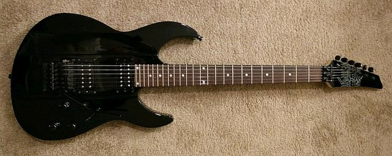
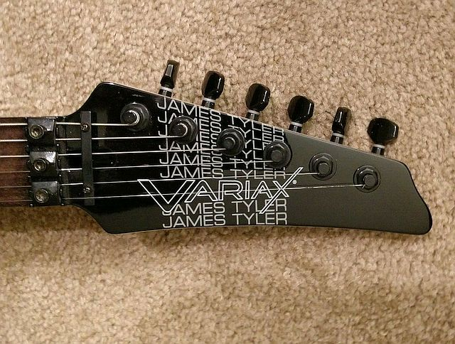
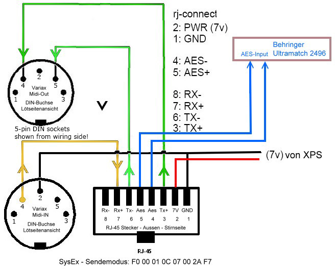

---
Line 6 JTV-89F guitar
---
24 Feb 2019
## [James Tyler Variax 89 Floyd Rose](https://line6.com/data/6/0a06434d357e5106d40019c0a/application/pdf/JTV-89F%20Onesheet%20-%20English%20(%20Rev%20A%20).pdf)

### [specifications](https://line6.com/support/topic/11208-what-is-the-jtv-89f-nut-width)  
- Mahogany body
- 3-piece maple neck with rosewood fingerboard (Tyler Fast n' Flat neck shape)
- 25-1/2" [scale length](http://www.edroman.com/techarticles/scalelength.htm)
- 16" radius neck profile
- Tyler Fast Flat neck shape
- 24 jumbo frets and dot inlays
- Locking Floyd Rose? nut and string tree
- 42.85mm Floyd Rose nut width  
- Sealed tuners (16:1 turn ratio)
- Black and black nickel hardware
- Floyd Rose? Licensed double-locking tremolo system by Graph Tech
- Graph Tech [PN-0080-B0 ghost bridge](http://www.graphtech.com/products/product-detail/pn-0080-b0-ghost-lb63-floyd-rose-style-locking-bridge---black) with [PN-0080-B6 saddles](http://www.graphtech.com/products/brands/ghost/product-detail/pn-0080-b6-ghost-floyd-rose-sytle-pickups---black-6-string)
- L. R. Baggs Radiance Hex piezo pickup system
- Two high-output, PAF-style alnico humbucking pickups wound to Tyler's specs
- Master volume and tone knobs
- Model and Alt Tune knobs
- 5-way selector switch
- VDI (Variax Digital Interface = [MIDI + AES/EBU](https://bencraven.com/?p=1616))  
  for integration with Line 6 POD HD500 and POD HD Pro,  
  and limited compatibility with POD xt, POD X3, Vetta II amplifier and other legacy Line 6 products
- Li-Ion battery (12 hours of play time), and international wall charger
- Variax Workbench software and USB interface
- Includes quality padded gig bag
- Additional battery, charger and cable kit available separately  

## [James Tyler design](https://www.yamaharental.com.au/guitars-basses/line-6-jtva89f-bl-james-tyler-variax-black/28810-75889/)?  
Among [guitars](https://www.tylerguitars.com/usa) designed by
[James Tyler](https://www.tylerguitars.com/about),  
seemingly only the JTV-98F and some Studio Elites had
[24-fret guitars](https://thehub.musiciansfriend.com/featured-private-reserve-guitars/straight-skinny-on-22-versus-24-fret-electric-guitars),  
and others with Floyd Rose trems rarely employed locking nuts.  

25 1/2 (strat) scale length was typical.  
JTV-89F headstock logo incorporates iconic James Tyler logo:


...but headstock shape emphatically is not:


#### [JTV Pilot's Handbook](https://line6.com/data/6/0a06434c5717520d343bb9e15/application/pdf/James%20Tyler%20Variax%20Pilot's%20Guide%20-%20English%20(%20Rev%20E%20).pdf)  
#### [Graph Tech locking bridge setup](https://support.graphtech.com/support/solutions/articles/6000070258-setting-up-your-graph-tech-locking-bridge)  
[fine tuning](https://line6.com/support/topic/15384-anyone-having-trouble-with-tuning-on-their-jtv-89f/?do=findComment&comment=112589)

### [Variax](https://en.wikipedia.org/wiki/Variax)
Traditional 1/4 phone jack audio plus **VDI** (Variax Digital Interface) using RJ-45 connectors.  
<details>
<summary> click for Variax wiring pinout</summary>  
  
</details>

##

### Variax Digital Interface uses MIDI channel 16 for control.  
#### [First generation](https://www.sweetwater.com/feature/technotes/issue16-variax/) (2003-10):  *300, 500, 600, 700* have piezo pickups (1 per string).  
#### Second generation (2010-15):  *JTV-59, 69, 89, 89F and Standard* added
* traditional magnetic pickups,
* drop tunings separate from model selection and
* user model creation.
#### Third generation (2017-?): *Shuriken* added [4 custom users preset banks](https://line6.com/support/page/kb/guitars/james-tyler-variax-guitars/variax-shuriken-custom-user-presets-r859/).  

##

A Variax is a modelling guitar, emulating tones of many other guitars.  
The only Variax with locking tremolo, JTV-89F was introduced in 2013.  
Line 6 also sells guitar electronics, including "multi-effect" and modelling devices that emulate other guitar electronics,
including stomp boxes, amplifiers and cabinets.  
HD500 was their final "multi-effect" device to fully support first-generation as well as HD Variax Workbench.  
Where HD500X nominally increased DSP processing capability over HD500 (while dropping first-generation Variax Workbench support), HELIX added up to four simultaneous impulse response ([IR](http://designingsound.org/2012/12/29/recording-impulse-responses/)) convolutions of up to 1024 or two 2048 16-bit samples at 48K samples/second.

[Integrating free PC-based IR convolutions with HD500](https://line6.com/support/topic/14428-impulse-response-101/)

[PC-based Amp simulations](http://designingsound.org/2012/12/29/recording-impulse-responses/)  

* not everything about amp simulation can be accomplished by IR
* good amp simulation requires loudspeaker loading
* good cabinet/loudspeaker/microphone simulation requires IR  
.. consequently, adding external IR to HD500 is doomed.  
Helix Native is $400 software using a PC, instead of $1000 hardware,
but Positive Grid [BIAS AMP 2](https://www.positivegrid.com/bias-amp-mobile/) costs $20 for iPad and claims to use
the same well-regarded amp+cab+mic simulation engine as do Mac and Windows software...  
Of course, to use it on an iPad requires an iOS-compatible audio interface.  
The Behringer 
<details>
<summary> click for BIAS Amp 2 reviews and tutorials</summary>  
<ul>
<li> Positive Grid Bias Amp Mobile
 <ul compact>
   <li> <a href="https://help.positivegrid.com/hc/en-us/categories/115000650543-BIAS-AMP-Mobile">Help</a>
   <li><a href="https://help.positivegrid.com/hc/en-us/articles/115001489306-Basic-Operation">Basic Operation</a>
   <li><a href="https://help.positivegrid.com/hc/en-us/articles/201179996-Getting-Started">Getting Started</a>
   <li><a href="https://help.positivegrid.com/hc/en-us/articles/115002726886-FAQ-BIAS-Amp-Mobile">FAQ</a>
   <li><a href="https://help.positivegrid.com/hc/en-us/categories/115000650543-BIAS-AMP-Mobile">Product Information</a>
   <li><a href="https://help.positivegrid.com/hc/en-us/articles/115003152823-BIAS-Amp-Mobile-Update-History-Release-Notes">Release Notes</a>
   <li><a href="https://forum.positivegrid.com/category/3/mobile-guitar-apps">Fora</a>
  </ul>
<li> Ask.Audio <a href="https://ask.audio/articles/review-positive-grid-bias-amp-2>Bias Amp 2 Review</a>
BIAS Amp 2 Explained</a>
<li> iOS <a href="https://itunes.apple.com/us/app/bias-amp-2/id711314889">  
App Store Preview</a>
<li> GEARNEWS <a href="https://itunes.apple.com/us/app/bias-amp-2/id711314889">
videos</a>
<li> David Wallimann YouTube <a href="https://www.youtube.com/watch?v=TjYen1DnEI8">  
Extensive Review</a>
<li>BIAS AMP 2 works with <a href="https://audiob.us/apps/search/amp">AUDIOBUS</a> and <a href="https://itunes.apple.com/cz/app/fiddlicator/id813106474">Fiddlicator</a> for custom cab [simulation IR](https://forum.audiob.us/discussion/3858/impulse-response-ir-loader-as-an-effect) and <a href="https://itunes.apple.com/us/app/rooms!/id572894725">Rooms!</a> for custom convolution reverb.
<li>AUDIOBUS <a href="https://forum.audiob.us/discussion/9349/best-reverb-app-in-your-opinions">Best Reverb App</a> opinions 2015.
<li>Tom Quayle <a href="https://www.youtube.com/watch?v=7loyIEX1JlY">YouTube Bias Amp 2 Demo</a> - <a href="https://www.youtube.com/watch?v=OObQ_WxSdso">Tone Building part 1</a> - <a href="https://www.youtube.com/watch?v=RL--M3xdo4g">Tone Building part 2</a>
<li> GROOVE3 <a href="https://www.groove3.com/tutorials/BIAS-Amp-2-Explained">  BIAS Amp2 2 explained</a>
</ul>

</details>

##
### Patches
While Line 6 hosts [patch sharing](https://line6.com/customtone/) for effects controllers,
Variax patch sharing is on a nominally Roland [user-supported site](https://www.vguitarforums.com/smf/index.php#c20).

#### [HD500](http://l6c.scdn.line6.net/data/l/0a06434dc7704ca4b3b26b924/application/pdf/POD%20HD500%20Advanced%20Guide%20%28Rev%20F%29%20-%20English.pdf)  
HD500 patches can control Variax settings.  
Selecting another patch can [simultaneously change effects and guitar emulations](https://line6.com/supportarchivenew/thread/48384/).  
[All 8 HD500 footswitches for patch changes](https://line6.com/support/topic/31146-hd500x-using-all-8-footswitches-for-patch-changes-idea/)  
[Pan between patches using EXP1 pedal](https://line6.com/support/topic/7192-control-jtv-with-pod-hd500/)

The ability to [change tuning on the JTV from the HD500](https://line6.com/support/topic/968-change-variax-tunings-using-footswitches/?do=findComment&comment=45144)
 was introduced at one of the JTV v1.8x firmware levels

### Line 6 HD:  two technologies
1. HD replaced earlier Pod effects with incompatible HD digital signal processing and patch format.
2. HD Variax separated drop tunings from guitar models (so any tunings could be applied to any model) and enabled users to add models based on e.g. body and pickup combination.

### Firmware
Variax firmware 2.0 introduced **HD**;  some users still prefer version 1.90.  
Reverting from HD is [possible](https://www.vguitarforums.com/smf/index.php?topic=9813.0).  
[Early firmware Alt Tune bug on JTV-89F](https://line6.com/support/topic/29433-just-cant-use-the-guitar-modeling/?do=findComment&comment=232495)  

Workbench HD initially did not support firmware download via e.g. HD500.  
Variax firmware download via dedicated Workbench VDI to USB dongle [only](https://line6.com/support/page/kb/guitars/james-tyler-variax-guitars/variax-workbench-hd-release-notes-r542/).  
(Version 2.12? Feb 2015)
[added support](https://line6.com/support/page/kb/guitars/jtvvariax-reflash-and-software-update-instructions-r309/)
for PODxt Live/Pro, POD X3 Live/Pro, **HD500**/HD Pro, and Vetta II.  
HD500X *only* supports HD Workbench.  
Introduced in 2016, Line 6 HELIX multi-effect processors
were updated in 2017 by firmware version 2.20 to support Variax Workbench HD.

[HD500X is incompatible](https://line6.com/support/page/kb/pod/pod-hd500-hd500x/pod-hd500x-compatibility-with-workbench-175-and-older-r565/) with first-generation Variax Workbench (v1.75 and older),  
discouraging first generation Variax use with anything newer than HD500,  
although a first generation Variax will play thru any VDI device.   

Non-HD Variax include 300/500/600/700 and [JTV with firmware before 2.0](https://line6.com/support/topic/26655-need-to-restore-v600-to-factory-presets/?do=findComment&comment=207395).  
HD Variax added support for customer-define guitar emulation models.

#### [JTV firmware success](https://line6.com/support/topic/18263-firmware-comparison-video-171-vs-221/?do=findComment&comment=271436)
```
1. Fully-charged battery, all 4 green LEDs.
2. JTV cabled to a supported VDI device.
3. JTV volume POT above 0.
4. USB / CAT cable direct to the laptop and JTV.
5. Line 6 Monkey v.1.77.
```

#### [Firmware vs flash memory](https://line6.com/support/topic/32624-jtv89-firmware-vs-flash-memory)

### Line 6 Knowledge Base
* [POD HD500/X](https://line6.com/support/page/kb/pod/pod-hd500-hd500x/)
* [Variax and WorkBench](https://line6.com/support/page/kb/guitars/)  

### Pod (HD500) [setup and signal routing](http://foobazaar.com/podhd/toneGuide/setup)
### [Workbench HD Tutorial videos](https://www.youtube.com/watch?v=d-1mYUCrPv4&list=PLXJITzFRKB4htEck-upN2v2xRjVT1PURt)
### Variax, amp and cab [tone templates](https://line6.com/tone-templates/) for famous artists  

##  

##  
##### back to other [blekenbleu documentation](../)
