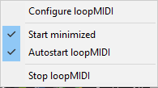
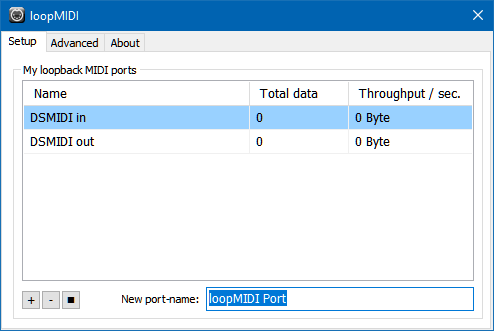
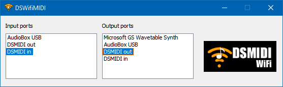

---
---
### [DSWiFiMIDI Server](https://trajkovski.net/dsmidiwifi-v1.01.zip) for [Android Wireless Mixer  ](https://play.google.com/store/apps/details?id=com.bti.wirelessMixer)  
by 0xtob

### What's this?

  DSMIDIWiFi forwards MIDI messages on the local network  
  between PC MIDI applications and handheld MIDI controller apps.  
  For more information, visit:
[DSMI - Wireless and Wired MIDI for the DS](https://forum.gbadev.org/viewtopic.php?t=11811)

### Usage

  - On Windows, install [LoopMIDI](https://www.tobias-erichsen.de/software/loopmidi.html)
    - [configure it](http://www.midicontrol.net/server)  
        
      Use unambiguous names:  
        
  - Install and configure [DSWiFiMIDI](https://trajkovski.net/dsmidiwifi-v1.01.zip)  
      
    - <i><b>Minimize it to the taskbar</b></i>.
      - Unlike LoopMIDI, closing DSWifiMIDI's window kills its service.
      - Restarting DSWifiMIDI will fail until after rebooting.
  - Reboot Windows to clear any `Error initing` reported during DSWiFiMIDI startup.
  - Install [Wireless Mixer - MIDI](http://play.google.com/store/apps/details?id=com.bti.wirelessMixer) on your Android device.  
    - [support](https://trajkovski.net/support.html)  
  - Start mixing!

### Troubleshooting

  Normally, the server should just work(TM).
  For hints, refer [the forum](https://forum.gbadev.org/viewtopic.php?t=11811).

### Compiling

  Linux:

    - Get the Qt4 and ALSA development packages
    - Type "make" in the source folder

  MacOS X:

    - Make sure you have the latest version of XCode
    - Install the Qt 4 Open Source Edition
    - Open the XCode project and push the build button

  Windows:

    - Install the Qt 4 Open Source Edition (with mingw)
    - Open a command window
    - Type "make" in the source folder

