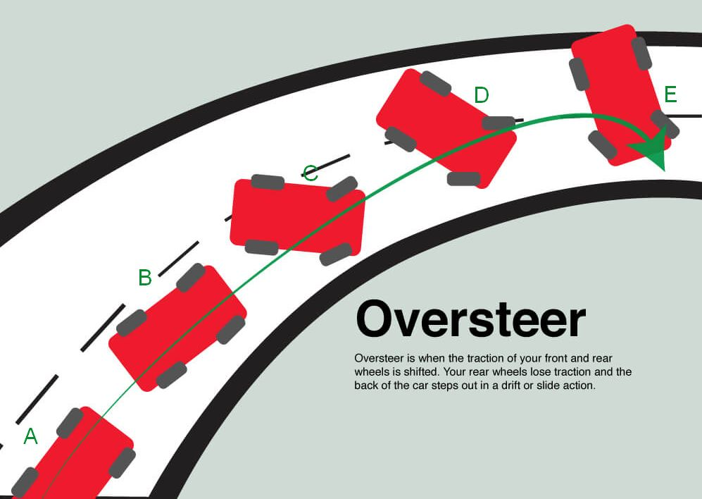
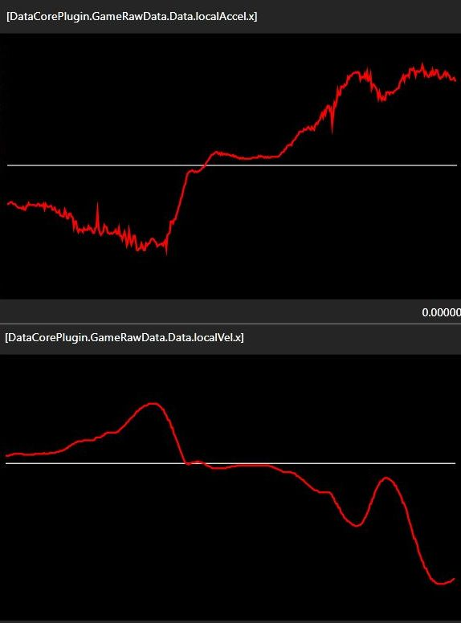

[*back*](https://github.com/blekenbleu/Loaded?tab=readme-ov-file#loaded)  

# Oversteer
Whatever it is, let us agree that understeer is its opposite.  
Wikipedia:&nbsp; ["Understeer Angle is the amount of additional steering (at road wheels)  
 &emsp; that must be added in any given steady-state maneuver beyond the Ackermann steer angle"](https://en.wikipedia.org/wiki/Understeer_and_oversteer)  

[](https://kogarahtyrepower.com.au/news/1944-tyrepower-kogarah-explains-oversteering-and-understeering)  
 &emsp; *by that definition, B and D  would represent understeer*  

## [lateral velocity = tangential speed × yaw velocity](https://boltflight.com/understanding-yaw-the-crucial-axis-of-rotational-motion-in-vehicles-and-aircraft/)
- yaw velocity (SimHub `OrientationYawVelocity`) is already *vehicle attitude* angular velocity;  
  lateral velocity (SimHub `AccelerationSway`) / vehicle speed becomes *vehicle trajectory* angular velocity  
- attitude and trajectory angular velocities' difference represents (rear wheel) slip angle
- steering angle with attitude minus trajectory angle becomes front wheel slip angle

[**Front tire slip = (steering angle + yaw velocity) - (radial velocity / tangential speed))**](https://vtechworks.lib.vt.edu/server/api/core/bitstreams/fe6d4ca1-514b-4e2b-b1ac-6561824a9de1/content)  
**Rear tire Slip  = yaw velocity - (radial velocity / tangential speed)**

- alternative (1) for oversteer:&nbsp; more slip at rear tires than front  
- alternative (2):&nbsp; vehicle yaw relative to vehicle direction (B, C, D, E)
- alternative (3):&nbsp; vehicle *yaw rate* relative to lateral velocity

## Assetto Corsa provides wheel slip telemetry for alternative (1):
`DataCorePlugin.GameRawData.Physics.WheelSlip04 + DataCorePlugin.GameRawData.Physics.WheelSlip03 -
(DataCorePlugin.GameRawData.Physics.WheelSlip02 + DataCorePlugin.GameRawData.Physics.WheelSlip01)`  
At least one issue:&nbsp; locked brakes in a straight line presents as massive over- or  understeer,  
 &emsp; &emsp; depending on which end locks up first/most.

## SimHub telemetry for alternative (3):
`AccelerationSway - rescale * OrientationYawVelocity`  
... *where* `rescale` zeroes average differences for small `AccelerationSway` values.

## [@rangerover estimates Wikipedia's oversteer](https://www.youtube.com/watch?v=R90_3tEO5t4)
- [Automobilista 2 - Rangey Under_Over Steer Front & Rear Slip with Brake surge 04-05-25](https://github.com/blekenbleu/SimHub-Profiles/blob/main/Automobilista%202%20-%20Rangey%20Under_Over%20Steer%20Front%20%26%20Rear%20Slip%20with%20Brake%20surge%2004-05-25.siprofile)
- [IRacing - Rangey Over & Under Steer & Slip 12-08-24.](https://github.com/blekenbleu/SimHub-Profiles/blob/main/IRacing%20-%20Rangey%20Over%20%26%20Under%20Steer%20%26%20Slip%2012-08-24.siprofile)  
   RangeyRover's JavaScript:
```
//Dont waste processing time if in pits or in pit lane or is less than 5kph$prop('SpeedKmh')
//if ($prop('IsInPit')==1 || $prop('IsInPitLane')==1 || $prop('SpeedKmh')<=5){return 0;}
var degreeRad = Math.PI/180; // 360 degrees to radians, which is 2π radians

// Angular velocities in radians per second
var angle1 = $prop('GameRawData.mAngularVelocity01'); // [ UNITS = Radians per-second ] (roll rate)
var angle2 = $prop('GameRawData.mAngularVelocity02'); // [ UNITS = Radians per-second ] (yaw rate)
var angle3 = $prop('GameRawData.mAngularVelocity03'); // [ UNITS = Radians per-second ] (pitch rate)

// Normalized steering input
var steeringInput = $prop('GameRawData.mSteering'); // [ RANGE = -1.0f->1.0f ]
var steeringAngleDeg = steeringInput * 24; //Typical steering angle 24 degrees, match to what is set in game

// Convert normalized steering input to actual steering angle in radians
var steeringAngleRad = steeringAngleDeg * degreeRad;

// Local velocities in metres per second
var local1 = $prop('GameRawData.mLocalVelocity01'); // [ UNITS = Metres per-second ] (Lateral velocity)
var local2 = $prop('GameRawData.mLocalVelocity02'); // [ UNITS = Metres per-second ] (Vertical velocity, not used in slip angle calculations)
var local3 = $prop('GameRawData.mLocalVelocity03'); // [ UNITS = Metres per-second ] (Longitudinal velocity)

// Assumed distances to front and rear axles in meters not available in game
var L_f = 1.2; // Distance to front axle [ UNITS = Metres ]
var L_r = 1.6; // Distance to rear axle [ UNITS = Metres ]

// Extract yaw rate, lateral and longitudinal velocities
var yaw_rate = angle2; // Yaw rate in rad/s
var v_y = local1; // Lateral velocity in m/s
var v_x = local3; // Longitudinal velocity in m/s

// Calculate front slip angle in radians from simplified equation
var alpha_f = steeringAngleRad - Math.atan((v_y + L_f * yaw_rate) / v_x);

// Calculate rear slip angle in radians from simplified equation
var alpha_r = -Math.atan((v_y - L_r * yaw_rate) / v_x);

// Convert slip angles from radians to degrees
var alpha_f_deg = alpha_f * (180 / Math.PI);
var alpha_r_deg = alpha_r * (180 / Math.PI);

//Output Oversteer in degrees
var over =  Math.abs(alpha_r_deg) - Math.abs(alpha_f_deg); //Oversteer
if(over<=0){
over = 0;
}
var pit = $prop('IsInPit');
var game =  NewRawData().mGameState;
if(pit !=1 && game!=4 ){
return Math.abs(over) * 10;
}
return 0
```

Plugin derivative of RangeRover slip angle calculator
- ignores center of gravity
- arctan only of 1000 * (game-independent) `AccelerationSway` divided by `SpeedKmh`
	- steering and yaw are already angles

## SimHub `AccelerationSway` is a *velocity*, not *acceleration*
- By observation, does not change sign while steering stays one side of center
- sway **acceleration** would zero when steering stops increasing
- some games have local velocity X and local acceleration X properties...  
	- but acceleration plot does not zero when velocity plot has zero slope:  
      
	 &emsp; &emsp;  *local acceleration plots match `AccelerationSway`*

### slip angle properties - mostly from Load.cs SlipAngle()
- YawRate:&nbsp; `OrientationYawVelocity` *radians per second*
- LPdiff:&nbsp; `LPyaw - View.Model.SlipGain * LPsway`
- RangeRover:&nbsp; *slip angle including steering*
- SlipAngle:&nbsp; *slip angle without steering `ayaw - View.Model.SlipGain * asway`
- SwayAcc:&nbsp; `AccelerationSway` *really, lateral velocity*
- Steering:&nbsp; *game0dependent steering wheel telemetry converted to radians*
- SwayRate:&nbsp; `Math.Atan(1000 * SwayAcc / SpeedKmh)`
- Vsway:&nbsp; *game-dependent lateral velocity*
- YawRate:&nbsp; `OrientationYawVelocity` *vehicle angle relative to trajectory*
