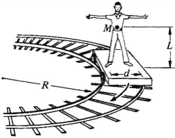

[*back*](OverSteer)

# slip rate
- sims rarely provide tire slip telemetry
- deducing slip from generally available SimHub properties is problematic.  

Denying access to tire slip information makes sense for online competitions,  
since it enables cheating by stability control, which is a well-explored,  
thanks to e.g. [FMVSS 126](https://www.ecfr.gov/current/title-49/subtitle-B/chapter-V/part-571/subpart-B/section-571.126).

Arguably, the bible and evangelist for computational vehicle dynamics are  
"The Multibody Systems Approach to Vehicle Dynamics" and Damian Harty,  
whose widely repeated quote took me far too long to appreciate:  
"Most drivers are acutely sensitive to the rate of change of body slip angle."  
- while tire slip angle directly influences grip, drivers do not directly sense it
- better to provide proxy feedback for sensed body slip angle rate
- SlipAngleRate calculation relatively is simple...

### Small angle approximation
Tire slip angles greater than about 6 degrees are doomed.  
For angles less than 6 degrees, `tan(y/x)` is nearly `y/x` in radians.  

### Basics:
A rail car rounding a curve has no side slip:  
 &emsp; 
- its lateral acceleration `LA = Speed * Speed / R`  
- it also has a yaw rate (change in yaw with time) `YawRate = Speed / R`  
- then required lateral acceleration `LA = Speed * YawRate`  

Vehicles circulate skid pads typically with some slip,  
their actual lateral acceleration differing from `Speed * YawVelocity`.  

Difference between Speed * YawVelocity and actual lateral acceleration is called body *slip rate*;  
body slip rate divided by Speed is body *slip angle rate*.  
SimHub properties from which to calculate body slip angle rate:  
- AccelerationHeave (AKA lateral acceleration)
- OrientationYawVelocity
- SpeedKmh  

Then SimHub slip rate = `ff * SpeedKmh * OrientationYawVelocity - AccelerationHeave`  
... and slip angle rate = `ff * OrientationYawVelocity - AccelerationHeave / SpeedKmh`  
... where fudge factor `ff = 1` for property values with *compatible units of measure*.  
For games and cars tested in SimHub, fudge factor `ff ~ 0.00485`:  
`SlipAngleRate = 0.00485 * OrientationYawVelocity - AccelerationHeave / SpeedKmh`  
