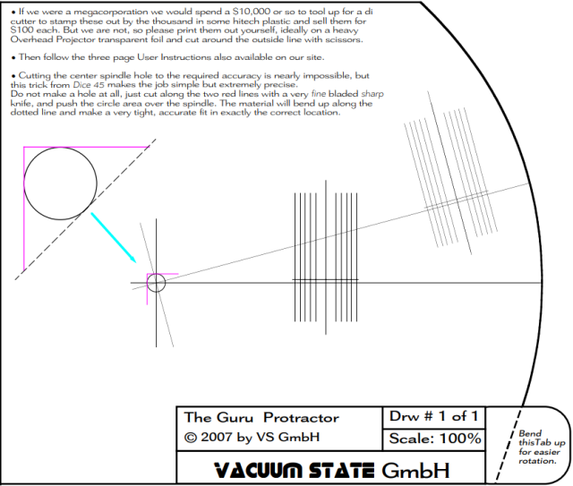

---
---
### Thorens TD 126 MK II (1976-77) with SME Series III B Oct 23, 1982 Charlotte NC
  [Thorens optionally supplied Series III](http://www.vinylengine.com/turntable_forum/viewtopic.php?t=81040)  
  Stereo Shoppe warned against MK III

Sites of most interest: [vinylengine](https://www.vinylengine.com/library/thorens/td126.shtml), [theanalogdept](https://www.theanalogdept.com/td126_dept.htm) and [Vinyl Nirvana](https://vinylnirvana.com/product-category/thorens-part)    
  [vinylengine forum](https://www.vinylengine.com/turntable_forum/viewforum.php?f=17) [schematic](ve_thorens_td126_mkii_schematic_en_de_fr.pdf)  
[Rare and Elite Thorens TD-126 MKII](https://vinylnirvana.com/vintage-turntables-for-sale/rare-and-elite-thorens-td-126-mkii)  
[2004-8, 2012 reviews](http://www.audioreview.com/product/analog-sources/turntables/thorens/td-126-mkii.html)   

[Thorens Family Tree](https://www.theanalogdept.com/thorens_dept_.htm) at theanalogdept.com  
[Gallery of rim, belt drive models](https://www.theanalogdept.com/thorens_gallery.htm) TD 150 preceded TD 125  

TD 124 (rim drive liable to vertical rumble) absurdly popular 1957 - 1968  
* Rim drives are liable to rumble, in my experience, and idler wheels replacement is problematic.

TD 125 [mechanically similar to TD 126](https://www.theanalogdept.com/td125_dept.htm) - [chassis comparisons](https://www.theanalogdept.com/rk_125_6_sub-chassis.htm)  
TD 126 (1974) and MK II (1976) models continued to use the 16-pole AC synchronous motor from the TD 125 MK II  
[TD 150, 125 and early 126 use 10mm bearing;  TD 126 MK III and later use 7mm bearing.](https://www.theanalogdept.com/td_platter_bearings.htm)  
"From my taking the bearing off a TD126 Mk2 and replacing it with one off a TD126 Mk3 two differences were noted.  
 Both were 10 mm  The earlier Mk 2 had a one piece bronze sleeve, and metal thrust plate in the bottom.  
 The Mk 3 had a two piece sleeve to allow an oil pressure doughnut half way,  
 ensuring the bottom did not dry out in worst cases of no care.  
 The Mk 3 also had Teflon as the thrust surface."

[Image of TD 125 springs in plate on which sub-chassis rests](https://www.theanalogdept.com/td125_susp.htm) 

[Suspension set-up](https://www.theanalogdept.com/susp_tim_bailey.htm)  3-spring design shared by  AR, most Ariston, Linn LP12, Systemdeks, and Thorens TD 125, 126, 145, 147, 150, and 160  
[Suspension Adjustment videos](https://www.youtube.com/watch?v=4RCj31Jaycg)

### Stylus alignment AKA Zenith
Most writing about cartridge alignment is BS.   
First, it is **stylus cantilevers** that want alignment.  
If a stylus is not aligned in its cartridge body, it needs replacing.  
Of course, a (non-conical) needle may be misaligned in its cantiliver...   
Facts:
- For pivoting tonearms, stylus cantilever alignment perfectly tangent to record grooves
  occurs at only 2 places along record radii.
- Audio-Technical writing that different protractors are required for different effective tonearm lengths
  (needle to pivot distance) applies *only* for arc, which does NOT satisfy alignment.
- NOTHING in this diagram is useful for accurate alignment:  
    
- Perfectly matching some overhang or arc is *incidental* to cantilever alignment.  
- These pairs of parallel lines (really, just center lines) are **ALL** that matter for alignment:  
    

IMO, if stylus cantilever cannot be seen well enough to align with protractor, *get another cartridge*.  

Tracking distortion is phase-shifted, compared with harmonic distortion typical of active electronics:  
  
* That phase error should affect perception of stereo imaging..  

Relevant alignment protractor differences are ***only*** about what tracking distortion metric gets minimized:  
* RMS (Loefgren AKA Lofgren B)  
* highest (Baerwald AKA Lofgren A)   
* towards the center(Stevenson)  
  
  FWIW, the argument for Stevenson is that classical music typically gets more dynamic towards the center...   

Increasing tonearm length reduces tracking error *magnitude*, but longer arms have higher effective mass,  
which is problematic for high compliance styli and e.g. warped records.  

## vinylengine forum
[overhaul guide](https://www.vinylengine.com/turntable_forum/viewtopic.php?f=17&t=3095)  
["you don't want a thorens"](https://www.vinylengine.com/turntable_forum/viewtopic.php?f=17&t=35589)  
[triage needed - clean and re-oil bearing](https://www.vinylengine.com/turntable_forum/viewtopic.php?t=114636)  
[spindle/bearing oil - mostly BS](https://www.vinylengine.com/turntable_forum/viewtopic.php?t=110649)  
[motor or pulley problem? bent shaft](https://www.vinylengine.com/turntable_forum/viewtopic.php?f=17&t=91322)  
[suspension video - ddarch](https://www.vinylengine.com/turntable_forum/viewtopic.php?f=17&t=90923)  
[index and paper shim platter](https://www.vinylengine.com/turntable_forum/viewtopic.php?f=17&t=114914)  
[strobe ring](https://www.vinylengine.com/turntable_forum/viewtopic.php?t=70518)  
[strobe mirror](https://www.vinylengine.com/turntable_forum/viewtopic.php?t=51859)  
[first day fixes](https://www.vinylengine.com/turntable_forum/viewtopic.php?t=111537)  
[TD 125 uses same springs](https://www.vinylengine.com/turntable_forum/viewtopic.php?t=59659)  
[spring sets](https://www.vinylengine.com/turntable_forum/viewtopic.php?t=85588)  
[MK II motor matches MK IV and 127 MK 1](https://www.vinylengine.com/turntable_forum/viewtopic.php?t=29547)  
[motor control circuit](http://www.vinylengine.com/turntable_forum/viewtopic.php?t=47938)  
[motor start problem](https://www.vinylengine.com/turntable_forum/viewtopic.php?t=82277)  
[motor thrust bearing DIY](https://www.vinylengine.com/turntable_forum/viewtopic.php?t=35350)  
[motor clutch slipping](https://www.vinylengine.com/turntable_forum/viewtopic.php?t=85229)  
[strobe issues](http://www.vinylengine.com/turntable_forum/viewtopic.php?t=36654)  
[Cartridge for SME 3009 series 3](https://www.vinylengine.com/turntable_forum/viewtopic.php?t=80530)  
[SME Series III Reviews](https://www.vinylengine.com/tonearm_reviews.php?make=SME&model=Series%20III)  
load capacitors in RCA leads(!)  
[Stereophile SME review](https://www.stereophile.com/content/sme-3009-series-iii-tonearm)  
[haters, but really some matching cartridges](https://forum.audiogon.com/discussions/sme-3009-series-iii-haters)  
[other high compliance cartridges](https://forum.audiogon.com/discussions/sme-series-iii-or-sme-3009)  
[AT OC9III would work fine](https://www.forums.stevehoffman.tv/threads/whats-compatible-with-a-vintage-sme-3009-series-iii-tonearm.665381/)  
[High Compliance Cartridge recomendations](https://www.audiokarma.org/forums/index.php?threads/high-compliance-cartridge-recomendations.363066/)  
[Ortofon SME 30H armwand](http://www.thevintageknob.org/ortofon-SME_30H.html)  
[Ortofon 30H: sty30 vs. sty20 or go crazy: sty40](https://www.vinylengine.com/turntable_forum/viewtopic.php?t=34170)
