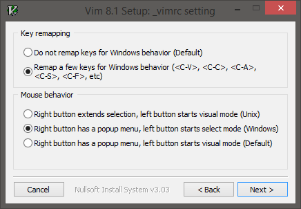

### My R&D process (roughly)
```
do {
  do {
    research()
    contemplate()
    copy()
    paste()
  } while (!credible())
  do {
    copy()
    paste()
    edit()
    build()
    debug()
    log()
  } while (broken())
  do {
    test()
    evaluate()
    log()
  } while (failing())
} while (!presentable())
```
... where `log()` also involves `copy()` and `paste()`.  
Fewer mouse actions and keystrokes for copy() and paste() save time and aggravation.

I am *so depressingly* old; my first PC was a [**Sinclair ZX80**](https://en.wikipedia.org/wiki/ZX80)  
and my second was an [IBM 5100](https://en.wikipedia.org/wiki/IBM_5100).  
From a user interface perspective,  
**Unix** peaked for me at [OpenWindows 3 - SunOS 4.1.4](http://toastytech.com/guis/ow3.html)  
The concept of a window manager saving and restoring the state and location of all client windows between logout and login by default seems to have been lost,  
  along with **X11 mouse behavior**.   
X11 mouse behavior can still be at least approximated, at least on **Windows**.  

Given  Apple's [Aqua](https://en.wikipedia.org/wiki/Aqua_(user_interface)) [Desktop](https://support.apple.com/en-us/HT201956) with *detached top menu bars*,  
X mouse focus-follows-cursor is probably counterproductive in **macOS**,  
but see [dwell](http://xahlee.info/kbd/macos_hover_switch_window.html) and [Creating Panels for Switch Control and Dwell Control](https://mcmw.abilitynet.org.uk/macos-1013-high-sierra-creating-panels-switch-control-and-dwell-control).  
Focus-follows-mouse [may still be configurable](https://stackoverflow.com/questions/98310/focus-follows-mouse-plus-auto-raise-on-mac-os-x)
for some macOS apps,  
e.g. Terminal and [iTerm2](https://iterm2.com/documentation-highlights.html), but not **MacVim**.  
One the other hand, **X mouse copy/paste for macOS** *is* useful  
and [was not too hard to implement](https://github.com/blekenbleu/macXcopy). 

### X mouse and Windows
**Gvim 8.1 installation**



`~/_vimrc`
```
  
```
**[X-Mouse Button Control](https://www.highrez.co.uk/downloads/xmousebuttoncontrol.htm)** may be better than **[True X-Mouse Gizmo](http://fy.chalmers.se/~appro/nt/TXMouse/)**,  
but the latter seemed [simpler to adapt](http://articleworthreading.blogspot.com/2016/03/true-x-mouse-gizmo-courtesy.html).  
Reserving middle button press for opening hyperlinks in new Chrome  browser tabs required a minor Registry hack,  
as does enabling focus following mouse auto-raise.

`TxMouse.reg`
```
  
```

A 3 button mouse is essential for efficient X11 usage, and separating that middle button from the scroll wheel reduces missed pastes.
Hyperscroll is worthwhile, and Logitech's *original* **Anywhere MX** had the most easily accessible power switch among hyperscroll 3-button mice.  Button switch durability is [problematic](https://www.ifixit.com/Guide/How+to+fix+Logitech+Anywhere+MX+Phantom+Double+Click/75780).
