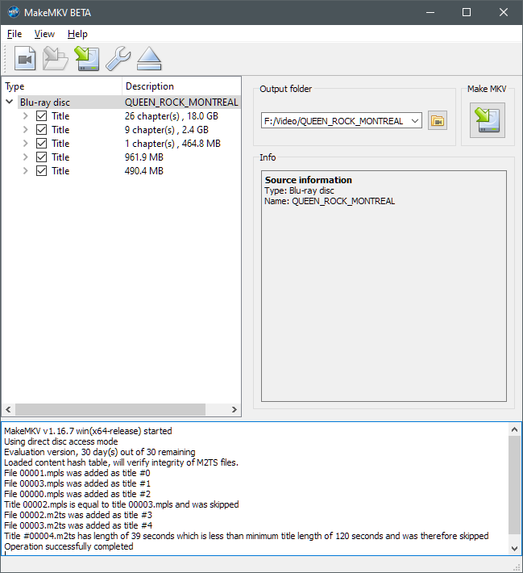

---
---
### Play Blu-Ray on Windows (or NOT)

#### Commerical Blu-Ray movies have [AACS DRM features](https://en.wikipedia.org/wiki/Blu-ray#Advanced_Access_Content_System).  
Blu-Ray support is not included in Windows.  
4K Blu-Ray discs are incompatible with existing standard Blu-ray players;  
PC **4K** Blu-Ray drives generally get poor ratings for durability and utility.  
[Intel's Dropping of SGX Prevents Ultra HD Blu-Ray Playback on PCs](https://tech.slashdot.org/story/22/01/14/1650202/intels-dropping-of-sgx-prevents-ultra-hd-blu-ray-playback-on-pcs)  
My WH16NS58 drive gets quite hot while playing Blu-Ray discs,  
 a task IMO best left to dedicated consumer players.  

According to some Internet sources, [these steps enabled VNC to play Blu-Ray discs](https://www.minitool.com/news/accs-decoding.html),  
but *that did not work for me* (6 Mar 2022, Windows 10 Home 21H2, Intel I7-8700K)  
Blu-Ray discs depend on Java for menus;  [this procedure for installing Java and MakeMKV **worked**](https://stolafcarleton.teamdynamix.com/TDClient/1893/StOlaf/KB/ArticleDet?ID=128854)  
* Windows [Java installation](https://www.java.com/en/download/) automatically set its required environmental variable.  
* **after** launching [MakeMKV](https://www.makemkv.com/download/) *one time* to `File > Open Disc` for some Blu-Ray disc:  
  
* No need for MakeMKV to actually rip discs for VLC to play them..   
* MakeMKV must be [purchased within 30 days](https://www.makemkv.com/buy/) to continue working;  
  US$60 cost is greater than for many commercial Windows Blu-Ray disc player software packages..  

#### Windows Blu-Ray player alternatives
* [Leawo Blu-ray Player](https://www.leawo.com/blu-ray-player/user-guide.html)  
  - menu control was problematic, in my experience
  - [MakeMV claims that Leawo hacked their executible](https://forum.makemkv.com/forum/viewtopic.php?f=5&p=5790#p5790)  
* [Blue-ray Master](https://www.bluraycopys.com) claims to sell one for $29.50,  
  - but the trial software downloaded is AnyMP4;  
    Blue-ray Master seemingly just hacked it;  
    Uninstalling it launched a 30% discount at [**AnyMP4**](https://www.anymp4.com/blu-ray-player)  
    bringing its price down to $41.30  
* Aiseesoft Blu-ray Player appears to be a clone of **GOM Player**,  
  which did not work for me...  
* Aurora Blu-ray Media Player appears to be another clone of [**AnyMP4**](https://www.anymp4.com/blu-ray-player)
* [CyberLink PowerDVD 21 Ultra](https://www.cyberlink.com/store/powerdvd-ultra/buy_en_US.html) can be purchased at [Amazon](https://www.amazon.com/dp/B095J3GJMM)  
  US$60 cost approaches that of dedicated new consumer Blu-Ray players...  

    
