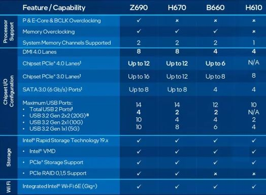
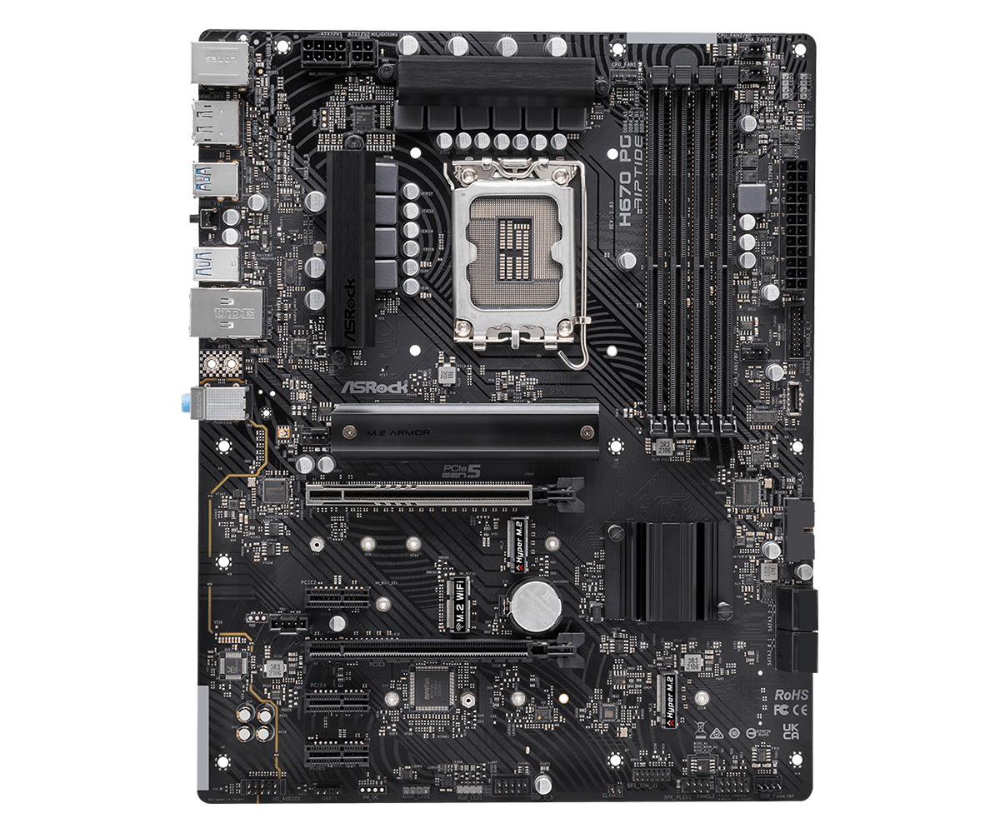

5 April 2022  
## H670 ATX motherboards
- Intel 12th generation Alder Lake processors require LGA1700 CPU sockets  
- H670 chipset offer nearly the same I/O capabilities as premium Z690  
- This impacts USB 3.2 5/10/20G and NVMe Gen4 support.  

  
### Available H670 ATX DDR4 motherboards

| model                    | DDR4 MHz | NVMe Gen4 | USB G2x2 | USB G2x1 | USB G1 | USB 2.0 |  
| ------------------------ | -------- | --------- | -------- | -------- | ------ | ------- |  
| [ASRock H670 Steel Legend](https://www.asrock.com/mb/Intel/H670%20Steel%20Legend/)                                            | 5000 | 3 | 0+1 | 2   | 6   | 2+2 |  
| [ASRock PG Riptide](http://us.asrock.com/MB/Intel/H670%20PG%20Riptide/)                                                       | 5000 | 3 | 0+1 | 2   | 8   | 2+2 |  
| [ASUS Prime H670-PLUS D4](https://www.asus.com/Motherboards-Components/Motherboards/PRIME/PRIME-H670-PLUS-D4/)                | 5066 | 3 |     | 3   | 3+4 | 2+3 |   
| [ASUS TUF GAMING H670-PRO](https://www.asus.com/Motherboards-Components/Motherboards/TUF-Gaming/TUF-GAMING-H670-PRO-WIFI-D4/) | 5333 | 4 | 1   | 2   | 4+3 | 0+4 |  
| [MSI MAG H670 TOMAHAWK](https://www.msi.com/Motherboard/MAG-H670-TOMAHAWK-WIFI-DDR4)                                          | 4800 | 3 | 1   | 1+1 | 4   | 6+4 |  

| model                    | PCIe 5.0 x16 | PCIe 4.0 x16 | PCIe 3.0 x16 | PCIe 3.0 x1  | VRM stages | ethernet |  
| ------------------------ | ------------ | ------------ | ------------ | -----------  | ---------- | -------- |
| [ASRock H670 Steel Legend](https://www.asrock.com/mb/Intel/H670%20Steel%20Legend/)   | 1 | 1 | | 3 | 13 | 2.5Gb |   
| [ASRock PG Riptide](http://us.asrock.com/MB/Intel/H670%20PG%20Riptide/)              | 1 | 1 | | 3 | 8 | 1.0Gb |  
| [ASUS Prime H670-PLUS D4](https://www.asus.com/Motherboards-Components/Motherboards/PRIME/PRIME-H670-PLUS-D4/) | | 2 | 1 | 2 | 8 | 2.5Gb |   
| [ASUS TUF GAMING H670-PRO](https://www.asus.com/Motherboards-Components/Motherboards/TUF-Gaming/TUF-GAMING-H670-PRO-WIFI-D4/) | 1 | | 1 | 2 | 14+1 | 2.5Gb |  
| [MSI MAG H670 TOMAHAWK](https://www.msi.com/Motherboard/MAG-H670-TOMAHAWK-WIFI-DDR4) | 1 | | 2 | 1 | 14+1+1 | 2.5Gb |  

#### VRM
MSI MAG H670 TOMAHAWK WIFI DDR4 has a 14 DrMOS with Duet Rail Power System (14+1+1) VRM with a digital CPU power system.
Heatsinks on the motherboard disperse heat from the PCB and VRM,  
but no proper cooling heatsinks for such powerful VRM.  

The ASUS Prime H670-PLUS D4 motherboard has a DIGI+ VRM design with 8 power stages.  
ProCool connectors keep the heat dissipated around the VRM for improved performance.  
VRM Heatsinks and thermal pads are added to disperse heat from MOSFETs and chokes to keep them cool.

ASUS TUF GAMING H670-PRO WIFI D4 has enlarged VRM heatsinks and PCH heatsinks  
for improved heat dispel from the VRM and chipset PCH.  
It has a robust DIGI+ VRM design of 14+1 DrMOS power stages.

ASRock H670 Steel Legend comes with a 9 Phase DrMOS Power Design for the CPU and other components.
DrMOS is a highly efficient power system that provides a more synchronous response to voltages by stepping down voltages providing stable power input.
ASRock H670 Steel Legend uses 50A DrMOS and 12K Nichicon premium capacitors for firm power response.
A 6-layer PCB design helps lower temperatures and efficiently dissipate heat.
With continuous power delivery and lower temps, you won't find a lot of issues with Memory overclocking.
.png)  

ASRock H670 PG Riptide has a 50A 9 Phase Dr.MOS Power Design,
[but lesser power/caps/heatsink](https://www.reddit.com/r/hardware/comments/rxnckv/listingdiscussion_of_gigabyte_msi_asus_asrock/) than Steel Legend.
  
Presumably, the Riptide is for those of us who will not be cranking power into DDR4 for max OC with an i9.  

