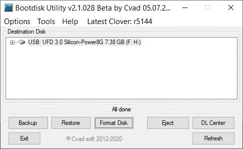

---
---
[*back*](../index.htm)  
### [Dell Inspiron 13 7373 2-in-1 - NVMe SSD upgrade](Inspiron13.htm)  
## NVMe for 2013 - 2017 Windows PCs
*updated 21 Feb 2022*

#### Background
Hard drive data rate is a key performance limitation in PCs originally delivered with [Windows 8](https://en.wikipedia.org/wiki/Windows_8).  
Many of these PCs from 2013 have motherboards with [PCIe slots](https://en.wikipedia.org/wiki/PCI_Express) for discrete GPUs,   
but instead drive displays from CPU integrated graphics controllers.  
While Windows performance in these PCs can be improved using [SSD](https://en.wikipedia.org/wiki/Solid-state_drive) with [SATA](https://en.wikipedia.org/wiki/Serial_ATA) interface,  
noticeably better performance is possible using SSD with [NVMe](https://en.wikipedia.org/wiki/NVM_Express) interface,  
which offers both higher I/O data rate and lower processing overhead.

However, NVMe wants 4 lanes of PCIe, which was available on most motherboards
only by a single card slot nominally provided for a discrete graphics card.  
Further, BIOS support for booting from NVMe was generally unavailable before 2017.  
Meanwhile, many PCIe motherboards have single-channel PCIe card slots
appropriate for M.2 SATA adapters.

Some (mostly older Samsung) NVMe SSDs incorporate ROM for BIOS (AKA CSM or OpROM) booting,  
but Windows boots faster using [UEFI](https://www.howtogeek.com/56958/HTG-EXPLAINS-HOW-UEFI-WILL-REPLACE-THE-BIOS).  
While it is possible to [modify some PC BIOS to add NVMe boot support](https://www.tachytelic.net/2021/12/dell-optiplex-7020-nvme-ssd),  
that process is IMO tedious and **risks bricking the PC**.  

The rest of this page is about using  
 **[CLOVER](https://github.com/CloverHackyColor/CloverBootloader)
 on a [USB 3.0](https://en.wikipedia.org/wiki/USB_3.0)
 [thumb drive](https://en.wikipedia.org/wiki/USB_flash_drive)
 to boot Windows 10 from [M.2 NVMe](https://www.velocitymicro.com/blog/nvme-vs-m-2-vs-sata-whats-the-difference)**  
 in 2013-2017 desktop PCs with PCIe but without NVMe in BIOS.  

#### Requirements
* Access to BIOS menu (by [F2 on many Dell PCs](https://www.dell.com/support/kbdoc/en-us/000126121/access-uefi-bios-system-setup-from-windows-on-your-dell-system))  
* An [M.2 NVMe drive](https://www.tomshardware.com/reviews/best-ssds,3891.html)  
    
* A [PCIe to M.2 NVMe x4 (4-lane) adapter card](https://www.amazon.com/gp/product/B08G8PBB3K)  
      
* a [tiny USB 3.0 thumb drive](https://www.amazon.com/gp/product/B077Y149DL) for CLOVER   
    
  Older USB 2.0 drives also work, but boot slower and protrude from a USB socket.  
* a USB thumb drive >= 8GB to install Windows 10 on the NVMe drive
* [BDUtility](https://www.softpedia.com/get/System/Boot-Manager-Disk/Bootdisk-Utility.shtml#download)  
  AKA Bootdisk Utility, the version used for this page was 2.1.2020.028 Beta.  
  This will download CLOVER and format the USB thumb drive to boot it.

#### Perspective
CLOVER is among the more recent utilities used mainly for [Hackintosh](https://en.wikipedia.org/wiki/Hackintosh);  
ability to boot Windows from NVMe is incidental.  
Consequently, configuring NVMe boot support requires extra steps.  
While this is [much discussed in the Win-Raid Forum](https://www.win-raid.com/t2375f50-Guide-NVMe-boot-w-o-BIOS-modding-Clover-EFI-bootloader-method.html),  
a succinct description using BDUtility was found in the
[Dell Optiplex Desktops community](https://www.dell.com/community/Optiplex-Desktops/Is-the-dell-Optiplex-9020-compatible-with-an-NVMe-ssd/m-p/8096201/highlight/true#M55209)  
Actual location for the essential *NvmExpressDxe-64.efi* driver seemingly varies considerably  
and may require additional research, trial and error for other CLOVER versions.  

#### Procedure
* Update PC BIOS to the current version  
  For Dell Inspiron 3847, that BIOS is [A11 7/31/2019](https://www.dell.com/support/home/en-us/product-support/product/inspiron-3847-desktop/drivers).  
* Install NVMe on PCIe adapter, then install it in the PC.  
    
* Boot existing Windows 10 and confirm that NVMe drive is recognized.  
  * Windows 10 has built-in NVMe support.  
* Using Disk Management, [set GPT on it.](https://www.howtogeek.com/245610/how-to-check-if-a-disk-uses-gpt-or-mbr-and-how-to-convert-between-the-two)  
* Download [Windows 10 installation media tool](https://www.microsoft.com/en-us/software-download/windows10) and create installation media on a USB drive.
* To avoid installation accidents, **unplug the PC's regular hard drives**.
* Boot that installation media USB drive and install Windows 10 on the NVMe drive
  - Booting to that thumb drive require USB boot priority in BIOS.  
  - Windows 10 installation media does not use BIOS to access NVMe.
  - When selecting that NVMe drive during the Windows installation process,  
    delete any displayed partitions, allowing installation to create its own partitions.
  - At some point, the installation procedure will attempt to reboot to the NVMe drive,  
    *which will fail*, if this PC indeed lacks NVMe boot support.  
    This is OK; NVMe Windows 10 installation will complete *after* a CLOVER thumb drive is created and installed.
* Unplug the Windows installation thumb drive.
* Reconnect the regular hard drives
* Reboot to the original Windows drive.
* Plug in the USB thumb drive, download and run BDUtility on it.  
  BDUtility will install CLOVER to a USB flash drive  
  and configure CLOVER for this system.  
  * launch BDUtility.exe  
  * highlight the flash drive  
  * click [Format Disk]  
     
   - this not only [re]formats the flash drive,  
     but also downloads and installs CLOVER on it.  
     That all takes awhile; wait for **All done**:  
       
* Copy CLOVER's NVMe driver to appropriate folders in that flash drive:  
  - Using Windows Explorer, navigate on that flash drive  
      
    to *EFI* > *CLOVER*.  
  - from *EFI* > *CLOVER* > *drivers* > *off*, copy *NvmExpressDxe-64.efi*  
      
     to both:  
    `EFI > CLOVER > drivers > UEFI`  
	*and*  
    `EFI > CLOVER > drivers > BIOS`  
      
* For the PC to boot from CLOVER USB flash,  
  not only must USB drives have first boot priority,  
  but BIOS must also have Secure Boot and CSM (Load Legacy OPROM) disabled:  
    
* F10 (on Dell) to save and exit BIOS,  
  which should then boot to CLOVER,  
  which will display a set of partitions,
  some of which may fail to boot  
  (in which case, power off and try again)  
  - one option should boot the the original Windows 10  
  - another option should boot to the NVMe partition and complete Windows 10 installation  
    * if the NVMe partition option is unshown, that means  
      CLOVER did NOT load its *NvmExpressDxe-64.efi* driver,  
      and that version of CLOVER searches elsewhere for drivers;  
      check newer entries in the [Win-Raid Forum](https://www.win-raid.com/t2375f50-Guide-NVMe-boot-w-o-BIOS-modding-Clover-EFI-bootloader-method-32.html#msg107724)...    
  - CLOVER records the most recent selection option and defaults to it subsequently.  
* Edit `\EFI\CLOVER\config.plist`, changing the `Timeout` value:
  ```
  <key>Timeout</key>
  <integer>5</integer>
  ```
  Reducing 5 to 1 or 2 will boot 3 or 4 seconds faster.

#### CLOVER references
* [SourceForege Wiki](https://sourceforge.net/p/cloverefiboot/wiki)  
  - [Description of tasks](https://sourceforge.net/p/cloverefiboot/wiki/Technical-Background)  
* [GitHub website](https://github.com/CloverHackyColor/CloverBootloader)  
* [Manually doing what BDUtility does](https://www.insanelymac.com/forum/topic/310038-manually-install-clover-and-configure-boot-priority-with-easyuefi-in-windows)  
* [Translated from Russian: Khaki clover](https://drovosek01.github.io/CloverHackyColor-WebVersion/english/from%20Word/Clover_Of_Khaki_Color_eng_5129.htm)
* [Win-Raid Forum NVMe Support for old Systems: Clover-EFI bootloader method](https://www.win-raid.com/t2375f50-Guide-NVMe-boot-w-o-BIOS-modding-Clover-EFI-bootloader-method.html)  
