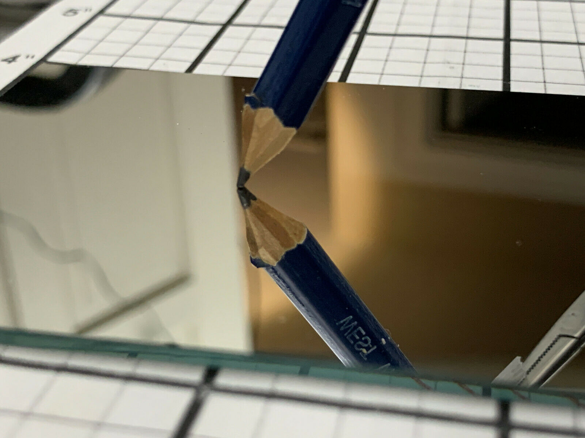

---
---
### 155x69mm Optical First Surface Reflector FS Flat Mirror DIY Projector Parts
*[back](../)*
  
  
item number:[193355207455](https://www.ebay.com/itm/193355207455)  
Condition: New  	
Type: Front surface mirror  
Country/Region of Manufacture: China  

First Surface Mirror GLASS for Kaleidoscopes, telescopes, periscopes, art projects  - Front Surface Mirror
Provides a true reflection with no double image

155mm x 69mm x 2mm
2-47/64" x 6-3/32" x 5/64"  
5/64" or 2mm Thick GLASS  

Superior accuracy for engineering and scientific projects, as well as art projects  

A first surface mirror or front surface mirror is a mirror with the reflective surface being above a backing,  
as opposed to the conventional, second surface mirror  
with the reflective surface behind a transparent substrate such as glass.  

This first surface mirror has an 15/64" or 2mm glass substrate.  

This was pulled from a high quality display system, and were isolated from contact with any outside contact,  
so there is ZERO wear, ZERO scratches, and entire surface is perfect.   
They have not been cleaned at all since they were installed, so there may be a thin film of dust on them,  
but I will leave the cleaning to you.  If you are not particular,  
a bit of household glass cleaner and non-abrasive wiping cloth will clean these up in 5 seconds.   
For the more particular, a bit of isopropyl and a lint-free wiping cloth will do the job quickly also.  

### [Pseudo-transmitted light microscopy by EPI illumination, replacing slides with mirrors](http://www.photomacrography.net/forum/viewtopic.php?t=31351)  
