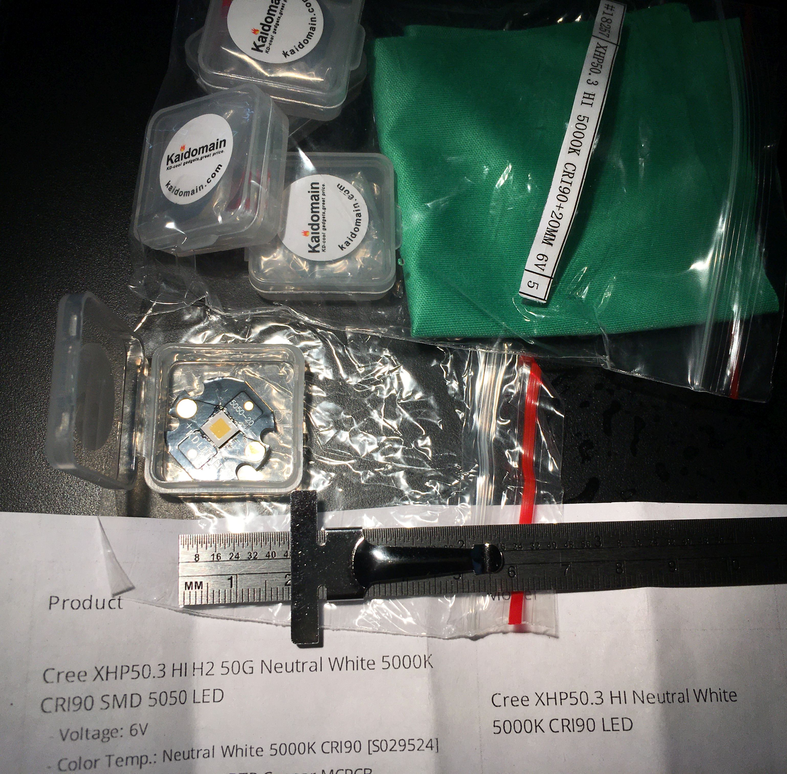

*[back](../)*
  
## LED illumination  
  
### [CRI vs CQS](https://www.nist.gov/publications/rationale-color-quality-scale)  
#### [microbehunter.com thread](https://www.microbehunter.com/microscopy-forum/viewtopic.php?f=28&t=15783#p124315)  
### [Pinspot RGBW 10W LED](../pinspot/index.htm)  
### [40mm RGB LED halo ring](../index.html#HALO)  
#### [USB gooseneck](../index.html#LEITZ)  
### [Labophot illumination conversion](../Nikon/Labophot#led-conversion)  
## [Kaidomain Cree XHP50.3 5000K CRI90 on 20mm DTO Copper MCPCB](http://kaidomain.com/Cree-XHP50_3-HI-Neutral-White-5000K-CRI90-SMD-5050-LED?search=high%20cri)  
- 6V  
- 3x3mm active area 18W LED
- [Cree XLamp XHP50.3 datasheet](https://cree-led.com/media/documents/XLamp-XHP50.3.pdf) - 46 pages  
  

 *27 July 2022*  
  
