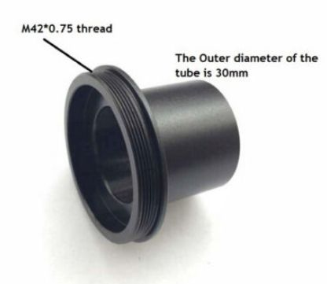
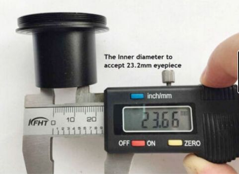

*[back](./)*

# M42 to 30mm to 23.2mm Microscope Adapter Camera Eyepiece Tube
 *item number: [224158403124](https://www.ebay.com/itm/224158403124)*
The Top male thread is M42*0.75
The outer diameter of the tube is 30mm
the inner diameter is 23.2mm to accept biological Microscope tube
and the end female thread to accpet C-mount.
full metal-----Aluminum alloy
 &nbsp;  
