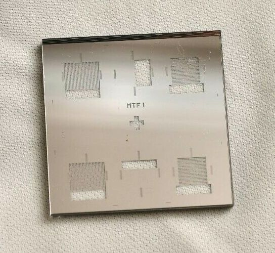
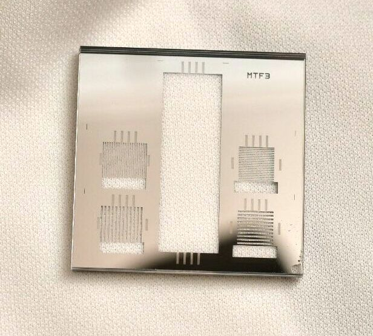
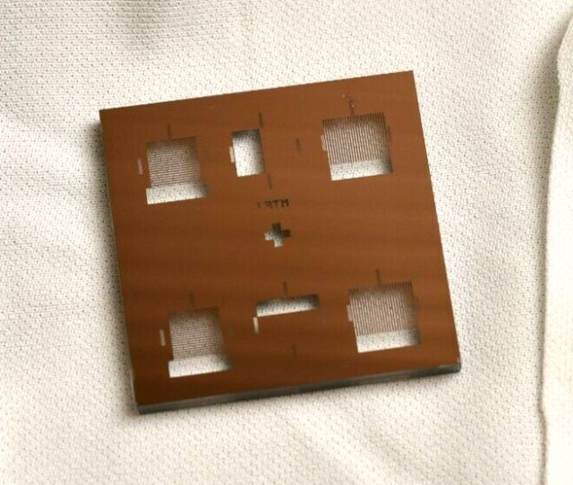
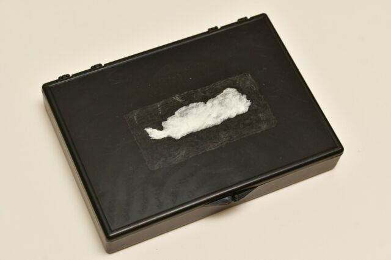
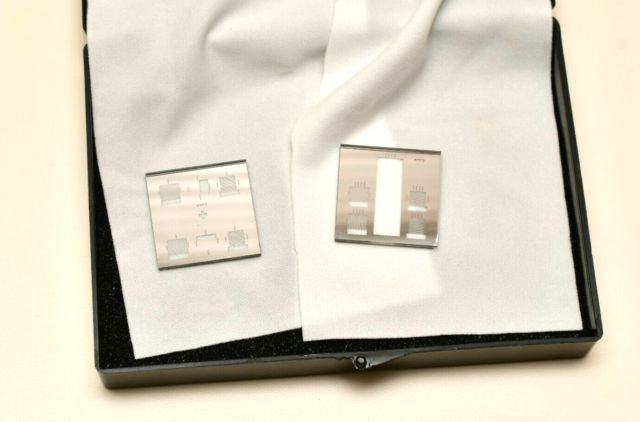

---
---
### [Episcopic MTF targets](https://www.photomacrography.net/forum/viewtopic.php?f=8&t=44878)
[*back*](../)
  

### MTF Targets for Lens/Camera Test Various Pitches Birefringent Resolution
eBay item number: 384631220753  
Condition: Used   
Mount: slide  

** Lot of 2 MTF Targets.  
Marked MTF1 and MTF3. 1.5"x1.5"x0.1".  
Each target appears to be two pieces of glass fused together.  
This might be a custom made item from the R&D lab it was retired from,  
I don't see any brand or other markings. Includes plastic case.  

*Condition*: Good.

|  |   |
| -------------- | -------------- |
|  |    |
|  |    |

