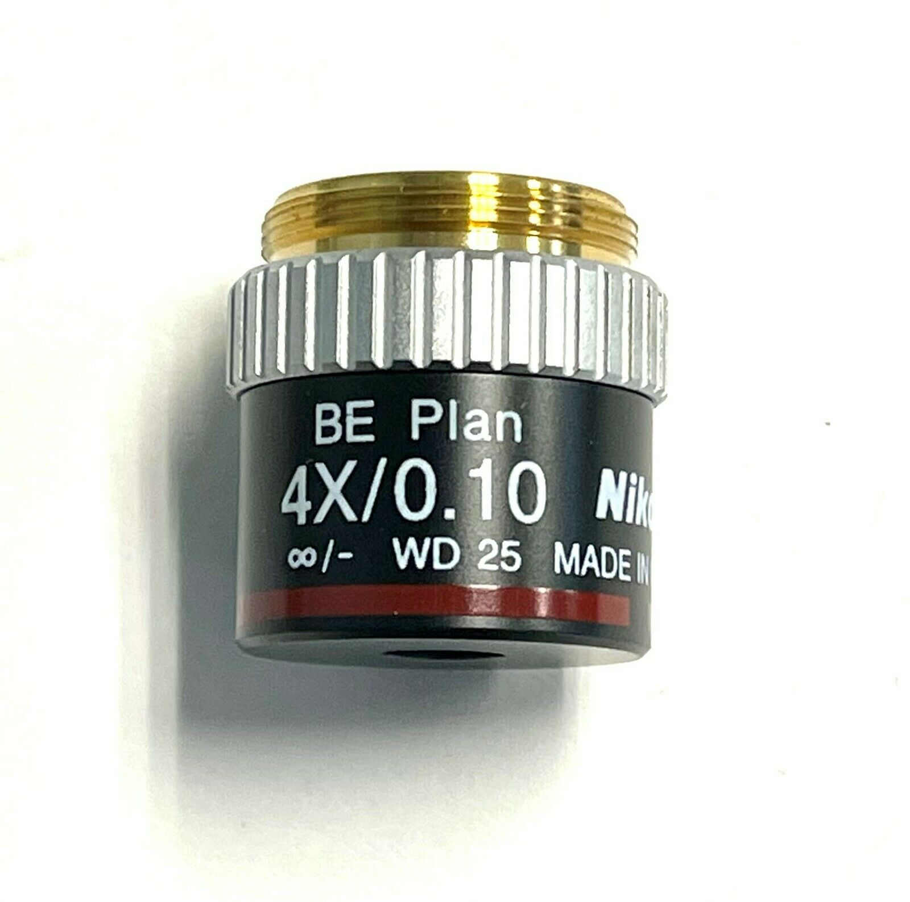

*[back](../../objectives/)*
  

## Nikon CFI BE Plan Achromat 4x/0.10 WD 25
eBay item number: 203878804396  
Condition: New
Brand: Nikon  
Model:	CFI BE2 Plan  
MPN:  MRN70042  
Objective Magnification(s):  4x

CFI BE Plan Achromat 4x / 0.10 / 25.0 Objective

  

Infinity objectives can be zoomed by mounting with a filter ring adapter  
on a telephoto zoom lens focused at infinity.  
"Instead, [for me the main advantages for infinity designs](https://www.photomacrography.net/forum/viewtopic.php?p=277496#p277496) are that I can more easily get the features I mentioned earlier (higher resolution, longer working distance, bigger image circles, better color correction), plus I can alter the magnification by changing tube lens FL without adding aberrations. On APS-C, the sharpest "5X" in my kit is an infinity 10X pushed down on 100 mm tube lens, and the sharpest "10X" is a 20X infinity pushed down in the same way."  
Focus bracketing works to some extent by [incrementally focusing closer than infinity](https://www.photomacrography.net/forum/viewtopic.php?f=8&t=14569).  

rjlittlefield [recommends](https://www.photomacrography.net/forum/viewtopic.php?p=283115#p283115) Nikon CFI 10X NA 0.25 on a 100mm macro lens  
for extremely sharp 5X combination that covers an APS-C sensor.  
"For infinity 4X, my only experience is with the [Nikon CFI BE 4X NA 0.10, part number MRN70040.](https://www.photomacrography.net/forum/viewtopic.php?p=272258#p272258)  
 It cleanly covers APS-C at 2.7X, used with a 135 mm tube lens.  
 So, I think it would have no trouble covering full frame at 4X."
  

[Nikon BE Plan 4x vs E Plan 4x](https://www.photomacrography.net/forum/viewtopic.php?p=146776)  
 For the [E Plans, Nikon says](https://www.microscope.healthcare.nikon.com/products/optics/cfi-e-plan-achromat-series) "with virtually no curvature of field when the field number is 20 millimeters",  
while for the CFI Plan Achromat they say "incredible image flatness over the entire 25mm field of view".  
[BE Plan Achromat objectives have been designed especially for the E100](https://www.microscope.healthcare.nikon.com/about/news/nikon-introduces-the-eclipse-e100-infinity-corrected-educational-microscope)  
with excellent optical corrections and very flat (Plan) optical performance. (2006)  
"It's a safe bet that the E Plans are achromats because Nikon wouldn't sell any less  
 and if they were better they would say so."  

[FAQ: How can I hook a microscope objective to my camera?](https://www.photomacrography.net/forum/viewtopic.php?f=29&t=12147&p=138270&hilit=be+plan+4x#p138270)  
[CFI BE 4X, remove black hood for more even coverage](https://www.photomacrography.net/forum/viewtopic.php?f=8&t=18182)  

### 10 June 2022 received intact, carefully packed in a box partially crushed by UPS  

Screwed to front of EF-S 55-250mm, presumably getting 1.1x - 5x zoom.  
Field of view is about 12mm at 55mm (with vignetting from 55-200) and 5mm at 250.  
