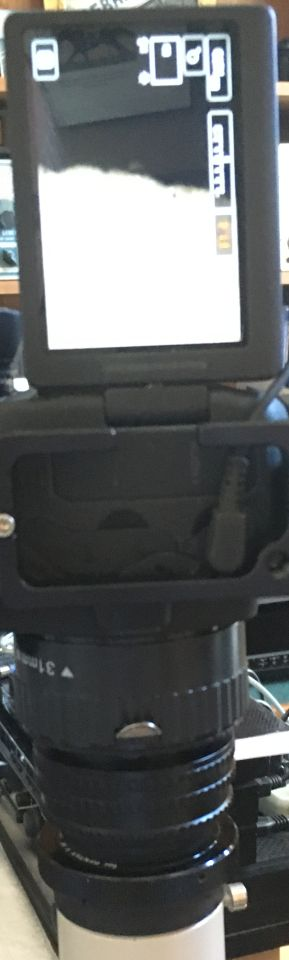
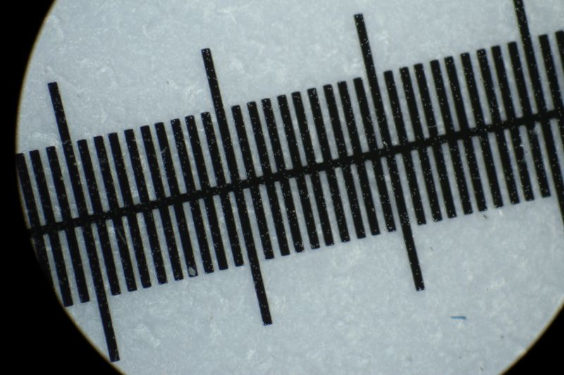
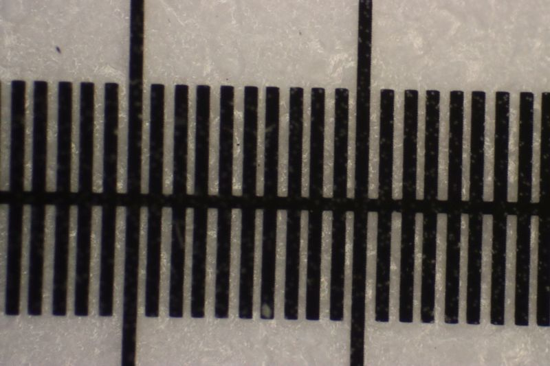

 *[back](photo)*
## Optiphot EPI: CF PL 2.5X projection to Canon EF sensor
Using a [male M42-T2 coupling ring](https://www.amazon.com/dp/B0813MTZ2P)
and [M42-EOS AF confirm adapter](https://www.amazon.com/dp/B09KRVWR4B) with a bellows,  
determined additional spacing wanted for Canon EF sensor parfocality:  
  
*about 6 cm (98mm camera flange to chimney top)*  

... implemented by helicoid and extension tube:  
  
*[17-31mm M42 helicoid](https://www.ebay.com/itm/282400567548) + 31mm EF extension tube*  

Magnification to 35mm sensor nearly matches parfocal eyepiece:  
  
*Canon 6D parfocal CF PL 2.5X*
... centering needs attention..

  
*CFWN 10x/20 by afocal iPhone Se*  

As expected, APS-C sensor crops/magnifies:
  
*Canon 90D parfocal CF PL 2.5X*  
