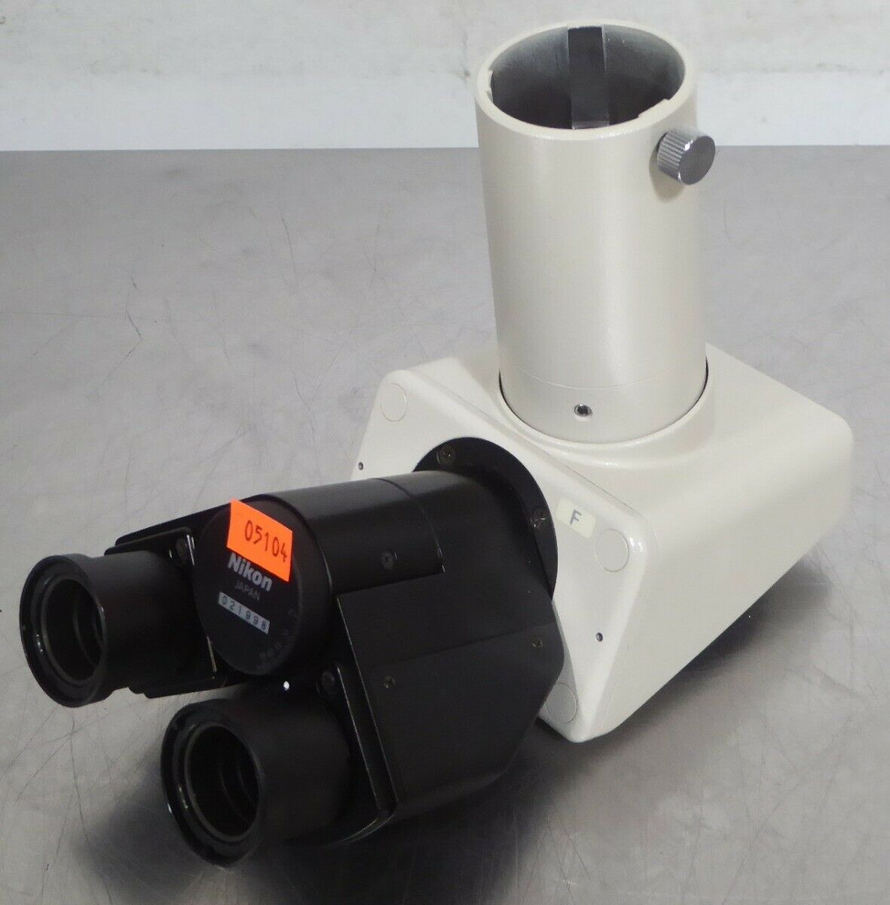
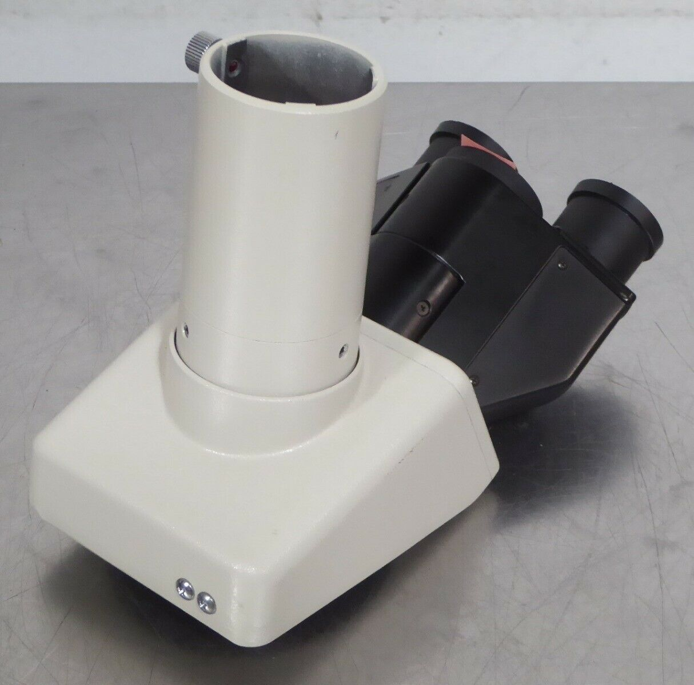
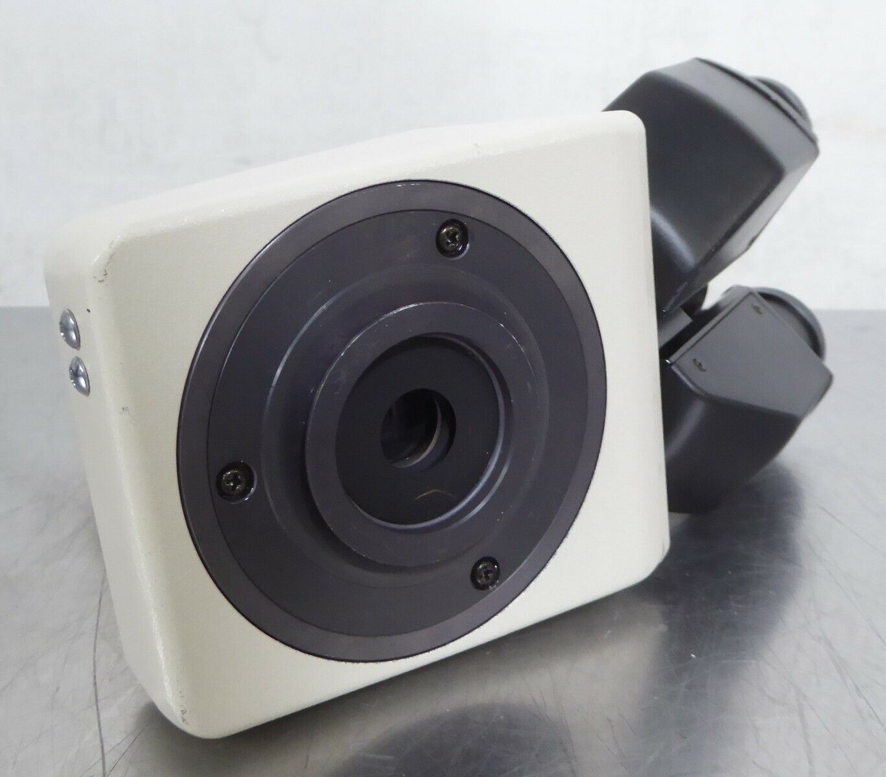
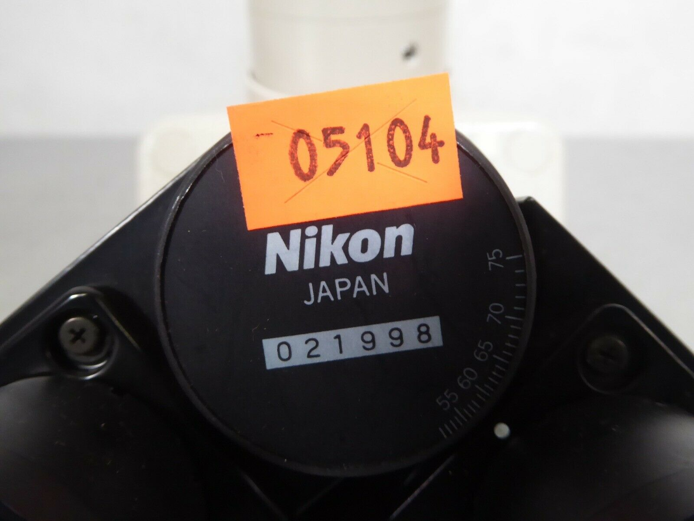
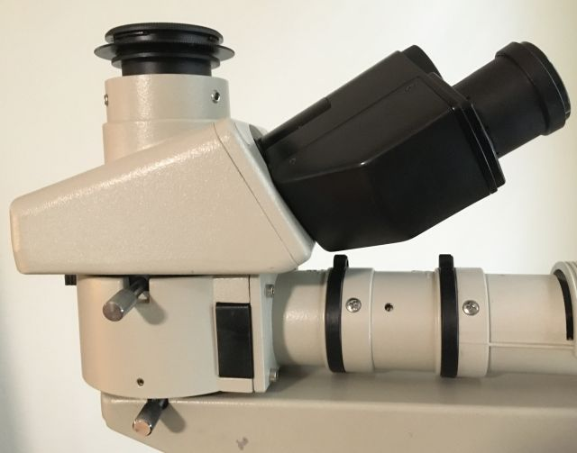
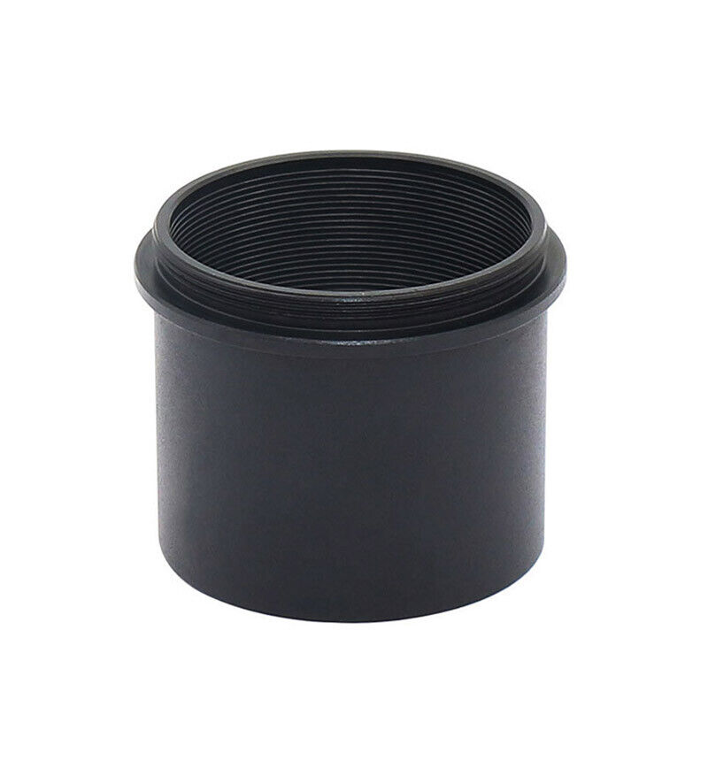
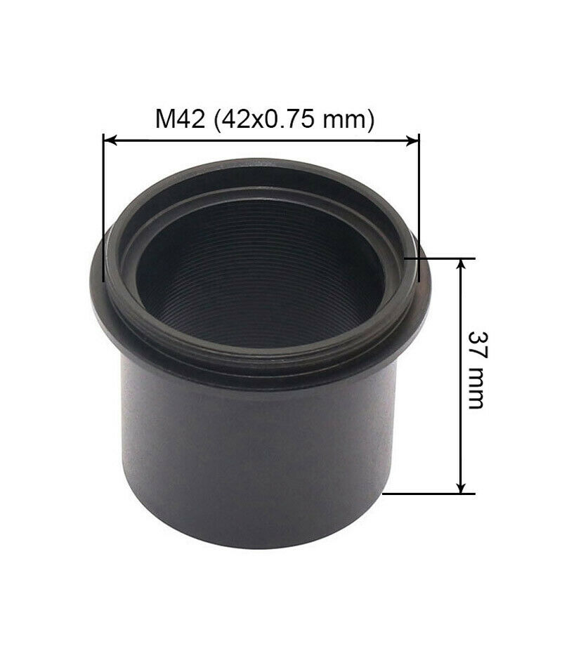
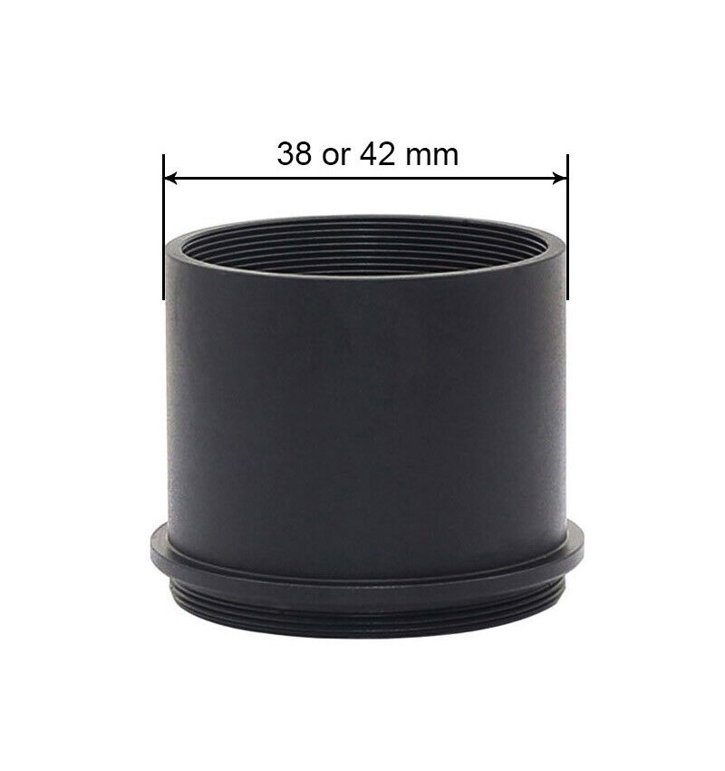
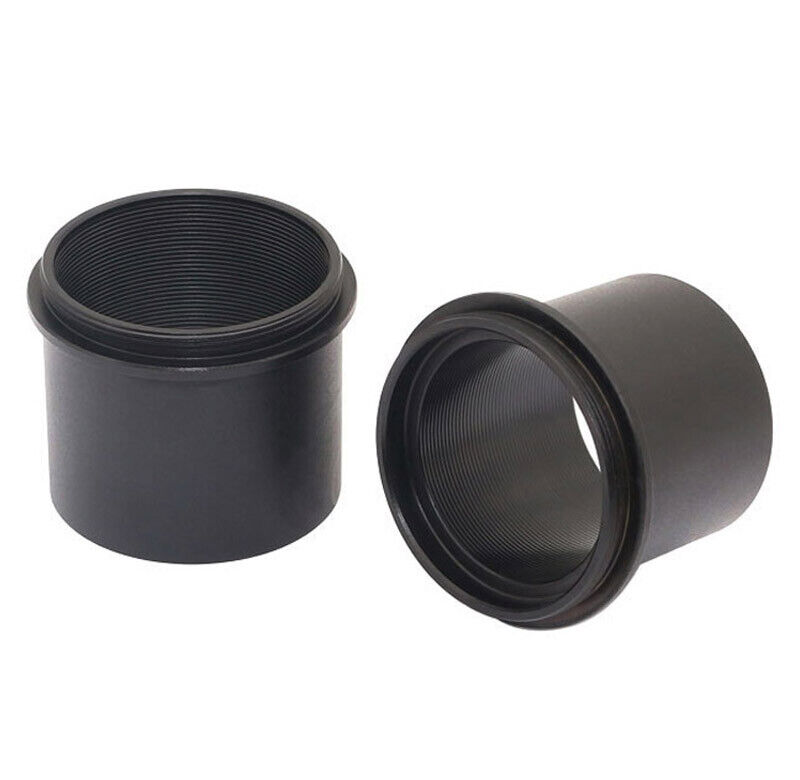

*[back](../)*
 

## Nikon Type F Trinocular Microscope Head  
eBay item number: 392906516398  
Condition: For parts or not working
Brand: Nikon  
Model:	Type F  

This Nikon Type F Trinocular Microscope Head is in good cosmetic condition    
with scuffs and scratches present.  

I was able to smoothly turn the trinocular port to change the viewing    
from the eyepieces to the port.  
The optics appear to be clear from a quick visual inspection.  

I do not have the knowledge or equipment to fully test this unit,  
so it is sold As-Is.  

Approximate unpacked dimensions: 9" x 5" x 7"  

|  |   |
| ----------- | ------------ |
|  |   |
  
With the relay lens chimney removed,  
a "standard" (ISO 38mm) photo tube is available:  
  
... as suggested by [Scarodactyl](https://www.photomacrography.net/forum/viewtopic.php?p=282897#p282897).  

Its thread is actually T2 (0.75mm thread pitch)   
rather than M42 lens mount (1 mm thread pitch)  

## received 20 May 2022: M42 to 38mm Telescope Ring Adapter  
eBay item number: 274696367794  
Condition:  New  
Model:	AD-M42-38  
Microscope Adapter Type:	Camera Adapter  
Top Mounting Diameter:	M42 (42x0.75 mm)	  
Bottom Outer Diameter:	38 mm or 42 mm  
Height:	37 mm  

|  |   |
| ----------- | ------------ |
|  |   |
