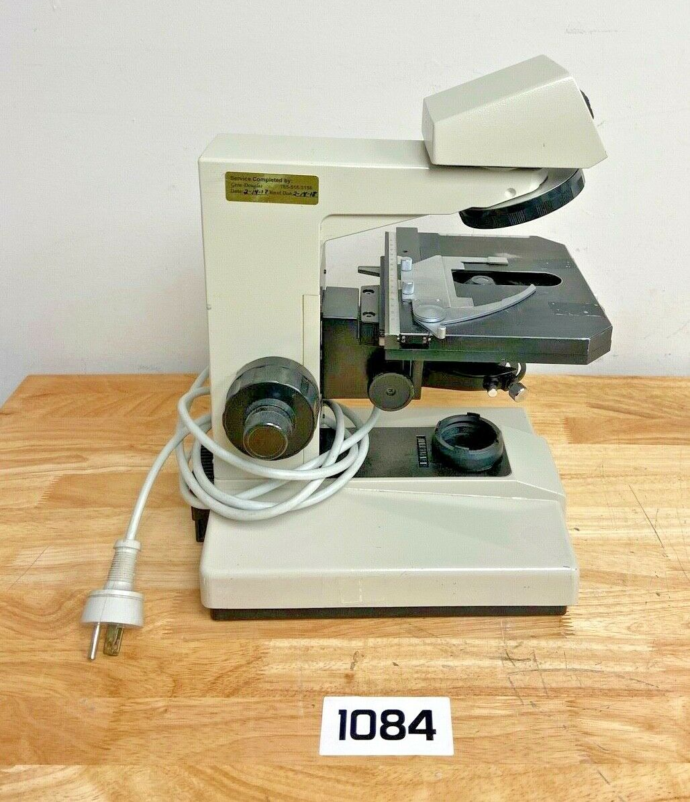
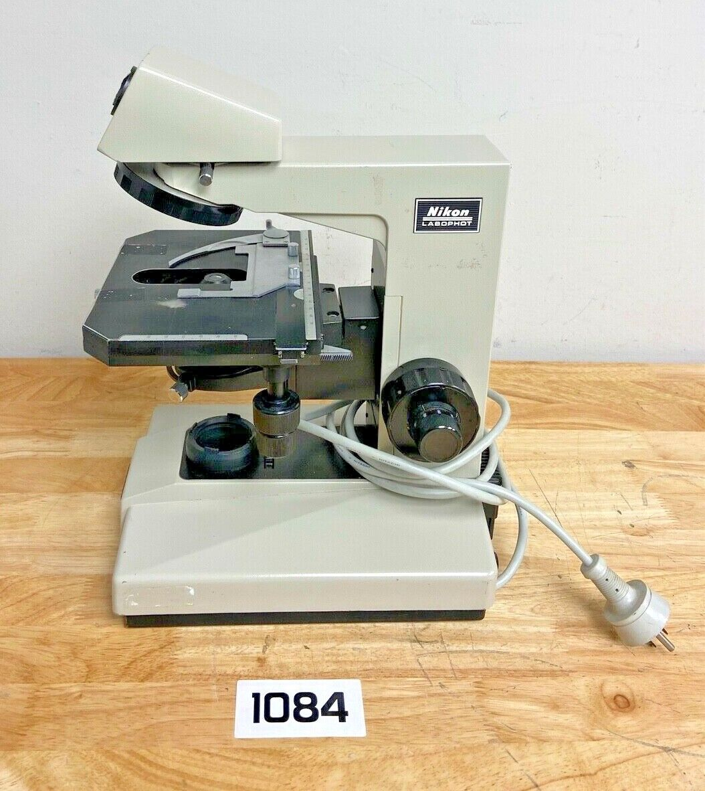
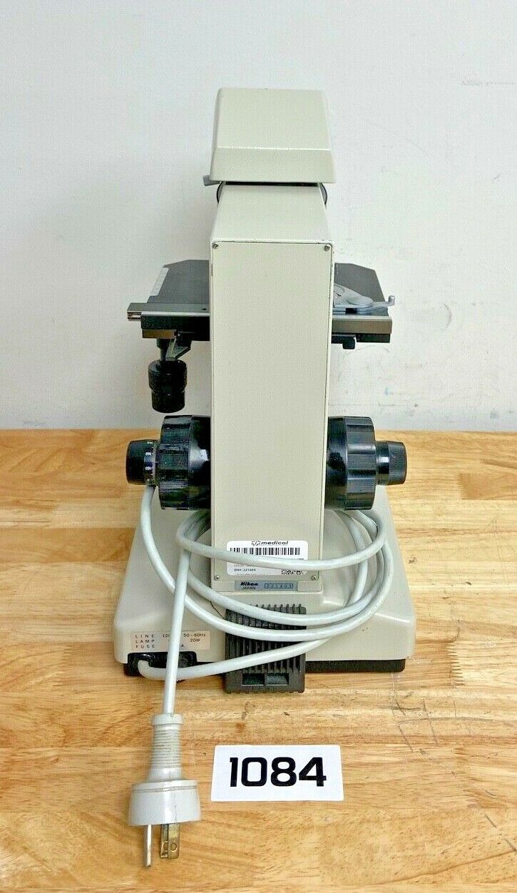
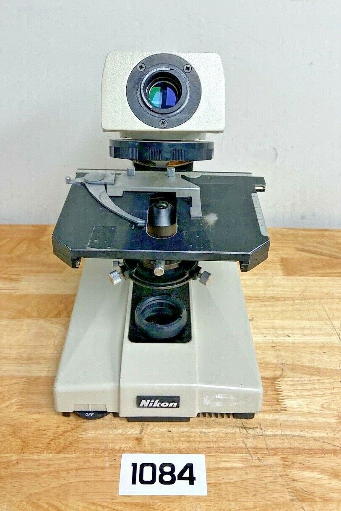
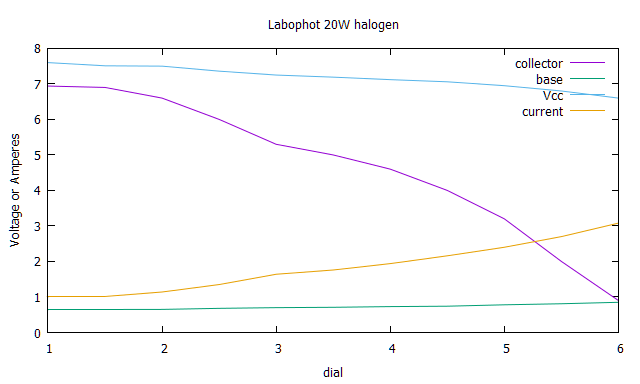

*[back](../)*
<a href="https://www.gixen.com/index.php" name="9e092736783d0da1dfd8413d57d10faf" target="_blank" >

</a>  
## Nikon Labophot Microscope
Introduced around the same time as the Optiphot (1978), the Labophot is lower cost and less flexible.  
Many of them seem to have been configured for phase contrast.  

- [Brochure](http://earth2geologists.net/Microscopes/documents/Nikon_Optiphot_Labophot_Pol_brochure.pdf)  
- [Instruction manual](https://neurophysics.ucsd.edu/Manuals/Nikon/Nikon%20Biological%20Microscope%20Labophot%20Y-R%20Stand%20Instructions.pdf) - Bell Labs  
- [Instruction manual](https://www.manualslib.com/manual/937966/Nikon-Labophot.html) - manualslib.com
- [Labophot @ lavinia.as.arizona.edu](https://lavinia.as.arizona.edu/~mtuell/)  
- [Repair Manual @ lavinia.as.arizona.edu](https://lavinia.as.arizona.edu/~mtuell/pdf/L0180%20OPTIPHOT%20LABOPHOT%20BODY.pdf)  
- [ Brooke Clarke 2014 ](https://www.prc68.com/I/Labophot.html)  

eBay item number: [155061301918](https://www.ebay.com/itm/155061301918)
Condition: For parts or not working  
Manufacturer: Nikon  

Nikon 221403 Labophot Microscope Parts Only (S1084)
"No power."


|  |  |
| --------------- | --------------- |
|  |  |

---

  *Received 11 July 2022

### Condenser

## LED conversion
Common (grounded) emitter bipolar transistors are approximately constant current sources.  
Labophot and Optiphot use transistors to modulate halogen lamp power  
and variable resistors between base and collector for control.  
Labophot potentiometers are about 1K Ohms, connected between collector and base,  
with halogen lamp between collector and nominal +7 VDC,  
to accommodate incandescent lamp behavior:
* As filament heats, resistance increases.  
* This lowers voltage drop from collector to emitter  
  and also current thru resistor to base, reducing power to lamps.  
  
Current was measured using a CA-60 AC/DC clamp.  

LEDs behave differently:  
* Selected LED should be bright enough with 1A that 1K is minimum resistance wanted from supply to base;  
  need to determine a minimum current for useful brightness to establish wanted potentiometer range.
* Above some voltage threshold, current increases with temperature.  
* this effectively decreased resistance increases transistor collector-emitter voltage  
  and current thru collector-base resistance, provoking current runaway.  
* For the transistor to behave as a more nearly constant current source,  
  variable resistance should move to between base and voltage supply for LED and transistor collector,  
  instead of between base and collector.  
* That voltage source droops slightly with increased current, providing some stabilizing negative feedback.  
  Adding a resistor between transistor emitter and ground would increase negative feedback but waste power.  
* A resistor between base and ground would also increase negative feedback,  
  as base-to-emitter voltage increases with current.  
* A resistor in series with forward-biased diode (a nearly constant voltage drop) from base to ground  
  would provide stronger current regulation.  

```
# Labophot halogen measurements 12 July 2022
# dial  Vcc     yellow  brown   current
1       7.6     6.94    .64     1
1.5     7.51    6.9     .64     1
2       7.5     6.6     .65     1.14    # very dim
2.5     7.36    6       .68     1.35
3       7.25    5.3     .70     1.64
3.5     7.19    5       .71     1.76
4       7.12    4.6     .73     1.94
4.5     7.06    4       .74     2.16
5       6.95    3.2     .78     2.4
5.5     6.8     2       .81     2.7
6       6.6     0.9     .85     3.08 
```
