*[back](../)*
  
## Nikon Optiphot Microscope

[Optiphot Brochure](http://earth2geologists.net/Microscopes/documents/Nikon_Optiphot_Labophot_Pol_brochure.pdf)  
[Instructions](https://cmrf.research.uiowa.edu/sites/cmrf.research.uiowa.edu/files/nikon-optiphot-manual_0.pdf)  
[Optiphot @ lavinia.as.arizona.edu](https://lavinia.as.arizona.edu/~mtuell/scopes/Optiphot.php)  

eBay item number: 294867880389  
Condition: Used  
Manufacturer: Nikon  
Model:	120432  

Nikon Labophot Microscope #120432 *Power Tested*

Includes: 1 Labophot microscope 

Condition: Nikon Labophot Microscope #120432 *Power Tested*.  Power tested.  
Clean, good condition.  Used.  
This item was previously owned and was working with other working equipment.  
See photos for exact item, condition, and details on model available. 

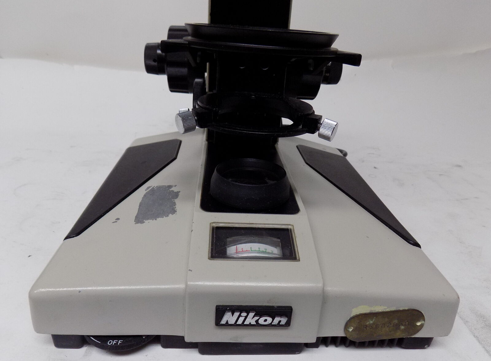  

| 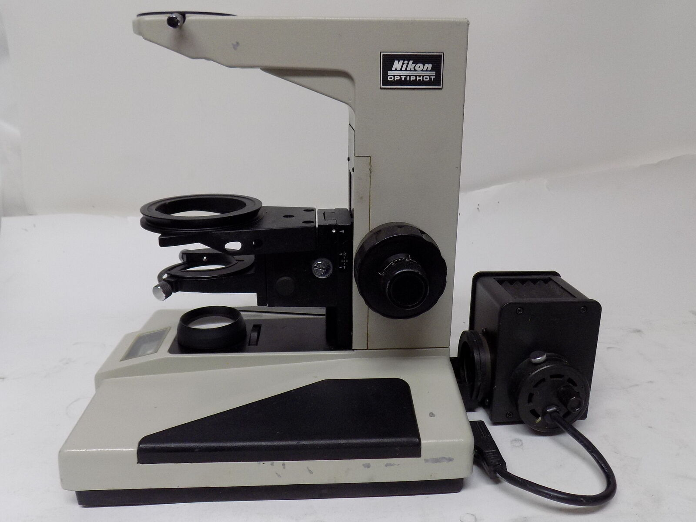 | 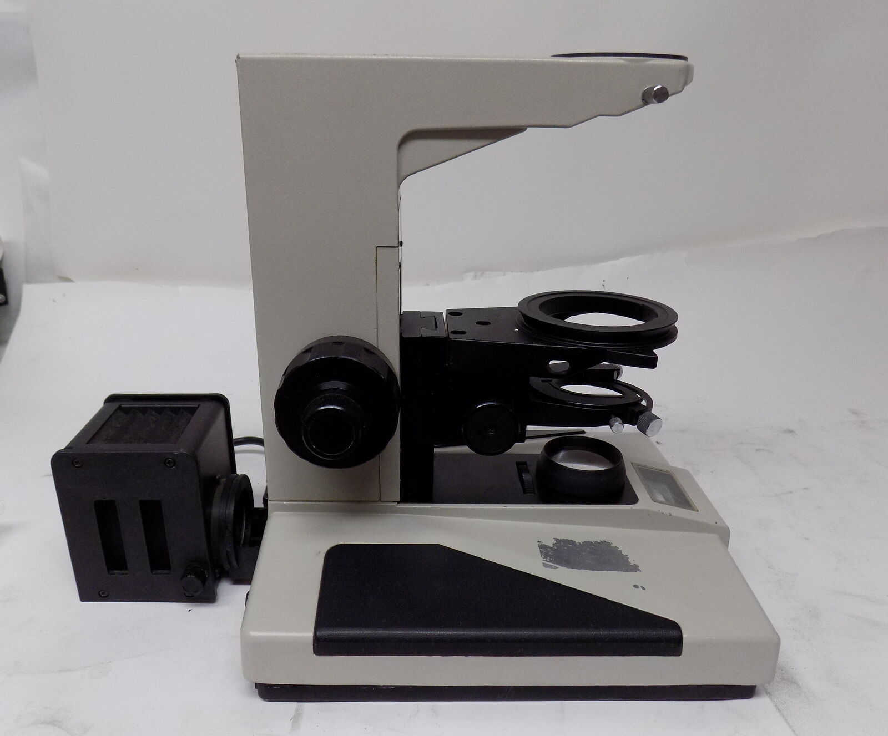  |
| -------------- | -------------- |
| 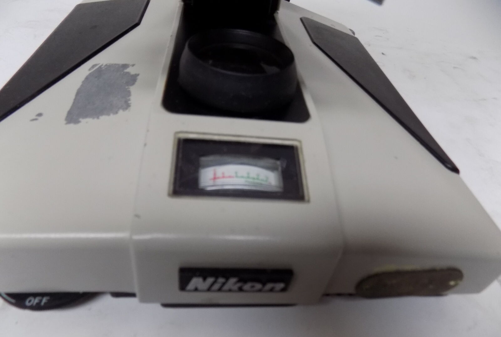 | 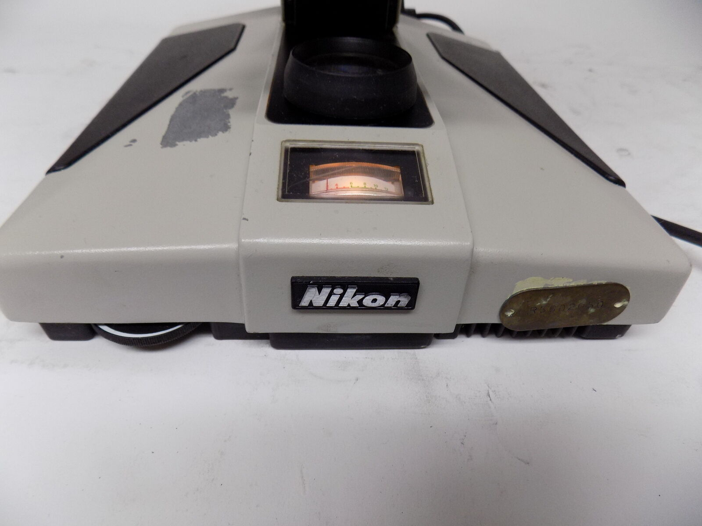   |
| 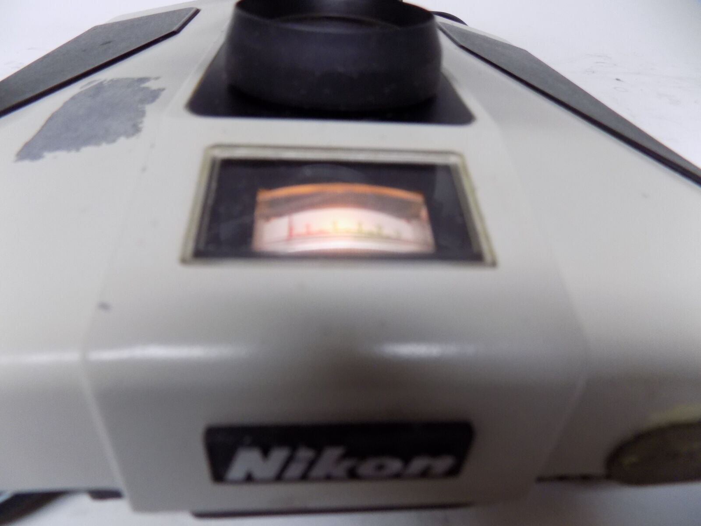 | 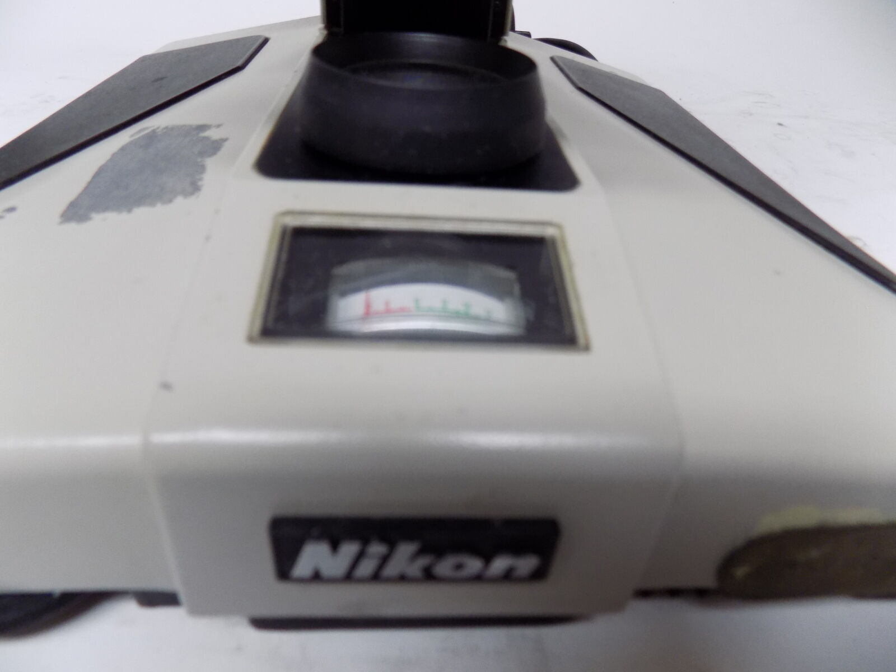 |  

## Received 9 June 2022  
Despite being advertised as a Labophot,
the frame has its Nikon Optiphot plate.  
Both plastic base pads are fine. 
Those tend to be problematic on Optiphot 2...  

The lamphouse was thankfully intact, having been removed as requested.  
Bulb lights; filament shows clearly in the field lens;  diffuser is missing...  
A cheap substitute was [ordered from Amazon](https://www.amazon.com/dp/B0041V9IX4).
  

Condenser carrier and rack are intact and working, 
but neither coarse nor fine stage focus knobs work.  

Bizarrly, power connecton from 12V bulb to base uses 110VAC plug and receptical:  
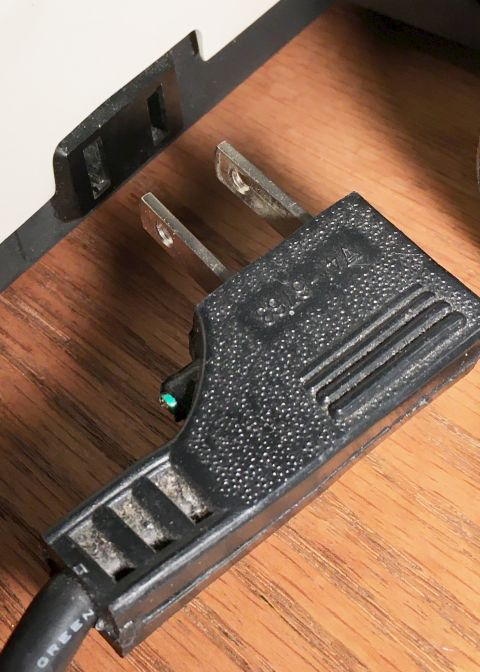  
...although they seemingly match those on page 10 of [the Optiphot instruction manual](https://cmrf.research.uiowa.edu/sites/cmrf.research.uiowa.edu/files/nikon-optiphot-manual_0.pdf).  

Condenser carrier and rack are seemingly identical to those on the diaphot Optiphot 66,  
except that, unlike the 66, a stop prevents it running off the pinion.  
That carrier design strikes me as odd; an upper U is rigid to the rack,  
with a screw that could anchor condensers to it, but a lower spring-loaded ring  
with two adjusting screws that presumably might be to center condensers,  
if they were tight in that floating ring and not anchored in the U...??  
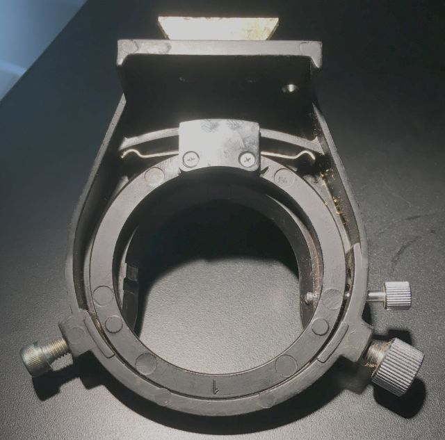  

Condenser and substage assemblies mount on a dovetail that, also unlike on the 66.  
is removable from the (broken) coarse focus rack.  
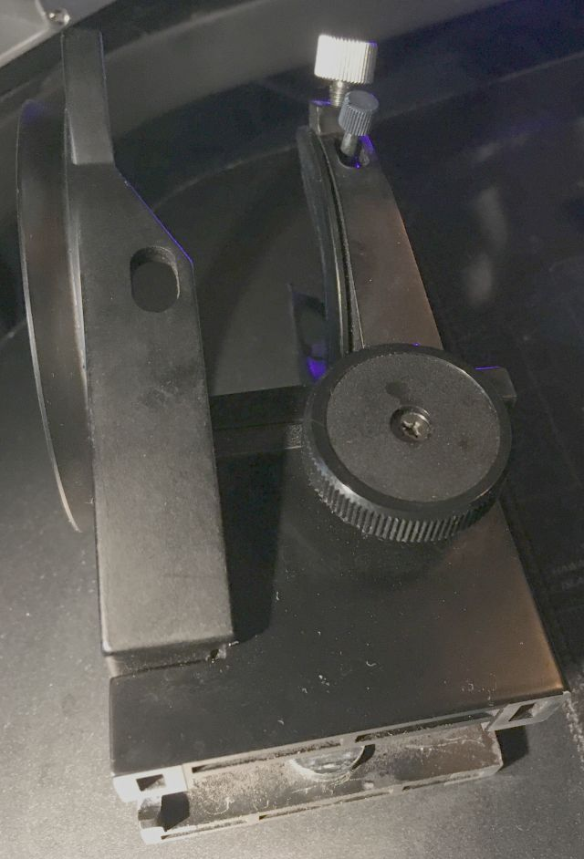  

### Focus
Optiphot-1 fine focus differs from -66  
- -66 has a single 26:6 planetary gear is driven from its (fragile plastic) small fine focus gear (13:3), 
- -1 has 15:6 plastic planetary driven from the fine focus, driving a plastic idler that drives its 20:6 (25:3).  

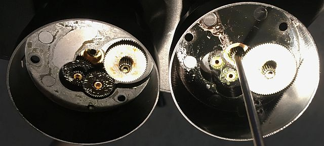  
    *-1 fine focus on the left;  -66 fine focus is to the right, with its fine focus shaft*  

Those last (metal) gears' 6 cog sticks thru a large brass spacer/bushing plate to drive a first coarse focus coaxial sun gear,
which smaller cog drives the coarse focus planetary gear, which small cog drive the coaxial focus pinion sun gear.

The -1 focus evidently had been already fiddled, because
its large brass spacer was only loosely threaded onto its coarse focus tube 
and its first coarse focus sun gear was missing.

The -66 coarse focus tube has a retaining nut on the end without gears;
don't yet know about the -1; its large brass spacer/bushing plate is still tightly threaded on its coarse focus tube.

Both focus blocks are the same width, so presumably matching fine focus shaft lengths.   

### Condenser
Bought a [Zeiss 0.9 flip-top condenser](../ZeissCondenser);  got [some advice](https://www.microbehunter.com/microscopy-forum/viewtopic.php?f=5&t=15701).  
Bought a Nikon swing-out condenser; not enough working distance for 3mm epi plate over the stage.  
[ELWD condenser](../ELWDcondenser/index.html) arguably has too much working distance.  
