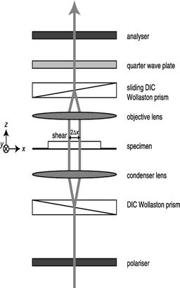
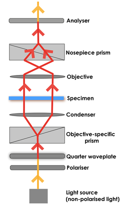
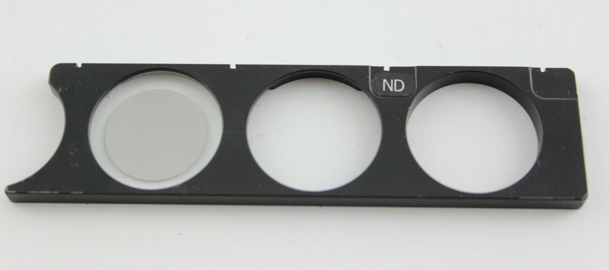
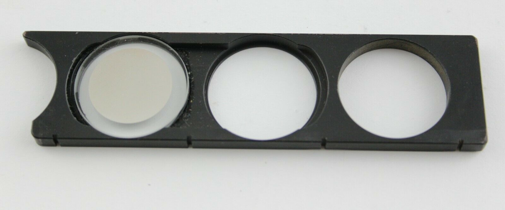
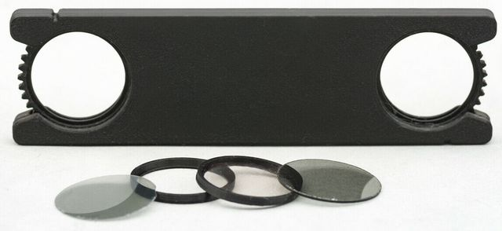

*[back](../)*
  
## Nikon 210mm EPI DIC
### [Wikipedia DIC microscopy](https://en.wikipedia.org/wiki/Differential_interference_contrast_microscopy)  

## [Nikon's microscopyu.com DIC articles](https://www.microscopyu.com/techniques/dic)  
### [DIC Principles and Applications](https://www.microscopyu.com/pdfs/Lasslett_Micro_and_Analysis_20-S9-2006.pdf)  
### [DIC Component Alignment (Java)](https://www.microscopyu.com/tutorials/dic-microscope-component-alignment)  

### [NIH: DIC shear modulation by LCD](https://www.ncbi.nlm.nih.gov/pmc/articles/PMC3695724)  

### [PeteM: DIC options compared](https://www.microbehunter.com/microscopy-forum/viewtopic.php?t=9734)  
Nikon Eclipse favored for De Senarmont system and long WD  

### [hkv: DIC setup](https://www.microbehunter.com/microscopy-forum/viewtopic.php?t=4040#p36805)  
If you pull out one of the eye pieces and look down the tube,  
you should see a white circle with a black stripe in the middle if DIC is properly aligned.  
  

### [abednego1995: 3 generations of Optiphot DIC](https://www.microbehunter.com/microscopy-forum/viewtopic.php?t=6593#p58881)  
The 1st and 2nd are with single translating Nomarski prism above the objectives,  
and the 3rd is a [Senarmont type set-up](https://www.manualslib.com/manual/1725578/Nikon-Optiphot-Pol.html?page=19) with dedicated prisms for each objective.  

### [rogeliomoreno's diascopic DIC considerations](https://www.microbehunter.com/microscopy-forum/viewtopic.php?p=126130#p126130)  
1. The objective's prism and the condenser's prism must match.  
   I did try to use Nikon objective's prisms (made for the N2 condenser's prism) with M condenser's prism and they did not work.  
2. Condenser prims are made to be mounted at precise distance from the condenser's lens, close to focal point.  
3. Prisms have to be oriented 45 degrees from polarizer direction  
   (Polarizer is typically oriented left-right and the analyzer back-front of the microscope)  
   First, find how objective's prism is oriented: removed the both prisms from the light train  
   and put the polarizer and analyzer crossed (when the light that you see through the eyepieces is darkest),   
   now put the objective's prism in the light train and remove one of the eyepieces and check for the black line:  
   -  it should be oriented / or \ (at 45 degrees,  
   -  *note*: not all prims show the black line when put between crossed polarizers  
      (the Nikon N1, N2 family of DIC prisms do not show that line, but mostly do).  
  Second, orient the condenser prism (the black line) in the same direction (/ or \) as the objective's prism,  
  remove the objective prism from the light train and insert the condenser prism,  
  turn that prism until its black line is in the same direction as that the objective's.  

[Olympus diascopic DIC Configuration and Alignment](https://www.olympus-lifescience.com/en/microscope-resource/primer/techniques/dic/dicconfiguration/)  

### [Nikon EPI DIC prisms repurposed](https://www.microbehunter.com/microscopy-forum/viewtopic.php?t=13950)  

### [Scarodactyl's Epi DIC woes](https://www.microbehunter.com/microscopy-forum/viewtopic.php?f=28&t=9092)  

### [Scarodactyl's Diatoms in epi DIC](https://www.photomacrography.net/forum/viewtopic.php?t=43832)  

### [JH's EPI DIC with mirror](http://www.photomacrography.net/forum/viewtopic.php?t=31351)  
-   [First surface mirror](../../FSmirror/)  

### [Differential Interference Contrast (DIC) Microscopy and other methods of producing contrast](https://www.canadiannaturephotographer.com/diffential_interference_microscopy.html)  

### [Flow visualization using a Sanderson prism](http://docplayer.net/148119567-Flow-visualization-using-a-sanderson-prism.html)  

### [S. R. Sanderson:  Simple, adjustable beam splitting element for differential interferometers based on photoelastic birefringence of a prismatic bar](https://authors.library.caltech.edu/6948/1/SANrsi05.pdf)  

### [DIC with non-DIC CF plan Nikon objectives?](https://www.photomacrography.net/forum/viewtopic.php?p=232998)  
The manufacturer has to design the DIC prism in a way that it matches the position of the exit pupil of the objective  
(which is usually inside the objective, so the DIC prism has to be of the Nomarski type)  

### [First steps in exploring (Zeiss) epi DIC](http://www.microscopy-uk.org.uk/mag/artjul13/dw-epiDIC.html)  

### [A Demonstration of the Use of Quarter & Whole Wave Plates to Alter the Colouration of Polarized Light Photomicrographs](http://www.microscopy-uk.org.uk/mag/artjan05/bjcomp.html)  

### [Epi-DIC for gemstone surface examination](https://www.zeiss.com/microscopy/en/resources/insights-hub/raw-materials/gemology-microscopy.html)  

### [NicoVB:  table salt and DIC](https://www.photomacrography.net/forum/viewtopic.php?p=200022)  
"let salt soak in water and let the water evaporate.  
I just put my slide on the central heating to speed up.  
But i was not happy with the forms, so i did it a second time.  
Then mixed with alcohol."  

### [Wollaston vs Nomarski prisms](https://www.photomacrography.net/forum/viewtopic.php?p=244997)
 &nbsp; &nbsp;  &nbsp; &nbsp;  &nbsp; &nbsp; 
 &nbsp; &nbsp; 
 &nbsp; &nbsp;  &nbsp; &nbsp;  &nbsp; &nbsp; 
  
 &nbsp; &nbsp;  &nbsp; &nbsp;  &nbsp; &nbsp;  &nbsp; &nbsp; *Wollaston 
 &nbsp; &nbsp;  &nbsp; &nbsp;  &nbsp; &nbsp; &nbsp; &nbsp;  &nbsp; &nbsp;  &nbsp; &nbsp; 
 &nbsp; &nbsp;  &nbsp; &nbsp;  &nbsp; &nbsp; &nbsp; &nbsp; Nomarski*  
So when we have a Nomarski prism, it's the front interference plane of the objective-side prism  
that must coincide with the objective rear focal plane - not the prism itself.  
The upper wedge must be thinner than the lower wedge in a Nomarski prism,  
but most drawings just have a straight line connecting the corners. Small but important difference.

### [Scarodactyl:  Reflected Light - Optiphot Series](https://www.photomacrography.net/forum/viewtopic.php?p=272448)  
What you need to look out for is the polarizer and analyzer.  
The best option has a rotatable polarizer with a separate quarter wave plate slider,  
mostly meant for epi DIC but good without too.  

### [Gerd: bright field EPI DIC DVD/CD](http://www.photomacrography.net/forum/viewtopic.php?t=12104)  
  

### [Esslinger + Gross: DIC vs PlasDIC; partially coherent illumination](https://onlinelibrary.wiley.com/doi/abs/10.1111/jmi.12248)  
  

### Quarter wave plate before analyzer or after polarizer  
 
  

## [EPI DIC](https://www.microscopyu.com/techniques/dic/reflected-light-dic-microscopy)  
  

## For Optiphot vertical illuminator rotating polarizing slider:  
My EPI rotating polarizing slider is missing the ND / wave plate insert:  
### Nikon Optiphot ND Filter Slider for Rotating Polarizer Universal Epi Illuminator  
eBay item &nbsp; [325064013162](https://www.ebay.com/itm/325064013162)  
  
  
Excellent condition  

## [diascopic Optiphot analyser and wave plate](https://www.microbehunter.com/microscopy-forum/viewtopic.php?f=24&t=13133)  
  
*quartz wedge appears to be from Leica, DIC condenser and nosepiece from Biophot*  

## For Metaphot sliders:  
### Nikon Rotatable Analyzer Polarizer Slider EPI Illuminator Microscope 20mm  
eBay item: &nbsp;265160069244  
  
*Ordered 30 Nov 2021 for Optiphot vertical illuminator, but fits Metaphot head*,  
*need 20mm filters*  

### 2 Microscope 20mm Linear Polarizing Filters High Quality Specs & BONUS Included  
eBay item &nbsp; [275280951982](https://www.ebay.com/itm/275280951982) 
 
  
(2) Microscope Linear Polarizing Filters High Quality Specs and Bonus Included  

See specifications included. Made in USA by a top optical manufacturer.  
Fully Laminated - 0.8mm thick. Rigid - will not bend.  
Its thickness provides rigidity for self-standing applications.  

Note: Since many of our buyers after making an order and receiving our polarizing filters  
begin farming to find microscope slides with polarizing capability we did the following:  
We included in this set a polarizing crystal microscope slider.  
This bonus is represented by an Acetaminophen, Orange G, Safranin O or Potassium Ferricyanide microscope slide. (ONE Slide)  
Since we depend by our supplier capabilities unfortunately we don't know which crystal will be included in the set.  

### 20mm - 140nm Quarter Wave Microscope Lambda Plate plus BONUS slide - See SPECS  
eBay item &nbsp; [275419900377](https://www.ebay.com/itm/275419900377) 
 
  
Microscope Quarter Wave Compensator Plate Multi Layers - Polarizing Applications.  
0.5mm thick (active layer 0.08mm)  140nm +/- 10nm Retardance Value.

We attached a detailed specification page showing all features, components  
and fabrication technology. Please see second attached picture.

We included in this sale as a bonus - a crystal polarizing microscope slide  
with a birefringent chemical available at the time of sale.  
In this way you can check the quality of our product right after receiving it.

Note: In our store we have listed two types of Lambda retaining plates:  
Group one: Laminated and Group two: Glass Mounted.  
Even same type of item - Quarter Lambda, for example interferometric has same value as Glass mounted quarter Lambda plates,  
visual some differences are noticed due to the technology used.  
Laminated plates are manufactured via hot lamination and at the line of contact between active layer  
and neutral protection layer there is a micrometric melted layer combining the last two.  
Visual this brings a color surplus in laminated lenses.  
In group two (full Lambda retaining plates) the effect is reversed but less noticeable.  
(For laser applications and special scientific research glass mounted retaining plates are usually the chosen choice.)
