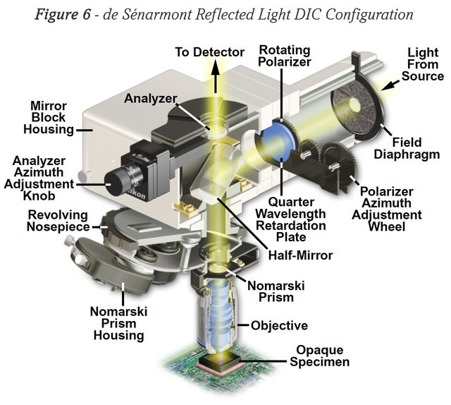

*[back](../)*
  

## Nikon 210mm EPI DIC
### [Wikipedia DIC microscopy](https://en.wikipedia.org/wiki/Differential_interference_contrast_microscopy)  

## [Nikon's microscopyu.com DIC articles](https://www.microscopyu.com/techniques/dic)  
### [DIC Principles and Applications](https://www.microscopyu.com/pdfs/Lasslett_Micro_and_Analysis_20-S9-2006.pdf)  
[Understanding waveplates and retarders  
 ](https://www.edmundoptics.com/knowledge-center/application-notes/optics/understanding-waveplates/)  
*See also*: &nbsp;[Polarized macro and micro photography](../../polarize/) e.g. for compensators and retardation plates.

## [EPI DIC](https://www.microscopyu.com/techniques/dic/reflected-light-dic-microscopy)  
Optiphot EPI DIC is strictly brightfield; DIC sliders block coaxial illumination.  

### [Scarodactyl:  Reflected Light - Optiphot Series](https://www.photomacrography.net/forum/viewtopic.php?p=272448)  
What you need to look out for is the polarizer and analyzer.  
The best option has a rotatable polarizer  
with a separate quarter wave plate slider,  
mostly meant for epi DIC but good without too.  

### [de Senarmont DIC Nicroscope Configuration](https://www.microscopyu.com/techniques/dic/de-sénarmont-dic-microscope-configuration)  
### [DIC Component Alignment (Java)](https://www.microscopyu.com/tutorials/dic-microscope-component-alignment)  

### [PeteM: DIC options compared](https://www.microbehunter.com/microscopy-forum/viewtopic.php?t=9734)  
Nikon Eclipse favored for De Senarmont system and long WD  
[De Senarmont Bias Retardation in DIC Microscopy](Bias Retardation in DIC Microscopy)  
wants 1/4 wavelength retardation plate fixed  
while polarizer can rotate +/- 45 degrees.  

### [hkv: DIC setup](https://www.microbehunter.com/microscopy-forum/viewtopic.php?t=4040#p36805)  
Look down an eye tube without eyepiece,  
you should see a white circle with a black stripe in the middle  
if DIC is properly aligned.  
  

### [abednego1995: 3 generations of Optiphot DIC](https://www.microbehunter.com/microscopy-forum/viewtopic.php?t=6593#p58881)  
1st and 2nd use a single translating Nomarski prism above objectives;  
3rd [Senarmont type](https://www.manualslib.com/manual/1725578/Nikon-Optiphot-Pol.html?page=19) has dedicated prisms per objective.  

### [rogeliomoreno's diascopic DIC considerations](https://www.microbehunter.com/microscopy-forum/viewtopic.php?p=126130#p126130)  
1. The objective's prism and the condenser's prism must match.  
   I did try to use Nikon objective's prisms (made for the N2 condenser's prism) with M condenser's prism and they did not work.  
2. Condenser prims are made to be mounted at precise distance from the condenser's lens, close to focal point.  
3. Prisms have to be oriented 45 degrees from polarizer direction  
   (Polarizer is typically oriented left-right and analyzer back-front)  
   First, find objective prism's orientation:  
   remove both prisms from the light train,  
   and cross the polarizer and analyzer  
   (light through eyepieces is darkest),   
   now put the objective's prism in the light train,  
   remove an eyepieces and check for the black line:  
   -  it should be oriented at 45 degrees,  
   -  *note*: not all prisms show the black line when put between crossed polarizers  
      (the Nikon N1, N2 family of DIC prisms do not show that line, but mostly do).  
  Second, orient the condenser prism (the black line) in the same direction  
  (/ or \\) as the objective's prism,  
  remove the objective prism from the light train  
  and insert the condenser prism,  
  turn that prism until its black line aligns with the objective's.  

### [Nikon EPI DIC prisms repurposed](https://www.microbehunter.com/microscopy-forum/viewtopic.php?t=13950)  

### [Scarodactyl's Epi DIC woes](https://www.microbehunter.com/microscopy-forum/viewtopic.php?f=28&t=9092)  

### [Scarodactyl's Diatoms in epi DIC](https://www.photomacrography.net/forum/viewtopic.php?t=43832)  

### [JH's EPI DIC with mirror](http://www.photomacrography.net/forum/viewtopic.php?t=31351)  
-   [First surface mirror](../../FSmirror/)  

### [Differential Interference Contrast (DIC) Microscopy and other methods of producing contrast](https://www.canadiannaturephotographer.com/diffential_interference_microscopy.html)  

### [Flow visualization using a Sanderson prism](http://docplayer.net/148119567-Flow-visualization-using-a-sanderson-prism.html)  

### [S. R. Sanderson:  Simple, adjustable beam splitting element for differential interferometers based on photoelastic birefringence of a prismatic bar](https://authors.library.caltech.edu/6948/1/SANrsi05.pdf)  

### [DIC with non-DIC CF plan Nikon objectives?](https://www.photomacrography.net/forum/viewtopic.php?p=232998)  
A DIC prism matches an objective's rear focal plane
(which is usually inside the objective,  
so the DIC prism must be of the Nomarski type)  

### [First steps in exploring (Zeiss) epi DIC](http://www.microscopy-uk.org.uk/mag/artjul13/dw-epiDIC.html)  

### [Epi-DIC for gemstone surface examination](https://www.zeiss.com/microscopy/en/resources/insights-hub/raw-materials/gemology-microscopy.html)  

### [NicoVB:  table salt and DIC](https://www.photomacrography.net/forum/viewtopic.php?p=200022)  
"let salt soak in water and let the water evaporate.  
I just put my slide on the central heating to speed up.  
But i was not happy with the forms, so i did it a second time.  
Then mixed with alcohol."  

### [Wollaston vs Nomarski prisms](https://www.photomacrography.net/forum/viewtopic.php?p=244997)
 &nbsp; &nbsp;  &nbsp; &nbsp;  &nbsp; &nbsp; 
 &nbsp; &nbsp; 
 &nbsp; &nbsp;  &nbsp; &nbsp;  &nbsp; &nbsp; 
  
 &nbsp; &nbsp;  &nbsp; &nbsp;  &nbsp; &nbsp;  &nbsp; &nbsp; *Wollaston 
 &nbsp; &nbsp;  &nbsp; &nbsp;  &nbsp; &nbsp; &nbsp; &nbsp;  &nbsp; &nbsp;  &nbsp; &nbsp; 
 &nbsp; &nbsp;  &nbsp; &nbsp;  &nbsp; &nbsp; &nbsp; &nbsp; Nomarski*  
The front interference plane of an objective-side Nomarski prism  
must coincide with the objective's rear focal plane.  
The upper wedge must be thinner than the lower wedge in a Nomarski prism,  
but most drawings just have a straight line connecting the corners.  
Small but important difference.

### [DIC prism interference band location by measuring objective's rear focal plane using a laser pointer](https://www.microbehunter.com/microscopy-forum/viewtopic.php?t=8594#p74473)   

### [DIC interference fringe altered by tilting prisms](https://www.microbehunter.com/microscopy-forum/viewtopic.php?t=9032)  

### [Gerd: bright field EPI DIC DVD/CD](http://www.photomacrography.net/forum/viewtopic.php?t=12104)  
  

### [Esslinger + Gross: DIC vs PlasDIC; partially coherent illumination](https://onlinelibrary.wiley.com/doi/abs/10.1111/jmi.12248)  
  

### [Nikon upper DIC prism for 160 TL is integrated with objective nosepiece](http://www.photomacrography.net/forum/viewtopic.php?f=30&t=23935)  

### [Nikon EPI DIC prisms in transmitted DIC Phase Contrast condenser](https://www.microbehunter.com/microscopy-forum/viewtopic.php?t=13950)  

### [Olympus diascopic DIC Configuration and Alignment](https://www.olympus-lifescience.com/en/microscope-resource/primer/techniques/dic/dicconfiguration/)  

### [NIH: DIC shear modulation by LCD](https://www.ncbi.nlm.nih.gov/pmc/articles/PMC3695724)  
