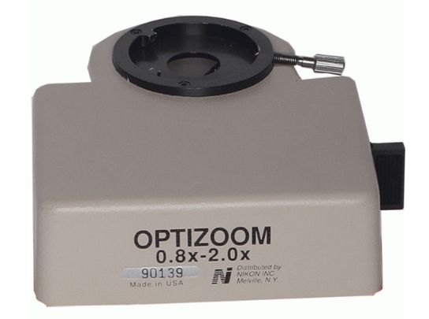

*[back](../)*
  

### [Optizoom 0.8-2x](https://www.photomacrography.net/forum/viewtopic.php?p=82446#p82446)  
  
A: Canon 50D camera.  
B: Trinocular head.  
C: Optem Optizoom 0.8x-2x  
D: Nikon rotatable analyzer with Bertrand lens.  
E: Here you can see where I have to cut the E400 frame to be able to mount the DIC nosepiece.  
F: DIC nosepiece with Plan Fluor 10x/0.3, Plan Fluor 40x/0.75 and PF/PA 100 oil DIC prism.  
G: Turret condenser with DIC prism 0.5-1.0 and 1.0-1.4  
H: DIC polarizer with adapter.  
  

