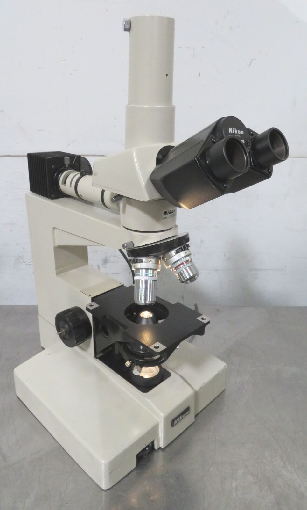
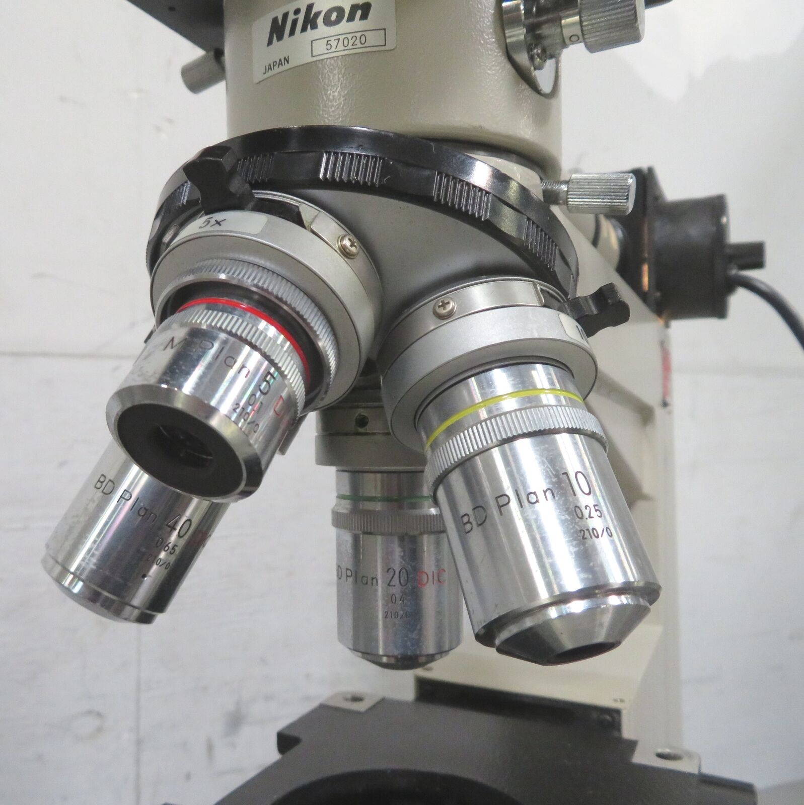
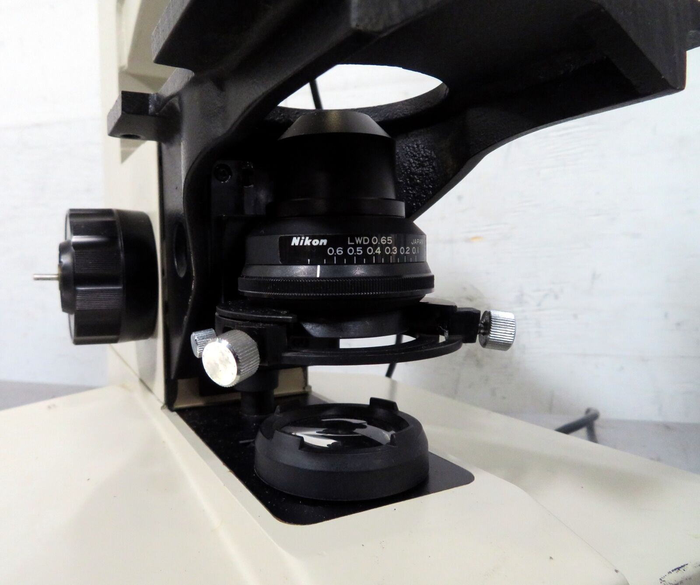
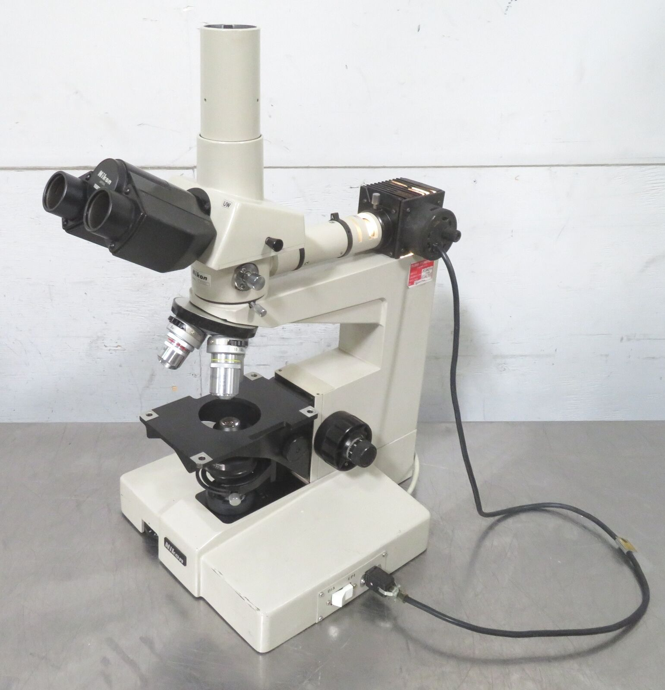
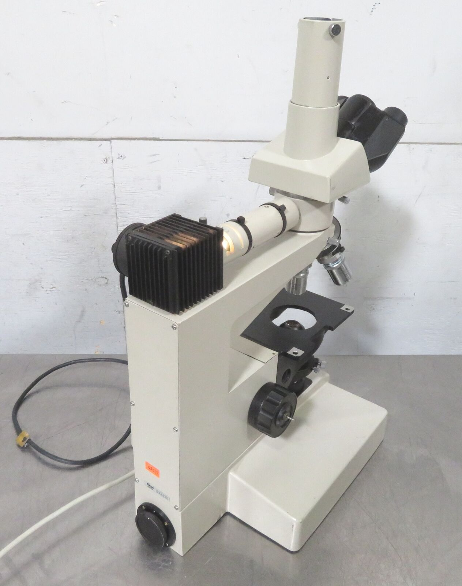
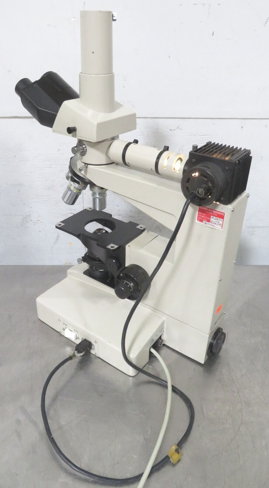

*[back](../)*

## Nikon Optiphot-66 with DIC, UW head and LWD condenser

- [Optiphot Brochure](http://earth2geologists.net/Microscopes/documents/Nikon_Optiphot_Labophot_Pol_brochure.pdf)  
- [Instruction manual](https://cmrf.research.uiowa.edu/sites/cmrf.research.uiowa.edu/files/nikon-optiphot-manual_0.pdf)  
- [Optiphot @ lavinia.as.arizona.edu](https://lavinia.as.arizona.edu/~mtuell/scopes/Optiphot.php)  

eBay item number: [334506777396](https://www.ebay.com/itm/334506777396)   
Condition: For parts or not working   
Manufacturer: Nikon   

**C182578 Nikon Trinocular Microscope, Vertical Illuminator, Condenser, Objectives**

*"Missing the stage and eyepieces; Z-Axis Focus is not engaged with adjustment dials."*    

This Nikon Trinocular Microscope features a Vertical Illuminator Assembly, an LWD0.65 Condenser,    
four Objectives (MPlan 5 DIC 0.1 210/0, BD Plan 10/0.25 210/0, BD Plan 20 DIC 0.4 210/0,    
and BD Plan 40 DIC 0.65 210/0), as shown.  

It provides both "Dia" and "Epi" illumination.  

It does NOT includes a Stage or Eyepieces, as shown.  

I examined some objects under each of the objectives, and I was able to focus on images    
by moving the stage platform by hand, and holding it in place (it moves smoothly by hand,    
but if you let go of it, it starts sinking down),    
but the Z-Axis Focusing Assembly is not engaged to the adjustment knobs on each side of the microscope.  

However, this is the extent of my testing of this microscope, and it is being sold as-is.  

Approximate overall unpacked dimensions: 18"L x 12"W x 23"H.  

Please ask questions or indicate concerns prior to bidding.    
By placing a bid, you agree to all stated terms.    
All auctions are sold as advertised, as is and without warranty, unless otherwise stated in the item description.    
No software, power cords, or other accessories are included unless stated above.  

  

|  |   |
| -------------- | -------------- |
|  |    |
|  |  |  

## Ordered 20 July 2022  

The same vendor (outback6) from whom I got a [Type F trinocular head](../Trinoc/#nikon-type-f-trinocular-microscope-head);  
I want to be optimistic that EPI DIC objectives include prisms, but am pessimistic about polarizing filters...  
[30mm WF 10X / 23 eyepieces](../../oculars/index.htm#WF30mm) are ordered for the UW head  

---

 *received 28 July 2022*  
Unexpectedly included [Leica 10x/21B Widefield Adjustable Eyepieces](https://spwindustrial.com/leica-10x-21b-microscope-eyepiece-10445111-pair-for-mz-or-dm/) [10445111](https://krebsmicro.com/pdf/Z16_Z8_4114754.pdf)  
- probably the same as [Wild 445111](https://www.photomacrography.net/forum/viewtopic.php?t=40880)  

UW head eye tubes are 36mm o.d.; about 3mm larger than 30mm clamp compression groove...  
Leica eyepiece is about 42mm, well over 30mm clamp capacity.  
Some M42 extension tubes (with diaphragm control pins) have 35mm i.d.;  
could likely be turned to 36mm i.d.,  
then use a 40mm long 2" extension tube with m42-M48 adapter.  

