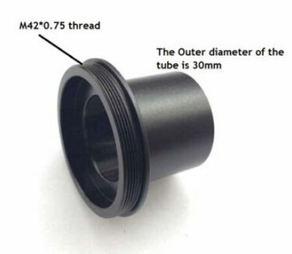

*[back](../)*
  
## Nikon Optiphot-66 with DIC, UW head and LWD condenser

- [Optiphot Brochure](http://earth2geologists.net/Microscopes/documents/Nikon_Optiphot_Labophot_Pol_brochure.pdf)  
- [Instruction manual](https://cmrf.research.uiowa.edu/sites/cmrf.research.uiowa.edu/files/nikon-optiphot-manual_0.pdf)  
- [Optiphot @ lavinia.as.arizona.edu](https://lavinia.as.arizona.edu/~mtuell/scopes/Optiphot.php)  

eBay item number: [334506777396](https://www.ebay.com/itm/334506777396)   
Condition: For parts or not working   
Manufacturer: Nikon   

**C182578 Nikon Trinocular Microscope, Vertical Illuminator, Condenser, Objectives**

*"Missing the stage and eyepieces; Z-Axis Focus is not engaged with adjustment dials."*    

This Nikon Trinocular Microscope features a Vertical Illuminator Assembly, an LWD0.65 Condenser,    
four Objectives (MPlan 5 DIC 0.1 210/0, BD Plan 10/0.25 210/0, BD Plan 20 DIC 0.4 210/0,    
and BD Plan 40 DIC 0.65 210/0), as shown.  

It provides both "Dia" and "Epi" illumination.  

It does NOT includes a Stage or Eyepieces, as shown.  

I examined some objects under each of the objectives, and I was able to focus on images    
by moving the stage platform by hand, and holding it in place (it moves smoothly by hand,    
but if you let go of it, it starts sinking down),    
but the Z-Axis Focusing Assembly is not engaged to the adjustment knobs on each side of the microscope.  

However, this is the extent of my testing of this microscope, and it is being sold as-is.  

Approximate overall unpacked dimensions: 18"L x 12"W x 23"H.  

Please ask questions or indicate concerns prior to bidding.    
By placing a bid, you agree to all stated terms.    
All auctions are sold as advertised, as is and without warranty, unless otherwise stated in the item description.    
No software, power cords, or other accessories are included unless stated above.  

  

|  |   |
| -------------- | -------------- |
|  |    |
|  |  |  

## Ordered 20 July 2022  

The same vendor (outback6) from whom I got a [Type F trinocular head](../Trinoc#nikon-type-f-trinocular-microscope-head);  
I want to be optimistic that EPI DIC objectives include prisms, but am pessimistic about polarizing filters...  
[30mm WF 10X / 23 eyepieces](../../oculars/index.htm#wf30mm) are ordered for the UW head  

---------------------------------  
### [DIC Principles and Applications](https://www.microscopyu.com/pdfs/Lasslett_Micro_and_Analysis_20-S9-2006.pdf)  

### [Nikon's microscopyu.com DIC articles](https://www.microscopyu.com/techniques/dic)  

### [Wikipedia DIC microscopy](https://en.wikipedia.org/wiki/Differential_interference_contrast_microscopy)  

### [NIH: DIC shear modulation by LCD](https://www.ncbi.nlm.nih.gov/pmc/articles/PMC3695724)  

### [PeteM: DIC options compared](https://www.microbehunter.com/microscopy-forum/viewtopic.php?t=9734)  
Nikon Eclipse favored for De Senarmont system and long WD  

### [hkv: DIC setup](https://www.microbehunter.com/microscopy-forum/viewtopic.php?t=4040#p36805)  
If you pull out one of the eye pieces and look down the tube,  
you should see a white circle with a black stripe in the middle if DIC is properly aligned.  
  

### [Nikon DIC expert abednego1995: 3 generations of Optiphot DIC](https://www.microbehunter.com/microscopy-forum/viewtopic.php?t=6593#p58881)  
The 1st and 2nd are with single translating Nomarski prism above the objectives,  
and the 3rd is a Senarmont type set-up with dedicated prisms for each objective.  

### [Nikon EPI DIC prisms repurposed](https://www.microbehunter.com/microscopy-forum/viewtopic.php?t=13950)  

### [Scarodactyl's Epi DIC woes](https://www.microbehunter.com/microscopy-forum/viewtopic.php?f=28&t=9092)  

### [Scarodactyl's Diatoms in epi DIC](https://www.photomacrography.net/forum/viewtopic.php?t=43832)  

### [JH's EPI DIC with mirror](http://www.photomacrography.net/forum/viewtopic.php?t=31351)  
-   [First surface mirror](../../FSmirror)  

### [Differential Interference Contrast (DIC) Microscopy and other methods of producing contrast](https://www.canadiannaturephotographer.com/diffential_interference_microscopy.html)  

### [Flow visualization using a Sanderson prism](http://docplayer.net/148119567-Flow-visualization-using-a-sanderson-prism.html)  

### [S. R. Sanderson:  Simple, adjustable beam splitting element for differential interferometers based on photoelastic birefringence of a prismatic bar](https://authors.library.caltech.edu/6948/1/SANrsi05.pdf)  

### [DIC with non-DIC CF plan Nikon objectives?](https://www.photomacrography.net/forum/viewtopic.php?p=232998)  
The manufacturer has to design the DIC prism in a way that it matches the position of the exit pupil of the objective  
(which is usually inside the objective, so the DIC prism has to be of the Nomarski type)  

### [Epi-DIC for gemstone surface examination](https://blogs.zeiss.com/microscopy/en/gemology-microscopy/)  

### [NicoVB:  table salt and DIC](https://www.photomacrography.net/forum/viewtopic.php?p=200022)  
"let salt soak in water and let the water evaporate.  
I just put my slide on the central heating to speed up.  
But i was not happy with the forms, so i did it a second time.  
Then mixed with alcohol."  

### [Wollaston vs Nomarski prisms](https://www.photomacrography.net/forum/viewtopic.php?p=244997)
 &nbsp; &nbsp;  &nbsp; &nbsp;  &nbsp; &nbsp; 
 &nbsp; &nbsp; 
 &nbsp; &nbsp;  &nbsp; &nbsp;  &nbsp; &nbsp; 
  
 &nbsp; &nbsp;  &nbsp; &nbsp;  &nbsp; &nbsp;  &nbsp; &nbsp; *Wollaston 
 &nbsp; &nbsp;  &nbsp; &nbsp;  &nbsp; &nbsp; &nbsp; &nbsp;  &nbsp; &nbsp;  &nbsp; &nbsp; 
 &nbsp; &nbsp;  &nbsp; &nbsp;  &nbsp; &nbsp; &nbsp; &nbsp; Nomarski*  
So when we have a Nomarski prism, it's the front interference plane of the objective-side prism  
that must coincide with the objective rear focal plane - not the prism itself.  
The upper wedge must be thinner than the lower wedge in a Nomarski prism,  
but most drawings just have a straight line connecting the corners. Small but important difference.

### [Scarodactyl:  Reflected Light - Optiphot Series](https://www.photomacrography.net/forum/viewtopic.php?p=272448)  
What you need to look out for is the polarizer and analyzer.  
The best option has a rotatable polarizer with a separate quarter wave plate slider,  
mostly meant for epi DIC but good without too.  

### [Gerd: bright field EPI DIC DVD/CD](http://www.photomacrography.net/forum/viewtopic.php?t=12104)  
  

### [Optizoom 0.8-2x](https://www.photomacrography.net/forum/viewtopic.php?p=82446#p82446)  
  
A: Canon 50D camera.  
B: Trinocular head.  
C: Optem Optizoom 0.8x-2x  
D: Nikon rotatable analyzer with Bertrand lens.  
E: Here you can see where I have to cut the E400 frame to be able to mount the DIC nosepiece.  
F: DIC nosepiece with Plan Fluor 10x/0.3, Plan Fluor 40x/0.75 and PF/PA 100 oil DIC prism.  
G: Turret condenser with DIC prism 0.5-1.0 and 1.0-1.4  
H: DIC polarizer with adapter.  
  

---

 *received 28 July 2022*  
Unexpectedly included [Leica 10x/21B Widefield Adjustable Eyepieces](https://spwindustrial.com/leica-10x-21b-microscope-eyepiece-10445111-pair-for-mz-or-dm/) [10445111](https://krebsmicro.com/pdf/Z16_Z8_4114754.pdf)  
- probably the same as [Wild 445111](https://www.photomacrography.net/forum/viewtopic.php?t=40880)  

UW head eye tubes are 36mm o.d.; about 3mm larger than 30mm clamp compression groove...  
Leica eyepiece is about 42mm, well over 30mm clamp capacity.  
Some M42 extension tubes (with diaphragm control pins) have 35mm i.d.;  
could likely be turned to 36mm i.d.,  
then use a 40mm long 2" extension tube with m42-M48 adapter.  

---

# M42 to 30mm to 23.2mm Microscope Adapter Camera Eyepiece Tube  
 *item number: [224158403124](https://www.ebay.com/itm/224158403124)*  
The Top male thread is M42*0.75  
The outer diameter of the tube is 30mm  
the inner diameter is 23.2mm to accept biological Microscope tube  
and the end female thread to accpet C-mount.  
full metal-----Aluminum alloy  
 &nbsp;   
