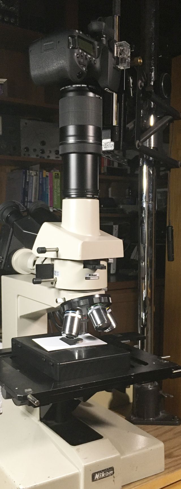
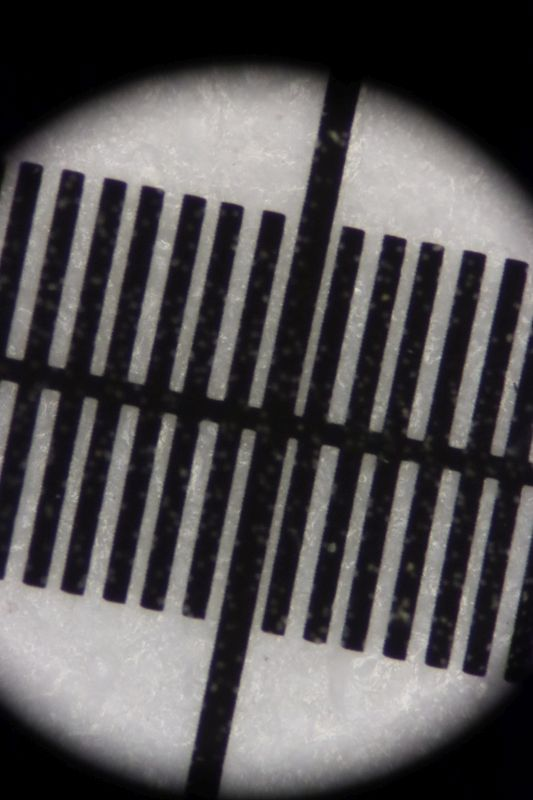
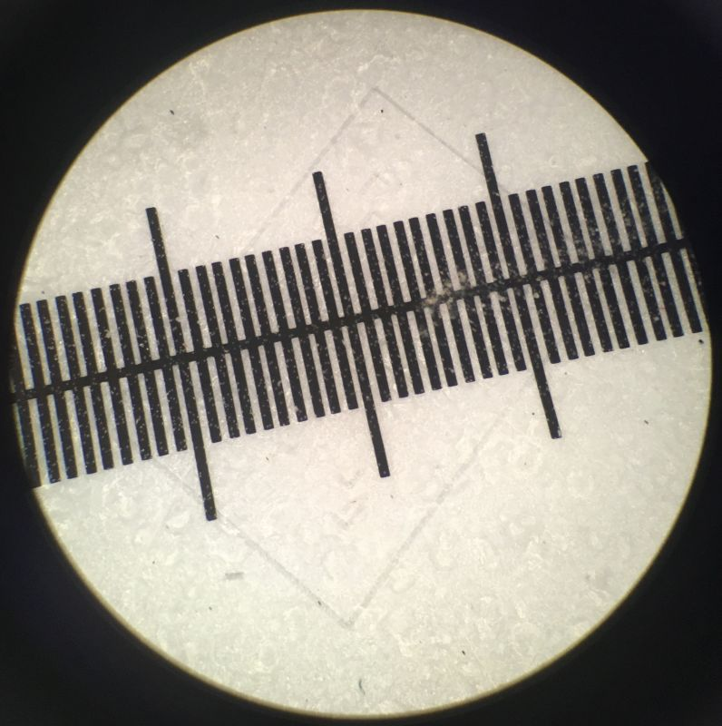

 *[back](photo)*
## (almost) Infinity-focused Optiphot trinocular heads  
Nikon Optiphot (CF) M Plan & EPI objectives have 210mm tube length.  
Only ["F" trinolar head](Trinoc/#F) focus objective rays at 210mm;  
"T" and "UW" heads have a pseudo-[infinity space around prisms](https://www.microbehunter.com/microscopy-forum/viewtopic.php?f=28&t=9092&start=60#p93275):
  
Nikon's CF PL chimney has an M50x0.75 external thread and positive lens.  
Removing that chimney allows the infinite image to continue...  
Alternatively, removing that negative lens would focus infinity objectives,  
but with [a bit under a 0.5x magnification](https://www.microbehunter.com/microscopy-forum/viewtopic.php?f=12&t=16289)  

A camera with (250mm) telephoto lens focused at infinity,  
[as discussed on photomacrography.net](https://www.photomacrography.net/forum/viewtopic.php?t=9438):  
  

... captured these images:  
   
*stainless millimeter rule*  

  
*same target as below*  

... however those strongly vignetted images are magnified about 3X  
relative to oculars (image by iPhone):
  
This issue is addressed as [T / UW "direct" projection](Trinoc/#T-UW)
and arguably better using [a Zeiss Triotar](../../Canon/#vintage-carl-zeiss-jena-triotar-chrome-lens-14-f135-cm).  

# Other  
Other Optiphot infinity configurations
- Infinity objectives thru [trinoc "F" head](Trinoc/#F) to an infinity-focused [tube lens](../tube)  
  Eclipse infinity heads [reportedly fit Optiphot](https://lavinia.as.arizona.edu/~mtuell/scopes/Eclipse.php) via Optiphot 100 vertical illuminator.  
- Optiphot 100/150/200 were infinity scopes with otherwise seemingly incompatible infinity objectives,
  presumably NOT being CFI60.  
- [UM-2 measurescope takes Optiphot style nosepieces](https://www.photomacrography.net/forum/viewtopic.php?f=25&t=43442)  

