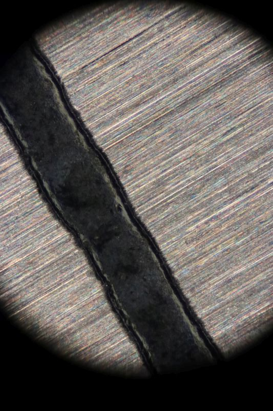

 *[back](photo)*
## Infinity-focused Optiphot EPI  
Nikon EPI objectives of the Optiphot era were designed for 210mm tube length.  
Actually, "F" was the only trinolar head in which rays focused at 210mm.  
More common "T" heads have a pseudo-infinity space around their trinocular prism:
  
Nikon's chimney holding the CF PL has an M50 x 0.75 external thread and positive lens.  
Removing that chimney allows the infinite image to continue;   
a camera with 250mm telephoto lens focused at infinity:
  

... captured these images:  
   
*stainless millimeter rule*  

  
*same target as below*  

... however those strongly vignetted images are magnified about 3X relative to oculars (by iPhone):
  
