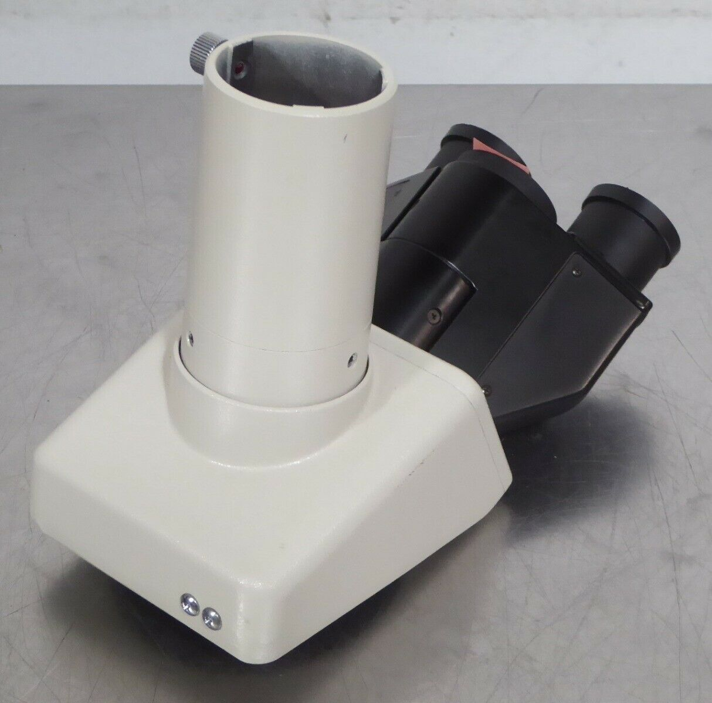
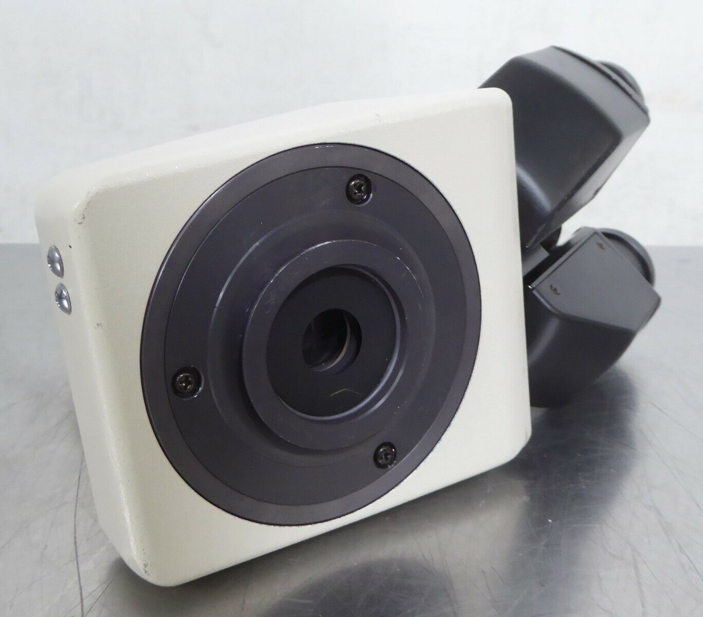
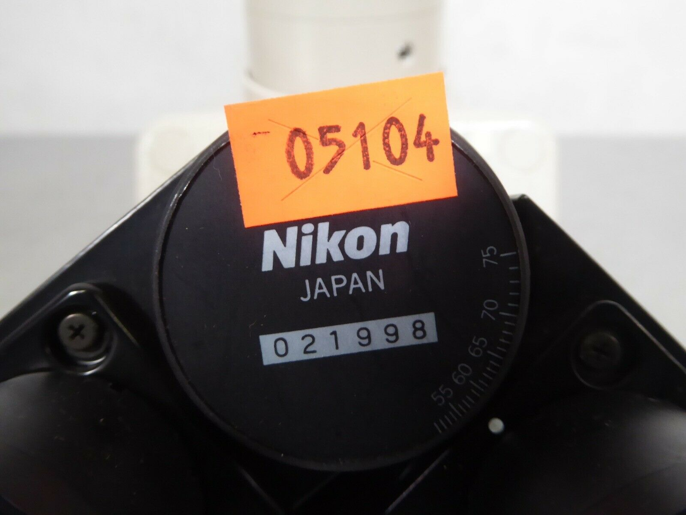
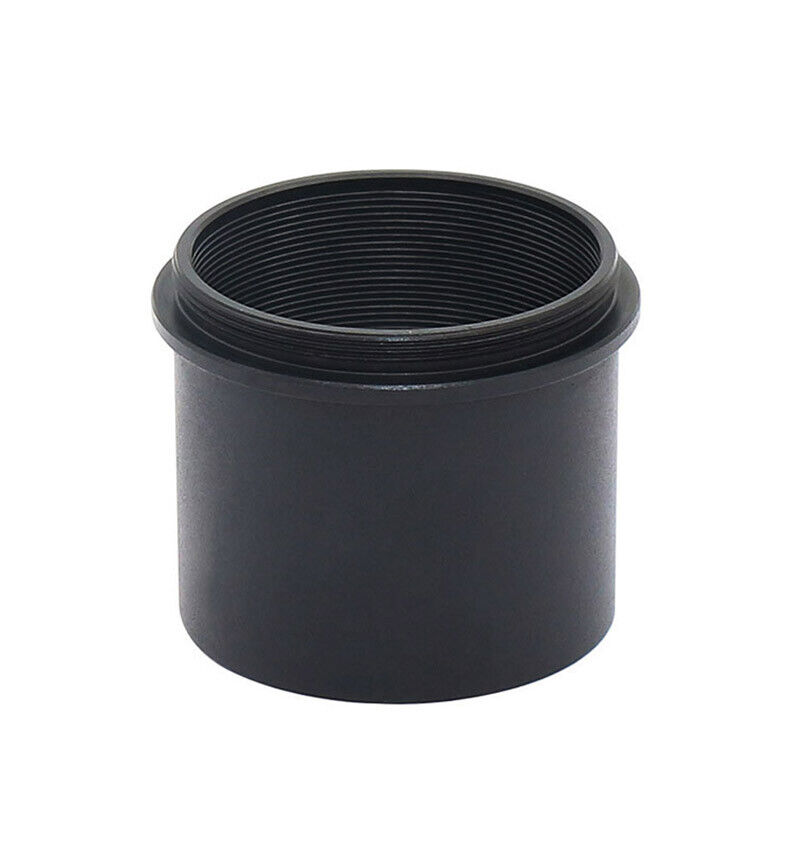
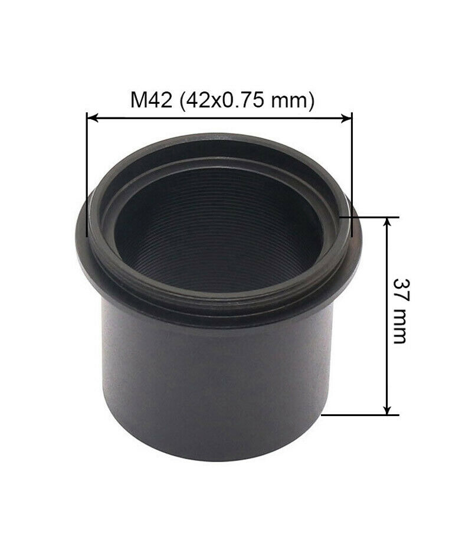
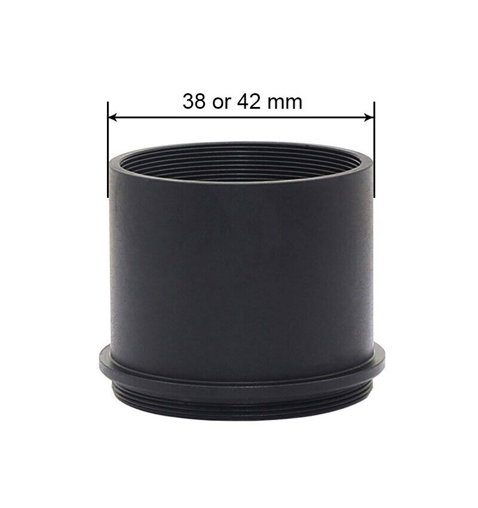
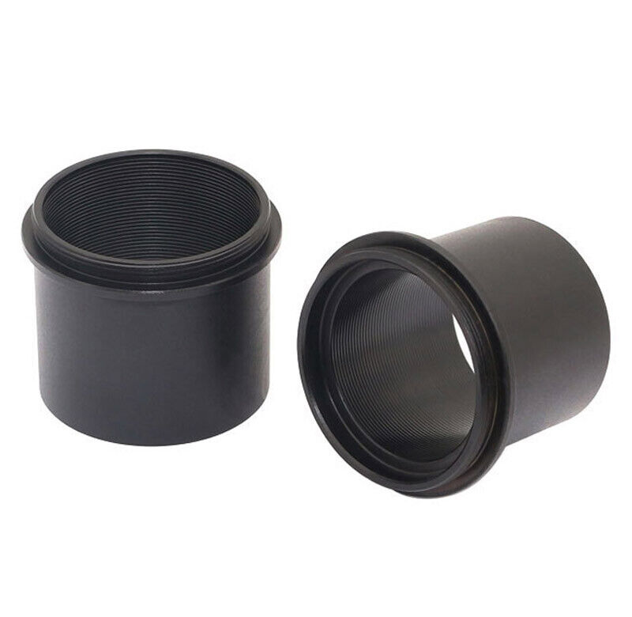

*[back](../)*
 

### [Viewing and Projection Eyepieces demonstration](https://www.microscopyu.com/tutorials/eyepiece)  
Common camera adaptations from [Ichthyophthirius](https://www.photomacrography.net/forum/viewtopic.php?p=272374#p272374):  
  
I: Visual lightpath (visual eyepiece and human eye)  
II: Afocal (eyepiece and camera lens)  
III: Refocussing (not recommended)  
IV: Eyepiece projection (lifting eyepiece while maintaining the intermediate image location O')  
V: Projective  
VI: [Macro lens, instead of photo relay lens, focused at O'](https://www.photomacrography.net/forum/viewtopic.php?p=272402#p272402)  
VII: Direct projection (image sensor at O')  

## Nikon Type F Trinocular Microscope Head  
eBay item number: 392906516398  
Condition: For parts or not working
Brand: Nikon  
Model:	Type F  

This Nikon Type F Trinocular Microscope Head is in good cosmetic condition    
with scuffs and scratches present.  

I was able to smoothly turn the trinocular port to change the viewing    
from the eyepieces to the port.  
The optics appear to be clear from a quick visual inspection.  

I do not have the knowledge or equipment to fully test this unit,  
so it is sold As-Is.  

Approximate unpacked dimensions: 9" x 5" x 7"  

|  |   |
| ----------- | ------------ |
|  |   |
  
With the relay lens chimney removed,  
a "standard" (ISO 38mm) photo tube is available:  
  
... as suggested by [Scarodactyl](https://www.photomacrography.net/forum/viewtopic.php?p=282897#p282897).  
Its thread is actually [T2 (0.75mm thread pitch)](https://en.wikipedia.org/wiki/T-mount)   
rather than [M42 lens mount (1 mm thread pitch)](https://en.wikipedia.org/wiki/M42_lens_mount)  

Since there are no optics in Type F head between its bottom flange and the ISO photo port,  
camera sensor is a "direct" shot from objectives (ignoring vertical illuminator beam splitter).  
With [Nikon CF objectives](https://krebsmicro.com/Nikon_CF.pdf), unlike most earlier microscope objectives,  
no additional optics are required to correct chromatic aberrations.  

Coincidentally, AO tube lens provide equivalent corrections for their infinity objectives,  
suggesting that no additional optics should be necessary for digital imaging without chromatic aberrations.  
Since designated AO photo relay optics are either rare or unavailable,  
direct focus to camera sensors seems worth attempting.  

## received 20 May 2022: M42 to 38mm Telescope Ring Adapter  
eBay item number: [274696367794](https://www.ebay.com/itm/274696367794)  
Condition:  New  
Model:	AD-M42-38  
Microscope Adapter Type:	Camera Adapter  
Top Mounting Diameter:	M42 (42x0.75 mm)	  
Bottom Outer Diameter:	38 mm or 42 mm  
Height:	37 mm  

|  |   |
| ----------- | ------------ |
|  |   |  

### [type F flare](https://www.photomacrography.net/forum/viewtopic.php?p=263114#p263114)  

## Nikon Type T Trinocular Microscope Head  
  
*bundled with Optiphot-66*   

Unlike the type F, type T (and type UW) have nearly the reverse of a tube lens  
at their bottom flange, creating [an approximate infinity space around beam splitter](../OptiphotInfinity)  
for oculars and photo tube.  Its removeable photo tube chimney has an approximate tube lens  
at its bottom to convert back from that beam splitter space to focus at a plane for a photo lens.  
With that chimney removed, focusing a camera lens towards that nearly reversed tube lens yields images  
of a strongly cropped field, indicating that space is not really infinity.  
Chimney construction does not allow for camera sensor placement at that focal plane.  
Several methods have been described for preempting that photo lens:
- [for teaching/discussion head](https://www.photomacrography.net/forum/viewtopic.php?p=240867#240867)  
- [chop off chimney insert just above 50mm thread](https://www.photomacrography.net/forum/viewtopic.php?p=263145#p263145)  
- [insert e.g Zeiss Triotar 1:4 f=13,5 cm ("slim"; M42 thread)](https://www.photomacrography.net/forum/viewtopic.php?p=263168#p263168)  
- [replace chimney insert with Pentacon microscope adapter](https://www.photomacrography.net/forum/viewtopic.php?p=263187#p263187)  
- [replace chimney insert with many filter rings](https://www.photomacrography.net/forum/viewtopic.php?p=206784#p206784)  
- [3D-printed chimney insert replacement with surplus shed 125mm doublet](https://www.photomacrography.net/forum/viewtopic.php?p=264784#p264784)  

### Diopter vs focal length: divide into 1000mm, e.g. diopter = 2 for 500mm  
Lens at the bottom of UW chimney photo port was missing...
UW and T chimney dimensions match.  
Lens at the bottom of T photo port is about 82mm focal length ~ 12 diopter.  
82mm is also roughly the distance from bottom lens to photo lens mount in the trinoc chimney.  

The chimney has an internal aperture stop at its 50mm thread.  
Lip above 50mm thread to chimney bottom  
(with 44mm female thread) is 49mm.  
Sadly, vertical illuminator extension for Optiphot-66 is 95mm long;  
it has useful diameter and threads...  

---

## Type UW
Received 28 July with [DIC Optiphot-66](../Optiphot66_DIC)  
  
UW head eye tubes are 36mm o.d.; about 3mm larger than 30mm clamp compression groove...  
Leica eyepiece is about 42mm, well over 30mm clamp capacity.  
Some M42 extension tubes (with diaphragm control pins) have 35mm i.d.;  
could likely be turned to 36mm i.d.,  
then use a 40mm long 2" extension tube with m42-M48 adapter.  
The trinocular chimney is missing its "tube lens" for the nominal infinity space created for binocular prisms.  
Brooke Clarke describes his UW as having  
[a slightly larger entrance optical diameter (18mm) compared to the stock trinocular head (16mm)](https://www.prc68.com/I/Labophot.html#Ultra_Wide_UW_Trinocular),  
which I confirmed by measurement, but also an ISO 38mm camera port; his is a *different* type UW version:  
  
... mine has a threaded chimney seemingly identical to that for type T.  
### Type T or UW "direct" projection  
[Ichthyophthirius described a "direct" projection conversion for this UW type](https://www.photomacrography.net/forum/viewtopic.php?p=206784),  
with a 100mm focal length achromat sandwiched between 32-42mm rings:
  

[Scarodactyl used a 125mm surplus shed doublet and 3-D printed chimney](https://www.photomacrography.net/forum/viewtopic.php?p=264566#p264566)  
  

A 32mm diameter, 7mm thick cemented doublet achromat with 135mm fl was [ordered from Surplus Shed](https://www.surplusshed.com/pages/item/B1058.htm)  
  
Surplus Shed also lists a [mounted achromat 35mm diameter by 125mm focal length](https://www.surplusshed.com/pages/item/L14523.html),  
and its advertised threaded 44mm diameter mount might fit Nikon's chimney bottom thread,  
but 13mm beyond the chimney bottom would not work.  Alternatively:
- [37.3 MM DIA 150MM FL coated; thickness 11.7/9.3mm center/edge](https://www.surplusshed.com/pages/item/%20L13517.html)  
Then there are also rectangular doublets which might work, depending on field diameter:
- [37.3mm diameter by 28.7mm wide by 11.5mm thick, 105mm focal length. Coated](https://www.surplusshed.com/pages/item/L1601.html)  
- [32 MM X 24 MM CTD 95 MM FL](https://www.surplusshed.com/pages/item/L10789.html)  
- [32MM X 24MM CTD 80MM FL](https://www.surplusshed.com/pages/item/L10762.html)  
AliExpress:
- [30mm fl 75, 40mm fl 100](https://www.aliexpress.com/item/3256804135863586.html)  
- [30mm fl 120/130](https://www.aliexpress.com/item/3256804165355888.html)  
- [34mm dia, 106/120/135mm fl](https://www.aliexpress.com/item/3256801207779520.html)  
- [34mm fl 86, 40mm fl 124, 42mm fl 141](https://www.aliexpress.com/item/3256803933011888.html)  - [also](https://www.aliexpress.com/item/3256804119258293.html), [and](https://www.aliexpress.com/item/3256804246336535.html)  
- [cemented meniscus 36mm fl 166mm](https://www.aliexpress.com/item/3256804229571686.html)  
- [41mm 156mm fl](https://www.aliexpress.com/item/3256802088308707.html) - [also](https://www.aliexpress.com/item/3256804229323894.html)  
- [42mm fl 126mm](https://www.aliexpress.com/item/3256802176120474.html)

### Achromat doublet assymetry
This [ray diagram](http://hyperphysics.phy-astr.gsu.edu/hbase/geoopt/aber2.html) demonstrates that convex side should face parallel rays:
  
