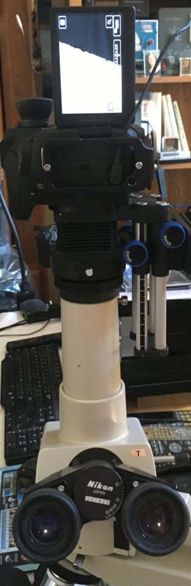
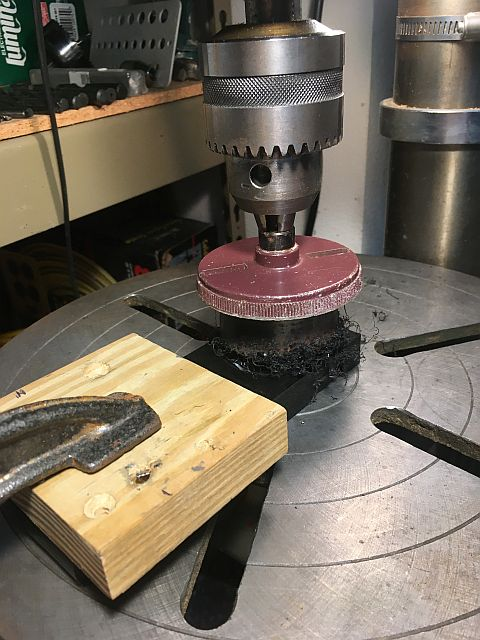

*[back](../)*
  

### Trinocular heads
- [F](#nikon-type-f-trinocular-microscope-head)  
- [T](#nikon-type-t-trinocular-microscope-head)  
- [UW](#type-uw)  
- [T / UW "direct" projection](#type-t-or-uw-direct-projection)  
- [UW afocal clamp](#uw-afocal-clamp)  
- [**image comparisons**](../../objectives/Hugin.htm)  

### [Viewing and Projection Eyepieces demonstration](https://www.microscopyu.com/tutorials/eyepiece)  
Common camera adaptations from [Ichthyophthirius](https://www.photomacrography.net/forum/viewtopic.php?p=272374#p272374):  
  
I: Visual lightpath (objective - ocular - human eye)  
II: Afocal (ocular - camera lens)  
III: Refocussing (not recommended)  
IV: Eyepiece projection (lifting eyepiece while maintaining the intermediate image location O')  
V: Projective  
VI: [Macro lens, instead of photo relay lens, focused at O'](https://www.photomacrography.net/forum/viewtopic.php?p=272402#p272402)  
VII: [Direct projection](#type-t-or-uw-direct-projection) (image sensor at O')  

## Nikon Type F Trinocular Microscope Head  
eBay item number: 392906516398  
Condition: For parts or not working
Brand: Nikon  
Model:	Type F  

This Nikon Type F Trinocular Microscope Head is in good cosmetic condition    
with scuffs and scratches present.  

I was able to smoothly turn the trinocular port to change the viewing    
from the eyepieces to the port.  
The optics appear to be clear from a quick visual inspection.  

I do not have the knowledge or equipment to fully test this unit,  
so it is sold As-Is.  

Approximate unpacked dimensions: 9" x 5" x 7"  
<table><tr><td>
  </td><td> 
</td></tr><tr><td>
  </td><td> 
</td></tr></table>
  
With the relay lens chimney removed,  
a "standard" (ISO 38mm) photo tube is available:  
  
  
... as suggested by [Scarodactyl](https://www.photomacrography.net/forum/viewtopic.php?p=282897#p282897).  
Its thread is actually [T2 (0.75mm thread pitch)](https://en.wikipedia.org/wiki/T-mount)   
not [M42 lens mount (1 mm thread pitch)](https://en.wikipedia.org/wiki/M42_lens_mount)  

Since there are no optics in Type F head between its bottom flange  
and the ISO photo port,   camera sensor is a "direct" shot  
from objectives (ignoring vertical illuminator beam splitter).  
With [Nikon CF objectives](https://krebsmicro.com/Nikon_CF.pdf), unlike most earlier microscope objectives,  
no additional optics are required to correct chromatic aberrations.  

Coincidentally, AO 10-120 tube lens provide equivalent corrections  
for their infinity objectives, suggesting that no additional optics  
may be necessary for digital imaging without chromatic aberrations.  
Since designated AO photo relay optics are either rare or unavailable,  
direct focus to camera sensors seems worth attempting.  

### received 20 May 2022: M42 to 38mm Telescope Ring Adapter  
eBay item number: [274696367794](https://www.ebay.com/itm/274696367794)  
Condition:  New  
Model:	AD-M42-38  
Microscope Adapter Type:	Camera Adapter  
Top Mounting Diameter:	M42 (42x0.75 mm)	  
Bottom Outer Diameter:	38 mm or 42 mm  
Height:	37 mm  

<table><tr><td>
  </td><td> 
</td></tr><tr><td>
  </td><td> 
</td></tr></table>

### [type F flare](https://www.photomacrography.net/forum/viewtopic.php?p=263114#p263114)  

## Nikon Type T Trinocular Microscope Head  
  
*bundled with Optiphot-66*   

Unlike the type F, type T (and type UW) have nearly the reverse of a tube lens  
at their bottom flange, creating [an approximate infinity space around beam splitter](../OptiphotInfinity)  
for oculars and photo tube.  Its removeable photo tube chimney has an approximate tube lens  
at its bottom to convert back from that beam splitter space to focus at a plane for a photo lens.  
With that chimney removed, focusing a camera lens towards that nearly reversed tube lens yields images  
of a strongly cropped field, indicating that space is not really infinity.  
Chimney construction does not allow for camera sensor placement at that focal plane.  
Several methods have been described for preempting that photo lens:
- [for teaching/discussion head](https://www.photomacrography.net/forum/viewtopic.php?p=240867#240867)  
- [chop off chimney insert just above 50mm thread](https://www.photomacrography.net/forum/viewtopic.php?p=263145#p263145)  
- [insert e.g Zeiss Triotar 1:4 f=13,5 cm ("slim"; M42 thread)](https://www.photomacrography.net/forum/viewtopic.php?p=263168#p263168)  
- [replace chimney insert with Pentacon microscope adapter](https://www.photomacrography.net/forum/viewtopic.php?p=263187#p263187)  
- [replace chimney insert with many filter rings](https://www.photomacrography.net/forum/viewtopic.php?p=206784#p206784)  
- [3D-printed chimney insert replacement with surplus shed 125mm doublet](https://www.photomacrography.net/forum/viewtopic.php?p=264784#p264784)  

### Diopter vs focal length: divide into 1000mm, e.g. diopter = 2 for 500mm  
Lens at the bottom of UW chimney photo port was missing...
UW and T chimney dimensions match.  
Lens at the bottom of T photo port is about 82mm focal length ~ 12 diopter.  
82mm is also roughly the distance from bottom lens to photo lens mount in the trinoc chimney.  

The chimney has an internal aperture stop at its 50mm thread.  
Lip above 50mm thread to chimney bottom  
(with 44mm female thread) is 49mm.  
Sadly, vertical illuminator extension for Optiphot-66 is 95mm long;  
it has useful diameter and threads...  

---

## Type UW
Received 28 July with [DIC Optiphot-66](../Optiphot66_DIC/index.htm)  
  
UW head eye tubes are 36mm o.d.; about 3mm larger than 30mm clamp compression groove...  
Leica eyepiece shield is about 42mm o.d., well over 30mm clamp capacity.  
Some M42 extension tubes (with diaphragm control pins) have 35mm i.d.;  
could likely be turned to 36mm i.d.,  
then use a 40mm long 2" extension tube with m42-M48 adapter.  
The trinocular chimney is missing its "tube lens" for the nominal infinity space created for binocular prisms.  
Brooke Clarke describes his UW as having  
[a slightly larger entrance optical diameter (18mm) compared to the stock trinocular head (16mm)](https://www.prc68.com/I/Labophot.html#Ultra_Wide_UW_Trinocular),  
which I confirmed by measurement, but also an ISO 38mm camera port;  
his type UW version has an **M50x0.75 to ISO 38mm adapter**:  
  
There appears to be one available at [deal corner](https://www.dealcorner.com/Nikon-Accessories):  
  
... mine has a threaded chimney seemingly identical to that for type T.  
### Type T or UW direct projection  
[Ichthyophthirius described a "direct" projection conversion for this UW type](https://www.photomacrography.net/forum/viewtopic.php?p=206784),  
with a 100mm focal length achromat sandwiched between 32-42mm rings:
  

[Scarodactyl used a 125mm surplus shed doublet and 3-D printed chimney](https://www.photomacrography.net/forum/viewtopic.php?p=264566#p264566)  
  

A 32mm diameter, 7mm thick cemented doublet achromat with 135mm fl was [ordered from Surplus Shed](https://www.surplusshed.com/pages/item/L14677.html)  
  
Surplus Shed also lists a [35mm diameter 125mm fl mounted achromat](https://www.surplusshed.com/pages/item/L14523.html),  
and its advertised threaded 44mm diameter mount might fit Nikon's chimney bottom thread,  
but 13mm beyond the chimney bottom would not work.  Alternatively:
- [37.3 MM DIA 150MM FL coated; thickness 11.7/9.3mm center/edge](https://www.surplusshed.com/pages/item/%20L13517.html)  

Surplus Shed also has rectangular doublets which might work,  
depending on field diameter:
- [37.3mm diameter by 28.7mm wide by 11.5mm thick, 105mm focal length. Coated](https://www.surplusshed.com/pages/item/L1601.html)  
- [32 MM X 24 MM CTD 95 MM FL](https://www.surplusshed.com/pages/item/L10789.html)  
- [32MM X 24MM CTD 80MM FL](https://www.surplusshed.com/pages/item/L10762.html)  

AliExpress:
- [30mm fl 75, 40mm fl 100](https://www.aliexpress.com/item/3256804135863586.html)  
- [30mm fl 120/130](https://www.aliexpress.com/item/3256804165355888.html)  
- [34mm dia, 106/120/135mm fl](https://www.aliexpress.com/item/3256801207779520.html)  
- [34mm fl 86, 40mm fl 124, 42mm fl 141](https://www.aliexpress.com/item/3256803933011888.html)  - [also](https://www.aliexpress.com/item/3256804119258293.html), [and](https://www.aliexpress.com/item/3256804246336535.html)  
- [cemented meniscus 36mm fl 166mm](https://www.aliexpress.com/item/3256804229571686.html)  
- [41mm 156mm fl](https://www.aliexpress.com/item/3256802088308707.html) - [also](https://www.aliexpress.com/item/3256804229323894.html)  
- [42mm fl 126mm](https://www.aliexpress.com/item/3256802176120474.html)

### Achromat doublet assymetry
This [ray diagram](http://hyperphysics.phy-astr.gsu.edu/hbase/geoopt/aber2.html) demonstrates that convex side should face parallel rays:
  

 *Surplus Shed 135mm achromat doublet was delivered 1 Aug 2022*  
    

 *Tiffen 44M6 adapter was delivered 2 Aug 2022*
- Tiffen adapter male 44mm thread cannot reach Nikon photo chimney bottom thread,  
  but Series VI filter thread reaches and engages:  
    

## "direct" projection experiments
Surplus Shed 135fl lens was temporarily hot-glued to an M42-25mm adapter;  
Another direct projection tube candidate uses 2+ and 4+ 37mm closeup lenses:  
  

The closeup tube extends 55mm down from the UW photo port lip  
and 67mm from the UW photo port lip to Canon 6D flange.  
  

The Surplus Shed tube extends 85mm from Canon 7D II flange to 135mm lens:  
  
...with 55mm below the UW photo port lip  
   

Keeping in mind that Canon 6D has a 35mm sensor while 7D is APS-C,  
both configurations capture a larger FoV than do WF10X/23 oculars.  
Here is the Canon 6D with closeup lens image;  
vignette is by field stop and not visible in oculars:
  

Here is the Canon 7D II with 135mm fl doublet lens image:
  

Images are from BD Plan DIC 5x 210/0 objective with DIC prism inserted.  
Here is crop of closeup lens image:  
  

.. and here is the corresponding 135mm doublet crop:  
  

 *10 Aug*   
Based on [Sure Squintsalot](https://www.microbehunter.com/microscopy-forum/viewtopic.php?f=9&t=11881) 's input, I tried direct projection to M6 mkII sensor from UW bottom lens:  
  
Focus required lifting objectives enough that should in theory degrade resolution,  
but more disasterously above 40X and 0.65 n.a..  

While the M6 II skyhook was in place, an M42 extension tube + helicoid was improvised for it,  
with a mount for the Surplus Shed 135mm achromat doublet improvised from a pair of rubber o-rings  
and 42-43mm, 43-37mm and 37-30mm filter adapter rings:
  
.. leaving the lens recessed about 6mm (thickness of 37-30mm step-down):
  
.. for a net distance of about 115mm from M6 flange to 135mm lens front.  
As with the 7D, 5X field is magnified and cropped slightly relative to oculars:  
  
.. with some visible chromatic aberration from BD 40x objective:  
  

 *12 Aug*  
### Trinocular "T" photo tube lens on 42mm extension tubes and helicoid  
  
82mm from photo tube lens flange to Canon M6 II body flange yields images  
parfocal to WF10X/23 oculars in UW head with matching field of view.  
  

---

### UW afocal clamp
  
[HERCULES M48 Male to M42 Female Thread Adapter Extension 5mm - from AliExpress](https://www.aliexpress.com/item/3256802502212562.html)

Spacer from 2-inch to 36mm eyetube o.d. was tediously hole-sawed  
from 16mm delrin, which melted and stuck to saw teeth,  
requiring cleaning between cuts of less than 1/16-inch.  
  

[2-inch Telescope Extension Tube](https://www.amazon.com/dp/B083TW6RW1)  
Single thumbscrew is 2 too few and uncomfortably small.  
  

 *10 Aug*  
Amazon thumbs screws arrived; thread matches and more comfortable than stock SVBONY...   
