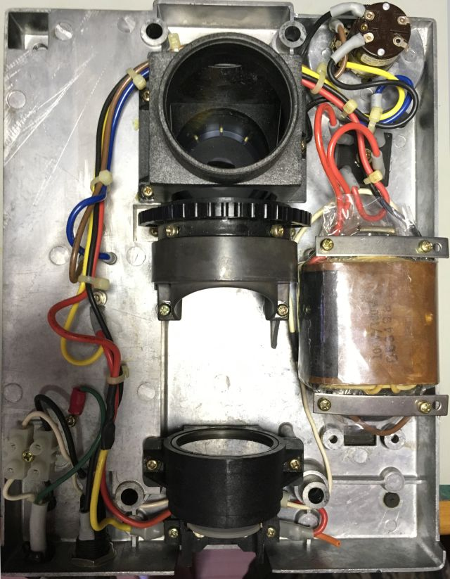
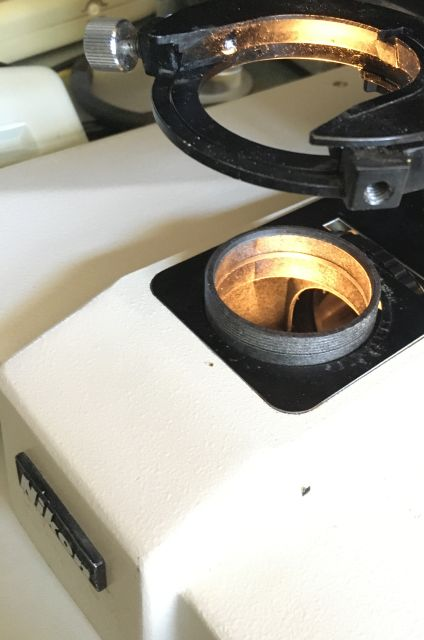

*[back](./)*
## Optiphot 66 diascopic conversion  

[The base](DIA-EPI_base) arrived 1 June 2022 with broken condenser carrier centering screw:  
  
Seller has been contacted..  
AO condenser dovetail is too large for Optiphot fork.  
Diascopic wiring in the base was hacked;  
originally probably provided 6V out side receptical based on adjacent switch.  
AC power is/was switched by potentiometer on the front.  
Instead, someone converted side switch to switch AC on/off,  
disconnected side receptical, ran AC cord from another 6V transformer  
thru a hole drilled in the other side rear of the base,  
hacked into the neutral AC line for the base transformer  
and added a 4 pole double throw center off switch  
to select either th base or external transformer,  
running green wire roung and unfused AC hot from the right side rear  
to the left side added 4PDT switch and tranformer power cord.  
  
6V wiring to 20W base lamp also appears to have been hacked...  

Cutout for 6V receptical is approx 25x11.6mm;  perhaps for a small panel meter...  

## Restored base wiring  

An Optiphot would originally have had wiring from its
**DIA EPI** switch  
to adjacent receptical for powering a (6V, 20W) EPI illuminator,  
which is useless without compatible cable connectors and illuminator.  
Wiring to that switch presumably was yellow and orange  
from lamp connections and red from the bridge rectifier.  

#### AC neutral:  
 White from cord to binding post,  
 white from binding post to transformer primary  .
#### AC hot:  
 Black from cord to binding post, black from binding post to fuse,  
 black from fuse to control switch,  
 black from control switch to transformer primary.
####  AC ground:  
 Green from cord to chassis.
#### 6 VAC:  
 Red pair from transformer to bridge rectifier.  
#### 6 VDC+:  
 Red from bridge rectifier to lamp connector.  
#### 6 VDC-:  
 Blue from bridge rectifier to power transistor emitter.  
 Yellow from transistor collector to potentiometer;  
 red from transistor collector to yellow to lamp connector.
#### Intensity control:  
 Brown from power transistor base to potentiometer.

  

## Restored base wiring  
The section of broken centering screw remaining in the condenser carrier was short,  
about 3mm or so.  After careful setup, that remaining segment was drilled out,  leaving threads intact.
  
A centering screw and field lens are still needed.  

## Labophot (?) Optiphot 2  
What was [listed as a Labophot](Optiphot-2) appears to be an Optiphot 2.  
If so, in addition to the field lens and both centering screws,  
it has a more powerful lamp house and what appears to be a circular stage rack.  
Whether the lamp house can be adapted to the 66 base is unclear..  

