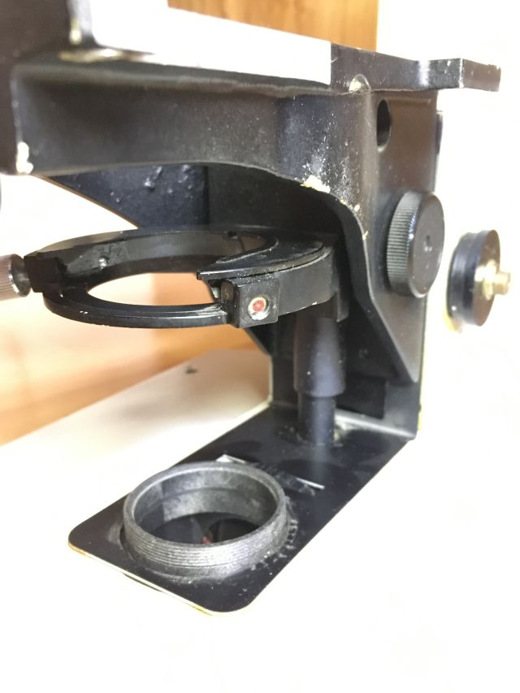
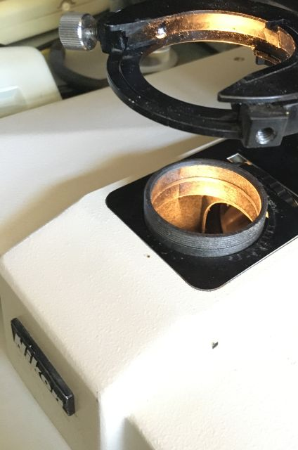

*[back](./)*
## Optiphot 66 diascopic conversions  

[The base](DIA-EPI_base/) arrived 1 June 2022
with broken condenser carrier centering screw:  
  
Seller has been contacted..  
AO condenser dovetail is too large for Optiphot fork.  

Optiphot-66 diascopic base is essentially that of a Labophot,  
lacking Kohler lamp filament alignment provisions;  
illumination diffuser is buried in the base,  
and bulb location in the lamp house is not adjustable.  

AC power is/was switched by potentiometer on the front.  
Diascopic wiring in the base was hacked,  
originally providing 6V out 2-prong side receptacle based on adjacent switch.  
Someone converted that side switch to instead turn AC on/off,  
disconnected the side receptacle, ran AC cord from another 6V transformer  
thru a hole drilled in the other side rear of the base,  
hacked into the neutral AC line for the base transformer  
and added a 4 pole double throw center off switch  
to select either the base or external transformer,  
running green wire ground and unfused AC hot from the right side rear  
to that left side added 4PDT switch and tranformer power cord.  

Fine focus shaft was broken off at one end.
Loosening coarse focus flanges from their threaded tubing is problematic;
thread locker is wanted to set slip clutch resistance.
Removing a condenser focus rack from its substage bracket
seemingly requires a special wrench to loosen a pinion bearing retainer.
  
6V wiring to 20W base lamp was also hacked...  

Cutout for 6V receptacle is approx 25x11.6mm;  perhaps for a small panel meter...  

## Restored base wiring  

An Optiphot-66 originally had wiring from its
**DIA EPI** switch  
to adjacent receptacle for powering a (6V, 20W) EPI illuminator,  
which is useless without compatible cable connectors and illuminator.  
Wiring to that switch presumably was yellow and orange  
from lamp connections and red from the bridge rectifier.  

#### AC neutral:  
 White from cord to binding post,  
 white from binding post to transformer primary  .
#### AC hot:  
 Black from cord to binding post, black from binding post to fuse,  
 black from fuse to control switch,  
 black from control switch to transformer primary.  
####  AC ground:  
 Green from cord to chassis.  
#### 6 VAC:  
 Red pair from transformer to bridge rectifier.  
#### 6 VDC+:  
 Red from bridge rectifier to lamp connector.  
#### 6 VDC-:  
 Blue from bridge rectifier to power transistor emitter.  
 Yellow from transistor collector to potentiometer;  
 red from transistor collector to yellow to lamp connector.  
#### Intensity control:  
 Brown from power transistor base to potentiometer.  

  
This 6V system seeming could be easily [converted to LED](Labophot/#led-conversion);  
a common-emitter transistor can be nearly constant current than constant voltage...  

### base mechanical
The section of broken centering screw remaining in the condenser carrier was short,  
about 3mm or so.  After careful setup, that remaining segment was drilled out,  leaving threads intact.  
  
A centering screw and field lens were still needed.  

### Optiphot 1  
What was [listed as a Labophot](Optiphot/) is actually an [Optiphot 1](Optiphot/#received-9-june-2022).  
In addition to the Kohler illumination and both condenser centering screws,  
it has a more powerful (50W) lamp house and a stage that rotates (about 270 degrees) as well as translates.  
Swapping vertical illuminator's 12V bulb to 6V (LED) would enable powering by -66 6V supply;  
Optiphot 1, after fine focus repair, will be a more capable frame, except for stage size..  

## 6 July: discopic transplant  
The 1 June diascopic base has been mostly disassembled for several weeks;  
the seller reneged on a replacement condenser carrier and offered no partial refund.  

Removing substage from its focus rack requires a long (8-inch) 3mm Allen bit.  
Recentering an arm on a base, for illumination alignment,  
seems more difficult than realigning a substage on its focus rack,  
since condenser carriers have centering screws.  
Condenser rack has an adjustable spring-loaded upper stop  
and a removable screw for its lower stop.  
Sadly, diascopic lamp centering flange differ: 3- vs 4-hole mount;  
the 4-hole diascopic base would need centering on the epi arm with good focus.  

Condenser dovetail was slack, tightened by loosening right dovetail clamp screws  
and nudging tighter by twisting a flat blade screwdriver.  
Substage assembly with condenser carrier was mechanically centered in the good fine focus neck,  
and that neck was mechanically centered on the diascopic base.  
One of 4 screws securing the Optiphot-66 stage to its substage  
was definitely non-standard, but was reused rather than further mess  
with corresponding threads in the stage.  
  

## 14 Sept 2022: arm transplant 
Given that [the 1 June purchase](DIA-EPI_base/) was basically a bust,
and the main things wrong with [20 July DIC Optiphot 66](Optiphot66_DIC/) were:  
- missing stage  
- failed fine focus  

... then swapping good arm from the original (March 2021) Optiphot 66  
onto unmolested DIC Optiphot 66 base consolidates best parts.  
- 4 screws and field lens bezel to remove base optics and electronics from casting;  
- 4 screws and long coiled focus spring to remove base casting from arm.  

DIC Optiphot 66 base EPI power receptical has 4 prongs, compatible with (50W) vertical illuminators,  
instead of 2 prongs on 1 June base.  
