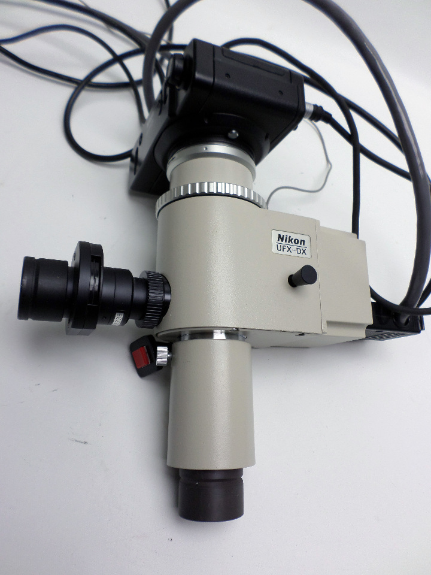
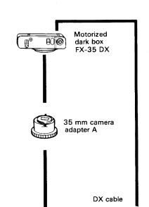
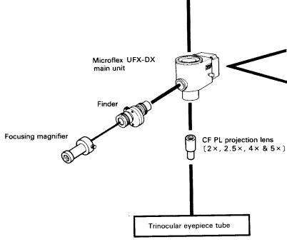
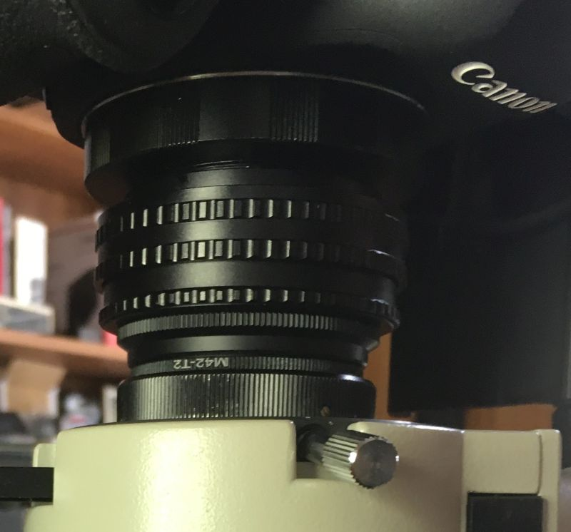
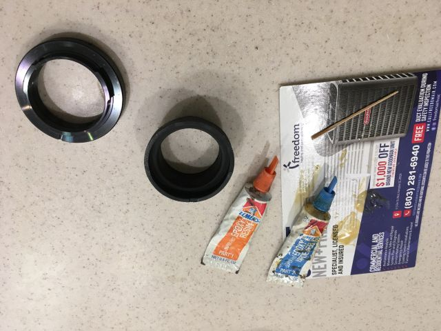
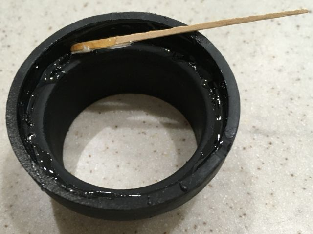
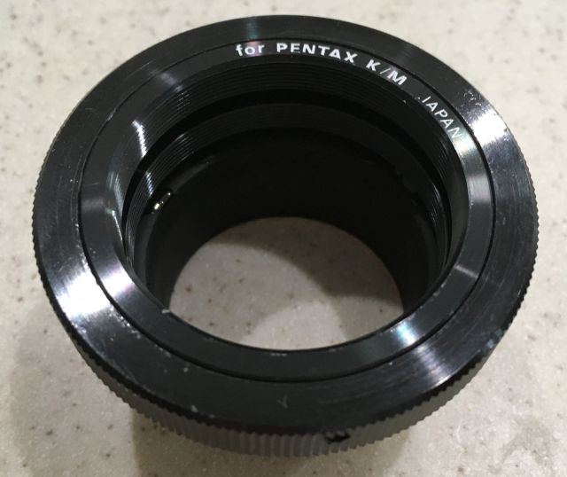
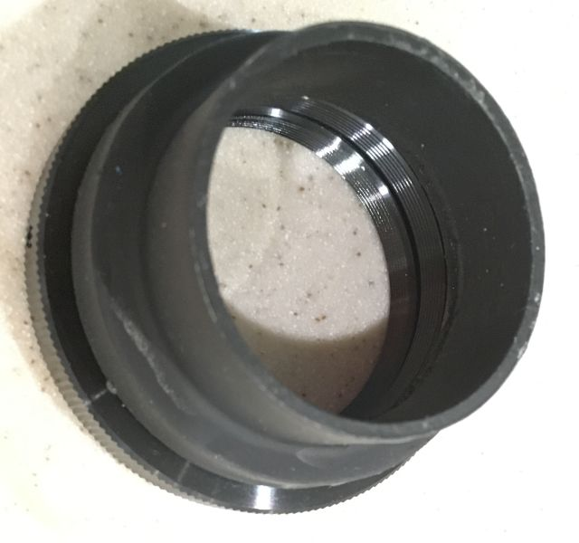

*[back](./)*
## Optiphot photography  
Released when photography meant film,
semi-automated image capture involved complex optics:  
  

.. for a camera body:  
  

... with prisms for finder and exposure:  
  

... so [trinocular](Trinoc/) chimneys mount projection lenses for 210mm tube length  
and clamp proprietary Microflex units, which are obsoleted by digital cameras.  

With ([trinocular](Trinoc/)) head removed, vertical illuminator flange-to-camera  
body flange distance for parfocal Canon EF DSLR is about 58mm:  
  
*Canon EF DSLR flange-to-sensor distance is 44mm*  

Canon's RF camera bodies have 20mm flange-to-sensor distance.  
With its chimney removed,  
Nikon's [F trinocular head](Trinoc/#F) has about 76mm flange-to-flange distance.  
(Canon) mirrorless bodies achieve parfocality
with Nikon 210mm objectives and [F trinocular heads](Trinoc/#F)...  

	Otherwise, with unmodified [type T or UW trinocular heads](Trinoc/#T)
	or type F with chimney,  
a [CF PL relay lens](CFPL2.5X) refocuses objective image planes at camera sensors.  
Alternatively, [generic aftermarket approx 2x photo relay lenses](relay2x) are available,  
requiring less separation between cameras and relay lens.

A (sprayed black) PVC reducer from 2 inch o.d. to 1.5 inch i.d.  
has 42mm o.d., which precisely fits Nikon's trinocular chimneys,  
and 48mm i.d., which nicely fits a Pentax K/M to T2 adapter,
that gets epoxied in place:  
  
*SUPER-FAST epoxy cures in 5 minutes, but wants 24 hours for full strength*  

  
*PVC reducer was cut short so that K/M adapter would bottom in it*

  
*T2 adapter allows clocking for desired camera orientation*  

  
*Will a diaphragm between projection lens and sensor improve contrast?*

#### [CF PL projection](CFPL2.5X)
#### [Infinity-focused Optiphot EPI](OptiphotInfinity)
#### [Infinity objectives with camera telephoto lens](CFI4x/)
