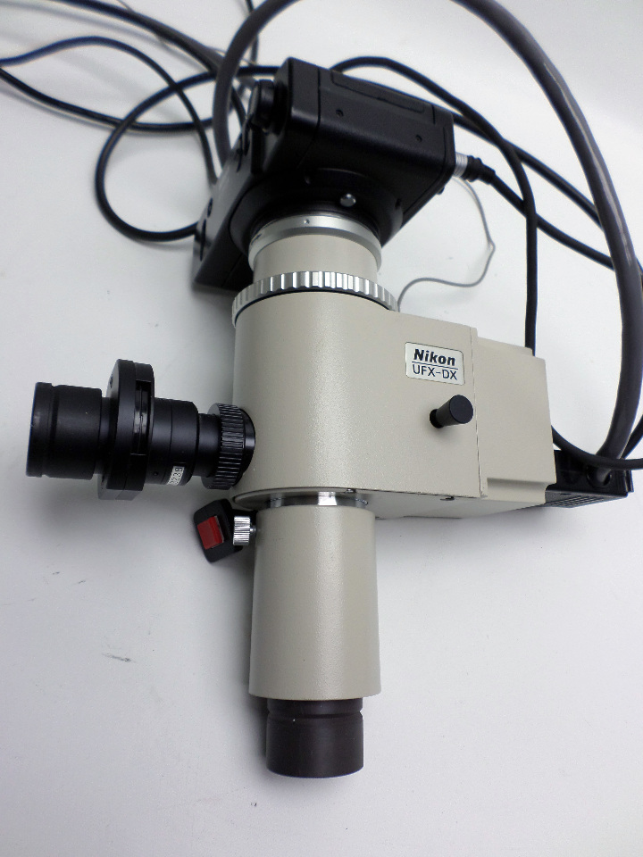
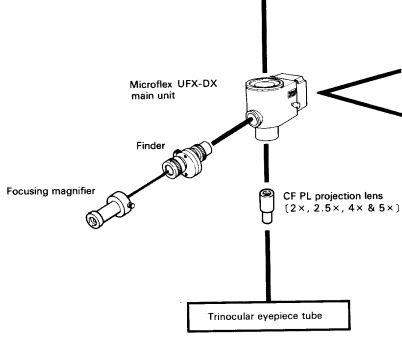
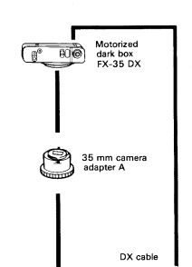

*[back](../)*
## Optiphot photography  
Released when photography meant film,
semi-automated image capture involved complex optics:  
  

... which included prisms for finder and exposure:  
  

.. as well as a camera body:  
  

#### [Infinity-focused Optiphot EPI](OptiphotInfinity)

