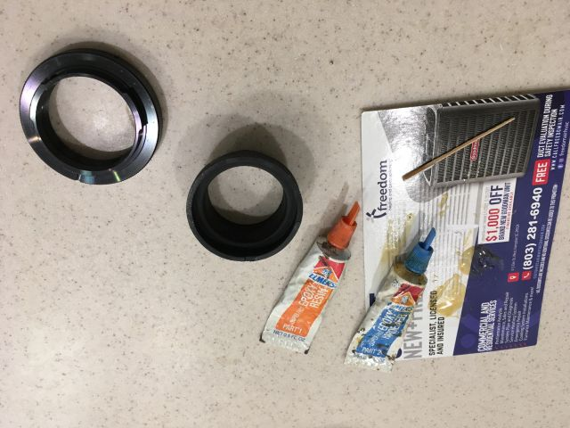
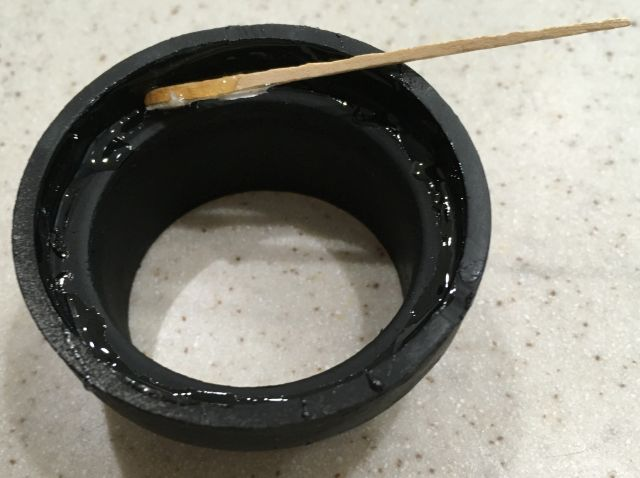
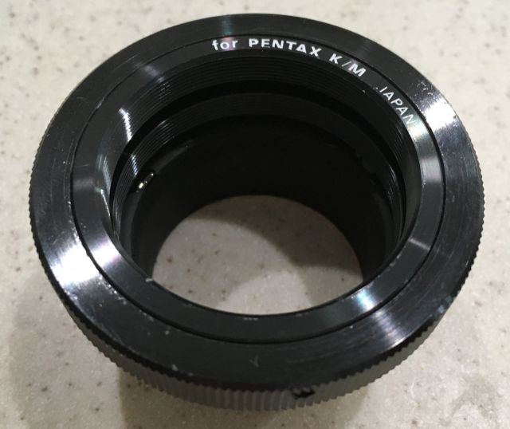
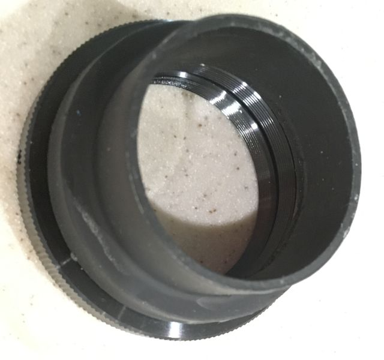

*[back](../)*
## Optiphot photography  
Released when photography meant film,
semi-automated image capture involved complex optics:  
  

.. for a camera body:  
  

... with prisms for finder and exposure:  
  

... so trinocular chimneys mount projection lenses for 210mm tube length  
and clamp proprietary Microflex units, which are obsoleted by digital cameras.  
A (sprayed black) PVC reducer from 2 inch o.d. to 1.5 inch i.d.  
has 42mm o.d which precisely fits the trinocular chimney  
and 48mm i.d. which nicely fits a Pentax K/M to T2 adapter
which gets epoxied in place:  
  
*SUPER-FAST epoxy cures in 5 minutes, but wants 24 hours for full strength*  

  
*PVC reducer was cut short so that K/M adapter would bottom in it*

  
*T2 adapter allows clocking for desired camera orientation*  

  
*Will a diaphragm between projection lens and sensor improve contrast?*

#### [Infinity-focused Optiphot EPI](OptiphotInfinity)

