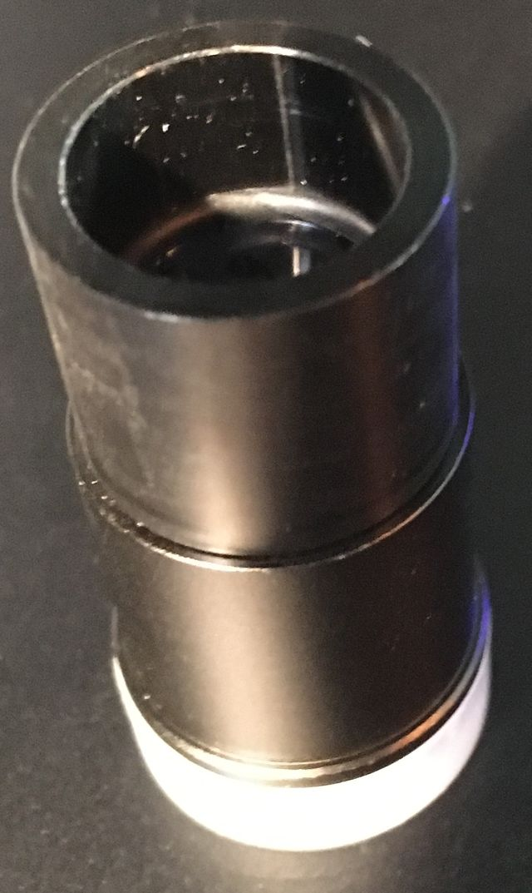

---
---
### generic approx 2x photo relay lenses
 *[back](photo)*

These typically have 23.2mm tube to fit microscopes and C-mount thread at their opposite end.  
Similar 0.5x photo relays are used with a [C-mount USB camera cube](https://www.amazon.com/dp/B016ODYIEK):  
  
Since Nikon CF objectives are nominally free of chromatic aberrations,  
truly generic photo relay camera adapters *could* work well.  
[Brooke Clarke compared a pair of generic camera adapters](http://www.prc68.com/I/MicroPhotography.html#ISvO)  
  
which are no longer available from cited vendors Image Solutions and Optexcom.    
A relay lens acquired 20 or so years ago looks similar to that Optexcom adapter:  
  
Focussed about 5cm from C-mount thread to camera sensor,
that parfocal image is poor and distorted,  
because it is actually intended for use with a C-mount camera sensor in very close proximity.  

The Image Solutions adapter looks similar to currently-available [AmScope CA-CAN-SLR-III](https://www.amazon.com/dp/B009OY7YG6).  
  
Its Amazon price is higher than that for a used [CF PL2.5X](CFPL2.5X),  
but includes a mechanical camera attachment that needs to be improvised or acquired for the CF PL2.5X.  
