[*back*](../index.html)
  
## Carl Zeiss Substage Microscope Condenser Flip Top 0.9 - Great Condition!  
eBay item number: 144045567244  
Condition: Used   
Brand: Carl Zeiss  

**Carl Zeiss Substage Microscope Condenser Flip Top 0.9 - Great Condition!   SHIPS TO USA ONLY.**  
**Glass is clear, no scratches, no fungus, just some dust as is expected with a vintage item like this.**  
**Flip top is a little stiff due to old grease, but works fine.  Please see pics!**  

This was from my father's estate. He was a professional photographer and collector of fine cameras,  
 lenses, microscopes and histological accessories.  Please see my other items for some interesting finds.  
I am adding more items every day or so.  I will be listing more microscope objectives and oculars soon too!  
  
What you see is what you get.  Please see pics.  

| 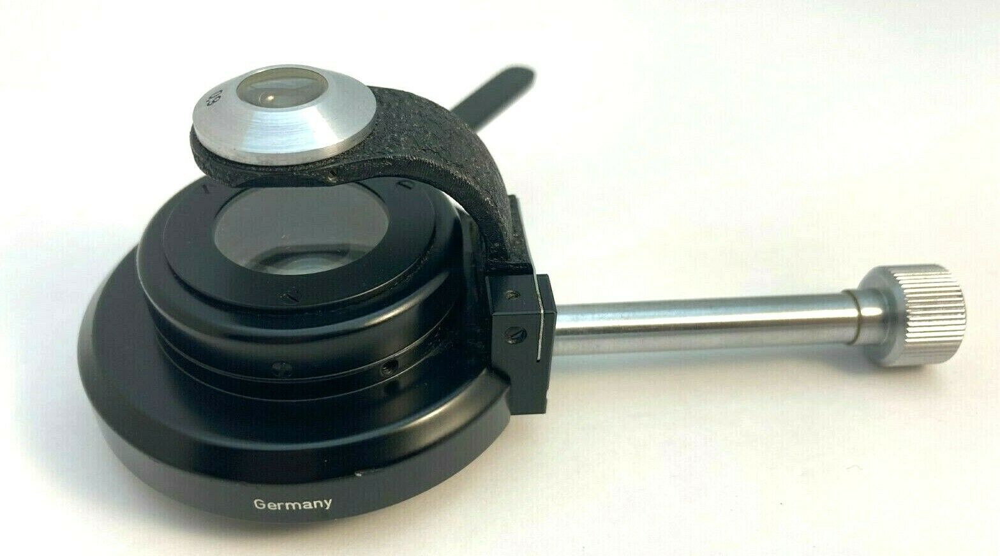 | 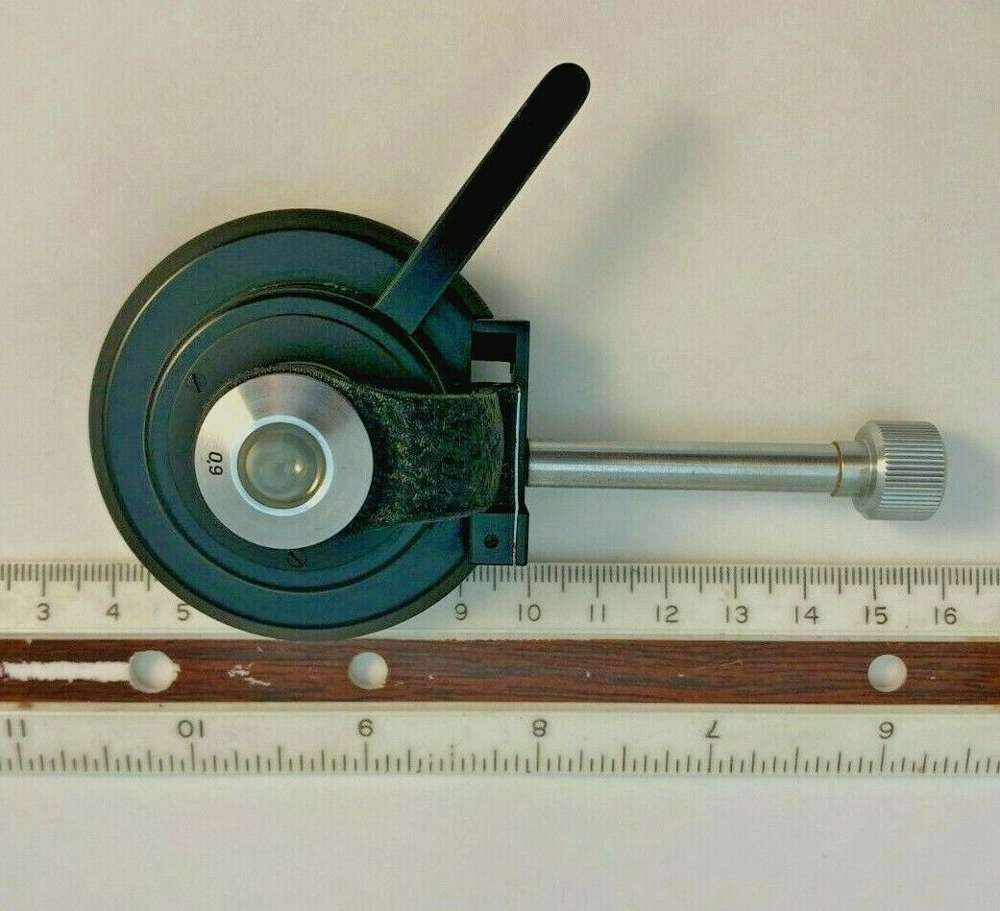  |
| -------------- | -------------- |
| 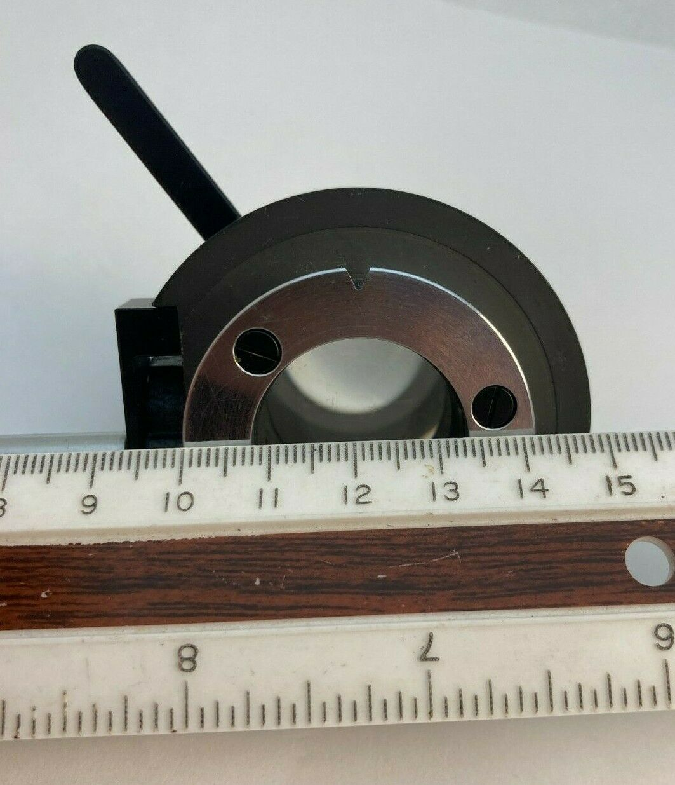 | 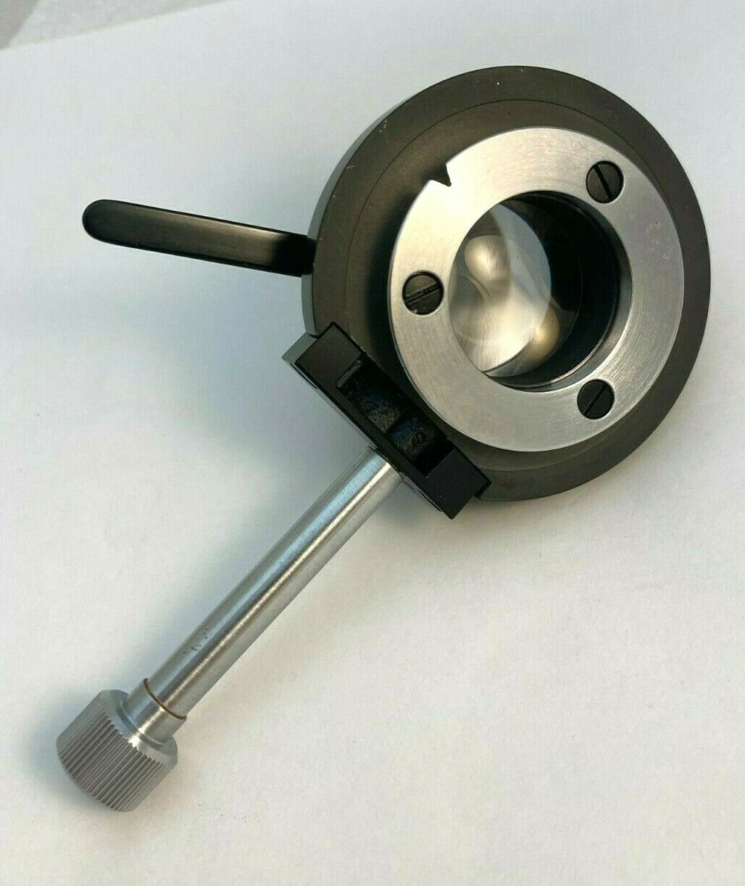   |
| 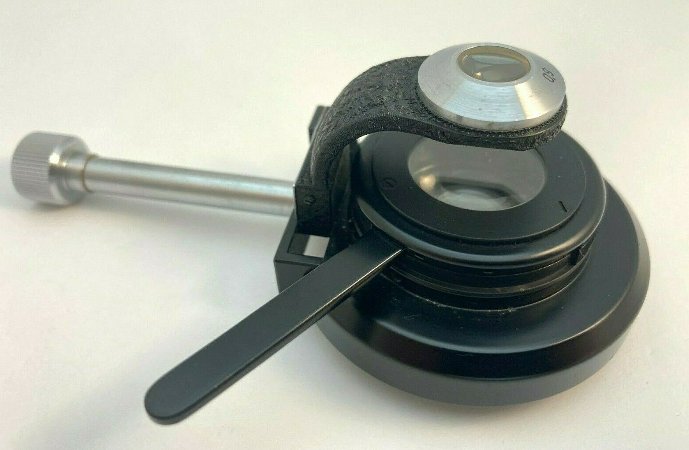 | 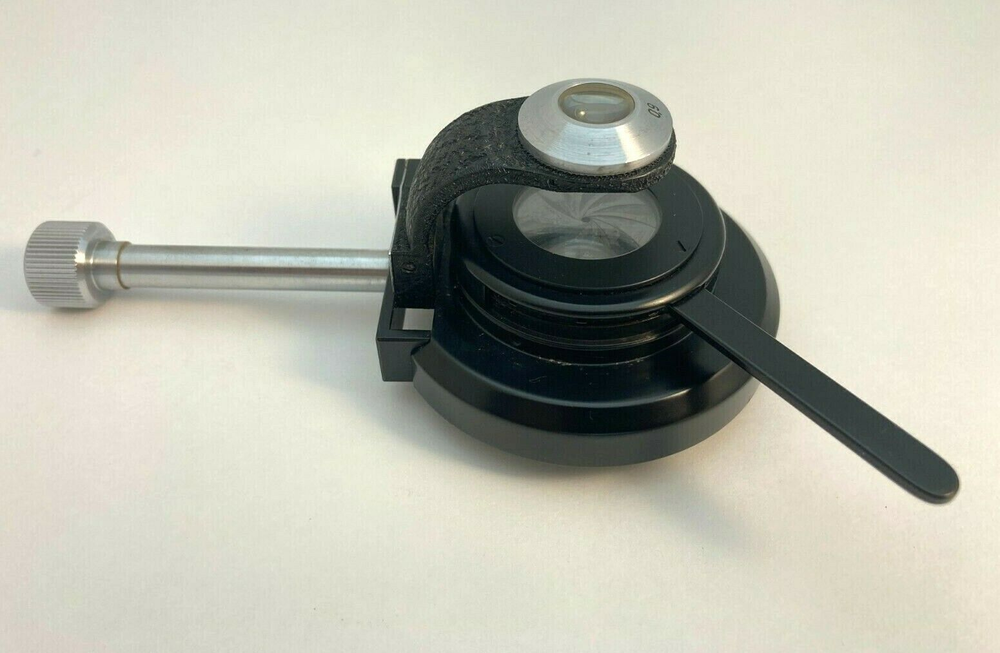   |
| 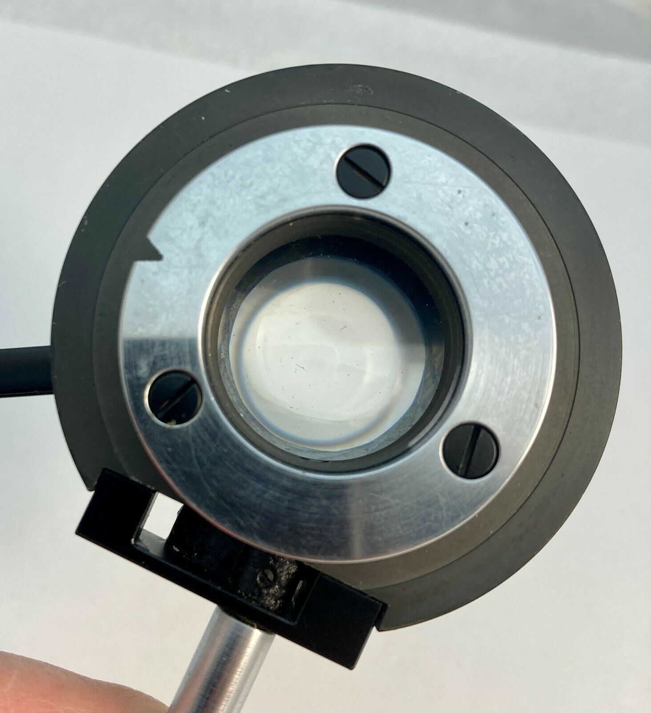 | 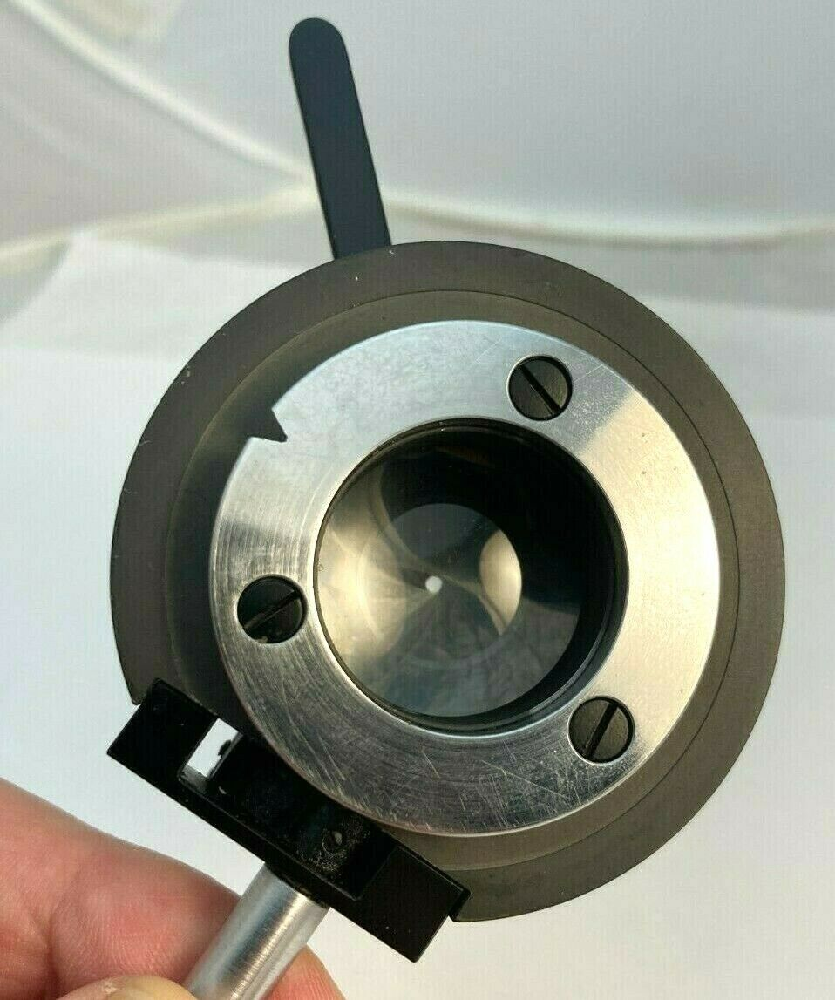   |
| 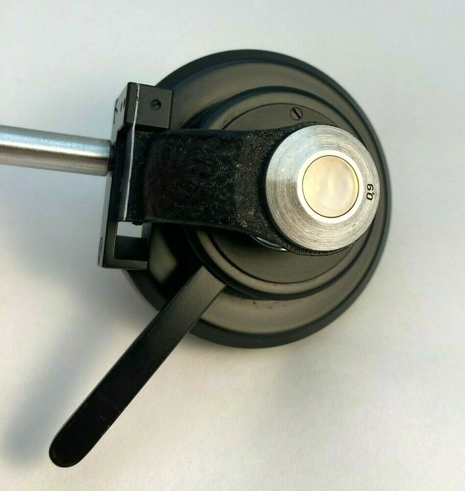 | 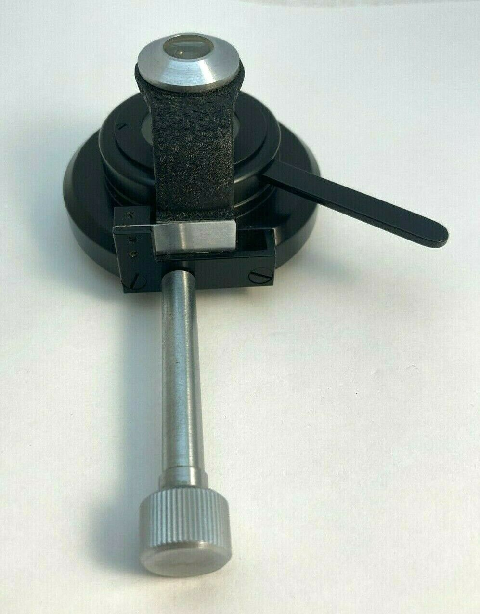   |
| 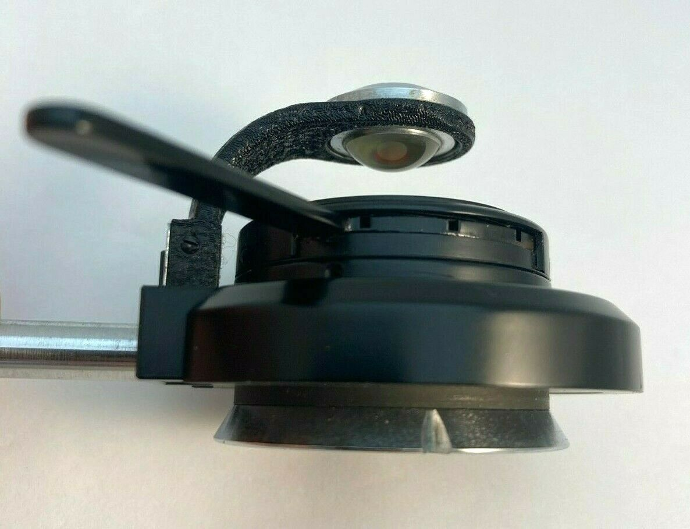 | 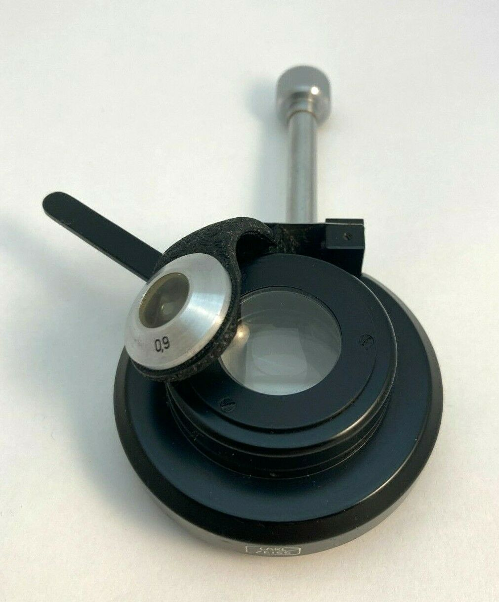   |

Nikon condenser dovetail is 35mm; this Zeiss should be a loose fit...    
