*[back](../)*
  
## Vintage Astro\Micro-Photography Camera Adapter Accessory by Monolux
Condition: Used  
Ended:May 23, 2022, 9:53AM  
This is for a vintage used Monolux camera adapter micro-photography and\or Astro-photography to camera adapter. It is in very good condition. Please see photos  
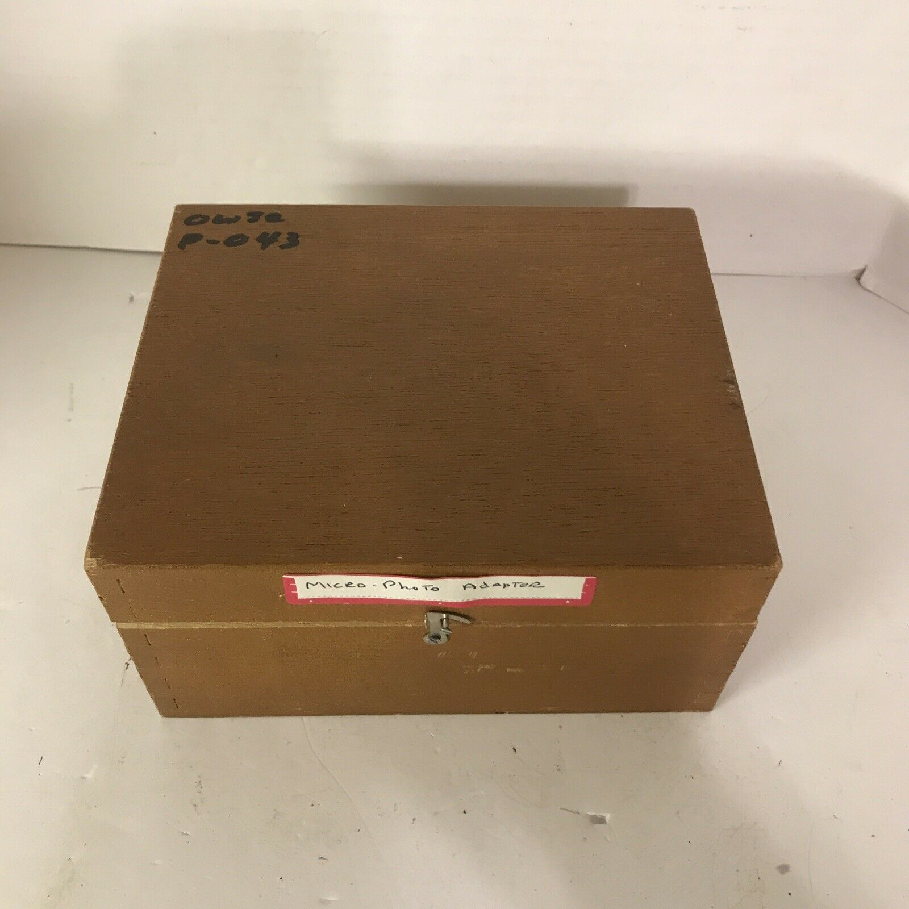  
  
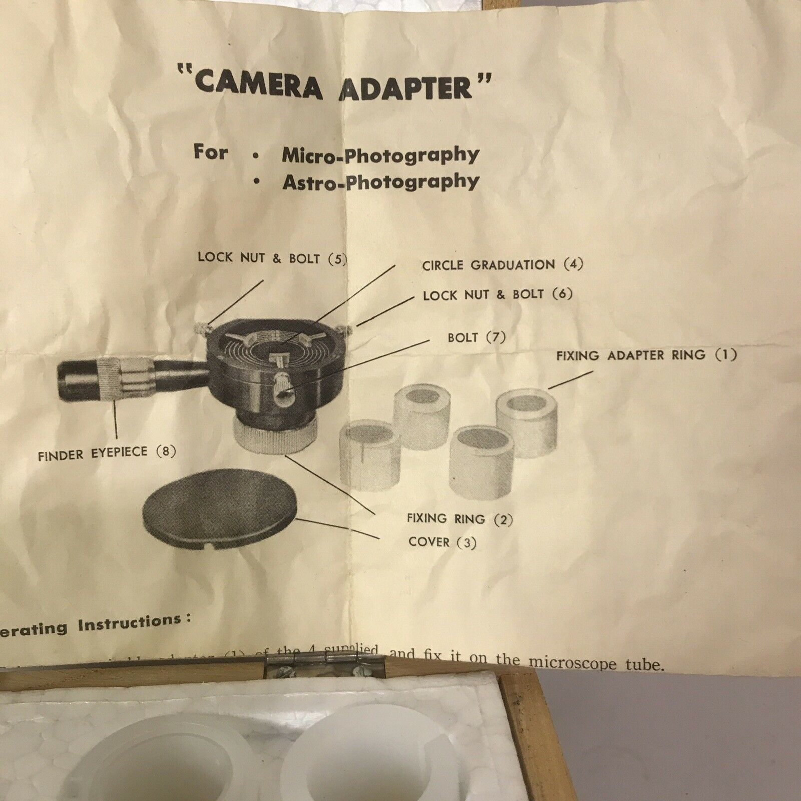  
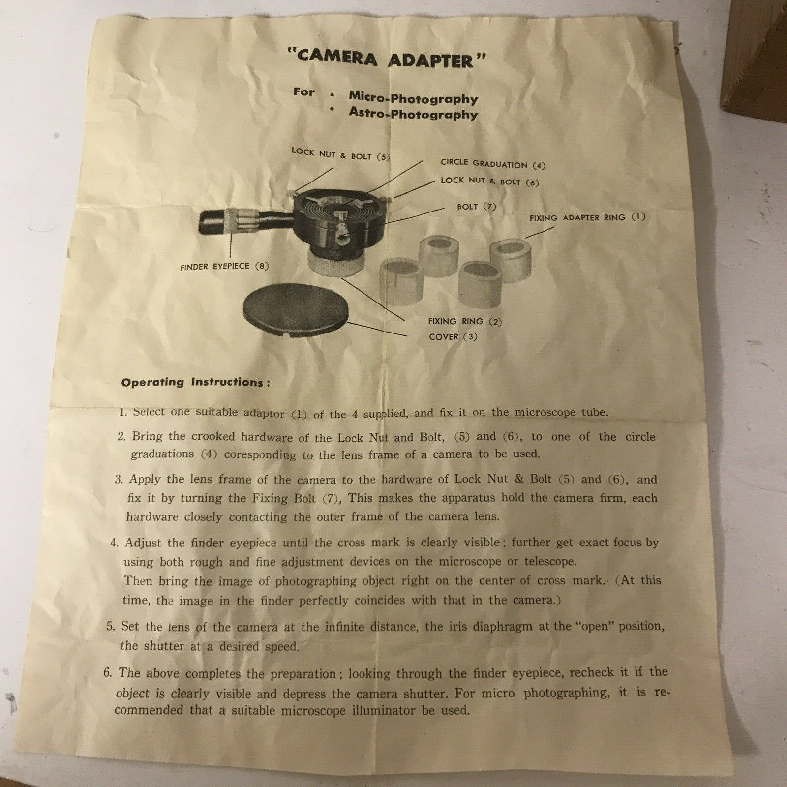  
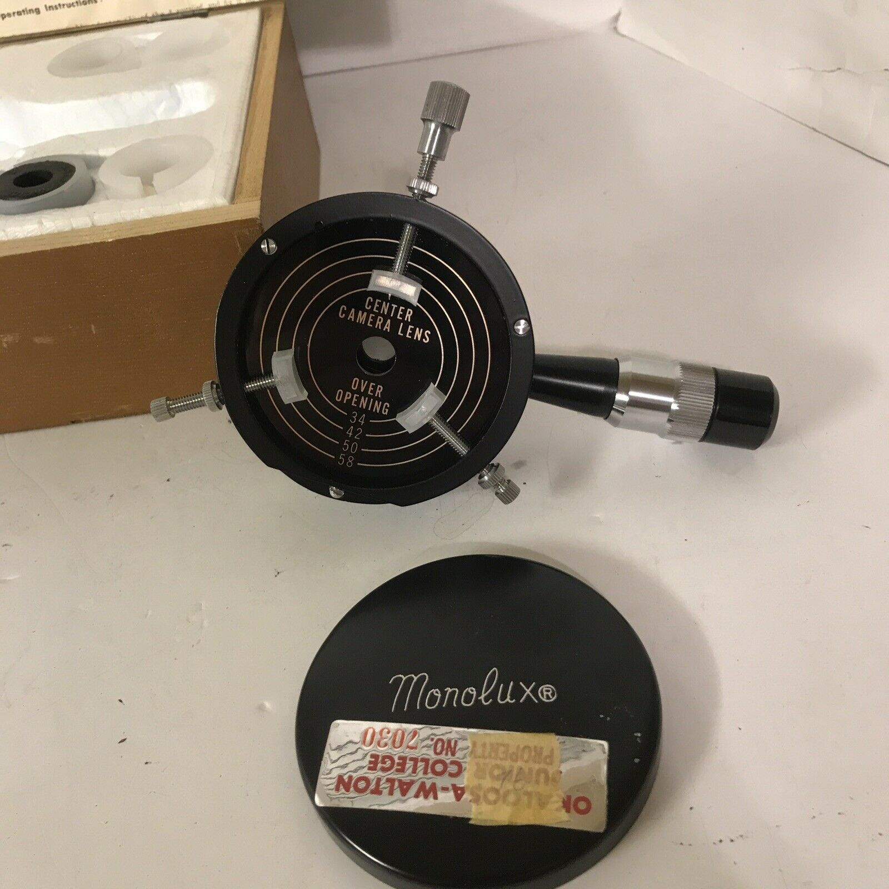  
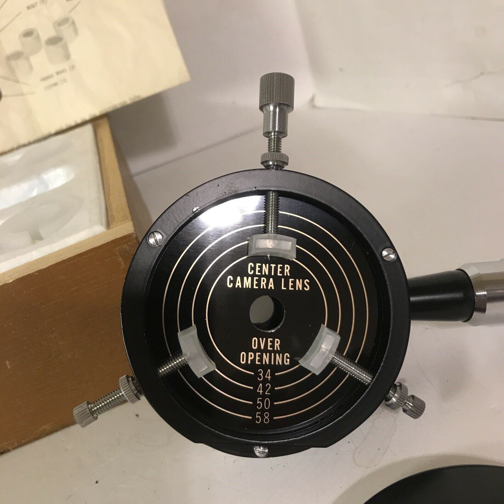  
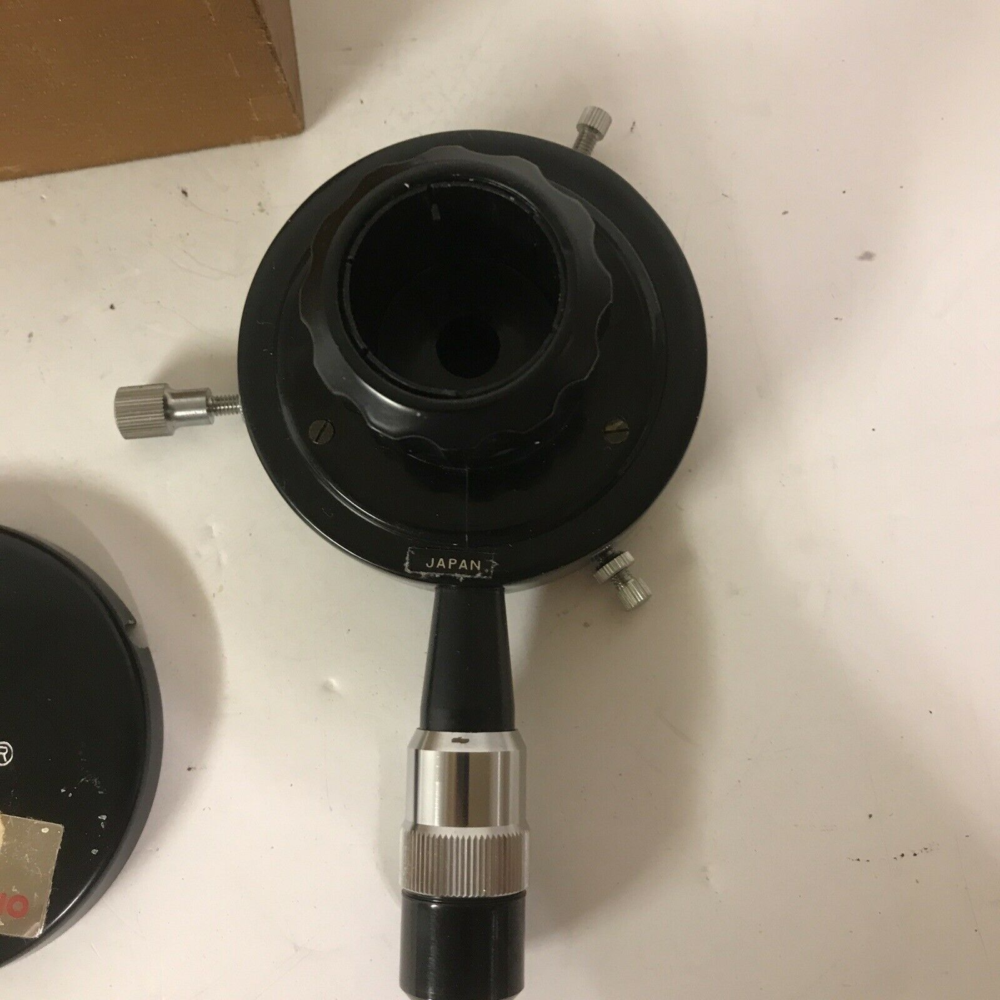  
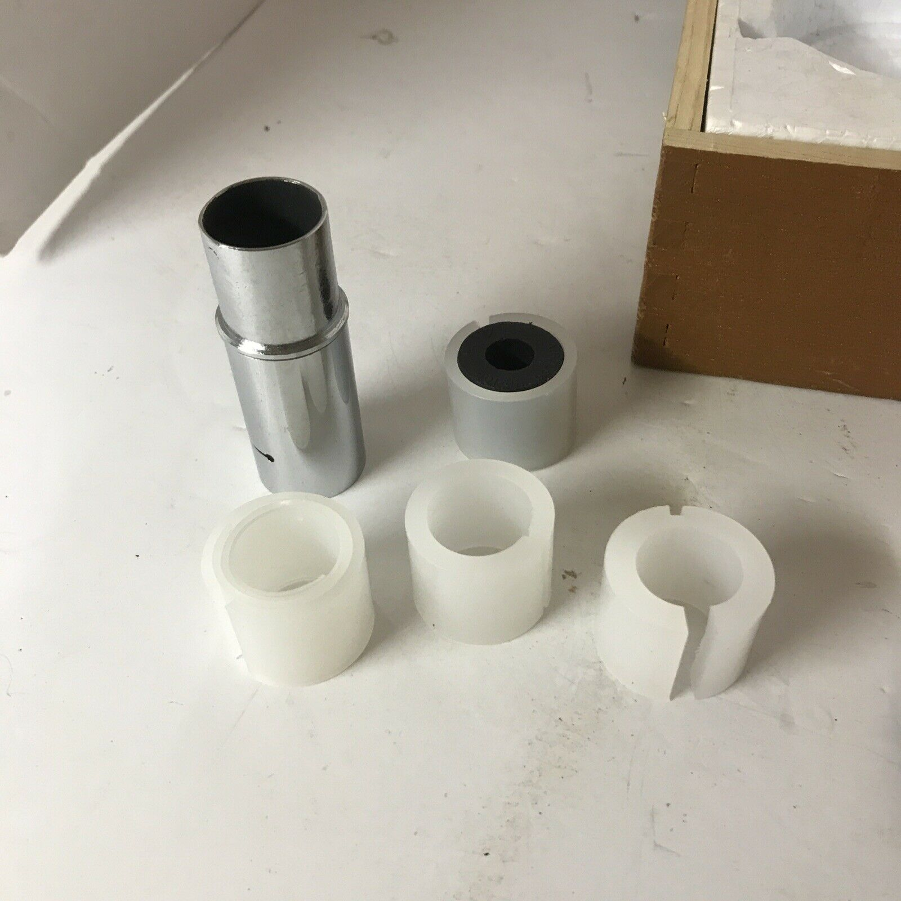  
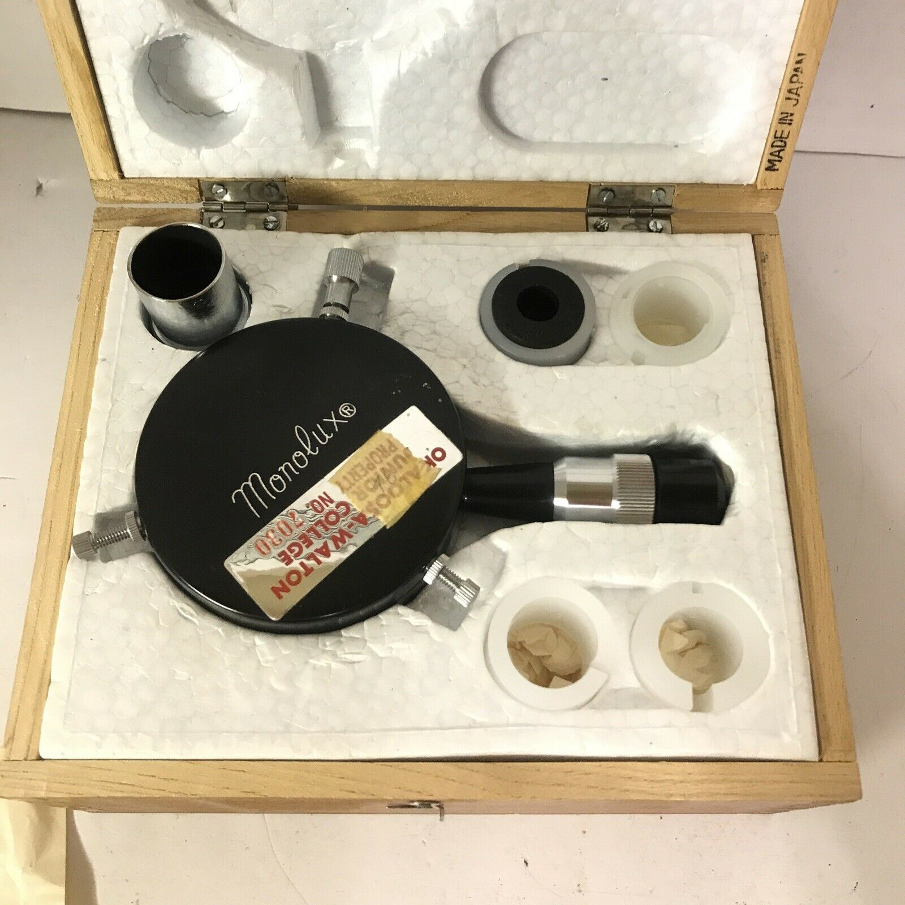  

---

## M42 to 30mm to 23.2mm Microscope Adapter Camera Eyepiece Tube w/ C-mount Thread  
eBay item number: [224158403124](https://www.ebay.com/itm/224158403124)  

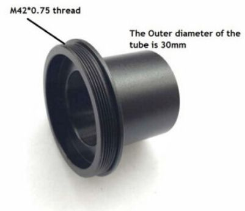  
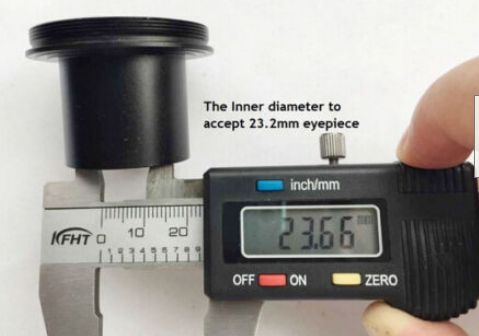  
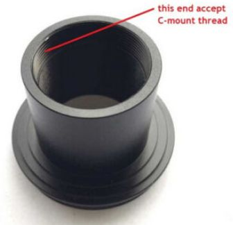  

 *Dear visitors, we are Cnscope, and we are professional microscope supplier*  

### Product Feature:  
 **it is homemade and Multifunction adapter.**  
The Top male thread is M42*0.75  
The outer diameter of the tube is 30mm  
the inner diameter is 23.2mm to accept biological Microscope tube  
and the end female thread to accpet C-mount.  
so it is Multi-function and powerful adapter both for Stereo microscope and biological microscope.  
more detail to check our picture.  
full metal-----Aluminum alloy  

**High quality and bid it confident.**  

 *received 10 Aug 2022*  
M42x0.75 thread and 30mm o.d. are as advertised,  
but i.d. is far too loose for 23.2mm oculars:  
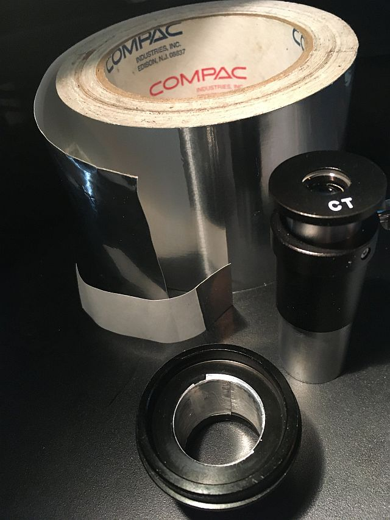  
... corrected by shimming i.d. with bits of HVAC pressure-sensitive aluminum tape.  
[MicrobeHunter.com: M42 - 30mm - 23.2mm eye tube adapter warning.](https://www.microbehunter.com/microscopy-forum/viewtopic.php?f=14&t=16026)  
