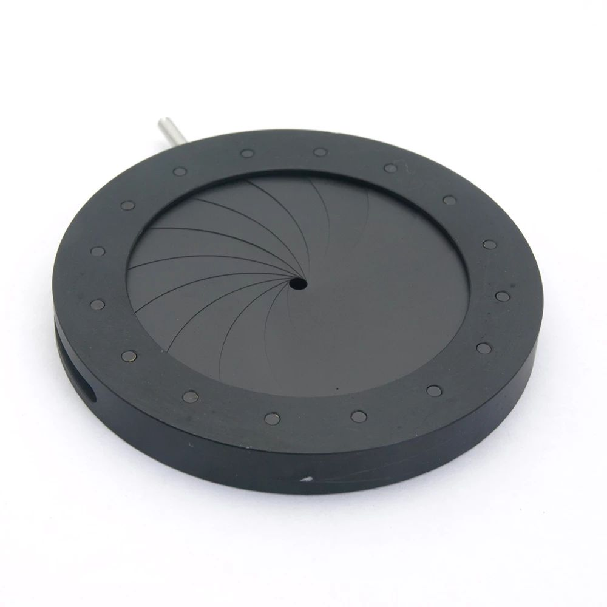

[*back*](../index.html)
  
## 1.5-37mm Aperture Variable Optical Iris Diaphragm Camera Laser Condenser Microscope Accessory 14 Blades  
<https://www.aliexpress.com/item/3256803033759032.html>    
Specifications:  
Outside diameter: 53.00mm  
Thickness: 6.00mm  
Maximum aperture diameter: 37.00mm  
Minimum aperture diameter: 1.50mm  
Blades: 16 PCS  
Material : Metal  

Packing List:  
1 piece iris diaphragm  

Adjustable Iris diaphragm series is used in the optical system,  
it can provide different diameters to meet different requirements of light,  
by adjusting the handle to change the aperture diameter.  
It could be customized according to drawings or sample processing or your requirements.

| Brand Name: JLLSMCMGGX |    Certification: NONE |  
| -------------- | -------------- |  
| Origin: CN(Origin) |        Magnification Ratio: 0x |  
| Is Smart Device: No |       Material: Metal |  
| Magnification Ratio: 500X & Under |    Model Number: 1.5-37mm adjustable iris diaphragm |  
| Material: Metal |           Theory: Adjustable Diaphragm |  
| Drawtube: As your microscope, laser, camera |    Range of Clear Aperture: 1.5mm-36mm |  
| Finish: Black Anodized |     Item Name: 1.5-37mm Adhustable Diaphragm |  

