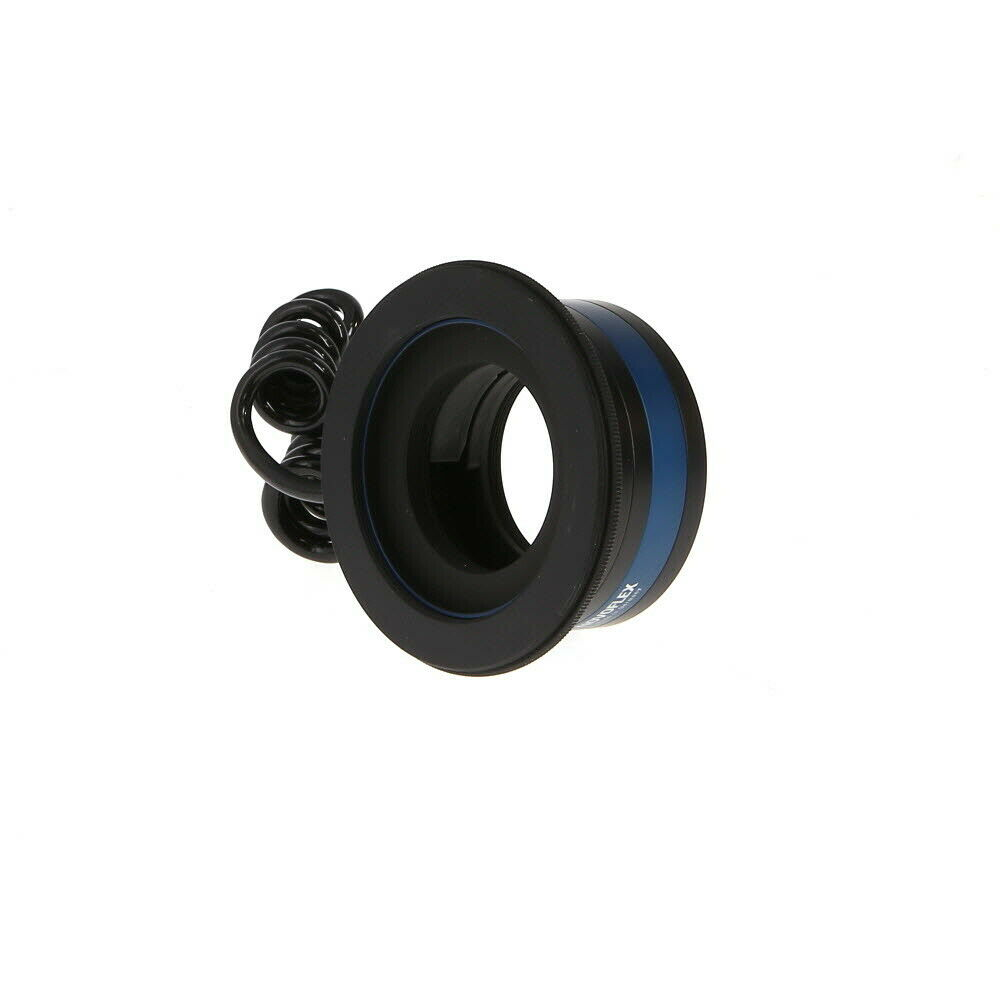
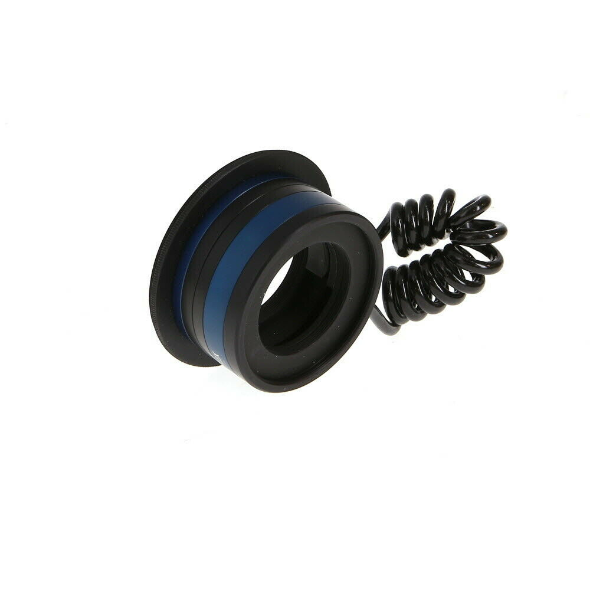
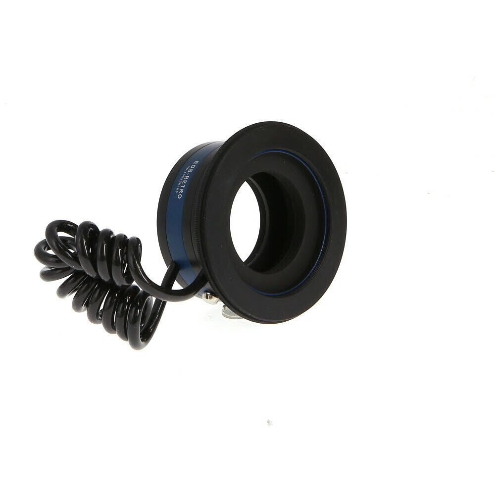
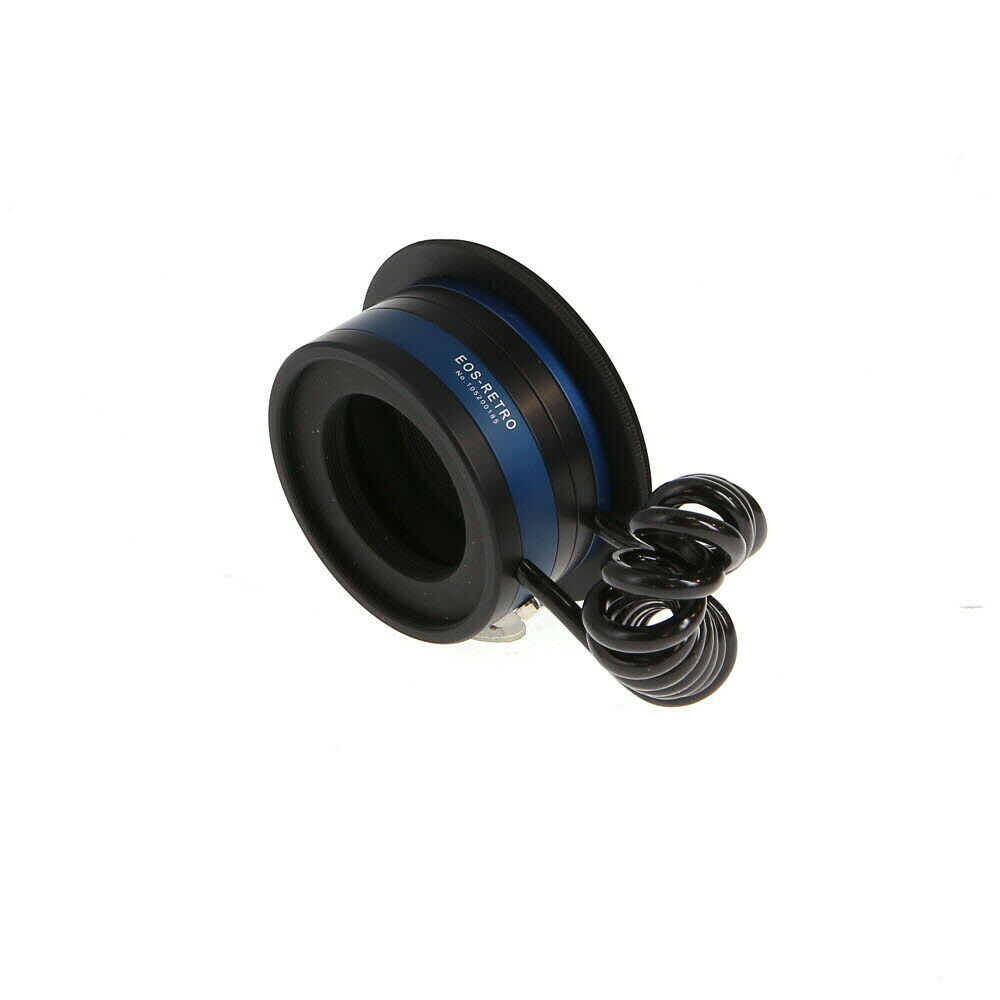
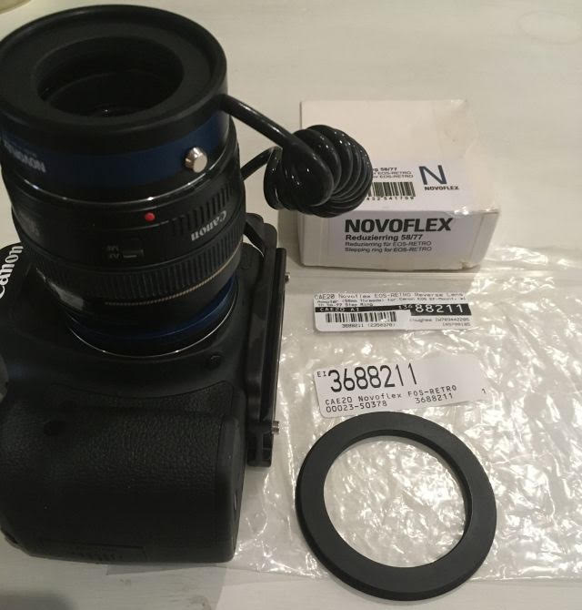
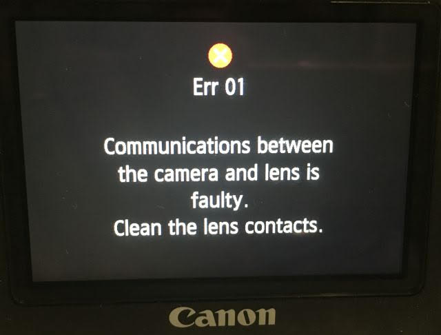
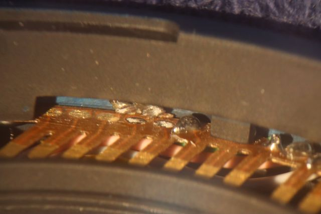

[*back*](../)
  
## Novoflex EOS-RETRO Reverse Lens Adapter (58mm Threads) for Canon EOS EF
eBay item number: 374061528653  
Condition: Used   
Brand: Novoflex  
MPN: EOS-RETRO  
Type: Lens Adapters

- with 58-77 Step Ring - This item is inoperative.

CONDITION: LN-

LIKE NEW MINUS, the rating of the equipment is at 97 to 99 percent of original condition.  
Only the closest inspections will reveal slight wear.  
Perfect glass, but the box and accessories are usually not included.  
See item description for specifics. 

*Product images are of the actual item up for sale.*  

|  |   |
| -------------- | -------------- |
|  |    |
|  |  |

Two wires were loose; cold solder joints.
  

Even after repair, Canon 6D behaves strangely with this on a 50mm f/1.4;  
seldom shows aperture when in aperture priority mode.
