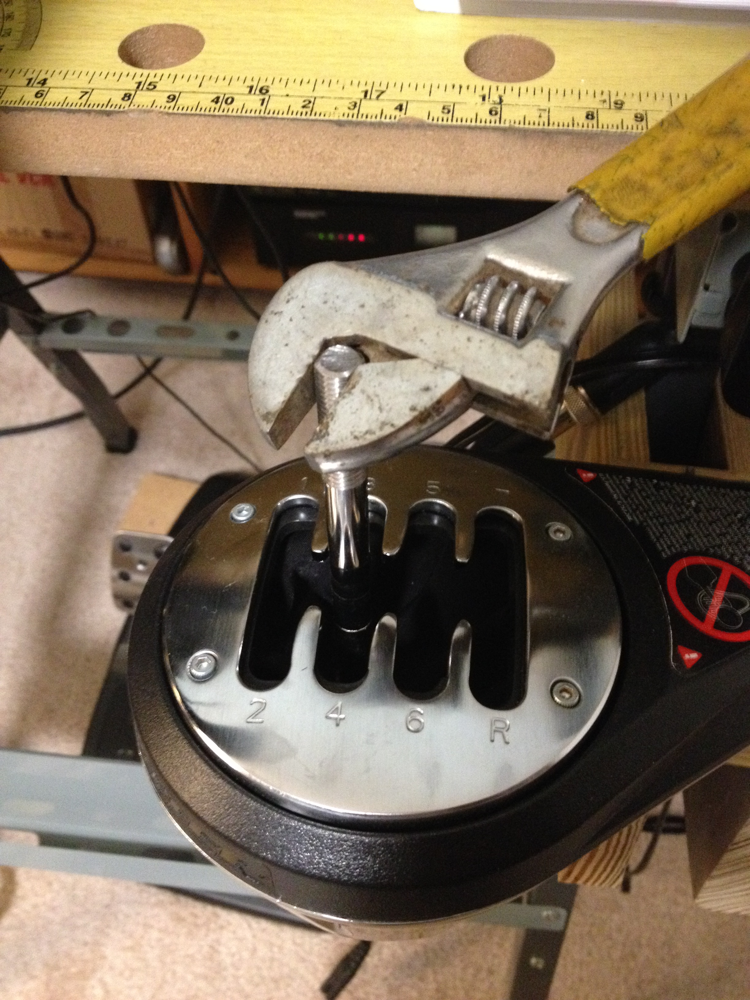
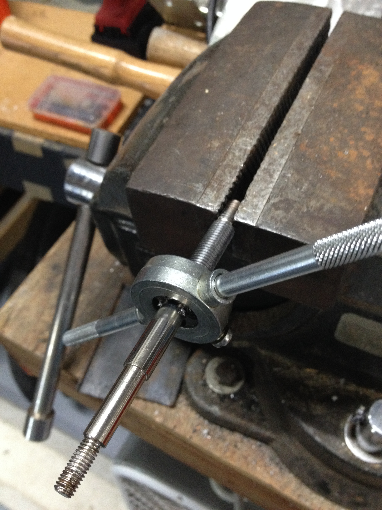
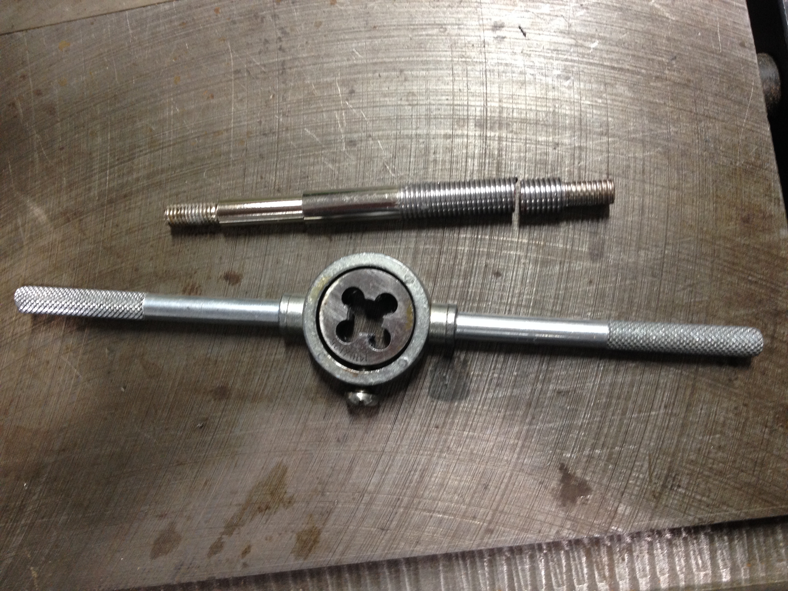
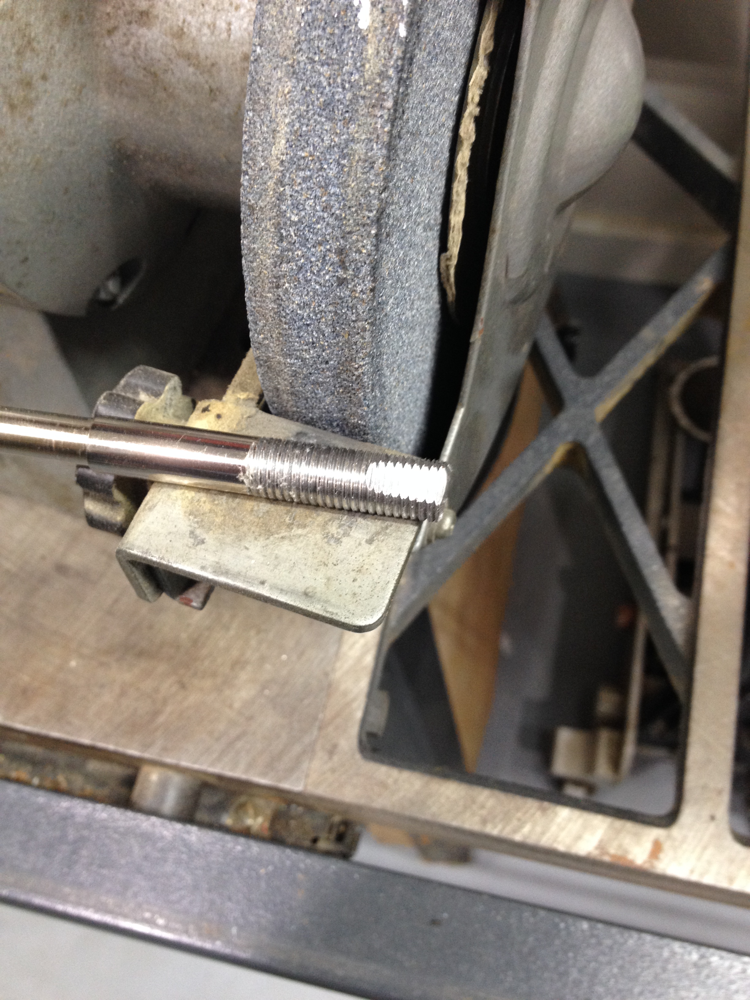
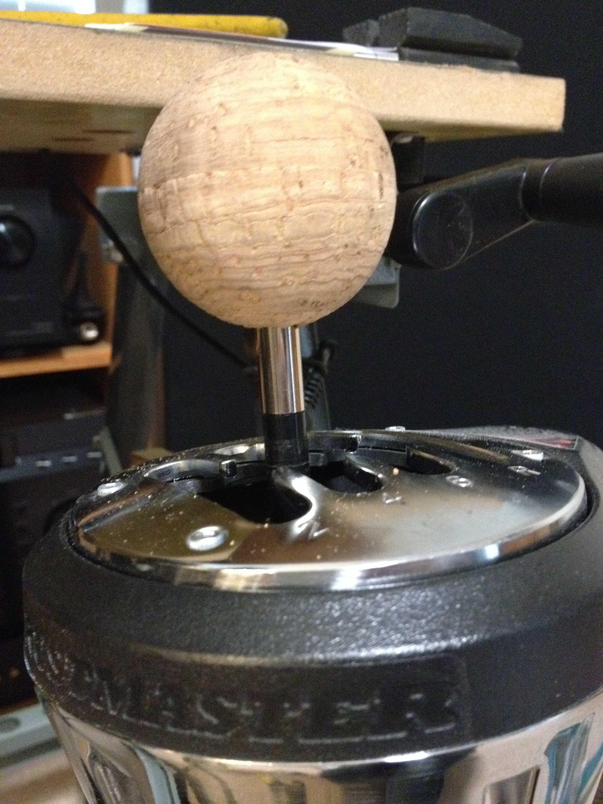
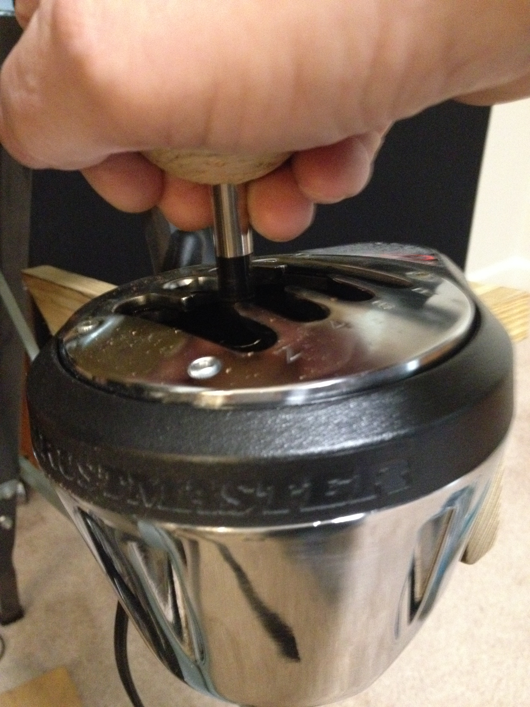

6 February 2019

## $15 Thrustmaster TH8A shifter mods

### Problems
Compared to real cars, I missed a *LOT* of shifts with a stock TH8A.  
Although sturdy, TH8A throws are too long and resistance is too low.
*  On track in a real BMW, a lighter knob improves shift feedback.
*  Simply shortening shift levers can unacceptably increase effort in some cars, but is wanted here.

### Project
Probably available for less elsewhere, a pair of 2 inch cork balls cost $7.85 from [Amazon](https://www.amazon.com/gp/product/B01312FOFO)  
The TH8A has an M10x1.25 thread for shift knobs.  
$20 buys a [fairly complete tap and die set](https://www.amazon.com/gp/product/B01312FOFO) or $6.30 gets just a needed [10mm x 1.25 hex die](https://www.amazon.com/gp/product/B01312FOFO)  

*   Unscrew the knob; fit a wrench on its flats to remove and eventually replace the lever
  
*   Screw the die over existing threads, clamp shaft flats in a vice and cut another couple of inches of threads  
  
*   Cut an inch or so off the shaft  
  
*   Grind a half inch or so of new flats on shortened shaft end
  
* Using a 5/16 bit, drill about 1.5 inches into 2 inch cork ball and thread it onto the shortened shaft

* I may eventually shorten the shaft another 1/2 inch or so, but shifting is much improved  

